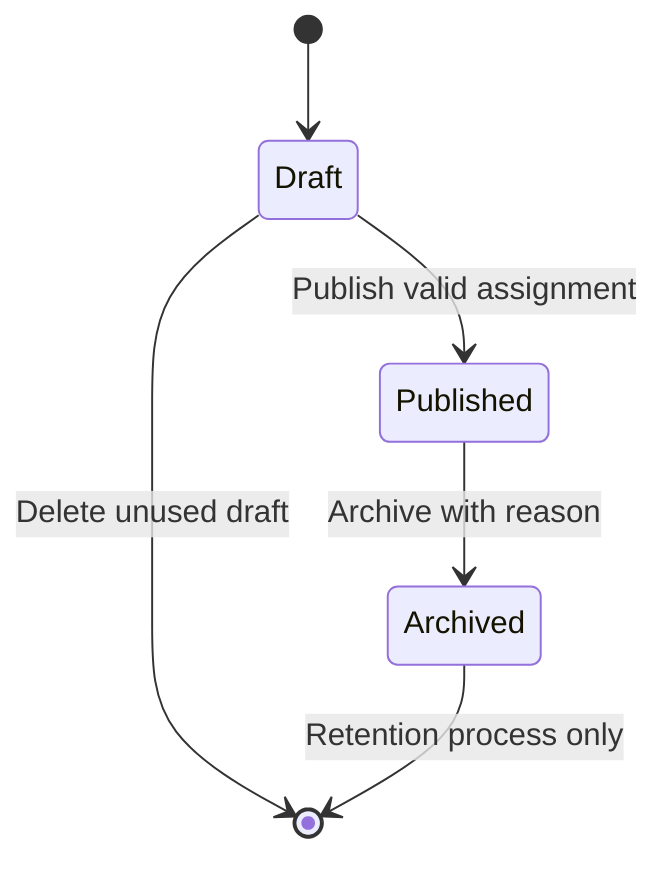

# 02 — Product Requirements Document

## Student Learning App

| Field | Value |
|---|---|
| Project | SrhDP — Student Learning App |
| Document ID | SLP-DOC-02 |
| Version | 0.1 — full draft for review |
| Date | 9 September 2026 |
| Source | `01_project_brief.md`, version 0.1 |
| Product owner / academic authority | Named individuals pending |
| Technical lead / QA lead | Named individuals pending |
| Approval status | Draft; no school-policy or release approval implied |
| Intended audience | Product, school representatives, design, engineering, QA, release and operations |

This PRD translates the project brief into product behavior, data rules, acceptance criteria, and release conditions. It is implementation-neutral: framework, database engine, API paths, authentication mechanisms, and hosting design belong in the SDD and API specification.

**How to read this document:** all requirements describe a proposed product baseline, not implemented functionality. “Must” denotes a release requirement after baseline approval. Proposed policy defaults make the document concrete and testable; the school must confirm or replace them before dependent stories are marked Ready. Pending decisions have owners and gates in Section 20. Completing this document does not resolve those decisions automatically.

## 1. Purpose, problem, and objectives

Students need one reliable place to find their schedule, access class resources, submit assignments, and view published academic information. Teachers and administrators need supported workflows to maintain those records with appropriate permissions and an attributable change history.

The current school process, existing tools, user counts, and measured pain points remain unverified. The proposed product addresses the problem hypothesis recorded in the brief; discovery findings may refine priorities.

| Brief objective | Product outcome | Primary requirement groups |
|---|---|---|
| OBJ-01 | Students find relevant academic information | HOME, CLS, MAT |
| OBJ-02 | Students submit work and understand its status | ASG, FILE |
| OBJ-03 | Users access only authorized records | AUTH, PERM, AUD |
| OBJ-04 | Staff maintain core data without developer database edits | ADM, ASG, RES, ATT, NOT |
| OBJ-05 | Academic records and calculations are consistent | RES, ATT |
| OBJ-06 | The service can be released, supported, and recovered | OPS and nonfunctional requirements |

## 2. Scope, priorities, and exclusions

### 2.1 Priority model

- **M — Must:** required for the baseline MVP. Removal requires a recorded scope decision.
- **C — Conditional:** implemented only after the triggering product decision is approved and estimated.
- **L — Later:** excluded from this release.

Every numbered requirement in Sections 6–16 is M unless explicitly marked C. A requirement’s acceptance criteria inherit its priority. Examples are acceptance fixtures, not real student data.

| Brief scope | MVP capability | Priority |
|---|---|---|
| SCP-01 | Account provisioning, sign-in, session recovery, logout | M |
| SCP-02 | Academic structure, users, teachers, enrollment | M |
| SCP-03 | Student Home dashboard | M |
| SCP-04 | Enrolled classes and sessions | M |
| SCP-05 | Published class materials and protected downloads | M |
| SCP-06 | Assignment creation, publication, submission, review | M |
| SCP-07 | Assessment setup, result entry and publication | M |
| SCP-08 | Attendance recording, correction, student history | M |
| SCP-09 | Consolidated profile, preferences, support details | M |
| SCP-10 | Notices, in-app notifications, read state | M |
| SCP-11 | Authorized administration and audit | M |
| SCP-12 | Data readiness, release and operations | M |

### 2.2 Conditional and excluded features

Classmate directories, push/email/SMS notifications, device-calendar integration, automated reminders, profile photos, bulk import automation, and multiple institution support are C. Account recovery remains M even if its selected method uses email; that does not include general email notifications.

Payments, billing, live video, chat/social feeds, parent accounts, online exam delivery/proctoring, AI tutoring, advanced analytics, full offline synchronization, self-service institution onboarding, historical migration, and external school-system synchronization are L unless the scope is revised.

Student and staff delivery platforms, language coverage, institution timezone, and exact device/browser support remain pending. The baseline assumes one institution, an authenticated student experience, an authenticated staff interface, and connectivity for writes.

## 3. Users, roles, and access boundaries

### 3.1 Personas and goals

| Persona | Main goal | Successful task |
|---|---|---|
| Student | Understand and complete learning responsibilities | Find an assignment, submit work, revisit its confirmation |
| Teacher | Manage assigned learning activities | Publish work, review submissions, record attendance/results |
| School administrator | Maintain accurate academic membership | Create term/class, assign teacher, enroll students |
| Academic publisher | Control official academic information | Review and publish results or issue corrections |
| Support/service owner | Resolve service issues | Identify a failed operation through a reference without unnecessarily opening academic content |

Academic publisher is a permission capability, not necessarily an additional account type. A teacher or administrator may receive it. Roles may be combined explicitly; role combinations do not eliminate record-level restrictions.

### 3.2 Permission matrix

“Own” means the authenticated student’s records; “assigned” means classes assigned to the staff member; “granted” means an explicit administrative capability within the institution. No role is public.

| Action | Student | Teacher | Administrator | Support |
|---|---|---|---|---|
| View student dashboard/profile | Own | Own staff profile only | Profile maintenance if granted | Diagnostic metadata only |
| Create/disable accounts, assign roles | No | No | Granted | No |
| Manage terms, classes, enrollment | No | Read assigned membership | Granted | No |
| View class content | Current enrollment; historical rules below | Assigned | Granted | No by default |
| Publish materials/assignments | No | Assigned | Only if academic-content capability granted | No |
| Submit an assignment | Own eligible enrollment | No student impersonation | No student impersonation | No |
| Review submissions | Own history only | Assigned | Only if review capability granted | No |
| Enter attendance/results | No | Assigned | Granted academic capability | No |
| Publish/correct results | No | Assigned plus publish permission | Granted publish permission | No |
| View individual results/attendance | Own visible records | Assigned | Granted academic capability | No |
| Publish a school notice | No | No, unless separately granted | Granted | No |
| Publish a class notice | No | Assigned | Granted | No |
| Read audit records | No | No by default | Granted audit capability | Restricted operational events if granted |

### 3.3 Membership policy — proposed default

Active students in active classes may access published class content and submit during the permitted window. Withdrawal stops new class-content access and submissions immediately but preserves read access to the student’s own past submissions, published results, and attendance while the account remains active. Completed/archived classes are read-only for former enrolled students and assigned staff. A disabled account cannot access either current or historical records.

Historical submission files remain accessible only through the student’s own submission history or an authorized staff review path; this does not reopen general class material access after withdrawal. Institution retention policy must govern eventual removal. Changing membership or roles must affect the next protected request and invalidate incompatible cached data.

## 4. Product navigation and complete journeys

### 4.1 Screen inventory

| Area | Required destinations and content |
|---|---|
| Access | Sign-in, activation/recovery, expired-session handling |
| Home | Student identity summary, today’s sessions, next exam, shortcuts, unread count |
| Classes | List, detail, overview, assignments, materials, sessions; Students tab conditional |
| Assignments | All/Pending/Completed, details, upload/submit, confirmation/history |
| Results | Term selection, subject/assessment results, approved summaries |
| Attendance | Session history, status counts, summary and coverage |
| Profile | Identity, editable preferences, support details, logout |
| Notices | Relevant notices/notifications, detail, read state |
| Staff | Academic setup, roster, content publishing, submission review, records, notices |

Bottom-navigation placement, combined pages, responsive layouts, and visual tokens belong in `03_ux_ui_spec.md`. Every destination must have loading, empty, unauthorized, unavailable, and retry behavior where relevant.

### 4.2 End-to-end release journeys

| Journey | Preconditions | Main flow | Required result |
|---|---|---|---|
| JRN-01 Prepare term | Authorized admin; valid users | Create term/class → assign teacher → enroll students → create sessions | Correct membership and schedule without manual database editing |
| JRN-02 Start day | Active student with enrollment | Sign in → Home → class → material | Correct student-specific information and authorized download |
| JRN-03 Submit work | Published assignment; eligible student | Review instructions → upload → finalize → revisit | One confirmed logical submission and persistent history |
| JRN-04 Publish records | Assigned staff; eligible records | Record → validate → publish → student views → audited correction | Consistent visible results and attendance |
| JRN-05 Read notice/help | Published relevant notice | Open notice → update read state → find support | Correct audience access and persistent read state |

## 5. Global business policies and states

### 5.1 Proposed baseline rules

| Rule ID | Rule |
|---|---|
| BR-01 | Authorization uses authenticated identity and authoritative membership, never client-supplied ownership alone. |
| BR-02 | Server time determines deadlines. Display dates in the configured institution timezone with an explicit timezone label on deadlines. |
| BR-03 | Assignment is on time when the accepted finalization timestamp is less than or equal to its due timestamp. Upload start alone does not reserve an on-time submission. |
| BR-04 | Late submissions are disabled by default. If enabled before publication, a required late-close timestamp must be later than due time; finalization is allowed through that instant inclusive and marked Late. |
| BR-05 | Default maximum confirmed attempts is one. Staff may select up to three before publication. Students may resubmit while the window remains open, attempts remain, and feedback has not been published. |
| BR-06 | Completed means at least one confirmed attempt, irrespective of grading. Pending means no confirmed attempt. Pending may be Overdue or Closed, which is shown separately. |
| BR-07 | Latest confirmed attempt is the review target. Earlier attempts remain immutable history. Publishing feedback freezes further attempts for the MVP. |
| BR-08 | Draft academic scores and feedback are never student-visible. Corrections to published information require a reason and a new published revision. |
| BR-09 | Unknown/not-recorded is distinct from zero, absent, failed, or completed. Missing data must not silently become a scored zero. |
| BR-10 | Current membership controls new content access; historical own-record access follows Section 3.3. |
| BR-11 | Calendar integration, public student lists, pass/fail, ranking, and weighted grade calculations are hidden unless their policy is approved. |
| BR-12 | No destructive deletion of referenced academic history in routine MVP workflows; archive or withdraw with audit instead. Retention deletion is a controlled operations process. |

These are proposals under decisions DEC-05 through DEC-08 of the brief. Changing a default requires updating its acceptance fixtures, contract, and affected Jira issues.

### 5.2 Assignment lifecycle and independent statuses

| Dimension | Values | Meaning |
|---|---|---|
| Assignment publication | Draft, Published, Archived | Draft is staff-only; Published is eligible for student visibility; Archived is read-only history |
| Submission availability | Not open, Open, Late open, Closed | Derived from publication, class state, time, membership, attempt limit, and feedback lock; display the relevant reason |
| Student submission | Not submitted, Submitted | Only successful finalization creates Submitted |
| Timeliness | On time, Late | Stored per confirmed attempt from authoritative acceptance time |
| Grading | Not graded, Draft feedback, Published feedback | Student sees no draft score or draft comment |

Closing the submission window does not archive the assignment or erase history. Published assignments cannot return to Draft. Archive blocks new attempts; existing attempts remain available to authorized history/review users. Reopening archived assignments is outside the baseline.

## 6. Authentication and permissions requirements

Each row includes its minimum acceptance criterion. Group scenario identifiers below provide additional coverage and can become QA case IDs.

| ID | Requirement | Acceptance criterion |
|---|---|---|
| REQ-AUTH-001 | Provision institution-managed accounts with unique login identifiers and role assignments. Public self-registration is excluded. | Duplicate identifier is rejected; new account cannot access academic data before activation; role assignments are audited. |
| REQ-AUTH-002 | Sign in active accounts and return the appropriate authorized experience. | Valid credentials for an active student open student Home; wrong credentials reveal no account existence detail; pending/disabled accounts receive no usable session. |
| REQ-AUTH-003 | Maintain session continuity and handle expiry without falsely confirming pending work. | Expired session requires reauthentication; returning to an assignment does not show an unconfirmed upload as submitted. |
| REQ-AUTH-004 | Support an approved recovery/activation method without exposing existing credentials. | Recovery evidence is single-use and expires; replay fails; recovery of an unknown identity returns the same public response as a known identity. |
| REQ-AUTH-005 | Logout invalidates the current session and clears account-specific local views. | A protected request using the logged-out session fails; another user signing in on the device cannot see the former user’s cached records. |
| REQ-AUTH-006 | Disable access and revoke sessions after password recovery or account disabling. | All previously issued sessions fail subsequent protected requests after successful recovery or disabling. |
| REQ-PERM-001 | Enforce Section 3 permissions for lists, individual records, downloads, and writes. | Student A cannot access Student B’s submission by replacing an identifier; unassigned teacher cannot edit the class; denied writes create no academic record. |
| REQ-PERM-002 | Apply role/enrollment changes on the next protected request. | Withdrawal blocks a new submission and general class material download while allowing own historical records according to Section 3.3. |
| REQ-PERM-003 | Prevent unauthorized metadata exposure through counts, search, errors, and deep links. | Counts exclude inaccessible rows; inaccessible and nonexistent academic IDs produce equivalent user-visible unavailable behavior. |

**AC-AUTH-01:** activate student S1, sign in, logout, then replay the old session: denied. **AC-AUTH-02:** recover access, then replay both the recovery evidence and an old session: denied. **AC-PERM-01:** test every matrix action with own, other, unassigned, disabled, withdrawn, and archived fixtures where applicable.

Proposed authentication policy for review: recovery evidence expires after 30 minutes; temporary activation evidence after 24 hours; throttle after 10 failed sign-in attempts in 15 minutes per account and source with a 15-minute cooldown. Exact implementation, secret handling, abuse protections, and session durations must be finalized in SDD; proposed sessions are 30-minute idle/12-hour absolute for staff and 7-day idle/30-day absolute for students. Absolute expiry cannot be extended by refresh. No production launch with an unspecified session policy.

## 7. Academic setup and enrollment requirements

| ID | Requirement | Acceptance criterion |
|---|---|---|
| REQ-ADM-001 | Manage academic years and terms with names, dates, and active/archive states. | End before start is rejected; term outside its academic year is rejected; archival preserves linked records. |
| REQ-ADM-002 | Manage subjects and classes with stable identifiers and required term association. | Class requires subject, term, name/code, and status; duplicate class code within a term is rejected; referenced class cannot be hard-deleted. |
| REQ-ADM-003 | Assign active teachers and manage class enrollment with effective membership dates. | Duplicate active enrollment is rejected; inactive account cannot be newly enrolled; assignment/removal changes authorized access. |
| REQ-ADM-004 | Support withdrawal, completion, and archival without deleting academic history. | Withdrawal records effective time/reason; archived class rejects new submissions and regular staff edits; own historical records remain visible under policy. |
| REQ-ADM-005 | Maintain user identity through supported admin forms. | Required identifier/name are validated; changing a display name preserves linked submissions/results; students cannot assign themselves a role. |
| REQ-ADM-006 | Support controlled initial data setup and reconciliation. | Admin can establish all pilot records manually; counts and sample membership are verified; automated import, if selected, reports row errors and duplicate handling before applying changes. |

Proposed enrollment eligibility for attendance: a session’s start time must fall within the student’s enrollment interval, including start and excluding withdrawal time. Backdating membership is an explicit admin correction with reason, not a silent update; affected reports must be recalculated and flagged for staff review.

## 8. Home, classes, and schedule requirements

| ID | Requirement | Acceptance criterion |
|---|---|---|
| REQ-HOME-001 | Show student name/identifier summary, shortcuts, unread count, today’s schedule, and next exam when present. | S1 sees only S1-relevant data; a failed widget is marked unavailable and is not replaced with a misleading zero. |
| REQ-HOME-002 | Define today by institution timezone and display sessions chronologically. | A UTC/local midnight fixture appears on the correct local day; sessions overlapping the day are included; canceled sessions are labeled and excluded from upcoming-action summaries. |
| REQ-HOME-003 | Show the nearest future published exam relevant to active enrollment. | Draft/canceled/past/unrelated exams are excluded; ties sort by start time then stable ID; no exam shows an empty state. |
| REQ-CLS-001 | List current enrolled classes with term filtering and explicit historical access. | Student sees no unrelated class; empty term shows no invented records; historical class is visibly read-only. |
| REQ-CLS-002 | Show class overview, teacher, location when available, sessions, assignments, and published materials. | Missing room renders “Not assigned”; inaccessible tabs/items are not exposed; Students tab is hidden until approved. |
| REQ-CLS-003 | Allow authorized staff to create/update/cancel sessions with start/end, location, and status. | End must be after start and dates within term; cancellation preserves audit/history and excludes the session from attendance calculations. |
| REQ-CLS-004 | Warn staff about teacher/class session overlaps without silently overwriting schedules. | Overlap identifies conflicting session; proposed baseline allows save only after explicit acknowledgement; student list shows both sessions clearly. |

Schedule changes must appear after the next successful refresh. Default ordering is start time ascending with stable ID tie-breaker. Archived class session corrections require administrator academic-correction permission and a reason.

## 9. Materials and file requirements

| ID | Requirement | Acceptance criterion |
|---|---|---|
| REQ-MAT-001 | Staff create draft materials with title, description, class, and attachment, then publish. | Missing title or ready attachment blocks publication; draft material is inaccessible to students. |
| REQ-MAT-002 | Students list and download published materials for eligible classes. | Unenrolled/withdrawn user cannot access a general material through a copied link; archived-class historical access follows Section 3.3. |
| REQ-MAT-003 | Staff replace/archive material with version attribution. | Replacement does not change a submitted student file or erase audit history; archived material is removed from active listings. |
| REQ-FILE-001 | Validate files server-side by configured allowlist, size, content type, and content safety checks. | Executable disguised as PDF, empty file, oversized file, and unsafe content are rejected and cannot become downloadable. |
| REQ-FILE-002 | Distinguish uploading, checking, ready, and failed states. | Upload progress reaching 100% is not submission success; only ready files may be attached to finalized work. |
| REQ-FILE-003 | Authorize download access and prevent attaching another user’s staged upload. | Copied private download reference denies an unauthorized user; Student B cannot finalize Student A’s staged file. |
| REQ-FILE-004 | Preserve confirmed files and clean abandoned uploads safely. | Cleanup removes unattached staged files after the configured expiry but cannot remove a confirmed submission attachment. |

**Proposed file limits:** PDF, DOCX, PPTX, XLSX, JPEG, and PNG; 20 MiB per file; up to 5 files and 50 MiB total per material/assignment attachment group or submission attempt. Reject archives, executable content, macro-enabled formats, and zero-byte files. Display limits before selection. Each filename is at most 255 characters for display; storage identity must not depend on user filenames. Staged uploads expire after 24 hours. Safety-check failure/unavailability keeps files unavailable rather than marking them ready.

An authorized user can retain a file after downloading it; access revocation controls future service requests and does not claim to erase existing external copies.

## 10. Assignment requirements

### 10.1 Authoring and publication

| ID | Requirement | Acceptance criterion |
|---|---|---|
| REQ-ASG-001 | Create a draft assignment with class, title, instructions, open/due times, file/text submission mode, attempts, and late policy. | Missing fields, open after due, invalid attempts, or late enabled without valid late-close time blocks publication. |
| REQ-ASG-002 | Publish only a valid assignment in an active assigned class. | Publication makes the assignment visible to current eligible students; attachment checks must have completed; only one publication notification event is recorded. |
| REQ-ASG-003 | Control changes after publication. | Instructions may be revised with audit; due/late-close may be extended but not shortened; class, submission mode, maximum attempts, and existing grading basis cannot change after the first confirmed attempt. |
| REQ-ASG-004 | Archive with reason while preserving history. | New finalization is rejected after archive; confirmed work remains readable to owner/authorized reviewer; no attempt is silently deleted. |

Proposed submission modes: text, files, or text-and-files. Text requires at least one non-whitespace character and at most 10,000 characters. File mode requires at least one ready file. Text-and-files requires both. Assignment title is 1–200 characters and instructions 1–20,000 characters. Optional draft grading feedback is a comment plus optional numeric score; if numeric scoring is used, maximum points must be positive and fixed once submissions exist.

### 10.2 Student submission and teacher review

| ID | Requirement | Acceptance criterion |
|---|---|---|
| REQ-ASG-005 | List All, Pending, and Completed using BR-06 and show deadline/availability separately. | A submitted but ungraded assignment appears in Completed; an expired unsubmitted assignment remains Pending with Closed/Overdue explanation. |
| REQ-ASG-006 | Show instructions, due time/timezone, accepted formats, attempts used, current feedback, and submission history. | Student sees only own attempts and published feedback; no artificial progress percentage is shown. |
| REQ-ASG-007 | Finalize an attempt only after current eligibility and input validation succeed. | Ready files + valid content + active membership + permitted window produces one attempt ID, sequence number, authoritative time, timeliness, and durable confirmation. |
| REQ-ASG-008 | Handle retries and concurrent submissions without unintended duplicates or lost attempts. | Same operation with same payload returns the original outcome; changed payload with same operation ID returns conflict; two distinct requests competing for the last attempt allow at most one. |
| REQ-ASG-009 | Preserve earlier attempts and enforce resubmission/feedback locks. | New confirmed attempt becomes current; older attempt remains immutable; once published feedback exists, further attempts fail even if time remains. |
| REQ-ASG-010 | Provide staff submission roster and current-attempt review. | Assigned teacher sees relevant roster with submitted/not-submitted status and attempt history; unassigned teacher cannot open it. |
| REQ-ASG-011 | Save draft feedback and explicitly publish it against the reviewed attempt. | Student sees no draft; publishing rejects if a newer attempt became current since review began; refresh shows the new attempt for review. |
| REQ-ASG-012 | Correct published feedback with reason and preserved revision history. | Student sees the latest published revision only; staff audit shows prior/new value, author, time, and reason; draft correction does not replace visible feedback until published. |

Submission confirmation must survive a page/app restart. If the network response is lost, the app shows “Checking submission status” or equivalent and reconciles the original operation before offering an unintended new attempt. An offline action cannot be labeled Submitted. Unconfirmed work may remain in the current form for retry but offline synchronization is not promised.

### 10.3 Boundary acceptance fixtures

| Case | Setup / action | Expected result |
|---|---|---|
| AC-ASG-01 | Due 10:00:00, acceptance at exactly 10:00:00 | On-time confirmed attempt |
| AC-ASG-02 | Upload begins 09:59, finalization accepted 10:00:01, late disabled | Rejected as closed; prior confirmed attempt unchanged |
| AC-ASG-03 | Late enabled through 11:00, acceptance 10:00:01 and 11:00:00 | Both eligible and marked Late, subject to attempt limits |
| AC-ASG-04 | Acceptance 11:00:01 with same late-close | Rejected |
| AC-ASG-05 | Confirmation response lost; identical retry after deadline | Original confirmed outcome returned; no new attempt/time |
| AC-ASG-06 | Student withdrawn after upload but before finalization | Rejected; uploaded file is not a confirmed submission |
| AC-ASG-07 | Teacher reviews attempt 1; student confirms attempt 2; teacher publishes feedback for 1 | Conflict; teacher must review current attempt |
| AC-ASG-08 | Archive and finalization race | One authoritative order: if finalization commits first it remains valid; if archive commits first finalization fails |

All replay responses still require current authentication and authorization to the stored own record.

## 11. Exams and results requirements

| ID | Requirement | Acceptance criterion |
|---|---|---|
| REQ-RES-001 | Create assessment/exam records linked to term, class/subject, title, maximum marks, date/time, and publication state. | Maximum marks must be positive; exam end follows start; draft/canceled exams do not appear as upcoming student exams. |
| REQ-RES-002 | Record one result per student per assessment in the baseline, with Scored, Absent, or Exempt status. | Scored requires marks between zero and maximum inclusive; Absent/Exempt require no numeric marks; duplicate identity is rejected. |
| REQ-RES-003 | Separate draft entry from student publication. | Only a user with publish permission can publish; missing/invalid entries prevent publication of the selected cohort; excluded/unresolved students are listed explicitly to staff. |
| REQ-RES-004 | Publish a selected validated result batch atomically and version subsequent corrections. | All selected results become visible together or none do; correction needs reason and does not change the previous visible revision until republished. |
| REQ-RES-005 | Let students filter own published results by term and subject. | Draft/other-student results never appear in rows, totals, counts, or ranking; no published data displays “No published results.” |
| REQ-RES-006 | Calculate and label summaries using Section 11.1. | Fixtures AC-RES-01 through AC-RES-05 match; incomplete coverage is visibly labeled and is not called a final term grade. |
| REQ-RES-007 | Preserve publication/correction history and explicit withdrawal of erroneous publication. | Authorized withdrawal requires reason, hides affected published values from student totals, marks summary incomplete, and creates an audit event. |

Publication of exam details and publication of a student’s score are independent: students may see an upcoming exam without seeing any result. Assignment feedback is not automatically added to exam/term totals; that requires an approved assessment mapping and weighting policy.

### 11.1 Proposed result calculation policy

For a scored assessment: `percentage = earned_marks / maximum_marks × 100`. Store/accept marks to two decimal places; calculate using unrounded values and round displayed percentages to two decimal places with half-up rounding.

For the baseline combined view, calculate `sum(earned) / sum(maximum) × 100` across the student’s published, scored assessments in the selected term/subject filter. Label it **Published scored assessments percentage**. Absent and Exempt records are listed and counted separately, and excluded from this numeric summary. Unpublished/missing results are excluded and make the summary incomplete; they must not be exposed as draft values. The denominator is the included maximum marks, not the number of subjects or displayed rows.

This is a provisional informational summary, not an approved weighted final grade. Do not show pass/fail, rank, GPA, “overall final result,” or average-of-percentages until the school supplies that policy. Staff must review absent-student treatment before approval; a school may require zero for absence, which would change the fixtures.

| Case | Inputs | Expected output |
|---|---|---|
| AC-RES-01 | 40/50 and 60/100, both published Scored | 100/150 = 66.67%; not 70% |
| AC-RES-02 | 0/50 Scored | 0.00%; score zero is present data |
| AC-RES-03 | 40/50 plus an Absent record | 80.00% for scored records; Absent count 1; not a final grade |
| AC-RES-04 | Only Exempt/Absent or no included scored maximum | Percentage N/A; no division by zero |
| AC-RES-05 | 40/50 published and 90/100 draft | Student sees 80.00% for published scored records with incomplete label; draft score is never disclosed |

## 12. Attendance requirements

| ID | Requirement | Acceptance criterion |
|---|---|---|
| REQ-ATT-001 | Record one attendance status per eligible student/session: Present, Absent, Late, or Excused. | Duplicate student/session row is rejected; unrecorded students stay Not recorded; future/not-started or canceled sessions cannot receive regular attendance writes. |
| REQ-ATT-002 | Support staff roster entry with explicit finalization. | Partial draft save does not mark the unselected roster absent and is not student-visible; finalization requires a status for each eligible student or explicitly leaves the roster incomplete. |
| REQ-ATT-003 | Show students own finalized attendance history with dates/class/status and summary. | Other students’ records and staff draft entries are excluded; filters affect both rows and summary consistently. |
| REQ-ATT-004 | Correct finalized attendance with reason and preserve prior values. | Assigned teacher or granted admin can correct; new finalized status updates summary; audit records old/new/reason. |
| REQ-ATT-005 | Recalculate when sessions are canceled or membership is corrected. | Canceled session is excluded from counts/denominator without erasing its audit history; roster eligibility follows Section 7. |

### 12.1 Proposed attendance calculation policy

For finalized statuses on eligible, started, noncanceled sessions in the chosen filter:

`attendance_percentage = (Present + Late) / (Present + Late + Absent) × 100`.

Excused is excluded from this denominator. Not recorded and draft statuses are excluded and displayed separately as missing coverage. Show `recorded coverage = finalized eligible session records / eligible started noncanceled sessions`. Each session contributes one unit regardless of duration. Display two decimal places, half-up. A zero attendance denominator displays N/A, not 0% or 100%.

| Case | Inputs | Expected output |
|---|---|---|
| AC-ATT-01 | Present 8, Late 1, Absent 1, Excused 2; all 12 eligible sessions finalized | 90.00%; coverage 12/12; excused count 2 |
| AC-ATT-02 | Same data plus one eligible session Not recorded | 90.00% provisional; coverage 12/13; missing 1 |
| AC-ATT-03 | Only 2 Excused | N/A; coverage 2/2 |
| AC-ATT-04 | Cancel the Absent session from AC-ATT-01 | 100.00%; coverage 11/11; canceled excluded |
| AC-ATT-05 | One Absent, no other records | 0.00%; distinct from no data |

## 13. Profile and communication requirements

| ID | Requirement | Acceptance criterion |
|---|---|---|
| REQ-PRO-001 | Provide one consolidated profile showing school-controlled identity and editable preferences. | Student cannot edit identifier, legal/school name, role, school, enrollment, or recovery identity through profile updates. |
| REQ-PRO-002 | Persist allowed preferences and validate field changes. | Supported language preference persists where multiple languages are approved; unsupported values fail; failed save retains previous value and gives an error. |
| REQ-PRO-003 | Display school-provided support channel, availability, and reporting instructions. | Support details are configured before pilot; reference IDs can be included without requiring passwords or private academic content. |
| REQ-NOT-001 | Authorized staff draft/publish notices with title, body, audience, and optional expiry. | Teacher cannot publish school-wide without permission; no notice is visible before publication; title/body/audience required. |
| REQ-NOT-002 | Build in-app notifications for assignment publication, feedback publication, result publication/correction, and notice publication. | One event per entity revision/action; retry does not duplicate the notification; notification failure does not undo a confirmed submission or published academic transaction. |
| REQ-NOT-003 | Apply audience and linked-resource access at read time. | Withdrawn student cannot open general class content through an old notification; notifications for own historical published feedback/results remain accessible under Section 3.3. |
| REQ-NOT-004 | Persist per-user read state and calculate unread count consistently. | Opening a successfully loaded detail marks it read; failed detail load does not; repeating mark-read is harmless; unread count includes only currently visible unread notifications. |
| REQ-NOT-005 | Support notice editing/archive/expiry with audit. | Archived/expired notice leaves active lists; old deep link displays unavailable; publication revision changes are visible without losing audit. |

Proposed notice limits: title 1–200 characters, body 1–20,000, expiry later than publication. No rich executable markup. For class notices/materials/assignments, eligibility is dynamic: students enrolled later can see still-published current content. Notifications are delivered to the eligible audience at the event time; enrollment later does not replay every historical notification. A new result/feedback revision creates a new unread notification; editing notice wording alone does not reset old read state or send again unless the publisher explicitly republishes a new revision.

## 14. Data validation and shared interaction requirements

### 14.1 Minimum product data dictionary

| Entity | Required business fields | Product constraints |
|---|---|---|
| Account | Stable ID, login identifier, name, role grants, status | Login unique within institution; identity survives name changes |
| Term | ID, academic year, name, start/end, state | Dates within year; referenced term archived rather than deleted |
| Class | ID, term, subject, code/name, state | Code unique within term; teacher assignments explicit |
| Enrollment | Student, class, effective start, state/end | No duplicate overlapping active membership |
| Session | Class, start/end, status, optional location | End after start; cancellation attributable |
| Material | Class, title, file revision, publication state | Publish only ready authorized attachments |
| Assignment | Class, title/instructions, window, mode, attempt/late policy | Policy snapshot preserved with confirmed attempts |
| Submission | Assignment, student, attempt number, operation reference, content/files, accepted time | Immutable confirmed attempt; latest reference unambiguous |
| Feedback | Attempt, comment, optional marks/max, revision, visibility | Draft hidden; current-attempt check on publication |
| Assessment/result | Class/term/subject, maximum, student status/marks, publication revision | Score/status rules; one baseline result identity |
| Attendance | Student, session, status, visibility, revision | Eligibility and uniqueness; no implicit absent |
| Notice/notification | Audience or recipient, source revision, title/body reference, time, read state | Current access checked; duplicate events suppressed |
| Audit | Actor, action, entity ID, time, change/reason, correlation | Restricted, immutable through ordinary interfaces |

### 14.2 Shared behavior

| ID | Requirement | Acceptance criterion |
|---|---|---|
| REQ-UX-001 | Validate required text after trimming boundary whitespace and preserve valid Unicode content. | Whitespace-only required field fails; Khmer/English names, if entered, are not corrupted even before interface language decisions are final. |
| REQ-UX-002 | Provide consistent loading, empty, error, conflict, permission, and session states. | Network failure is not rendered as “No results”; rejected save cannot show success; conflicting edit asks user to reload/reconcile. |
| REQ-UX-003 | Paginate large lists and use deterministic ordering/filter semantics. | Default page size 20, maximum 100; stable ID resolves ties; empty page/filter has correct empty state; aggregates cover all filtered authorized records, not the loaded page. |
| REQ-UX-004 | Preserve safe form input during recoverable errors and prevent misleading duplicate actions. | Repeated tap does not create duplicate record; refresh after uncertain save checks authoritative result; logout clears user-specific draft/cache content. |
| REQ-UX-005 | Prevent silent concurrent overwrites of staff edits. | Two staff edit the same revision; second stale save returns conflict and leaves the first saved version intact. |
| REQ-UX-006 | Expose accessible labels, focus/reading order, and non-color status cues on supported platforms. | Core journeys are usable by keyboard on web and screen reader on the selected client; validation identifies affected fields; status is readable without color. |

Default list ordering: classes by name/ID; sessions by start/ID; active assignments by due/ID; submissions by attempt descending; results by term then subject/assessment; attendance newest session first; notices/notifications newest publication/event first. User-selectable ordering is optional, but ordering must remain stable for a fixed dataset.

## 15. Audit, initial data, and service requirements

| ID | Requirement | Acceptance criterion |
|---|---|---|
| REQ-AUD-001 | Record role/account changes, enrollment, publication/archive, academic corrections, and privileged support access. | Test actions create actor/time/entity/change/reason records; no passwords, recovery evidence, or raw session credentials appear. |
| REQ-AUD-002 | Restrict audit access and prevent ordinary users from modifying it. | Student/teacher without grant cannot list or edit audit; authorized reviewer can locate an academic correction by entity/reference. |
| REQ-DATA-001 | Validate pilot identities, membership, and content before rollout. | Reconciled source/target counts, duplicate report, sample student/teacher access checks, and data-owner acknowledgement exist. |
| REQ-DATA-002 | Separate non-production and production academic data and notification recipients. | DEV/UAT use synthetic or approved anonymized data; test publication cannot notify production students. |
| REQ-OPS-001 | Release a traceable build with migration, configuration, smoke-check, and recovery instructions. | Release record identifies source/build and rehearsal outcome; production smoke results attach to that exact release. |
| REQ-OPS-002 | Monitor authentication errors, submission failures, storage/checking failures, background delivery, latency, and availability. | Injected non-production failure creates a discoverable diagnostic event and routes an alert to the configured owner according to the agreed threshold. |
| REQ-OPS-003 | Back up and restore required database and files consistently. | Restore rehearsal recovers selected confirmed attempts and their attachments, academic revisions, membership, and access behavior. |
| REQ-OPS-004 | Provide service ownership, escalation, and maintenance handover. | Named contact, coverage hours, severity handling, incident procedure, and runbook are available before pilot. |

## 16. Nonfunctional requirements and proposed verification profile

The numerical profile below is proposed for sizing and QA, not a claim about available infrastructure or an approved service agreement. Confirm it against actual pilot capacity under DEC-13; record replacements before load testing.

**Proposed test dataset/load:** one institution, 1,000 student accounts, 100 staff accounts, 100 classes, 10,000 confirmed attempts, 100 concurrent signed-in users; 15-minute warm-up then 30-minute steady run at 20 metadata requests/second plus 10 concurrent upload sessions. Upload content uses the maximum supported file size. Record infrastructure, dataset, request mix, errors, and latency distribution. Success at this profile does not establish capacity for a larger rollout.

| ID | Requirement / proposed target | Verification |
|---|---|---|
| NFR-01 | Routine list/detail server response p95 ≤ 1 second; dashboard p95 ≤ 2 seconds under the approved profile, excluding file byte transfer | Load report with endpoint breakdown and full request/error counts |
| NFR-02 | Finalization p95 ≤ 2 seconds once required files are ready; no confirmed duplicate attempts under retry/concurrency tests | Timed finalization and integrity reconciliation |
| NFR-03 | On the approved client/device, primary content appears within 3 seconds at 10 Mbps/100 ms round-trip network in at least 95% of measured core-page loads | Device/network-controlled client timing; report cold/warm cases separately |
| NFR-04 | 99.5% monthly service availability proposed, measured by an authenticated synthetic core-read check once per minute | Successful valid probes ÷ expected probes; count maintenance outages and report monitoring gaps separately |
| NFR-05 | Recovery point ≤ 24 hours and recovery time ≤ 4 hours proposed for service-level disaster recovery | Restore rehearsal documents backup time, recovered point, lost-write window, and time to verified service |
| NFR-06 | No confirmed academic write is acknowledged before durable persistence; transient dependency failures cannot create false success | Fault-injection scenarios around commit, response loss, storage and notification failure |
| NFR-07 | Zero unresolved confirmed unauthorized academic access paths at release | Permission matrix, deep-link, download, and ownership-tampering test evidence |
| NFR-08 | All core journeys pass on the approved platform/device/browser matrix and language coverage | Signed test matrix; no “all devices supported” claim |
| NFR-09 | In-app notification appears within 60 seconds for 95% of eligible events in healthy operation; retried events remain deduplicated | Event-to-visible timestamp measurements; failure/recovery test |
| NFR-10 | Logs and analytics exclude secrets and unnecessary academic content; operational reference is available for failed writes | Sample event/log inspection and redaction tests |
| NFR-11 | Protected data uses encrypted transport and access-controlled persistence; secrets are outside versioned source | Configuration/security review documented in SDD and release evidence |
| NFR-12 | Critical journey and academic-rule regression cases execute reproducibly in CI/UAT | Repeatable test data and recorded outcomes attached to release candidate |

RPO is an accepted disaster-loss boundary to approve, not permission for ordinary submission loss. If losing up to 24 hours of academic writes is unacceptable, the owner must choose a tighter target and fund the required recovery design before launch.

## 17. Analytics and product success

Use the project brief’s proposed success measures: ≥90% independent completion per core usability task, ≥99% valid logical submission reliability during the agreed pilot, 100% approved academic calculation cases, 100% required access-control cases, and 100% staff MVP workflows without developer data edits. Pilot duration, participant counts, and adoption/support targets remain DEC-15 decisions.

| Event | Trigger | Minimum non-sensitive properties |
|---|---|---|
| sign_in_outcome | Sign-in completes or fails | Time, pseudonymous user where known, role, outcome category, correlation |
| class_detail_opened | Authorized detail loads | Class reference, pseudonymous user, client version |
| material_download_outcome | Authorized download attempt completes/fails | Material reference, outcome category, duration |
| submission_operation_started | User requests finalization | Assignment reference, logical operation reference, client version |
| submission_operation_outcome | Finalization confirmed/rejected/uncertain | Same operation reference, outcome category, latency, confirmed attempt reference if permitted |
| published_results_viewed | Authorized results screen loads | Term reference, pseudonymous user, view outcome |
| notice_read | Detail successfully loaded and read state recorded | Notification/notice reference, pseudonymous user, time |

Backend academic outcomes are authoritative for reliability; client success events alone are insufficient. Deduplicate retries by logical operation and report unresolved operations separately. Do not classify permission, invalid-input, and deadline rejections as successful submissions; report them separately from valid-operation technical failures. Support inquiries are categorized manually or through the selected support process; no separate support-ticket product is implied.

## 18. UAT and release acceptance matrix

| UAT ID | Scenario | Coverage | Expected evidence |
|---|---|---|---|
| UAT-01 | Admin prepares term, class, teachers, and two students | ADM, AUTH; JRN-01 | Valid setup, rejected duplicates, reconciled roster |
| UAT-02 | Student signs in, finds local-day schedule and material | HOME, CLS, MAT, FILE; JRN-02 | Correct local date, correct class, protected download |
| UAT-03 | Student submits valid work and retries a lost response | ASG, FILE; JRN-03 | One confirmed attempt, unchanged time, restart persistence |
| UAT-04 | Boundary/late/attempt/withdrawal scenarios | BR-03–BR-07, ASG | All AC-ASG fixtures pass |
| UAT-05 | Teacher reviews, publishes, and corrects feedback | ASG, AUD | Draft hidden, stale review conflict, published revision and reason |
| UAT-06 | Staff publish and correct assessment results | RES; JRN-04 | All AC-RES fixtures pass; student scope enforced |
| UAT-07 | Staff finalize/correct attendance, cancel session | ATT; JRN-04 | All AC-ATT fixtures pass and coverage is clear |
| UAT-08 | Staff publish notice; student reads; membership changes | NOT, PERM; JRN-05 | Correct audience, persistent read, no old-link bypass |
| UAT-09 | Student edits allowed preferences, logs out, another signs in | PRO, AUTH, UX | School fields protected, persisted preferences, no cache leak |
| UAT-10 | All role/resource negative tests | PERM, AUD, NFR-07 | No unauthorized list, object, count, download, or mutation |
| UAT-11 | Pilot performance, recovery, release rehearsal | OPS, DATA, NFR | Approved profile passes; confirmed files restored; release record complete |

**Release gate:** Must requirements and associated acceptance cases pass; critical defects and confirmed data exposure/integrity issues are resolved; remaining defects have explicit product/QA/release acceptance and workaround; required school decisions are closed; UAT accepts a named build; migration/restore/rollback are rehearsed; production smoke checks and monitoring pass; service owner is assigned.

Severity proposal: Critical = unauthorized disclosure, broad data corruption/loss, or service unusable without workaround; High = a core journey fails for affected users with no acceptable workaround; Medium/Low = constrained impact with reviewed workaround or cosmetic issue. Critical/High release blockers require resolution or an explicit scope removal that eliminates the failing journey from the approved release; they cannot be hidden by a passing aggregate test percentage.

## 19. Traceability and implementation handoff

| Brief scope / journey | Requirement groups | Downstream design/test artifact |
|---|---|---|
| SCP-01 / all authenticated journeys | AUTH, PERM | Access flows, session contract, permission tests |
| SCP-02 / JRN-01 | ADM, DATA | Academic ERD, staff screens, enrollment tests |
| SCP-03–04 / JRN-02 | HOME, CLS | Dashboard/session designs, authorized read contract |
| SCP-05 / JRN-02 | MAT, FILE | File lifecycle/design, upload/download tests |
| SCP-06 / JRN-03 | ASG, FILE | Assignment state model, atomic finalization/review contract |
| SCP-07–08 / JRN-04 | RES, ATT | Calculation specification, worked fixtures, publication tests |
| SCP-09–10 / JRN-05 | PRO, NOT | Profile/notices designs and audience/read tests |
| SCP-11 | PERM, AUD, UX | Permission/audit/concurrency design |
| SCP-12 | DATA, OPS, NFR | Test plan, release plan, operations runbook |

Example chain: `SCP-06 → REQ-ASG-008 → Jira story (key assigned on creation) → merge request → AC-ASG-05 → UAT-03 → release artifact`. Do not invent existing Jira keys or claim issues have been created.

Definition of Ready for a story: requirement IDs, approved dependent defaults/decisions, designs, contract/data dependencies, acceptance cases, owner, and estimate exist. Definition of Done: implementation reviewed; relevant automated/QA cases pass; permission/error states checked; design/API/docs match behavior; migration/configuration/release impact recorded. Done does not itself mean deployed to production.

## 20. Open decisions and scope-impact register

References retain decision IDs from the project brief. Defaults below remain proposals until approved; the register names the decision gate, not a fabricated deadline.

| Decision | Required resolution | Proposed baseline / effect | Owner | Gate |
|---|---|---|---|---|
| DEC-01 | Institution, sponsor, product owner, branding | One institution; working name retained | Sponsor | PRD approval |
| DEC-02 | Student/staff platforms and supported matrix | Platform-neutral behavior; native rollout only if selected | Product owner / technical lead | UX/estimate baseline |
| DEC-03 | Languages and institution timezone | No location inferred; timestamps always unambiguous | School representative | UX and deadline tests |
| DEC-04 | Pilot size, dates, eligible audience | Controlled cohort; no dates committed | Product owner | Pilot plan |
| DEC-05 | Activation/recovery, session durations, identifiers | Institution-managed accounts and Section 6 defaults | Admin / technical lead | Auth contract |
| DEC-06 | Assignment window, attempts, completion, formats | BR-03–BR-07 and Sections 9–10 | Academic authority | Assignment story Ready |
| DEC-07 | Results, attendance, publish/correct authority | Sections 11–12 provisional formulas; no rank/GPA/final grade | Academic authority | Records story Ready |
| DEC-08 | Student directory, historical access, role grants | Directory hidden; own history under Section 3.3 | School authority | Permission design |
| DEC-09 | Initial data sources and import scale | Manual supported setup; automation conditional | Data owner | Import/setup estimate |
| DEC-10 | Stack, infrastructure, recovery provider, repository | SDD decision; no vendors selected | Technical lead | SDD approval |
| DEC-11 | Notification channels/reminders/calendar | In-app events only; optional channels deferred | Product owner | Scope estimate |
| DEC-12 | Staffing, budget, delivery dates, support hours | No commitments inferred | Sponsor / delivery lead | Delivery plan |
| DEC-13 | Performance/load, availability, RTO/RPO | Section 16 proposals require capacity/recovery review | Technical lead / service owner | Release test plan |
| DEC-14 | Retention, deletion, support access, school policy obligations | No routine destructive history deletion; real-data lifecycle must be approved | School authority | Real-data onboarding |
| DEC-15 | Pilot metrics, participant count, evaluation window | Brief targets plus Section 17 definitions | Product owner | Pilot start |

Sign-off requires resolution of decisions that determine baseline scope and business acceptance; infrastructure-specific details may be completed in SDD before dependent implementation. A deferred optional feature must remain absent/disabled rather than appearing with undefined behavior. Change proposals must identify affected requirement IDs, acceptance fixtures, estimates, and release implications.

## 21. Approval and revision history

| Reviewer role | Review focus | Name | Status |
|---|---|---|---|
| Product owner | Scope, behavior, priorities, success measures | Pending | Pending |
| School academic authority | Assignment, result, attendance and publication policies | Pending | Pending |
| School administrator/data owner | Identity, enrollment, data lifecycle | Pending | Pending |
| Technical lead | Feasibility, contracts, integrity, capacity | Pending | Pending |
| QA lead | Testability, coverage, fixtures, release gate | Pending | Pending |
| Service/release owner | Support, recovery, rollout readiness | Pending | Pending |

| Version | Date | Change |
|---|---|---|
| 0.1 | 9 September 2026 | Initial complete PRD derived from project brief v0.1; requirements, policies, permissions, acceptance fixtures, quality targets, traceability, and decision register |

This task creates `02_prd.md` only. The brief remains unchanged; SDD, UX specification, database schema, executable API contract, Jira issues, tests, and production deployment are downstream work.
