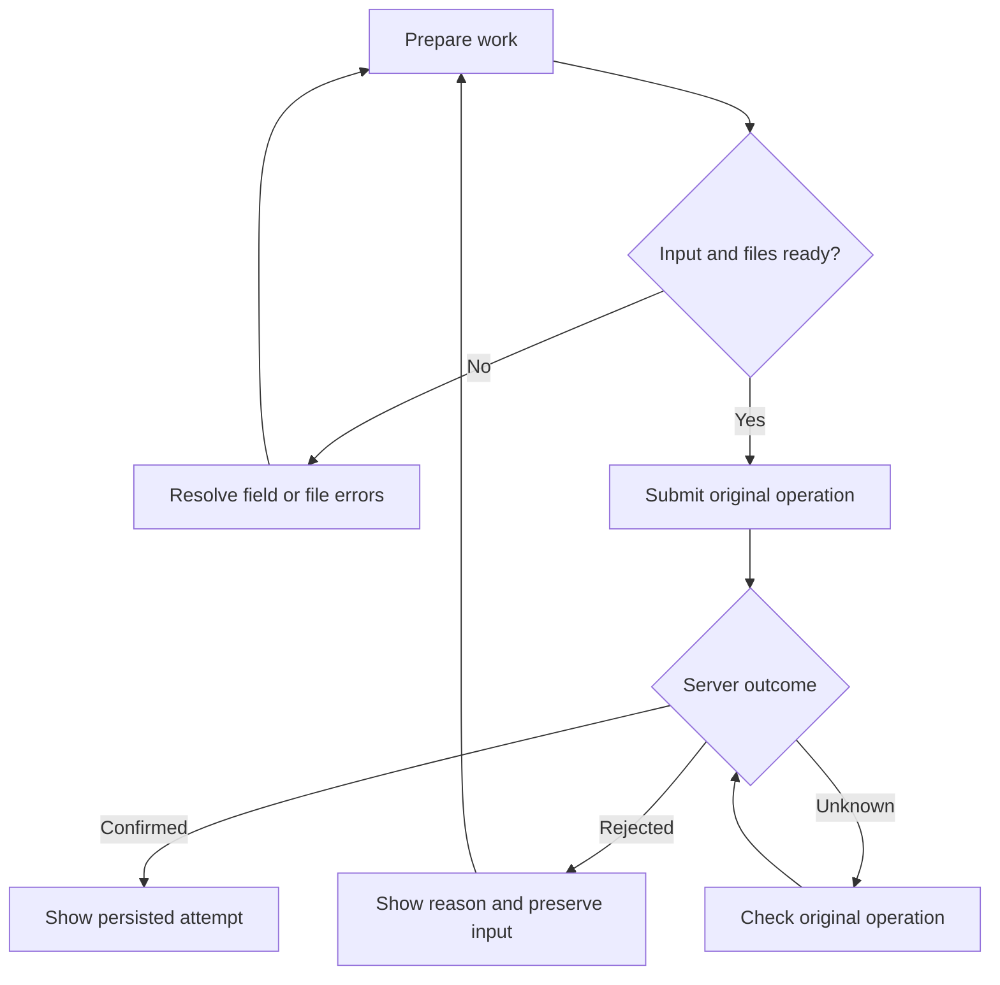

# 03 — UX/UI Specification

## Student Learning App

| Field | Value |
|---|---|
| Project | SrhDP — Student Learning App |
| Document ID | SLP-DOC-03 |
| Version | 0.1 — complete design specification draft |
| Date | 10 September 2026 |
| Sources | `01_project_brief.md` v0.1; `02_prd.md` v0.1; supplied implementation-plan screen descriptions |
| Owner | UX/UI designer — named owner pending |
| Reviewers | Product owner, academic authority, administrator, technical lead, QA lead |
| Status | Draft for review; no school-policy, visual-design, or platform approval implied |
| Deliverable | Screen and interaction specification, proposed design tokens, flows, state coverage, handoff and acceptance criteria |

This document translates the PRD into a consistent student experience and supporting staff interface. It specifies what each screen contains, how actions behave, and what users see when data is missing, requests fail, or permissions change. It does not claim that a Figma file, interactive prototype, application, or usability study has been completed.

The PRD is the source of truth for product rules. All visual values and navigation choices below are proposed design defaults. The original reference images have not been re-inspected for this document; visual direction uses the supplied description of a green-themed student app. No precise measurements or assets are attributed to those images.

## 1. Design objectives and scope

| Objective | UX outcome | Evidence required before acceptance |
|---|---|---|
| UX-OBJ-01 | Student finds today's class and its materials | Observed Home-to-material task succeeds without help |
| UX-OBJ-02 | Student distinguishes upload from confirmed submission | User identifies the persisted attempt, time, and submission outcome |
| UX-OBJ-03 | Academic summaries communicate scope and missing data | User distinguishes a partial published summary from a final grade |
| UX-OBJ-04 | Staff can maintain the term and publish work | Admin/teacher journeys complete without developer database changes |
| UX-OBJ-05 | Errors preserve trust and provide recovery | Failed/uncertain writes never present success; retry is discoverable |
| UX-OBJ-06 | Core tasks remain usable across approved input and display modes | Keyboard, assistive technology, text scaling, and viewport checks pass |

Included: authentication, student Home, classes/sessions, materials, assignments and history, results, attendance, profile/preferences/help, notifications/notices, academic setup, staff authoring/review/publication, and authorized audit review.

Conditional features remain absent until approved: classmate directory, profile photos, device-calendar integration, reminders, push/email/SMS notifications, automated import, and multiple institutions. Account recovery is included through the method selected under DEC-05. Online exams, chat, payments, guardian accounts, and full offline synchronization remain excluded.

## 2. Design principles

1. Put the next relevant action beside the information needed to take it.
2. Use the same words for the same academic state on student and staff screens.
3. Separate submission, timeliness, grading, and availability; do not compress them into one ambiguous badge.
4. Display server-confirmed outcomes. A spinner ending or upload reaching 100% is not academic success.
5. Use progressive detail: essential task information first, supporting history and policy below.
6. Preserve valid input after recoverable failures, while protecting it from another account using the device.
7. Show no invented records, grades, percentages, counts, or student identities as production placeholders.
8. Hide actions that a role cannot perform; explain legitimate actions that are temporarily unavailable.

## 3. Information architecture and navigation

### 3.1 Student navigation

Five primary destinations use consistent labels and order: **Home, Classes, Assignments, Results, Profile**. At compact widths, use a labeled bottom navigation bar. At expanded widths, use a left navigation rail/sidebar. Never display both primary navigation systems simultaneously.

| Primary destination | Secondary destinations | Entry behavior |
|---|---|---|
| Home | Today’s schedule, exam detail, Notifications, Notices, Attendance | Landing page after student sign-in |
| Classes | Class overview, Assignments, Materials, Sessions, historical classes | Current term; retain explicit user selection during session |
| Assignments | Detail, submission form, confirmation, own attempt history | All filter initially; preserve chosen filter on return |
| Results | Term/subject filters, published assessment detail | Current term if available; otherwise latest accessible term with explicit label |
| Profile | Preferences, Attendance, My submission history, Help, Logout | One consolidated identity page |

Attendance is reachable from Home and Profile. Notices have a Home shortcut and a tab within Notifications. My submission history remains reachable from Profile for withdrawn students who no longer have access to general class details. Historical results and attendance retain their own term filters.

Notifications open from a labeled bell action in the student header. Within the destination, **Updates** displays event notifications and **Notices** displays currently relevant school/class notices. The bell badge counts visible unread notifications only; it does not add a second count for the same notice.

### 3.2 Staff navigation

Proposed staff layout: left navigation plus page heading, scoped filters, content, and contextual actions. Sections are **Classes**, **Academic setup**, **Users & enrollment**, **Records**, **Notices**, and **Audit**. Render each only when an explicit capability allows it. Teachers enter their assigned Classes; administrators enter their permitted setup area. A combined-role account may switch authorized workspaces through the account menu without granting additional permissions.

Class workspace contains Overview, Sessions, Materials, Assignments, Submissions, Results, and Attendance. Staff roster access is authorized operational access; it does not enable the conditional student directory.

### 3.3 Back, deep links, and restoration

- Back returns to the originating list with its filter and position retained when safe. A cold deep link uses the logical parent as fallback.
- Re-selecting an active primary tab does not discard an edited form. An explicit leave decision is required for unsaved work.
- Protected deep links first authenticate, then reload the resource under current authorization. Do not reveal its title before authorization succeeds.
- Deleted, nonexistent, expired, and inaccessible academic resources share a neutral unavailable page; never reveal another student's identity.
- Role switch, logout, account disablement, or withdrawal clears incompatible data and navigation history. Own historical access still follows the PRD.
- Refresh revalidates access and current state. Returning from sign-in does not automatically submit a form.

## 4. Screen catalog

IDs are design references, not implemented routes or API paths. Every screen inherits Section 7 states and Section 21 accessibility rules.

| ID | Screen | Role | Primary action | PRD coverage |
|---|---|---|---|---|
| AUTH-01 | Sign-in | All | Sign in | REQ-AUTH-002–003 |
| AUTH-02 | Activation/recovery | All | Continue approved recovery | REQ-AUTH-001, 004, 006 |
| AUTH-03 | Session interruption | All | Sign in again | REQ-AUTH-003, 005–006 |
| STU-01 | Home | Student | Open relevant class/task | REQ-HOME-001–003 |
| STU-02 | Classes list | Student | Open class | REQ-CLS-001 |
| STU-03 | Class detail | Student | Select content tab | REQ-CLS-002 |
| STU-04 | Schedule/session and exam detail | Student | Open authorized class | REQ-HOME-002–003, REQ-CLS-003 |
| STU-05 | Materials | Student | Download file | REQ-MAT-002, REQ-FILE-003 |
| STU-06 | Assignments list | Student | Open assignment | REQ-ASG-005 |
| STU-07 | Assignment detail | Student | Start eligible submission | REQ-ASG-006, 009 |
| STU-08 | Submission form | Student | Submit assignment | REQ-ASG-007–008, REQ-FILE-001–004 |
| STU-09 | Confirmation and own history | Student | View confirmed attempt | REQ-ASG-006–009 |
| STU-10 | Results and assessment detail | Student | Select term/subject | REQ-RES-005–007 |
| STU-11 | Attendance | Student | Filter history | REQ-ATT-003, 005 |
| STU-12 | Profile/preferences | Student | Save preferences | REQ-PRO-001–002 |
| STU-13 | Notifications/notices/detail | Student | Open update | REQ-NOT-003–005 |
| STU-14 | Help | All | Use configured support channel | REQ-PRO-003 |
| STF-01 | Academic structure | Granted admin | Save term/class | REQ-ADM-001–002, 006 |
| STF-02 | Accounts and enrollment | Granted admin | Save account/membership | REQ-ADM-003–005, REQ-AUTH-001, 006 |
| STF-03 | Session editor | Assigned/granted staff | Save/cancel session | REQ-CLS-003–004 |
| STF-04 | Material editor | Assigned/granted staff | Publish material | REQ-MAT-001, 003, REQ-FILE-001–004 |
| STF-05 | Assignment editor | Assigned/granted staff | Publish assignment | REQ-ASG-001–004 |
| STF-06 | Submission roster and review | Assigned/granted reviewer | Publish feedback | REQ-ASG-010–012 |
| STF-07 | Assessments and result publication | Granted academic staff | Publish selected results | REQ-RES-001–004, 007 |
| STF-08 | Attendance roster | Assigned/granted staff | Finalize attendance | REQ-ATT-001–002, 004–005 |
| STF-09 | Notice editor | Granted publisher | Publish notice | REQ-NOT-001–002, 005 |
| STF-10 | Audit review | Granted reviewer | Inspect revision | REQ-AUD-001–002 |

## 5. Responsive layout specification

Platforms remain DEC-02. These are proposed logical design widths, not a claim that all browsers or operating systems are supported. For web, use CSS pixels; native implementation must translate to platform logical units.

| Layout | Width | Grid and spacing | Behavior |
|---|---|---|---|
| Compact | 320–599 | One column; 16 outer margin; 16 gap | Bottom navigation; stacked cards; full-width main action |
| Medium | 600–1023 | 24 outer margin; 24 gap; one/two columns by content | Student navigation rail; filters wrap; detail remains readable |
| Expanded | 1024+ | 240 sidebar; 32 content padding; content max 1200 | Two-column summaries; staff tables; detail/editor max 760 where appropriate |

Reference frames for later mockups: 390×844 student, 768×1024 tablet, and 1440×900 staff. Also inspect 320-wide reflow and enlarged text. Long content uses vertical scrolling; no full-page horizontal scrolling. Wide academic grids may use a labeled horizontal scroll region, with student identity kept visible and an alternative stacked record view on compact screens.

Use minimum heights, not fixed heights, for text-bearing cards, fields, navigation labels, and buttons. Allow long names and translated labels to wrap. Sticky action bars include safe-area padding and bottom content clearance; they must not hide a field, error, focused element, or last row. When the keyboard is open, maintain visibility of the active field and its error; move or unstick actions if necessary.

## 6. Proposed design system

### 6.1 Color tokens

The green palette follows the supplied design direction. These are candidate values for implementation and visual review; validate actual component contrast combinations before approval.

| Token | Value | Usage |
|---|---|---|
| color.brand.primary | #166534 | Primary buttons and selected navigation |
| color.brand.pressed | #14532D | Pressed/active button surface |
| color.brand.subtle | #DCFCE7 | Selected background with dark green text |
| color.surface.page | #F8FAFC | Page background |
| color.surface.card | #FFFFFF | Cards, form surfaces, menus |
| color.text.primary | #0F172A | Main text and headings |
| color.text.secondary | #475569 | Supporting text |
| color.border.decorative | #E2E8F0 | Nonessential dividers |
| color.border.control | #64748B | Input/control boundaries where needed |
| color.status.success | #166534 | Success text/icon on #F0FDF4 |
| color.status.warning | #92400E | Late/warning text/icon on #FFFBEB |
| color.status.danger | #B91C1C | Errors/destructive action on white or #FEF2F2 |
| color.status.info | #1E40AF | Informational text/icon on #EFF6FF |
| color.focus | #1D4ED8 | Visible focus ring with contrasting gap |

Never use green alone to indicate submitted, red alone to indicate absent, or pale dividers as the only essential input boundary. Disabled controls retain legible labels and a nearby explanation. A dark theme is not included until explicitly designed and approved.

### 6.2 Typography and geometry

| Token | Proposed value | Use |
|---|---|---|
| type.family | System sans-serif with full script fallback | Avoid dependency on a selected commercial font |
| type.pageTitle | 28 / 36, semibold | Main page heading |
| type.sectionTitle | 20 / 28, semibold | Card group/section heading |
| type.body | 16 / 24, regular | Instructions and primary content |
| type.label | 14 / 20, medium | Fields, tabs, badges |
| type.supporting | 14 / 20, regular | Metadata and helper copy |
| space.scale | 4, 8, 12, 16, 24, 32, 48 | Consistent internal and section spacing |
| radius.control / card / dialog | 8 / 12 / 16 | Rounded geometry |
| size.control.minimum | 48 high | Main buttons and inputs |
| size.icon / hitTarget | 20–24 / at least 44×44 | Visible icon versus operable area |
| elevation.card | Border by default | Avoid excessive shadows |
| elevation.overlay | Subtle shadow and scrim | Menus/dialogs above content |

Typography values are size/line-height in logical units. Khmer text, if approved, must use a tested Khmer-capable system fallback and expandable line height without clipped combining marks. Do not assume Latin line metrics fit every script.

### 6.3 Reusable component contract

| Component ID | Component | Variants and behavior |
|---|---|---|
| CMP-01 | App shell/header/navigation | Student/staff, compact/expanded; labeled selected destination; unread badge with accessible count |
| CMP-02 | Button | Primary, secondary, text, destructive; default, focus, pressed, disabled, busy; label describes action |
| CMP-03 | Input/select/date-time | Label, required marker, helper, error, read-only; preserve valid Unicode; school timezone beside time controls |
| CMP-04 | Status badge | Submission, grading, availability, timeliness, publication; icon/text; wraps without truncating meaning |
| CMP-05 | Summary card | Value, unit, scope, coverage, optional explanation; unavailable/N/A distinct from zero |
| CMP-06 | Academic list card | Title, class/term, relevant metadata, status, explicit open action; avoid nested interactive targets |
| CMP-07 | Tabs and filter controls | Selected state, accessible labels; filters apply to rows and aggregates together |
| CMP-08 | File row/upload group | Name, type, size, lifecycle, progress if measurable, retry/remove before confirmation |
| CMP-09 | State panel | Loading, empty, error, unavailable, offline, stale; title, explanation, permitted recovery action |
| CMP-10 | Dialog | Title, consequence, fields/reason when needed, Cancel and explicit action; focus containment and restoration |
| CMP-11 | Feedback banner | Inline persistent failure or success; nonblocking toast for secondary saved preference only |
| CMP-12 | Roster/table | Headers, stable row identity, sorting/filtering, pagination, row errors, explicit selection scope |
| CMP-13 | History/revision panel | Attempt/revision, actor where authorized, timestamp, current label; immutable prior entries |
| CMP-14 | Pagination/load more | Loading/error/end states; existing rows remain; stable ordering and filter context |

## 7. Shared screen and write states

| State | Presentation | Action/transition |
|---|---|---|
| Initial loading | Skeleton approximates content; accessible “Loading…” | No fake numbers; replace with loaded content |
| Successful empty dataset | Specific explanation, e.g. “No classes for this term” | Change term or relevant help; no student create-class action |
| No filter matches | “No assignments match these filters” | Clear filters; distinguish from no assignments |
| Partial dashboard failure | Error within failed widget; other authorized widgets remain | Retry widget; no replacement with zero |
| Recoverable read failure | “We couldn't load this information” | Retry retains filter context |
| Unavailable resource | “This item isn't available” | Back to accessible parent; identical for inaccessible/nonexistent IDs |
| Offline | Persistent connection message | Reads may show clearly dated safe session data; writes need connection |
| Stale data | “Last updated {time}; refresh to check for changes” | Revalidate before actions; discard if access cannot be established |
| Known write rejection | Field or policy error; no success | Edit/retry only if permitted; retain safe input |
| Unknown write outcome | “Checking … status” and persistent operation context | Reconcile original operation before allowing another write |
| Concurrent edit | “This record changed while you were editing” | Reload latest; preserve authorized unsaved input for manual comparison |
| Session expired | Hide protected content; sign-in action | Reauthorize destination and reconcile interrupted write |
| Access revoked | Clear affected cached content | Navigate to allowed list/history; no retry that bypasses permission |

UI may acknowledge taps immediately, but must not invent an academic outcome. Critical confirmations persist inline and in history; a transient toast alone is insufficient. Retry failures remain visible. Automatic retries of reads may be bounded; academic writes reuse their original operation identity when the contract supports it. API behavior belongs in the API specification.

Draft text can be preserved in current protected form memory during recoverable errors. Disk persistence or background offline delivery is not promised. Logout clears drafts and staged references. On browser/app restart, recover the confirmed server history; do not promise recovery of unsaved text.

## 8. Authentication screens

### AUTH-01 — Sign-in

Content order: institution/product identifier, “Sign in,” login identifier, password, Show/Hide password, Sign in, recovery/help link. No public Register link. Identifier wording follows the approved school login policy; do not hardcode email if student IDs may be used. Password supports paste and password-manager entry. Do not trim passwords silently.

Validate missing fields locally. On submit, mark the form busy and prevent duplicate requests. Generic credential failure: “Unable to sign in. Check your details or use account recovery.” Avoid revealing whether an identifier exists. Rate-limit responses show the server-provided retry availability without inventing countdown duration. Service failure has Retry and Help. Successful role routing follows Section 3.

### AUTH-02 — Activation/recovery

Entry comes from an institution-issued activation method or the recovery link. Show only fields required by the approved method. Public request confirmation uses the same response for known and unknown identities: “If your details match an account, follow your school's recovery instructions.” Expired/used evidence provides Restart recovery or school Help. New password fields and validation must match the approved auth contract; password strength policy is a DEC-05 dependency, not invented here.

Completion returns to sign-in and states that the password/access update succeeded only after confirmation. Previous sessions are revoked according to the PRD. Never display the old password or full recovery evidence.

### AUTH-03 — Session interruption and logout

Expiry copy: “Your session has ended. Sign in again to continue.” If an academic write may have succeeded, add “We'll check the outcome after you sign in.” Reauthenticate before showing preserved private input. A different account cannot inherit the pending operation or draft.

Logout normally proceeds directly. If unsaved input exists, show “Log out and discard unsaved changes?” with Stay and Log out. Clear private UI immediately on local logout; server invalidation must complete or be handled explicitly by the authentication contract. Do not claim that a failed server revocation succeeded.

## 9. Home, classes, and schedule

### STU-01 — Home layout

Top to bottom: student greeting/name and school identifier; institution-local date; Today’s schedule; next published exam; shortcuts to Assignments, Attendance, Notices, and Classes. Bell action stays in header. Use a two-column arrangement for schedule and supporting cards only when width permits. Do not add unsupported GPA, rank, gamification, or attendance percentage without coverage context.

Session cards show class/subject, start–end, location, and canceled status when applicable. Overlapping sessions remain separate; canceled sessions are not promoted as the next activity. Today includes sessions overlapping the institution-local day. Next exam excludes draft/canceled/past/unrelated exams and opens STU-04. An absent exam displays “No upcoming published exams.” No enrollment displays guidance to contact school support, while profile and permitted history remain accessible.

### STU-02 — Classes list

Heading, term selector, Current/Historical control, then class cards sorted by name with stable ID tie-break. Each shows subject/class name, code, term, assigned teacher summary, and class state. A missing location is “Not assigned,” not an empty gap. Preserve list position after detail. Historical mode is read-only and visibly labeled.

### STU-03 — Class detail

Header: back, class title/code, term, read-only banner where applicable. Tabs: Overview, Assignments, Materials, Sessions. Overview shows teacher, location, description if provided, and upcoming session. Each tab loads and fails independently. Students tab is absent until DEC-08 approval. Do not expose private roster counts through hidden directory features.

Withdrawal removes general class access; users reach their own submissions through STU-09, not an unrestricted class link. Completed/archived classes remain read-only for previously enrolled students under PRD policy.

### STU-04 — Schedule/session and exam detail

Show title, class, date, start/end with timezone, teacher/location when available, and cancellation/update information. Provide Open class only when currently authorized. Exam detail is schedule information, not an online examination screen and not result publication. No Add to My Schedule or calendar permission prompt is included until DEC-11 defines it. A canceled session stays understandable in history and cannot be treated as an attendance obligation.

## 10. Materials and downloads

### STU-05 — Materials

Class materials list shows title, description excerpt, publication/update date, and file rows with filename/type/size. Detail exposes full description and individual Download actions. Do not imply a previewer for every format; use the selected platform's supported open/download behavior. A protected fetch rechecks permission before providing the file.

During download, show progress only when measured. A failure leaves an actionable Retry on that file. A stale link may be refreshed under authorization. Unsafe/unready files are never offered as downloadable. Archived material is absent from active lists. Empty copy: “No published materials yet.” No external app installed: explain the format and retain the supported download option, without claiming the app can render it.

Confirmed student submission attachments are a separate resource history; replacing a teaching material does not replace a student's submitted file.

## 11. Assignment browsing and detail

### STU-06 — Assignments list

Top: title, All/Pending/Completed tabs, term/class filters. Cards: assignment title, class, due date/time/timezone, submission badge, availability and late marker if relevant. Sort active assignments by due timestamp then stable ID. Filters and counts use all authorized matching records, not just the loaded page.

**Pending = no confirmed attempt. Completed = at least one confirmed attempt.** Completed does not mean graded, full marks, or no further eligible attempt. A closed unsubmitted assignment remains Pending and displays Closed/Overdue explanation. Do not show a fictional percentage progress bar.

### STU-07 — Assignment detail

Content order: title/class; independent status badges; due time and late-close policy; instructions; teacher attachments; required submission mode and limits; attempts used/max; current confirmed attempt and published feedback; submission action; earlier attempts.

| Condition | Main action | Explanation |
|---|---|---|
| Before opening | Unavailable action with visible opening time | “Submissions open {date/time/timezone}” |
| Eligible, no confirmed attempt | Start submission | Show requirements before form |
| Eligible, attempts remain, no published feedback | Submit another attempt | “Your previous attempt remains in history” |
| Late window open | Start submission / Submit another attempt | “This attempt will be marked Late”; show late-close time |
| Attempt limit reached | View submission | “All permitted attempts have been used” |
| Published feedback | View feedback | “Further attempts are closed because feedback has been published” |
| Window closed | View submission/history if present | “The submission window has closed” |
| Archived class/assignment | View history | “Read-only” with relevant reason |
| Withdrawal | Own history route only | No general assignment access restored by this screen |

When multiple blocks apply, prioritize access/class/archive restrictions, then feedback lock, attempts, and time; show secondary relevant reasons in detail. The backend decides eligibility. Local clocks and button state cannot override it.

## 12. Submission form, files, and confirmation

### STU-08 — Form specification

Use a dedicated page with assignment identity and deadline summary. Text mode displays a labeled text area; file mode displays an upload group; text-and-files displays both and requires both. Text is 1–10,000 characters after required-content validation. Show a character counter near the limit and an error without silently truncating pasted work. A Back action warns before discarding unsaved input.

Proposed PRD limits displayed before selection: PDF, DOCX, PPTX, XLSX, JPEG, PNG; 20 MiB per file; maximum 5 files and 50 MiB combined per attempt. Reject empty files and unsupported formats. Explain rejection per file; keep other valid files. Actual acceptance is server-side. These limits remain DEC-06 proposals. Use the same limits for staff material/assignment attachment groups.

| File state | UI | Allowed actions |
|---|---|---|
| Selected | Filename, size, waiting label | Remove; begin upload |
| Uploading | Measured percentage or indeterminate progress | Cancel upload where supported |
| Checking | “Checking file…”; no false 100%-complete badge | Wait or remove staged file |
| Ready | “Ready to submit” | Remove before finalization |
| Rejected | Specific safe error, e.g. unsupported format/size | Replace/remove |
| Temporary failure | “Upload/check couldn't finish” | Retry under file service contract |
| Expired staged file | “This upload expired. Select the file again” | Re-upload; staged expiry is 24 hours in PRD |
| Confirmed attachment | Read-only filename/size and download | Open/download under authorization; no remove action |

The primary Submit assignment action requires valid input and all required files Ready. It shows a short persistent note: “Uploading files does not submit your assignment. Submission time is recorded when your work is accepted.” For a final allowed attempt, display “This is your last permitted attempt” before action. Avoid a redundant generic confirmation dialog; a resubmission review can explicitly show attempt number and preserved earlier history.

### Submission outcome flow

If finalization is in flight, disable another submit action. If the response is lost, keep “Checking submission status” and an explicit Check again action if reconciliation remains unavailable. Do not create a new operation simply because the deadline has passed or the screen reopened. An authoritative rejection permits editing/retrying when still eligible. A confirmed original operation shows its original time and attempt number even when retrieved after the deadline.

### STU-09 — Confirmation and own history

A durable confirmation panel shows **Submitted**, assignment title, attempt number, reference, accepted date/time/timezone, On time/Late, and submitted text/files. Actions: View assignment if authorized, View submission history, return to list. No unsupported Download receipt feature is implied.

History lists latest attempt first, labels Current, and preserves all earlier confirmed attempts read-only. Detail shows the content of that specific attempt and only published feedback. No feedback yet reads “Feedback has not been published,” with no draft score or draft-existence indicator. A corrected feedback revision shows Updated and publication time; staff audit contains old values/reason. Own history remains available after withdrawal while the account is active.

## 13. Results screens

### STU-10 — Results and assessment detail

Layout: title; term and subject filters; summary with scope and coverage; subject/assessment rows; explanatory note. Rows show assessment title/date, subject, published status, Scored/Absent/Exempt, marks/max where appropriate, percentage for scored records, and updated publication indicator. Blank scores never become zero.

The summary label is **Published scored assessments percentage**. Show included earned/max totals and an Incomplete label when coverage is incomplete. Explain “Only published scored assessments are included. This is not a final term grade.” Do not expose draft values or unauthorized assessment metadata to explain missing coverage; use a safe aggregate completeness indicator supplied by the contract.

| Fixture | UI expectation |
|---|---|
| 40/50 and 60/100 | Total 100/150; 66.67% |
| Published scored 0/50 | 0.00%, not missing |
| 40/50 and an Absent result | 80.00%; Absent count 1; scope note remains |
| Only Absent/Exempt | N/A; display status counts |
| 40/50 published and another score draft | 80.00%, Incomplete; no draft marks shown |
| No published records | “No published results for this selection” |

Calculations use unrounded inputs and display two decimal places, half-up, as in the PRD. Filter changes update rows and totals as one coherent selection; while loading, never show new-filter rows with old-filter totals. Assignment feedback is not automatically included. No GPA, pass/fail, ranking, weighted grade, or celebratory final-result message is in the baseline.

Assessment detail includes the student's visible record and publication/update time. If publication is withdrawn, remove affected values from totals and show incomplete coverage; the old deep link must not reveal withdrawn marks.

## 14. Attendance screen

### STU-11 — Attendance

Layout: term/class and date filters; attendance percentage; recorded coverage; Present/Late/Absent/Excused counts; newest-first history. Each row shows session date/time, class, and visible finalized status. For eligible started sessions without finalized attendance, use Not recorded; never disclose a hidden staff draft status.

Formula explanation is available beside the summary: “Present and Late count toward attendance. Excused sessions are excluded from the percentage.” Show coverage separately as finalized eligible records / eligible started noncanceled sessions. Filters apply to summary and rows consistently. Canceled sessions are excluded; future sessions are not missing attendance.

| Fixture | UI expectation |
|---|---|
| Present 8, Late 1, Absent 1, Excused 2 | 90.00%; coverage 12/12 |
| Same plus one Not recorded | 90.00%, Provisional; coverage 12/13; missing 1 |
| Only two Excused | N/A; coverage 2/2 |
| Only one Absent | 0.00%; coverage 1/1 |
| No eligible sessions | N/A; “No eligible sessions in this selection” |

Do not label students at risk based on an invented threshold. Help links explain how to contact the school about a discrepancy; they do not imply an implemented appeal workflow.

## 15. Profile, preferences, and help

### STU-12 — Consolidated profile

Show school-controlled name, student identifier, institution, and relevant enrollment summary as read-only text, with “Contact your school to update these details.” Do not offer a disabled misleading Edit identity form. Roles, recovery identity, school name, and enrollment are not student-editable.

Preferences include supported language only if multiple interface languages are approved. Save is explicit, shows busy state, persists confirmed values, and keeps previous values if rejected. Do not add an institution-timezone override that changes deadline meaning. Avatar is initials/generic identity icon; photo upload is conditional. Links: Attendance, My submission history, Help, Logout. No duplicate second Profile page.

### STU-14 — Help

Display actual school-configured support channel, service availability, and instructions. Before pilot, replace configuration placeholders with approved contact details. A failed operation may provide Copy reference. Suggested report fields are screen/action, time, and reference; never request passwords, recovery codes, or unnecessary private academic files. Opening a contact link is a deliberate user action, not an automatic message.

## 16. Notifications and notices

### STU-13 — Updates, notices, and detail

Updates rows show safe title/excerpt, event time, unread text/dot, and destination action. Notices rows show title, school/class audience label when authorized, publication date, and excerpt. Use newest event/publication then stable ID ordering. Titles and excerpts are loaded under current authorization; badges exclude no-longer-visible notifications.

Opening successfully loaded detail records read state. A failed load stays unread. If detail loads but mark-read fails, retain the readable detail and retry the read update; do not claim the server count is synchronized. Opening twice is harmless. A new feedback/result revision creates a new unread notification; ordinary notice text edits do not silently resend.

Expired/archived/inaccessible notice links show the shared unavailable page. Later enrollment makes still-published current content accessible but does not replay old notification events. Notification delivery failure does not reverse a confirmed submission or publication. Do not introduce permission requests for deferred push/calendar functionality.

## 17. Staff setup and academic content screens

### STF-01 — Academic structure

Provide year/term/subject/class lists with names, dates, status, filters, and permitted Create/Edit/Archive actions. Term editor requires year, name, start/end; validate end after/at valid start boundary and containment within year according to the API contract. Class editor requires subject, term, name/code, status. Duplicate class code within a term has an inline error. Linked historical records cannot be hard-deleted.

Archive dialog identifies the entity, consequences, and reason; primary action says Archive class/term. Referenced records remain inspectable. Setup checklist shows counts of users, classes, assignments of teachers, enrollments, and sample verification tasks for authorized staff; do not mark reconciliation passed automatically because forms were saved. Manual setup is supported; no Import button until selected.

### STF-02 — Accounts and enrollment

Account list/editor shows stable identifier, name, login identity, status, explicit roles. Duplicate login errors preserve other fields. Grant changes, disabling, and recovery actions require clear scope and audit. Disable dialog explains access/session revocation without deleting academic history. Never show existing passwords.

Enrollment editor selects class/student, effective start, state, and withdrawal/end where relevant. Prevent duplicate active enrollment and new enrollment of inactive accounts. Teacher assignment uses active staff and explicit scope. Withdrawal/backdated corrections require reason and warn that access and report eligibility change. Show affected records/review needs returned by the service; no speculative count. Archived-class correction is limited to the appropriate permission.

### STF-03 — Session editor

Fields: class, start/end, institution timezone, optional room/location, status. Enforce term boundaries and end after start. Teacher/class overlaps appear as an explicit warning naming accessible conflicting sessions; baseline save requires acknowledgement. Cancellation requires confirmation/reason, preserves history, and explains exclusion from attendance counts. If another user changed the session, show conflict before overwriting.

### STF-04 — Material editor

Fields: class, required title, description, attachments; draft/publication status. Save draft is separate from Publish. Publish requires ready attachment(s). A preview shows student-visible title/content and audience. Replace file produces an attributable revision; Archive removes active student access. History of material changes is separate from immutable submitted student work.

### STF-05 — Assignment editor

Fields: class, title (1–200), instructions (1–20,000), open/due timestamps, submission mode, maximum attempts (1–3, default 1), late acceptance toggle (off by default), late-close timestamp when enabled, optional ready attachments, optional grading maximum. Show timezone on each relevant group and a summary of resulting policy before publication.

Save draft never exposes work to students. Publish validates class state, required fields, time ordering, limits, and file readiness. Preview lists class audience, opening/due/late-close, mode, attempt limit, and attachments. After publication, show locked fields with reasons. Due/late-close may extend but not shorten; after first confirmed attempt, class/mode/attempt limit/existing grading basis are locked. Archive requires reason and warns that new submissions stop while history remains. Published assignments cannot revert to Draft; archived assignments cannot reopen in MVP.

## 18. Staff review and academic publication

### STF-06 — Submission roster/review

Roster columns: student identifier/name, submission status, latest attempt, accepted time, timeliness, feedback publication status. Filters select class/assignment and relevant status. Summary counts reflect the whole filtered authorized roster. Open row shows latest confirmed attempt content/files and separate earlier attempts.

Review form: comment, optional score/max, Save draft feedback, Publish feedback. Draft save clearly states “Saved as draft; students cannot see this feedback.” Publication summary identifies student and reviewed attempt and explains that further attempts will close. If a newer attempt exists, publication rejects and asks the reviewer to reload that attempt; do not silently attach feedback to a new target. Correct published feedback requires reason, shows original versus proposed content to staff, and remains draft until republished.

### STF-07 — Assessment setup and results

Assessment editor includes term, class/subject, title, maximum marks, exam date/start/end where relevant, and publication state. Distinguish **Publish exam details** from **Publish results**. Publishing a schedule does not publish scores.

Results grid has a per-student Scored/Absent/Exempt selector. Scored requires numeric 0–maximum with at most two decimals. Absent/Exempt leave marks empty and remove contradictory numeric input only after explicit user acknowledgement if it would discard an entered value. Missing students remain unresolved, not zero. Row errors are linked from an error summary.

Publish selected results opens a review step listing selected eligible records, selected count, excluded/unresolved rows and reasons, and the student-visible summary scope. Selection is explicit across pagination: default is current page; any select-all-filtered action names its full scope. Selected batch publishes all or none; no per-row success animation before atomic confirmation. If selection/revisions changed, refresh/review again.

Correction flow: edit draft correction → reason → preview → republish selected correction. Student sees the previous published revision until commit. Withdraw publication requires permission, reason, and warning that values leave student summaries. No hard-delete shortcut replaces withdrawal/audit.

### STF-08 — Attendance roster

Select class/session before loading eligible students. Show session date/time and eligibility count. Future/not-started/canceled sessions cannot receive regular attendance edits. Each student starts with no selected status. Available statuses are Present, Absent, Late, Excused; never default missing rows to Absent.

Save draft and Finalize attendance are separate. A convenience bulk status action, if implemented, must name selected scope and require deliberate selection; it cannot act on unselected unseen rows. Finalization shows counts and explicitly lists remaining Not recorded students. User either completes them or deliberately confirms an incomplete roster; student coverage reflects incompleteness. Corrections require reason and preserved prior values. Membership corrections/cancellations show recalculation/review feedback supplied by the service.

### STF-09 — Notice editor

Fields: title (1–200), body (1–20,000), authorized school/class audience, optional expiry later than publication. Save draft, Preview, Publish. Render plain safe content; no executable markup. Teacher school-wide option is absent without a separate grant. Review audience before publication; show server-derived recipient scope, not guessed numbers.

Editing wording preserves read state. Explicit republish as a new revision explains that it creates a new event; archive/expiry remove active visibility. Staff publication outcome remains confirmed even if a downstream notification is delayed.

### STF-10 — Audit review

Only granted reviewers see this section. Filters: entity/action, actor where permitted, date range, reference. Detail displays actor, timestamp/timezone, entity/reference, prior/new state and reason within granted scope. No editing/deleting audit actions. Secrets and unnecessary academic content never appear. Support sees only authorized diagnostic metadata, not an automatic full academic view.

## 19. Field validation and content rules

| Field/category | UX requirement |
|---|---|
| Required text | Label required state; trim boundary whitespace for required-content checks; preserve Unicode |
| School identity | Read-only for student; staff edits preserve stable identity and linked records |
| Password | No silent trimming; paste permitted; approved contract determines policy |
| Time fields | Explicit institution timezone; validate boundaries; never use ambiguous numeric date-only deadlines |
| Numeric score | Show maximum; support approved decimal precision; no implicit zero or silent rounding of invalid input |
| Long filename/title | Wrap in detail; abbreviated list name retains full accessible name and extension |
| Invalid field | Inline precise error plus top error summary for long forms; focus first invalid field after submit |
| Conflict | Explain latest revision exists; allow safe manual reconciliation, never silent overwrite |
| Reason | Required for specified corrections/archive/withdrawal; validate as non-whitespace; length follows contract |
| Unspecified limits | SDD/API must supply bounds for unspecified names/descriptions; designer must not invent conflicting limits |

Validate on attempted submit and after correction/blur; avoid errors before first interaction. Client validation assists the user; server errors must map to the same fields. Error recovery never clears unrelated valid content. Do not include technical stack traces, raw API bodies, or database identifiers in product copy; a safe support reference is acceptable.

## 20. Microcopy and localization

English is the draft copy language, not an approved English-only release decision. DEC-03 determines interface languages and institution timezone. Unicode school data must remain intact regardless of UI language. If Khmer is approved, commission reviewed translations of the complete string catalog and test mixed Khmer/English names, dates, digits, line wrapping, and assistive labels. Do not concatenate translated sentence fragments.

| State/action | Proposed English copy |
|---|---|
| No schedule | No classes scheduled for today. |
| No materials | No published materials yet. |
| No pending work | No pending assignments in this selection. |
| Checking file | Checking file. It is not ready to submit yet. |
| Upload ready | Ready to submit |
| Submission unknown | Checking submission status. Please wait before trying again. |
| Confirmed | Submitted successfully. |
| Late rejected | The submission window has closed. Your work was not submitted. |
| Newer attempt conflict | A newer attempt is available. Review it before publishing feedback. |
| Partial results | Incomplete — only published scored assessments are included. |
| Missing attendance | Attendance has not been recorded for this session. |
| Saved draft | Draft saved. Students cannot see these changes. |
| Unavailable | This item isn't available. |
| Save conflict | This record changed while you were editing. Reload the latest version. |
| Unsaved leave | Leave and discard unsaved changes? |

Use sentence case and explicit action verbs: Submit assignment, Publish feedback, Finalize attendance, Archive class. Avoid ambiguous OK for consequential actions. Exact timestamps include date, time, and timezone; relative times can supplement but not replace deadlines or submission receipts. The institution timezone must be configured, not inferred from the user's location.

## 21. Accessibility and motion acceptance targets

These are proposed project acceptance targets, not a claim of formal standards certification. The selected platform must implement semantic roles and accessibility APIs appropriately.

- Essential text targets contrast of at least 4.5:1; large text and essential control/icon boundaries target at least 3:1. Measure actual rendered pairings, including focus and error states.
- Primary actions and icon controls offer at least 44×44 logical-unit targets with sufficient separation; 48-high controls are the design default.
- Support keyboard operation on web: logical Tab order, visible focus, Enter/Space activation where appropriate, Escape dismissal of nonessential overlays, and restored focus after close.
- Dialogs have a name, focus containment, and a safe dismissal route. Initial focus should not accidentally activate a destructive action.
- Screen readers receive headings, labels, required/invalid states, table headers, selected tabs, expanded controls, and file lifecycle. Announce important status changes without reading every upload percentage.
- At 200% text scaling, no clipped labels, inaccessible actions, overlapping badges, or hidden validation. Compact reflow must retain all core functionality.
- Color is always paired with text/icon meaning. Decorative icons are hidden from assistive technology; functional icons have names.
- Reading and visual order agree. Errors link to the affected field. Page navigation moves focus to the new heading; inline refresh does not reset the user's reading position unnecessarily.
- Honor reduced motion. Use short, subtle transitions (proposed 150–200 ms); remove nonessential animation under reduced motion. No flashing or celebratory motion for grade outcomes.
- Do not make drag-and-drop, swipe, hover, or animation the only way to complete an action. File selection uses an accessible button; row actions remain discoverable without hover.

## 22. Data-state and contract handoff

The UI requires authoritative values below. These are conceptual contract needs; no endpoint path, JSON field name, or implementation technology is approved by this document.

| Area | Required information from service | UI must not infer |
|---|---|---|
| Session/access | Active identity, capabilities, resource authorization, expiry outcome | Permissions from hidden buttons alone |
| Lists | Stable record identity, ordering, filter context, pagination, authorized totals | Totals from current page length |
| Assignment | Publication, window/timezone, eligibility and blocking reason, policy, attempts, published feedback | Eligibility solely from device clock |
| Submission | Original operation outcome, accepted timestamp, attempt/reference, timeliness, immutable content | Success from upload completion |
| Files | Lifecycle, limits, safe failure, expiry, authorized download | Safety from filename extension |
| Results | Published values, scoped totals, included counts and safe completeness | Draft values, weighted grades, rank |
| Attendance | Finalized statuses, eligible-session coverage, cancellation effects | Missing as absent |
| Publication | Revision, selected scope, committed outcome, conflict | All-or-none outcome from individual row spinners |
| Notifications | Visible unread count, read acknowledgement, current linked access | Historic access from old notification possession |

Engineering must distinguish known failure from unknown outcome for academic writes. Operation identifiers, conflict control, and recovery after restart are specified in the API/SDD handoff. No screen is Ready if its critical failure state depends on an undefined backend outcome.

## 23. Prototype and usability plan

This Markdown specification is complete as a draft; high-fidelity screens and clickable prototypes remain a downstream design deliverable. Use synthetic data only. Proposed design-file organization: Foundations, Components, Student flows, Staff flows, Exception states, Responsive/accessibility, Handoff. Name frames `{screen ID} / {state} / {width}` and link each to PRD and UX acceptance cases.

Required prototype branches:

1. Sign in → Home → class → material; include empty schedule and failed download.
2. Assignment → valid upload/check → submit → durable confirmation/history.
3. Lost submission response → reconciliation → original receipt; closed-window rejection branch.
4. Results and attendance → change filters → incomplete/zero/N/A fixtures.
5. Admin setup → teacher assignment/enrollment → teacher publishes assignment.
6. Teacher review → newer attempt conflict → review current attempt → publish feedback.
7. Result draft → selected batch preview → publish → correction; attendance partial finalization.
8. Notice publication/read, session expiry, withdrawal/history, and logout on shared device.

Proposed study: 5–8 students and 2–3 staff for formative feedback; recruit varied devices, language needs, and assistive-technology use where relevant. These counts are planning suggestions under DEC-15, not a representative population claim. Use tasks without naming the exact button to press; record completion, errors, assistance, time, and whether participants correctly explain submission and summary states. Use the brief's proposed ≥90% independent core-task completion target with participant counts reported. Any false belief that unconfirmed work was submitted is a critical design finding regardless of aggregate completion rate.

## 24. UX acceptance and QA matrix

Each case is a design/implementation verification requirement; no tests are claimed to have run against an application.

| Case | Scenario | Expected result | Trace |
|---|---|---|---|
| UX-AC-01 | Navigate all primary destinations and back | Labels/order stable; list state restored; no draft lost silently | REQ-UX-004, STU-01–13 |
| UX-AC-02 | Wrong/unknown account sign-in | Equivalent safe response; no academic content exposed | REQ-AUTH-002, REQ-PERM-003 |
| UX-AC-03 | Session expires during finalization | Reauthentication then original-operation reconciliation | REQ-AUTH-003, REQ-ASG-008 |
| UX-AC-04 | Home widget fails while others succeed | Local error; no false zero/empty state | REQ-HOME-001 |
| UX-AC-05 | Institution-local midnight and canceled session | Correct local day; canceled excluded from next activity | REQ-HOME-002 |
| UX-AC-06 | Student has submitted but ungraded work | Completed tab, Submitted badge, no draft feedback | REQ-ASG-005–006 |
| UX-AC-07 | Upload reaches 100%, file still checking | Not submitted; finalization unavailable until Ready | REQ-FILE-002 |
| UX-AC-08 | Invalid/oversize file alongside valid files | Per-file error; other content preserved | REQ-FILE-001, REQ-UX-004 |
| UX-AC-09 | Lost response and retry after deadline | Original receipt/time; no extra attempt | AC-ASG-05 |
| UX-AC-10 | Exact due time and late-close boundaries | Outcomes match PRD fixtures; UI explains rejection/late state | AC-ASG-01–04 |
| UX-AC-11 | Withdrawal after upload | Finalization denied; own prior history remains accessible | AC-ASG-06, REQ-PERM-002 |
| UX-AC-12 | Concurrent new attempt during review | Publish conflict; no stale feedback publication | AC-ASG-07 |
| UX-AC-13 | Results fixtures and filters | Correct 66.67%, zero, N/A, incomplete; no draft leakage | AC-RES-01–05 |
| UX-AC-14 | Attendance fixtures and cancellation | Correct percentage and separate coverage | AC-ATT-01–05 |
| UX-AC-15 | Staff partially records attendance | No implicit absence; explicit incomplete finalization | REQ-ATT-001–002 |
| UX-AC-16 | Result batch contains invalid/unresolved rows | Clear selected/excluded scope; atomic publication | REQ-RES-003–004 |
| UX-AC-17 | Published correction drafted then committed | Previous student-visible value remains until publication | REQ-RES-004, REQ-ASG-012 |
| UX-AC-18 | Notice detail load/read update fails | No false synchronized read; retry is safe | REQ-NOT-004 |
| UX-AC-19 | Copied private link and account switching | Neutral unavailable response; no previous-account cache | REQ-PERM-001–003, REQ-AUTH-005 |
| UX-AC-20 | Concurrent staff edits | Latest revision preserved; manual reconciliation offered | REQ-UX-005 |
| UX-AC-21 | Long English/Khmer content and 200% text | No clipping or lost action; readable labels and order | REQ-UX-001, 006 |
| UX-AC-22 | Keyboard/screen-reader core journeys | Operable controls, focus management, clear announcements | REQ-UX-006 |
| UX-AC-23 | Empty list, filter-empty, error, offline | Distinct states and appropriate recovery | REQ-UX-002 |
| UX-AC-24 | Multi-page lists and bulk selection | Stable order, full-scope totals, explicit selection | REQ-UX-003 |
| UX-AC-25 | Admin disables/withdraws/archives | Clear consequence, required reason, preserved history | REQ-ADM-003–005, REQ-AUD-001 |
| UX-AC-26 | Classmate/calendar/photo controls before approval | Absent; no inert or undefined action | DEC-08, DEC-11; PRD Section 2 |

UX-AC-01–26 complement the PRD's UAT-01–11; they do not replace backend permission, integrity, load, recovery, and release testing.

## 25. Handoff, readiness, and change control

Before a feature enters development, attach its screen ID, PRD requirements, approved dependent policy, component variants, all relevant states, responsive behavior, copy, contract needs, and acceptance cases. Add actual design-node links only after those nodes exist. Do not invent Figma URLs or Jira keys.

Design handoff package must contain:

- Approved student/staff screen flows and annotated reference frames.
- Token definitions, component variants, focus/disabled/error behavior, and icon/asset ownership.
- Validation and localization catalog including accessibility names and pluralized strings.
- Synthetic fixtures for absent, zero, incomplete, long-text, permission, offline, and concurrency cases.
- Traceability from screen and requirement to Jira story, implementation review, and QA evidence.
- Review log of unresolved deviations with owner and decision gate.

Design acceptance requires product and academic-policy review, complete critical state coverage, accessible prototype review, and approved platform/language matrix. Implementation acceptance additionally requires rendered device checks, PRD calculation fixtures, negative permission checks, and confirmed-write recovery. Completing this document does not itself approve a release.

Changes to attempts, deadlines, completion meaning, grade/attendance policy, historical access, or publication authority must update the PRD before corresponding UX rules are changed. Visual-only changes still require affected component/state review. Record revision, affected IDs, rationale, reviewer, and acceptance impact.

## 26. Pending decisions and approval

| Reference | Decision | Proposed position / required action | Owner | Gate |
|---|---|---|---|---|
| DEC-01 | Branding and institution | Working name; green candidate palette; confirm actual identity/assets | Sponsor/product owner | Visual baseline |
| DEC-02 | Student/staff platform and supported matrix | Adaptive student shell and staff workspace; confirm selected platforms/devices | Product/technical lead | Design and estimate baseline |
| DEC-03 | Languages/timezone | Draft English copy; Unicode data; explicitly configured school timezone | School representative | Content and deadline design |
| DEC-05 | Auth identifiers, recovery, password/session policy | Match PRD proposals and final contract; no invented recovery UI | Admin/technical lead | AUTH stories Ready |
| DEC-06 | Assignment/file policy | PRD proposed one attempt, optional up to three; limits and boundaries retained | Academic authority | Assignment stories Ready |
| DEC-07 | Records and publisher permissions | Provisional formulas/coverage; no GPA/rank/pass-fail | Academic authority | Records stories Ready |
| DEC-08 | Directory/history/access | Directory hidden; own-history access after withdrawal | School authority | Permission design |
| DEC-11 | Optional channels/calendar/reminders | In-app updates; optional controls absent | Product owner | Scope approval |
| DEC-13 | Performance and service targets | PRD profile; design includes pending/failure states | Technical/service owner | Test plan |
| DEC-14 | Retention and private drafts | No full offline persistence; history follows approved retention policy | School/technical authority | Real-data onboarding |
| DEC-15 | Study cohort and success evidence | Proposed formative study; confirm participants and observation window | Product/designer | Study start |
| UX-DEC-01 | Navigation, breakpoints, tokens | Candidate values in Sections 3–6; validate through prototype review | Designer/product owner | Design sign-off |
| UX-DEC-02 | Unspecified field bounds and supported file opening | Resolve in API/platform contract; align helper copy | Technical lead/designer | Dependent screen Ready |

| Reviewer | Review focus | Approval |
|---|---|---|
| Product owner | Scope, navigation, user journeys | Pending named reviewer |
| Academic authority | Assignment/records wording and policies | Pending named reviewer |
| Administrator | Setup, enrollment, correction workflows | Pending named reviewer |
| Designer | Visual system, responsiveness, accessibility | Pending named reviewer |
| Technical lead | Contract feasibility, retries, authorization, platforms | Pending named reviewer |
| QA lead | Fixture coverage and testable states | Pending named reviewer |

| Version | Date | Change |
|---|---|---|
| 0.1 | 10 September 2026 | Complete initial UX/UI draft aligned to brief and PRD v0.1; screen inventory, layout/tokens, student/staff interactions, state model, accessibility, copy, traceability, and review gates |
