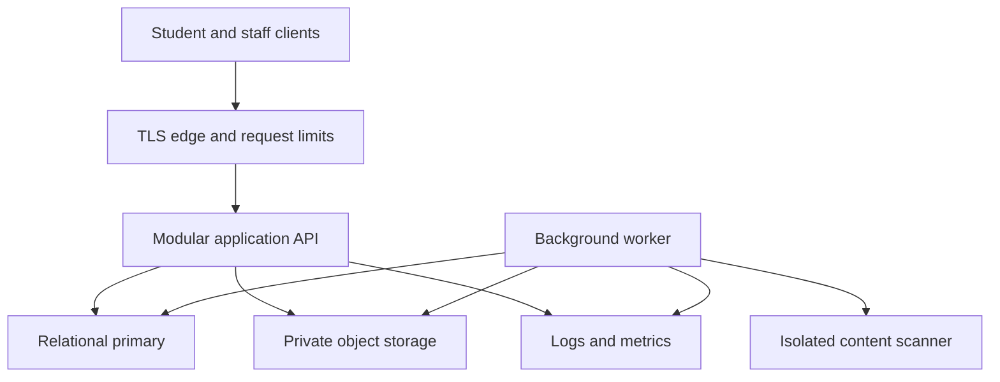
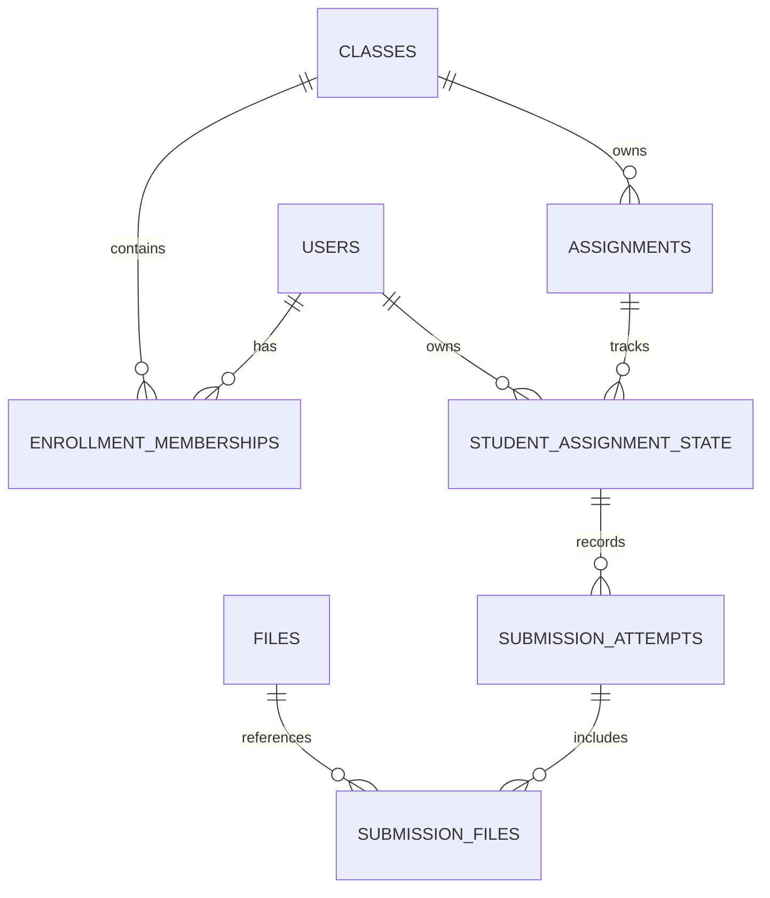
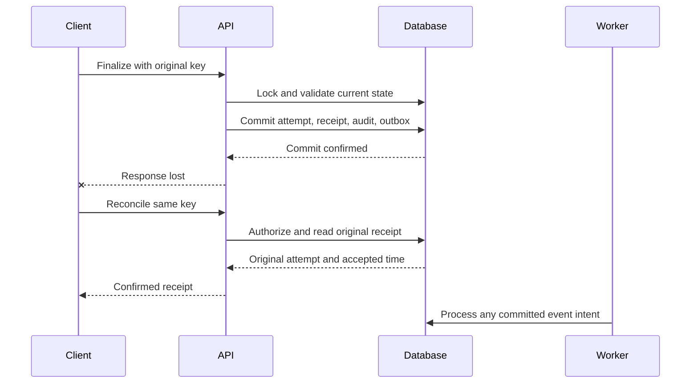

# 04 — Software Design Document

## Student Learning App

| Field | Value |
|---|---|
| Project | SrhDP — Student Learning App |
| Document ID | SLP-DOC-04 |
| Version | 0.1 — complete technical design draft |
| Date | 10 September 2026 |
| Sources | `01_project_brief.md` v0.1; `02_prd.md` v0.1; `03_ux_ui_spec.md` v0.1 |
| Technical owner | Technical lead — named individual pending |
| Reviewers | Product owner, academic authority, designer, engineering, QA, security/service and release owners |
| Status | Proposed design for review; not an implemented or approved production system |
| Scope | Architecture, module contracts, logical data design, concurrency, security, client behavior, operations, testing and delivery |

This SDD defines a buildable technical baseline for the student application and its supporting staff workflows. It preserves the PRD's proposed academic policies and the UX specification's distinction between uploading, confirmed submission, publication, and incomplete academic coverage.

No existing repository, production deployment, school integration, or approved technology stack has been supplied. This document therefore specifies the architecture and behavior concretely while leaving named platforms, runtime versions, hosting provider, and procurement decisions in an explicit register. Completing the document does not approve school policies, buy infrastructure, create Jira issues, or deploy software.

## 1. Purpose, boundaries, and source precedence

The brief owns objectives and scope; the PRD owns product rules; the UX specification owns screen behavior and proposed design tokens; this SDD owns technical mechanisms and implementation boundaries. If a technical constraint changes product behavior, amend the PRD and acceptance fixtures before implementation. Do not silently relax authorization, deadline, or publication rules to fit an implementation.

In scope: institution-managed accounts, academic structure/enrollment, Home/classes/sessions, materials, assignments/submissions/review, published results, finalized attendance, profile/preferences, notices/in-app notifications, authorized audit, and production operation.

Conditional or excluded capabilities stay outside the active architecture until approved: student directories, photo uploads, device calendars, general push/email/SMS, automated import, multiple-institution onboarding, payments, online exam delivery, chat, guardian accounts, and full offline synchronization. Recovery-channel integration is a required dependency once its method is selected; it does not imply general notification-channel scope.

The design assumes one institution per initial deployment. Institution identifiers still scope records and requests to prevent accidental mixing and support explicit future migration. This is not a claim that a multi-tenant SaaS product is ready.

## 2. Architectural drivers and invariants

| Driver | Required architectural outcome |
|---|---|
| Reliable submission | A confirmed attempt, its file references, operation outcome, and audit commit together |
| Current authorization | Account, role, membership, and resource visibility are checked on every protected request |
| Historical access | Withdrawal blocks new class activity but preserves authorized own past records |
| Published academic data | Student reads use explicit published/finalized revisions, never draft columns |
| Consistent calculations | One versioned calculation implementation serves API summaries and staff previews |
| Small MVP operating team | One modular backend deployment plus worker; no mandatory service mesh or broker |
| Recoverable writes | Known rejection and unknown network outcome have different client states |
| Operable production | Traceable releases, protected backups, tested restore, diagnostics and ownership |

**Invariants to encode and test:**

1. No response says an academic write succeeded before its database commit succeeds.
2. One logical submission key with the same canonical payload produces at most one attempt; changed payload under that key conflicts.
3. No attempt is created using another user's staged file or an unready file.
4. Concurrent finalization, feedback publication, archive, and withdrawal have a defined serial order.
5. Confirmed attempts and published revisions are immutable; current pointers may advance through authorized operations.
6. No result/attendance/notification count includes unauthorized rows or hidden draft values.
7. Unknown, missing, absent, exempt, and scored zero remain distinct.
8. Delayed notification processing never rolls back a committed academic operation.
9. Ordinary workflows archive or withdraw referenced history; they do not hard-delete it.
10. A database restoration is not complete until referenced file versions and access rules are verified.

## 3. Proposed architecture and decision records

### 3.1 Architecture decisions

All ADRs below are proposed. They become the implementation baseline only after technical/product review.

| ADR | Decision | Rationale and trade-off | Revisit condition |
|---|---|---|---|
| ADR-01 | Modular monolith API with separately executed worker from the same codebase | Keeps academic transactions local; deployable by a small team; modules require enforced boundaries | Independent scaling or ownership is demonstrated by measurements |
| ADR-02 | One transactional relational primary database | Foreign keys, unique constraints, revisions, and atomic publication share one consistency boundary | Proven regional or scale requirement |
| ADR-03 | Private immutable file objects plus relational metadata | Files remain outside relational rows; metadata links exact object versions | Provider cannot satisfy durability/version/authorization requirements |
| ADR-04 | Database-backed session authority | Supports immediate revocation and current access checks; adds a database dependency | Measured auth load requires a coherent revocation-aware alternative |
| ADR-05 | Transactional outbox and database job queue for MVP | No gap between academic commit and recorded event intent; no required external message broker | Queue contention/volume justifies a broker |
| ADR-06 | Class-scoped write serialization plus revision checks | Straightforward protection of attempts and publication races; may limit hot-class throughput | Approved load test shows lock contention exceeds targets |
| ADR-07 | Protected file downloads through an authorization gateway | Rechecks access for each new request; prevents a reusable public download link | An equally revocation-aware gateway is validated |
| ADR-08 | No shared cache of private academic responses in MVP | Avoids stale permission and publication leaks; optimize database reads first | Measured read pressure and tested invalidation design |
| ADR-09 | Stateless API replicas; durable state in database/object storage | Restart and scale do not depend on one app server's disk | None without new durability design |
| ADR-10 | Backward-compatible migrations and one immutable release artifact | Supports rolling release and code rollback without discarding academic writes | Explicit downtime migration is approved |

### 3.2 Technology selection boundary

| Layer | Required capability | Selection status / acceptance task |
|---|---|---|
| Student client | UX screens, secure session handling, accessibility, protected drafts, upload progress | Web/native framework pending DEC-02 and DEC-10 |
| Staff client | Accessible forms/tables, revision conflicts, selected publication preview | Browser-based staff interface proposed; framework pending |
| API runtime | Maintained framework, schema validation, transactions, streaming, structured logs | Language/framework/version pending; pin after support/security review |
| Database | ACID transactions, row locking, exact decimals, constraints, consistent snapshots, backup/restore | Engine/version pending; PostgreSQL locking documentation is a reference, not a procurement decision |
| Object store | Private immutable/versioned objects, checksum verification, lifecycle controls, backups | Provider/region pending |
| Worker/scanner | Durable jobs, isolation, content scanning, bounded resources | Scanner and runtime pending validation of supported file types |
| Secrets/telemetry | Protected secret injection, structured logs, metrics, alerts | Provider and retention pending |

An implementation is not Ready while its runtime/database/hosting choices remain unrecorded. Selection must demonstrate the transaction and file guarantees below in a small technical spike. Do not introduce package versions into this document without checking their maintained support status at selection time.

## 4. System context and deployment components



The public edge exposes the client assets and authorized application routes only. Database, scanner, queue internals, and object management APIs have no public application-user access. Static assets may use public caching; academic responses must not.

The API accepts and validates requests, establishes identity, enforces policy, executes use cases, commits data, and serializes role-specific responses. The worker handles file checks, notification fan-out, abandoned-upload cleanup, and reconciliation. It uses the same domain policy/calculation code but runs with a separate service identity and bounded privileges.

Production shape is proposed: TLS entry point, one or more API instances, at least one supervised worker process, relational primary, private file service, secret provider, telemetry, and backup destination. Replica count and high availability depend on DEC-13 capacity and availability approval. This topology alone does not establish an uptime guarantee.

## 5. Module boundaries and code organization

| Module | Owns | Exposes to other modules |
|---|---|---|
| Identity | Users, credentials, activation/recovery, sessions, capability grants | Authenticated principal, session validation/revocation |
| Academic structure | Years/terms, subjects/classes, teacher assignments, membership intervals | Scope/eligibility queries, academic state guards |
| Scheduling | Sessions, cancellation, overlap warnings, exam schedule projection | Institution-day schedule and next published exam |
| Content/files | Material revisions, staged file lifecycle, authorized file access | Ready file references and download authorization |
| Assignments | Assignment policy, student work state, immutable attempts, feedback revisions | Eligible actions, finalization, review/history |
| Results | Assessment definitions, result revisions, publication batches | Published result view and informational summary |
| Attendance | Eligible rosters, draft/finalized revisions, corrections | Finalized history, counts, coverage |
| Communication | Notice revisions, recipient events, notifications/read state | Visible updates and unread count |
| Profile | Safe preferences and school-controlled identity projection | Own profile/preferences |
| Audit/operations | Audit events, outbox/jobs, operation diagnostics | Restricted audit query and worker dispatch |
| Dashboard | Composes authorized queries; owns no duplicate academic records | Per-widget student Home response |

Suggested repository areas: `clients/student`, `clients/staff`, `server/modules`, `server/shared`, `worker`, `contracts`, `database/migrations`, `tests`, `deploy`, and `docs`. Exact layout follows the selected ecosystem. This is a proposed organization, not a list of existing files.

Within a module: transport adapter → application use case → domain policy → repository/storage adapter. Controllers do not contain deadline formulas or direct cross-module updates. A use case owns the transaction and passes its transaction context to collaborating repositories. Cross-module reads use explicit query interfaces; schema ownership and database constraints remain documented. Shared code is limited to identity/time/decimal primitives, transaction helpers, errors, and telemetry—not an unrestricted utility layer.

## 6. Client architecture and state management

The client separates view components, screen state, domain-facing models, API adapter, session manager, and upload coordinator. It implements the five student destinations and authorized staff workspace described in SLP-DOC-03; screen IDs remain the design references.

Each query state is explicit: idle/loading/success/empty/error/unavailable. Refresh can retain previously authorized data only within the same active account and with visible stale status; a known access change clears it. A failed count request is not zero. Filters form part of query identity; rows and aggregates belong to the same filter snapshot.

Write state is explicit: editing → validating → sending → confirmed/rejected/unknown. Unknown leads to reconciliation of the original operation. A new attempt key is not generated as a network retry. Disable duplicate taps while pending, but enforce all protections server-side.

Use in-memory protected drafts by default. No background academic synchronization and no promise of unsaved-text recovery after restart. To reconcile an interrupted submission after restart, retain only a minimal pending-operation marker in platform-appropriate account-bound storage: opaque operation key, assignment reference, and creation time; never credentials, text, files, or scores. Reauthenticate before use. Clear markers on logout/account switch. Independently expose an authorized latest-attempt/history query so a lost marker does not hide a committed submission. Native storage choices remain platform approval work; browser academic-response caches/service-worker caches are disabled.

Transport failure cannot create a success toast. The persisted attempt receipt includes attempt/reference, authoritative timestamp, timeliness, and file references. Screen reload reads that receipt from the service. Notification state is independent from the attempt outcome.

## 7. Logical data model

This is a logical schema and constraint design. A separate database specification must provide executable DDL, exact types/lengths, index syntax, migrations, and engine-specific enforcement.

| Entity group | Principal records | Key relationships/invariants |
|---|---|---|
| Institution/access | institutions, users, credentials, sessions, role_grants, recovery_challenges | User belongs to institution; canonical login unique within institution; session stores revocation/expiry |
| Academic structure | academic_years, terms, subjects, classes, teacher_assignments | Term within year; class references subject/term; class code unique per term |
| Membership | enrollment_memberships, enrollment_intervals | Stable student/class guard row; no overlapping active intervals; withdrawal retains intervals |
| Scheduling | class_sessions | Class, start/end, status, location; canceled records retained |
| Files/materials | files, file_references, materials, material_revisions | File owns immutable object key/version/checksum; published material points to ready revision |
| Assignments | assignments, assignment_revisions, student_assignment_state | Stable assignment identity; current policy/revision; unique student/assignment guard |
| Attempts | submission_attempts, submission_files | Unique student/assignment/attempt number; immutable content and accepted time |
| Feedback | feedback_revisions | Attempt-specific draft/published revisions; current published pointer |
| Results | assessments, assessment_eligibility, result_records, result_revisions, publication_batches | One student/assessment result identity; revision state; batch commit |
| Attendance | attendance_rosters, attendance_records, attendance_revisions | One student/session identity; draft separate from current finalized pointer |
| Communication | notices, notice_revisions, event_recipients, notifications, notification_reads | Revision/action event uniqueness; recipient uniqueness; current access checked |
| Reliability | command_operations, outbox_events, worker_jobs | Scoped idempotency key, canonical hash, terminal outcome; durable event/job leases |
| Audit | audit_events | Actor/action/entity/time/reason/change/reference; no ordinary update/delete interface |

### 7.1 Core relationships



### 7.2 Data representation

Opaque stable identifiers are serialized as strings; clients do not infer ordering, ownership, or dates from IDs. Internal ID format is selected with the database specification. All protected relationships include institution consistency through composite constraints or equivalent tested enforcement.

Store instants unambiguously in UTC with subsecond precision; retain the configured IANA institution timezone for display and date conversion. Store marks as exact decimal values with two fractional digits, with maximum precision selected from academic limits. Do not use binary floating point for persisted academic marks. Calculate percentages with exact decimal arithmetic and half-up rounding to two displayed decimals.

Use explicit status fields, not overloaded numeric zero or null. Mutable roots carry an incrementing revision. Immutable revision records carry actor, creation/publication time, and correction reason where required. Server-generated audit timestamps and stable IDs survive display-name changes.

## 8. Constraints, indexes, and query consistency

Required uniqueness includes canonical institution/login; term/class code; membership student/class guard; student/assignment state; assignment/student/attempt number; operation scope/key; student/assessment result identity; student/session attendance identity; event/recipient notification identity. File reference rows prevent confirmed attachments from being mistaken for abandoned staging.

Referential actions preserve academic history. Deleting a referenced user/class/assessment through ordinary application roles is rejected; archive/disable/withdraw paths remain available. Required field/check constraints cover positive maximum marks, valid score range/status combinations, start/end ordering, and nonnegative attempt counters. Cross-record rules such as term containment or interval overlap require transactional enforcement beyond a simple row check.

| Query | Candidate index shape | Notes |
|---|---|---|
| Active student classes | institution, student, membership state, class | Intervals checked against relevant time/state |
| Class sessions/day | institution, class, start time, ID | Overlap query also checks end time |
| Assignment list | institution, class, publication state, due time, ID | Join current own attempt state; do not scan all submissions |
| Own attempt history | institution, student, assignment, attempt number descending | Immutable content loaded on detail |
| Staff latest attempts | institution, assignment, student | Join unique current-state pointer |
| Published results | institution, student, term, assessment | Query published pointer only |
| Attendance history | institution, student, session | Join eligible session times/status |
| Notifications | institution, recipient, event time, ID | Access filter and read join required |
| Jobs | state, next_run_at, lease_until, ID | Dispatch bounded ready batches |
| Audit | institution, entity type, entity ID, time, ID | Additional actor/time index only if actual query needs it |

These are index intentions, not approved DDL. Verify query plans on the PRD dataset, including withdrawn/history cases and full-filter summaries. Avoid indexing every column or loading entire rosters into client memory.

Lists use default 20, maximum 100 items; stable ID breaks ordering ties. Proposed cursor pagination binds cursor to sort/filter context. It is not a durable snapshot across multiple changing requests. One response's rows and aggregate totals are computed from a consistent read snapshot; clients refresh when filters change. Bulk publication uses an explicit frozen selection and revisions, not the moving contents of a paginated query. Protected post-write reads and publication summaries use the primary; asynchronous replicas are not part of the initial design.

## 9. Authentication, sessions, and account recovery

Use institution-managed accounts, no public registration. The proposed browser pattern is an opaque random session credential in a Secure, HttpOnly, appropriately SameSite cookie, with server-side session lookup and CSRF protection on state-changing requests. Same-origin deployment is the proposed default. Do not store browser bearer credentials in application local storage. If a native client is approved, use an opaque credential in approved OS-protected storage and validate it through the same session authority.

Store only a one-way digest of session credentials and single-use recovery evidence. Passwords use a maintained password-hashing implementation, proposed Argon2id with parameters benchmarked on deployment hardware and approved before launch; use framework-supported verification and upgrade paths, not custom cryptography. OWASP provides the implementation guidance for password hashing and session controls. [Password Storage Cheat Sheet](https://cheatsheetseries.owasp.org/cheatsheets/Password_Storage_Cheat_Sheet.html), [Session Management Cheat Sheet](https://cheatsheetseries.owasp.org/cheatsheets/Session_Management_Cheat_Sheet.html).

Persist created_at, last_activity_at, absolute_expires_at, idle expiry, revoked_at, user, and security generation. Use server time; refresh cannot extend absolute expiry. PRD proposed values remain: staff 30-minute idle/12-hour absolute; student 7-day idle/30-day absolute; activation evidence 24 hours; recovery evidence 30 minutes. Role combinations use the stricter applicable session policy; switching to a privileged staff workspace cannot inherit a weaker student session lifetime without the selected reauthentication policy.

On password recovery or account disablement, revoke all sessions and increment security generation in the same transaction. Logout revokes the current session. Each protected request checks authoritative account/session state; no long-lived self-contained token bypasses this check. Fail closed if session authority cannot be read.

Failed login/unknown identity responses remain equivalent. Proposed throttle is 10 failed attempts/15 minutes per account and source, with a 15-minute cooldown, as in the PRD; precise distributed counter behavior and abuse handling require the auth implementation review. Recovery completion consumes valid evidence once under a transaction, updates password, revokes sessions, and audits without recording the secret. Delivery channel, identity verification, password policy, privileged MFA policy, and support recovery procedure remain DEC-05 gates. Do not launch recovery with an undefined method.

## 10. Authorization and membership lifecycle

Authorization has four layers: active session/account; institution scope; explicit capability; resource-level relationship/publication/history policy. The authenticated user determines ownership, never a supplied student ID alone. Administrator status is not implicit permission to publish scores or impersonate submissions.

| Resource/action | Authorization rule |
|---|---|
| Current material/assignment | Active eligible enrollment and published current content |
| New attempt | Above plus active class, open window, remaining attempts, no feedback lock |
| Withdrawn student's own attempt | Active account plus own confirmed history; file access through that history |
| Archived/completed class | Former enrollment/assigned staff permitted read-only history under PRD |
| Own results/attendance | Own published/finalized records, including allowed historical access |
| Staff edit/review | Assigned class or explicit institution academic capability; current class/state policy |
| Result publication/correction | Separate publish/correction capability plus authorized class/record |
| Audit/support | Explicit audit or restricted diagnostic scope; no default academic content access |

Apply the same predicates to list, count, search, detail, file download, mutation, notification link, and operation receipt. Missing/inaccessible academic IDs return equivalent unavailable behavior. DTO serializers expose only role-approved fields; never fetch a full draft object and rely on the client to hide it.

A membership root exists per student/class even when no active interval exists; this provides a stable lock target and retains historical interval evidence. Attendance eligibility is session.start within an interval [start, withdrawal), not membership at the time the report is requested. Completed enrollment and archived classes preserve policy-defined history. Backdated changes require reason, audit, recalculation, and a staff review flag for affected records; they do not delete prior revisions.

Changes become authoritative at transaction commit. Requests authorized after revocation commit see the new rule. A response already authorized and streaming before revocation cannot be recalled; future requests are denied. UI clears affected cached data after receiving the new access state or a denial. Do not claim to erase files a user already downloaded.

## 11. Transaction and concurrency design

### 11.1 Lock hierarchy

Proposed correctness-first MVP protocol:

1. Begin a short database transaction and acquire the institution authorization guard in shared mode for normal protected mutations. Membership, capability, disabling, recovery/session-revocation changes acquire it in exclusive mode. These administrative changes are expected to be infrequent.
2. Revalidate the principal and relevant grants under that guard.
3. Acquire affected class guard rows exclusively in ascending stable ID order for academic mutations. Setup/publication paths use the same guard when creating or changing related rows.
4. Acquire command-operation, student work state, entity/revision, and file rows in documented deterministic order. Global non-class commands use an equivalent module root guard.
5. Perform validation, writes, audit, and outbox insertion; commit; then respond.

Authorization guard identity exists from institution setup; class guards exist from class creation. No operation obtains an exclusive authorization guard after taking a class lock. Bulk commands sort all class/entity IDs consistently. Job handlers follow the same order for domain changes. This coarse protocol deliberately serializes writes within a class; it must pass the approved throughput profile before release. Finer locks require a replacement proof/test of every race, not a local optimization by one endpoint.

At the database layer, use read-committed transactions with explicit guards/current reads for mutations and consistent snapshots for multi-query read responses. The selected engine must demonstrate the required lock modes and stale-read behavior. PostgreSQL documents that conflicting row locks coordinate writers and are retained through the transaction; it also documents deadlock handling. The hierarchy above is this project's proposal, not a claim that row locking alone enforces all rules. [PostgreSQL explicit locking](https://www.postgresql.org/docs/current/explicit-locking.html).

### 11.2 Boundaries and retries

Never hold database locks while uploading bytes, scanning content, calling recovery delivery, or waiting for a user. Ready immutable file metadata is verified inside finalization; byte preparation happens earlier. No network call sits between academic writes and commit.

Revision-based updates use expected_revision: update only when current revision matches; otherwise return a conflict with safe current metadata. Publication preview includes a selection/revision fingerprint that is revalidated at commit. Never overwrite a newer draft silently.

Deadlock/serialization failures roll back the entire transaction. Proposed internal retry maximum is two additional attempts with short jitter within the request budget; reuse the original operation key and rerun all policy checks. A database connection loss around commit is an unknown outcome, not a known rollback; reconcile before re-execution. Lock timeout budgets must fit NFR-01/02 and be approved from measurement; do not wait indefinitely at deadline spikes.

## 12. Idempotent command and operation model

`command_operations` contains institution, authenticated actor, command kind, target, idempotency key, canonical request digest, terminal outcome, resource reference, accepted time if applicable, and timestamps. A unique scoped key prevents duplicates. Keys are opaque client-generated values with sufficient randomness and are not authorization credentials.

Canonicalization is contract-defined: stable object key ordering, normalized decimal/time representation, preserved meaningful text, and an explicit ordered list of file IDs. Hash after canonicalization; do not collapse distinct text or reorder user-significant files. Stored operation data excludes raw credentials and unnecessary academic payload copies.

For finalization, acquire the class guard before examining/creating the operation. A previously committed operation is returned before rechecking today's deadline/attempt eligibility, but only after current authorization to the original own record. Same key/different digest returns conflict. A confirmed replay after withdrawal can read the own historical receipt; a disabled account cannot.

New valid commands persist attempt/result, terminal command outcome, audit, and event intent in one transaction. Business rejections after authorized command evaluation may persist a terminal rejected outcome with no academic changes. A changed request after such a rejection needs a new key. Syntactically invalid or unauthenticated traffic does not reserve arbitrary operation records. Internal transient failures leave no fabricated terminal success/failure.

There is no durable Processing row committed separately for synchronous academic finalization in this baseline. While a request is in flight, operation lookup may return Not found yet; that is not proof of rejection. The client retries/reconciles the original request/key after bounded waiting. A repeated command blocks on the same guard or returns the original terminal result. Worker jobs have their own leased processing state, separate from synchronous command receipts.

Retain confirmed operation key/digest/outcome linkage for the lifetime of its academic record. Do not apply a 24-hour generic idempotency expiry to confirmed submissions. Rejected-operation cleanup policy is explicit operational retention; expired-key behavior must never allow confirmed-key reuse. Detailed retention periods remain DEC-14.

## 13. Assignment finalization algorithm

Preconditions: bytes already uploaded, inspected, and Ready; request carries assignment, mode-appropriate content, file IDs, original operation key, and optional expected policy revision.

```text
finalize(principal, assignment, payload, operation_key):
  validate request shape and bounded payload
  begin transaction
  take shared authorization guard; validate active principal
  take assignment's class guard; load current assignment and ownership scope
  find terminal operation for this actor/target/key
  if found:
    verify canonical digest and current access to stored own outcome
    return stored outcome only after ending transaction
  load/create unique student_assignment_state under class guard
  validate current membership, class/publication, mode, attempts, feedback lock
  lock referenced file rows in stable order
  validate owner, purpose, Ready status, immutable version, expiry and limits
  accepted_at = database wall-clock instant sampled now, after lock waits
  validate open <= accepted_at and due/late-close boundary
  allocate next attempt number from locked state
  insert immutable attempt, policy snapshot and attachment references
  advance current attempt pointer and count
  insert confirmed command outcome, audit and applicable outbox intent
  commit
  return durable receipt
```

`accepted_at` is the proposed server acceptance linearization point: sampled after waiting/validation and immediately before writing, retained only if the transaction commits. It is not request arrival time, upload start, or a transaction-start timestamp captured before lock waits. A commit may finish slightly later; product/academic review must explicitly approve this interpretation under DEC-06. If the school requires actual commit-time deadline semantics instead, that requires a different engine-specific design and revised fixtures before coding.

On time is accepted_at ≤ due; late acceptance requires late enabled and due < accepted_at ≤ late_close. Before open or after permitted close rejects. Feedback publication freezes attempts. Class/archive/withdrawal commands participate in the same guards; if finalization commits first, its attempt survives; if blocking change commits first, finalization rejects.

Policy snapshot includes revision, due/late-close, allowed mode, max attempts, and grading basis as relevant to explaining the attempt. Existing confirmed times/content never change during retry, policy extension, material replacement, or publication.



Finalization does not depend on notification success. The PRD does not mandate a student submission notification; the receipt itself is the confirmation. Only defined events generate in-app notifications.

## 14. Files, scanning, downloads, and cleanup

### 14.1 Lifecycle

Proposed flow: create upload record → transfer to private staging object → verify actual size/type/checksum → queue isolated inspection → Ready or Rejected/Failed → attach within academic transaction. Upload URLs, if used, permit only a single bounded staging key/purpose and short expiry; they never grant arbitrary bucket access or final-file download rights.

Each file record stores owner, institution, purpose, object key and immutable version, original display name, measured byte size, detected type, checksum, scan status/version/time, expiry, and lifecycle revision. Use generated storage keys; user filenames are metadata only. Do not let a later upload overwrite a Ready object. Scan the exact object version that will be referenced by the academic record.

Enforce the PRD proposed allowlist PDF/DOCX/PPTX/XLSX/JPEG/PNG, nonzero size, ≤20 MiB/file, ≤5 files and ≤50 MiB/group. Validate both transfer and finalization totals. Reject executables, macro-enabled formats, archives submitted as such, disguised content, and unsafe files. Office package internals require bounded extraction/inspection; allowlisting DOCX must not allow unbounded nested decompression. Inspection workers have CPU/memory/time limits and no unnecessary outbound network or production credentials.

OWASP recommends layered file validation, controlled names/storage, and authorization rather than trusting client content type. The exact immutable-object workflow and group limits here are project design decisions. [File Upload Cheat Sheet](https://cheatsheetseries.owasp.org/cheatsheets/File_Upload_Cheat_Sheet.html).

### 14.2 Durable attachment without distributed transaction

Before Ready, the object must be durably stored in the protected immutable location with verified identity. Finalization only adds relational references and marks it attached; it does not copy a file after acknowledging success. Database rollback can leave an unreferenced Ready object for cleanup, but cannot leave a confirmed attempt waiting for a post-commit move. No distributed transaction with the object provider is assumed.

A storage outage or integrity mismatch before readiness blocks submission of that file. Later confirmed-file unavailability is an operational incident; preserve the reference, return a truthful download failure, and recover the exact version. Do not silently substitute another file or delete the attempt.

### 14.3 Download gateway

All new download/range requests authenticate and authorize against the relevant current material or own historical submission path. The gateway streams the authorized object through the edge/backend without revealing a reusable unauthenticated storage URL. A revoked user cannot start a new request; an already authorized transfer may finish. Content disposition uses safe filenames, content sniffing is disabled, and protected bytes are not placed in shared caches. Native file-opening behavior follows the approved client platform.

### 14.4 Cleanup race protocol

Staged expiry is 24 hours in the PRD. Cleanup selects expired unreferenced candidates, locks each file row, rechecks references, and marks Deleting in a short transaction. Finalization locks the same row and rejects Deleting/expired files. After commit, cleanup deletes the exact unreferenced object version; it retries failures and marks Deleted only after confirmation. Confirmed references make the file ineligible. Object lifecycle policies must not independently delete attached objects by upload age. Orphan object reconciliation compares metadata/reference state without exposing names in general logs.

## 15. Academic setup, sessions, and materials

Admin setup use cases validate year/term boundaries, unique class codes, active accounts, explicit teacher grants, and nonoverlapping membership intervals. A class archive changes state under its guard and records audit; it blocks ordinary writes and new attempts while preserving history. Exceptional archived corrections require explicit academic-correction capability and reason.

Session creation/update validates start < end and term boundaries. Overlap warnings query teacher/class sessions under the relevant guards; the approved baseline requires explicit acknowledgement, not silent overwrite. Multi-class teacher scheduling uses sorted class guards where it changes conflicting entities. Canceling a session retains its record and audit and excludes it from attendance eligibility/summary. No destructive delete substitutes for cancellation.

Materials have stable identity and separate revisions; publishing references Ready file versions. Replacing content creates a new revision and current published pointer. Archive removes active visibility. Download access uses current membership or allowed archived-class history, independent from submission attachment ownership. Initial manual data setup has a reconciliation checklist and data-owner acknowledgement; bulk import remains conditional, and no integration credentials are assumed.

## 16. Feedback and result publication

### 16.1 Feedback

Save draft feedback against a specific attempt/revision. Publish acquires the class guard and current student work state, verifies reviewer scope and that reviewed attempt still equals current attempt, validates score/max, then writes the immutable published revision, advances pointer, sets feedback lock, audit, operation receipt, and outbox event in one commit. If a new attempt won first, return conflict; never redirect the review silently to it.

A correction references the current published revision, includes reason, and remains a separate draft until republished. Old published feedback remains visible until that commit. Prior revisions are visible only through authorized staff audit/history; students receive current published feedback and update metadata.

### 16.2 Assessment and result identity

Assessment details/publication are separate from student score publication. One result root per student/assessment references immutable revisions with Scored/Absent/Exempt. Scored needs 0 ≤ marks ≤ maximum; Absent/Exempt require null numeric marks. Maximum is positive; grading basis changes that would reinterpret published scores require a controlled correction design, not an unrestricted field edit.

Assessment eligibility records establish which students are expected for the assessment. Proposed baseline captures the eligible roster when exam/assessment details are published; later enrollment/backdated corrections flag reconciliation, and authorized staff adjust the expected roster with reason before publication. This fills a PRD completeness dependency and needs academic approval under DEC-07; do not infer all future enrollment changes are retroactive assessment obligations.

### 16.3 Atomic selected publication

Preview creates a bounded explicit list of result IDs and expected revisions, with excluded/unresolved records separately identified. Proposed maximum selected batch is 100 for the initial API; a larger requirement must be reviewed for transaction limits. UI supports intentional multiple batches without pretending they form one atomic publication.

Commit locks authorization/class guards in order, revalidates actor/selected IDs/eligibility/revisions, validates every selected result, inserts batch/revisions, advances all selected published pointers, writes audit and event recipients, then commits all or none. A selected invalid row rejects the batch. Unselected unresolved students remain incomplete; they are not silently scored zero.

Correction and withdrawal use the same boundaries. Withdrawal appends an attributable publication action and clears the current visible pointer for affected records without erasing prior evidence. Student totals exclude withdrawn values and mark coverage incomplete. Staff cannot see or affect records outside their grants by changing a batch selection.

## 17. Results and attendance calculations

One backend calculation library owns policy version and exact-decimal behavior. Client rendering uses returned values; a preview must call the same calculation path. Return filter scope, numerator, denominator, included counts, excluded-status counts, safe coverage/completeness, and calculation policy version.

### 17.1 Results

For published Scored records in the selected term/subject scope: percentage = sum(earned) / sum(maximum) × 100. Round display to two decimals half-up. Absent/Exempt are separate counts, excluded from the numeric denominator. If denominator is zero, return null percentage with an explicit N/A reason, not 0 or NaN. Missing/unpublished/withdrawn expected records mark incomplete without exposing draft values. Do not include assignment feedback unless assessment mapping is separately approved.

| Fixture | Result |
|---|---|
| 40/50 + 60/100 | 100/150 = 66.67% |
| Scored 0/50 | 0.00% |
| 40/50 + Absent | 80.00%, Absent 1, informational scope |
| Only Absent/Exempt | N/A |
| 40/50 published + another draft | 80.00%, incomplete, no draft score |

Label: Published scored assessments percentage. There is no weighted final grade, GPA, rank, or pass/fail in the baseline.

### 17.2 Attendance

Attendance has a stable student/session root with separate draft and finalized revisions. Roster entry never defaults unselected students to Absent. Finalize requires explicit complete/incomplete choice; selected finalized records and roster coverage state commit together. Correction adds reason/revision and advances finalized pointer.

Eligible sessions are started, noncanceled, and within enrollment intervals. Each contributes one unit regardless of duration. Percentage = (Present + Late) / (Present + Late + Absent) × 100. Excused is excluded from this denominator but included in finalized recorded coverage. Coverage = finalized eligible records / eligible started noncanceled sessions. Draft/missing records contribute missing coverage, not absence. Zero percentage denominator means N/A.

8 Present + 1 Late + 1 Absent + 2 Excused gives 90.00%, coverage 12/12. One additional missing record leaves 90.00% provisional with 12/13 coverage. Canceling the Absent session gives 100.00%, coverage 11/11. Only Excused yields N/A; only one Absent yields 0.00%.

Compute from authoritative records initially. Membership correction/cancellation invalidates derived views and creates a review flag/audit in the same domain transaction. Any future materialized summary must carry source revision and be excluded from authoritative reads until consistent.

## 18. Outbox, jobs, and notification semantics

Domain publication inserts an outbox event in its database transaction. Event identity includes institution, entity ID, revision, and action; unique constraints prevent duplicate event intent. Minimal payload references records, not copied scores/text/secrets. Event schema has a version for worker compatibility.

Required in-app events: assignment publication, feedback publication, result publication/correction, and notice publication. Notice ordinary edits preserve read state; explicit republishing creates a new revision/event. New enrollment does not replay old events.

Capture event-time eligible recipient IDs transactionally in `event_recipients` while publication holds the authorization guard. For the pilot this bounded recipient snapshot avoids using delayed-worker membership to guess who was eligible at publication. Larger school-wide audiences require sizing/review before adoption. On delivery/read, also check current authorization; event-time inclusion never grants permanent access.

Worker dispatch claims bounded ready jobs using database leases and a unique claim generation. A stale worker cannot mark a newly claimed job completed. Proposed retries use exponential backoff with jitter and a finite attempt budget; concrete intervals/limits belong in deployed configuration and alert policy. Exhausted jobs remain inspectable for authorized replay, not silently discarded. At-least-once execution is expected; consumer uniqueness on event/recipient makes in-app notification creation idempotent.

For each recipient, insertion and its processing checkpoint commit together. Crash after insert/before lease completion is safe to retry. Missing recipients are retried independently without duplicating completed deliveries. Notice expiration/archiving and membership changes are checked at read time; no old link bypasses policy.

Mark-read is idempotent per user/notification. A successfully loaded detail permits read update; failed detail does not. Unread count applies the same current visibility predicate. Worker delays do not alter committed academic success. NFR-09's proposed 95% within 60 seconds is measured event commit to visible eligible notification, not just worker dequeue time.

## 19. API architecture and error contracts

Proposed API style: versioned JSON over HTTPS for metadata, separate bounded binary transfer routes, schema-first contracts, and role-specific DTOs. Route names below are contract groups, not deployed URLs: auth, me, dashboard, classes/sessions, materials/files, assignments/submissions, assessments/results, attendance, notices/notifications, staff setup, audit, operations.

Successful metadata responses contain data plus request reference and applicable pagination/revision information. Academic receipt responses include durable resource ID, operation ID, accepted_at, and outcome. Errors use stable machine code, safe message, optional field errors, request reference, retry guidance, and outcome certainty. Do not expose SQL, stack traces, credentials, or another user's names.

| HTTP intent | Example machine category | Client behavior |
|---|---|---|
| 400/422 invalid input | VALIDATION_FAILED | Show bounded field errors; preserve valid input |
| 401 no valid session | SESSION_REQUIRED | Reauthenticate; reconcile pending write |
| 403 denied capability | ACTION_NOT_ALLOWED | Remove action; do not expose restricted record metadata |
| 404 academic unavailable | RESOURCE_UNAVAILABLE | Same visible handling for nonexistent/inaccessible IDs |
| 409 revision/key/policy conflict | REVISION_CONFLICT / OPERATION_PAYLOAD_CONFLICT | Reload/reconcile; do not blind-retry edited payload |
| 422 known domain rejection | SUBMISSION_CLOSED / ATTEMPTS_EXHAUSTED | Explain confirmed rejection and eligible next action |
| 413/415 transfer rejected | FILE_TOO_LARGE / FILE_TYPE_NOT_ALLOWED | Replace file |
| 429 limited | RATE_LIMITED | Honor bounded server retry guidance |
| 503 unavailable | TEMPORARILY_UNAVAILABLE | Reads retry; writes reconcile if commit may be uncertain |

Exact mapping is finalized in the API specification; stable domain codes distinguish reasons without requiring clients to parse English. Network timeout itself has unknown outcome irrespective of an absent HTTP status.

Schema limits include title/instructions/text/file bounds from PRD; every other field needs a bounded length/range before code generation. Whitelist sortable/filterable fields; parameterize queries; reject unknown privilege/ownership fields. Date-time requests contain an unambiguous offset/instant; responses include institution timezone context. Do not serialize large IDs as lossy numbers.

Versioning policy: additive optional fields remain compatible; changing enum meaning, required fields, or academic semantics requires a coordinated contract version and migration. Clients handle unknown display enum safely but never assume it permits a write. Published OpenAPI/schema artifacts and compatibility tests accompany each release; this document does not claim they already exist.

## 20. Security, privacy, and abuse boundaries

| Threat | Control | Verification |
|---|---|---|
| Student changes resource ID | Server ownership/membership predicates on every access | Own/other/deep-link/download negative cases |
| Stale role/session | Authoritative active/revocation checks, guarded mutations | Disable/withdraw races and next-request tests |
| Cross-site browser write | CSRF controls, same-origin policy, credential protections | Missing/invalid token and origin tests |
| Script/content injection | Safe text rendering, no executable rich markup, contextual encoding | Malicious title/body/filename fixtures |
| SQL injection | Parameterized repositories, allowlisted sort/filter | Query-boundary tests |
| Malicious upload | Immutable private staging, layered inspection, isolated worker | Disguised/oversized/decompression fixtures |
| Duplicate academic command | Scoped keys, digest, unique constraints, transaction guards | Lost-response/replay/concurrency tests |
| Staff overwrites draft/publication | Revision precondition and atomic pointer changes | Stale edit and batch tests |
| Sensitive logs/cache | Role DTOs, no-store private responses, redaction | Log/cache inspection after account switch |
| Exhausted resources | Bounded body/file/page/batch size, queue limits, rate limits | Load and cancellation tests |
| Privileged misuse | Least-privilege capability, reasons, attributable audit | Grant/audit review and alert scenarios |

Transport is encrypted; database/object/secrets access is limited to required service identities. Worker scanning identity does not have unrestricted academic query access. Database application credentials cannot perform schema migrations or routine audit deletion. Release migration identity is separate and short-lived. Secret values come from the approved secret provider, never source control or client bundles.

Analytics uses pseudonymous references and outcome categories. Do not record assignment text, raw marks, file bytes, credentials, or recovery evidence in general telemetry. Authorized academic audit may contain before/after values necessary for corrections, with restricted access and approved retention. Backup access is part of the same privacy boundary. This design does not assert compliance with any unspecified jurisdiction or school policy; DEC-14 establishes actual obligations before real-data onboarding.

## 21. Performance, caching, and capacity

Retain the PRD proposed test profile: one institution, 1,000 students, 100 staff, 100 classes, 10,000 confirmed attempts, 100 concurrent signed-in users; 15-minute warm-up then 30 minutes at 20 metadata requests/second plus 10 concurrent upload sessions using maximum supported file size. Record hardware, runtime/DB configuration, mix, concurrency, and error distribution.

Targets remain proposed: routine list/detail server p95 ≤1 second; dashboard ≤2 seconds; finalization ≤2 seconds after files Ready; primary client content within 3 seconds for ≥95% of controlled core-page loads at 10 Mbps/100 ms round trip. Upload transfer time is measured separately and is not hidden inside metadata results.

Avoid N+1 query patterns: batch class/session metadata, fetch current attempt pointers, and use aggregate SQL scoped to authorized filters. Dashboard widgets can run independent bounded reads, with local failure representation. Limit database pools so API and worker concurrency do not exceed database capacity; configure statement/lock/HTTP timeouts consistently. Slow scans cannot consume API worker threads.

The class guard is a known contention risk. Run a concentrated single-class deadline test in addition to evenly distributed traffic. Record lock-wait time separately from execution. If it fails targets, refine guards with proof for all conflicting operations before launch; do not remove locking without a replacement invariant.

Private responses are not shared-cacheable. Public fingerprinted client assets can be cached. Optional server reference-data caches must not contain authoritative permissions, current submission availability, private grades, or unread counts. No cache may make a withdrawn user's next protected request succeed.

File sizing illustration, not budget: 10,000 attempts × 5 MiB average ≈48.83 GiB of submission bytes before teaching files, revisions, backups, or object overhead. At the permitted 50 MiB/attempt ceiling the same count is ≈488.28 GiB. Measure expected average, retention, peak ingress, and download volume before provider sizing; never use allowed maxima as actual usage claims.

## 22. Failure handling and reconciliation

| Failure point | Authoritative state | Required recovery |
|---|---|---|
| Upload interrupted | No confirmed attempt | Retry/reselect under same staged identity if allowed |
| Scanner unavailable | File not Ready | Bounded retry; fail closed; visible checking/failure |
| Transaction rejected before commit | No academic mutation from that transaction | Return known rejection or retryable rollback |
| Connection lost during commit | Unknown to caller | Read/retry original operation; no new key |
| Response lost after commit | Academic record exists | Return original receipt on replay |
| Worker crashes after notification insert | Some recipient insert may exist | Unique event/recipient permits safe replay |
| Cleanup races with finalization | File row lock orders operations | Referenced file retained or finalization rejected |
| Object missing after confirmation | Attempt remains valid, attachment unavailable | Incident; restore exact version; do not erase history |
| Notification delivery delayed | Academic transaction remains committed | Queue monitoring and replay |
| Database down | Auth/academic authority unavailable | Fail closed; no offline write success |
| Stale staff editor | Newer revision exists | Conflict; manual reconciliation |
| Clock skew | Deadline correctness uncertain | Alert and correct service clock source; do not silently backdate |

Scheduled reconciliation checks: attempts with missing file references/versions; unattached expired uploads; terminal operations pointing to missing resources; published pointers to invalid revisions; outbox events without expected recipients/checkpoints; duplicate logical identities; stale leases; and recomputed academic summary discrepancies. Checks are read-only by default. Repairs use authorized domain commands with audit or an approved incident procedure; never fabricate a missing student's attempt from a log message.

## 23. Observability and service ownership

Structured request events include timestamp, environment, build version, request/correlation reference, route template, status/outcome category, latency, and safe pseudonymous actor/resource reference when needed. Worker events include job/event reference, attempt, lease generation, outcome, and duration. Never log raw payloads by default.

Metrics: authenticated availability probes; metadata/finalization latency; valid logical submission success/unknown/rejection categories; DB lock waits/deadlocks/pool saturation; upload/scanning queue age and failures; object download failures; outbox age and exhausted jobs; notification visibility delay; backup freshness; disk/storage capacity; deployment smoke status. Avoid per-student metric labels with unbounded cardinality.

Proposed alerts: any confirmed unauthorized access/integrity incident is immediate escalation; oldest required outbox/scan work beyond the approved healthy budget triggers investigation; availability/latency thresholds use approved sustained windows to avoid alerting on one transient request. Named recipients, coverage hours, escalation delays, and exact thresholds are release configuration gates, not invented here.

A dashboard/report is not evidence that alerts reach an owner. UAT must inject failures and record receipt/triage through the configured path. Submission reliability uses backend logical operation outcomes, deduplicating retries and reporting unresolved operations separately. Invalid-input/permission/deadline rejection is not a successful submission and must not inflate technical-success metrics.

## 24. Environments, configuration, and secrets

Use separate DEV, test/CI, UAT, and production databases, file stores, credentials, notification recipients, and telemetry labels. DEV/UAT use synthetic or approved anonymized data. No test publication can target production recipients. Local temporary files are never the only persisted copy of confirmed content.

Configuration groups include institution timezone/languages, session policies, submission/file limits, database pools/timeouts, object/scanner settings, worker leases/retries, feature flags, support contact, alert routing, and backup schedules. Validate required configuration at startup; missing timezone, secrets, or storage policy fails readiness. Do not expose secret config through health endpoints.

Feature flags for conditional features default off. A flag cannot change approved deadline/grade policy without versioned domain configuration and product review. Academic policy changes are auditable, effective-dated where necessary, and retain attempt/publication snapshots. Build artifacts carry a version and schema compatibility range; environment values are injected at deployment.

## 25. CI/CD, release, and rollback

Proposed pipeline:

1. Pull request: formatting/static checks, unit policy tests, contract checks, dependency/security review, and code review.
2. Integration stage: real selected database and isolated object/scanner adapters; migrations and concurrency tests; build once with dependency lockfiles.
3. UAT deployment: same immutable artifact, synthetic fixture load, UI/permission/academic tests, performance profile and failure injection.
4. Release record: commit/build digest, schema version, config revision, migration plan, backups, smoke checks, rollback conditions, named release owner, UAT acceptance.
5. Production rollout: backup/readiness prechecks, compatible migrations using one migration runner, deploy API/worker with compatible event schemas, health and authenticated smoke checks, monitor outcome metrics.

No publish/deploy action is performed by this document. Repository, CI provider, environments and approval mechanics remain implementation decisions.

Migrations follow expand → compatible application change → verified backfill → later contract/remove. Backfills are restartable, bounded, monitored, and preserve publication/attempt IDs. Index creation/DDL lock impact is rehearsed on representative data. Do not run destructive migrations automatically from every API startup.

API and worker versions must overlap safely during rollout. Pause claims or drain workers when an event change is not compatible; do not abandon in-flight leases without recovery. New writes continue only when the deployed schema and code are compatible.

Rollback defaults to the previous compatible application artifact/config, retaining valid new academic writes. Do not restore an old database merely to undo a bad UI release. If schema rollback would lose/reinterpret data, stop affected writes and use a forward fix or controlled recovery plan. A disaster restore is distinct from a normal code rollback and requires reconciliation of the lost-write window.

Production smoke checks use approved isolated test identities/records: sign-in, authorized class read, protected download, controlled submission receipt/replay, staff publication visibility, and notification health. Avoid real-student impersonation. Cleanup uses the approved synthetic-data procedure without erasing audit.

## 26. Backup, restoration, and disaster recovery

PRD proposed RPO ≤24 hours and RTO ≤4 hours require school/service approval. Daily backup scheduling alone is insufficient if failures can make the latest successful point older than 24 hours. Monitor successful recoverable backup age and provide a schedule/redundancy margin; select tighter recovery if losing a day's academic writes is unacceptable.

Back up relational data, immutable referenced file versions, configuration needed for recovery, and protected access to encryption keys. Database snapshots alone cannot restore attachments. Maintain a recoverable manifest/checkpoint mapping a database recovery point to exact file object versions, with file backup lag accounted for. Retain object versions long enough to cover every retained database recovery point; cleanup must respect backup dependencies.

Restore procedure:

1. Declare incident, scope affected service, stop or isolate writes when needed, record last known good recovery points.
2. Restore database into an isolated recovery environment and recover matching referenced object versions/configuration.
3. Verify constraints, confirmed operations/attempts/files, published revisions, enrollment access, and queue/audit state.
4. Revoke restored sessions/recovery evidence or advance a protected security generation before reopening to prevent revival of previously revoked access.
5. Reconcile outbox jobs so safe deduplication is preserved. Any external recovery-message channel needs replay suppression to avoid stale messages.
6. Run named smoke/permission/calculation checks and record actual recovered point, data-loss window, and elapsed time.
7. Authorize service reopening, communicate verified impact through the incident owner, then investigate and reconcile supported missing work.

The recovery point is measured by consistent database-and-file recoverability, not the timestamp of one database export. Test a confirmed attempt and all attachments end to end during rehearsal. Backup access, retention, deletion and key escrow responsibilities are DEC-14/DEC-10 gates. This design does not claim an untested backup can meet RTO/RPO.

## 27. Test strategy and technical acceptance

Use the selected production database engine for transaction tests; an in-memory substitute cannot prove locking behavior. Use fault injection around commit and exact object versions. Unit tests cover pure policies; integration tests cover guards/constraints/publication; contract tests cover DTOs/errors; UI tests cover UX states; UAT covers complete roles/journeys.

| Technical case | Required evidence | Source trace |
|---|---|---|
| SDD-T01 | Session logout/recovery/disable invalidates next protected request | REQ-AUTH-003–006 |
| SDD-T02 | Own/other/unassigned/withdrawn/archived scope across lists/counts/downloads | REQ-PERM-001–003 |
| SDD-T03 | Concurrent identical finalizations create one attempt/original timestamp | REQ-ASG-008, AC-ASG-05 |
| SDD-T04 | Same key/different payload conflicts; two distinct last-attempt requests allow one | REQ-ASG-008 |
| SDD-T05 | Due/late-close inclusive boundaries and post-lock timestamp behavior | AC-ASG-01–04 |
| SDD-T06 | Withdrawal/archive versus finalization yields one serial outcome | AC-ASG-06, AC-ASG-08 |
| SDD-T07 | New attempt versus feedback publication prevents stale publish | AC-ASG-07 |
| SDD-T08 | Unready/foreign/expired/deleting files never attach; cleanup cannot delete confirmed file | REQ-FILE-001–004 |
| SDD-T09 | Lost commit response reconciles; known rollback does not claim success | NFR-06, REQ-UX-004 |
| SDD-T10 | Result selected batch all-or-none; draft correction hidden | REQ-RES-003–004 |
| SDD-T11 | Results/attendance fixtures and missing coverage match exactly | AC-RES-01–05, AC-ATT-01–05 |
| SDD-T12 | Event retry/fan-out crash deduplicates; event-time recipients and current access both apply | REQ-NOT-002–004 |
| SDD-T13 | Concurrent staff revision update rejects stale write | REQ-UX-005 |
| SDD-T14 | Full-filter counts and cursor ties remain authorized/coherent | REQ-UX-003, REQ-PERM-003 |
| SDD-T15 | Maximum-file scans/resource limits and private cache/log inspection | REQ-FILE-001, NFR-10–11 |
| SDD-T16 | Standard load plus hot-class contention meets approved budgets | NFR-01–03 |
| SDD-T17 | Restore confirmed data and exact files, revoke restored credentials | REQ-OPS-003, NFR-05 |
| SDD-T18 | Release migration/rollback maintains accepted writes and compatible jobs | REQ-OPS-001 |
| SDD-T19 | Selected platform accessibility/text scaling/account switch | REQ-UX-006, NFR-08; UX-AC-19–22 |
| SDD-T20 | Clock/timezone fixtures cover local midnight, offsets and ambiguous local input if applicable | REQ-HOME-002, BR-02–04 |

Use controlled test clocks for domain fixtures and a database-time integration check for acceptance sampling. Explicitly test any timezone daylight-saving ambiguity even if the chosen institution does not observe it; reject ambiguous local input without an offset rather than guessing. Property tests may supplement fixed fixtures for decimal sums and status exclusions.

Release evidence must cover PRD UAT-01–11 and applicable UX-AC-01–26. No implemented test, performance result, or security certification is claimed by this document.

## 28. Implementation sequence and dependencies

| Increment | Build scope | Completion gate |
|---|---|---|
| 1 | Select platforms/runtime/database/provider; repository, environments, contracts, migration runner | ADR review; transaction/storage spike proves required capabilities |
| 2 | Identity/session/capabilities, institution/time primitives, audit skeleton | Auth and resource-scope negative tests |
| 3 | Academic structure, membership, teacher assignment, sessions | Staff setup JRN-01 with correct student access |
| 4 | File lifecycle, scanner, protected gateway, materials | Ready/rejected/cleanup/download fixtures |
| 5 | Assignment policy, current state, command receipts, finalization | Boundary/retry/race cases pass on real DB |
| 6 | Staff review/feedback and student history | New-attempt conflict and withdrawal history pass |
| 7 | Assessments/results and attendance | Publication atomicity and all calculation fixtures |
| 8 | Outbox/recipient jobs, notices/notifications; dashboard/profile composition | Deduplication/current visibility/read-state cases |
| 9 | Full UX integration, accessibility and platform checks | Core student/staff journeys in UAT |
| 10 | Load/fault testing, backup restore, release rehearsal, support handoff | Approved named build and production readiness evidence |

Outbox infrastructure can be created earlier alongside audit; domain events are added with each feature. Notification UI must not delay building durable submission confirmation. Each Jira story must reference PRD requirement, UX screen/state, SDD mechanism/test, contract/data dependency, owner and acceptance criteria. No issue keys are invented.

## 29. Traceability, risks, and approval gates

### 29.1 Requirement mapping

| PRD area | SDD sections | Main UX screens |
|---|---|---|
| AUTH/PERM | 9–12, 20 | AUTH-01–03; all protected screens |
| ADM/CLS/HOME | 5–8, 10, 15, 21 | STF-01–03; STU-01–04 |
| MAT/FILE | 7–8, 14–15 | STU-05, STU-08; STF-04–05 |
| ASG | 11–13, 16.1 | STU-06–09; STF-05–06 |
| RES/ATT | 16–17 | STU-10–11; STF-07–08 |
| PRO/NOT | 6, 18–19 | STU-12–14; STF-09 |
| UX | 6, 19, 27 | All SLP-DOC-03 states/components |
| AUD/DATA/OPS/NFR | 7–8, 20–28 | STF-10; implementation/operations evidence |

### 29.2 Risks and decisions

| Reference | Risk/decision | Required action | Owner/gate |
|---|---|---|---|
| DEC-02 / DEC-10 | Platform/runtime/DB/provider unspecified | Select maintained versions, confirm team skills, validate technical spike | Technical/product owner before implementation baseline |
| DEC-03 | Timezone/language undefined | Configure institution timezone; approve localized content and offset rules | School before deadline/UI testing |
| DEC-05 | Recovery/session/password/privileged auth policy | Approve selected method and exact configuration; demonstrate revocation | Admin/security/technical before auth Ready |
| DEC-06 / SDD-DEC-01 | Acceptance time interpretation and assignment defaults | Approve post-lock acceptance instant; retain PRD boundaries or revise explicitly | Academic authority before finalization Ready |
| DEC-07 / SDD-DEC-02 | Assessment expected roster and absent treatment | Approve eligibility snapshot/reconciliation and published summary policy | Academic authority before result Ready |
| DEC-08 | Historical access and capability scope | Confirm withdrawal/archive rules and directory exclusion | School before permission baseline |
| ADR-06 | Class guard contention | Hot-class benchmark; refine only with equivalent race protection | Technical/QA before release |
| SDD-DEC-03 | Maximum atomic result batch of 100 | Confirm UX and school workflow; size larger batch if needed | Product/technical before publication contract |
| ADR-03 / ADR-07 | Provider cannot preserve exact files or revocation-aware access | Demonstrate immutable object lifecycle and gateway behavior | Technical before storage selection |
| DEC-11 | Notification channel expansion | Keep in-app baseline; estimate/approve optional external delivery separately | Product before scope expansion |
| DEC-13 | Availability/load/RPO/RTO not yet accepted | Capacity profile, recovery rehearsal, named service owner | Service/sponsor before launch |
| DEC-14 | Retention/backup/delete policy unknown | Define record/operation/audit/file backup retention and access | School before real-data onboarding |
| DEC-12 | Staffing/budget/support not committed | Assign owners and funded coverage | Sponsor before production commitment |

All dependent story gates must close before implementation of the affected behavior; completing this draft does not make pending decisions approved. An unresolved optional feature stays absent. A core unresolved policy blocks that feature's Ready state, not the completion of this reviewable document.

### 29.3 Sign-off and revision history

| Reviewer | Review responsibility | Status |
|---|---|---|
| Product owner | Scope and unresolved product consequences | Pending named reviewer |
| Academic authority | Deadlines, expected roster, publication/calculation policy | Pending named reviewer |
| Technical lead | Architecture, selected stack, transaction/storage proof | Pending named reviewer |
| Security/service owner | Access, recovery, privacy, operational controls | Pending named reviewer |
| QA lead | Reproducible fixtures and required evidence | Pending named reviewer |
| Release owner | Migration, rollback, support and recovery readiness | Pending named reviewer |

| Version | Date | Change |
|---|---|---|
| 0.1 | 10 September 2026 | Complete initial SDD aligned to brief/PRD/UX v0.1, with modular architecture, logical schema, transactions, idempotency, file lifecycle, publication, operations, testing, and approval gates |

## 30. Sources and downstream deliverables

Project sources read for this version: [01_project_brief.md](01_project_brief.md), [02_prd.md](02_prd.md), and [03_ux_ui_spec.md](03_ux_ui_spec.md). These relative references identify companion documents in the project folder.

Technical references consulted on 10 September 2026 are linked beside the specific supporting statements in Sections 9, 11, and 14. They support general implementation mechanisms; the project architecture, limits, lock hierarchy, recipient snapshot, and acceptance-time interpretation are explicitly proposed design choices.

Downstream deliverables: approved technology/ADR record, executable database specification/migrations, versioned API schema with request/response examples, repository and CI configuration, implementation tasks, automated test fixtures, rendered UI verification, deployment/runbook, and restore evidence. This task completes `04_sdd.md`; those artifacts are not claimed to exist or to have passed review.
