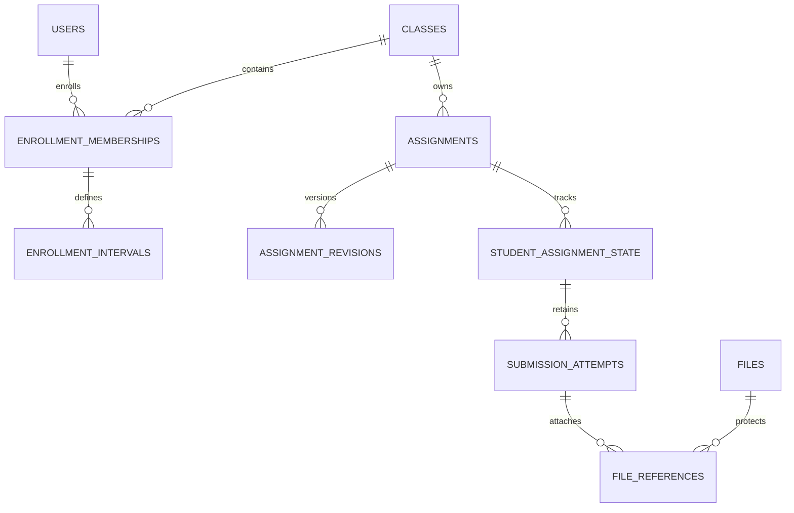
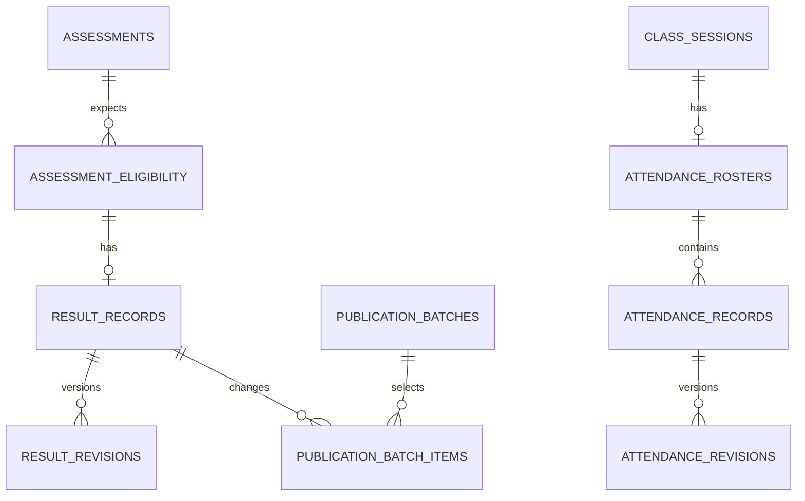

# 05 — Database Specification

## Student Learning App

| Field | Value |
|---|---|
| Project | SrhDP — Student Learning App |
| Document ID | SLP-DOC-05 |
| Version | 0.1 — complete database design draft |
| Date | 10 September 2026 |
| Sources | `02_prd.md` v0.1 and `04_sdd.md` v0.1; UX behavior from `03_ux_ui_spec.md` v0.1 |
| Owner | Technical lead / database owner — named person pending |
| Status | Proposed schema for review; no production database has been created or changed |
| SQL profile | PostgreSQL reference dialect; engine and deployed version still require DEC-10 approval |
| Deliverable | Data dictionary, relational schema, reference DDL, ownership constraints, transaction rules, queries, migrations, retention and verification plan |

This document makes the SDD's logical entities concrete. It defines a relational baseline, including the records necessary for reliable retries, explicit academic publication, file cleanup safety, and historical access. The SQL appendix creates the reference schema in an empty PostgreSQL database; it is not an approved production migration or a replacement for the guarded application commands described below.

PostgreSQL is a proposed reference dialect so types, foreign keys, and indexes can be reviewed precisely. It is not an approved engine selection. Porting to another engine must preserve every invariant and revalidate syntax, collation, transaction behavior, decimal rounding, and partial-index semantics. Do not apply PostgreSQL DDL to the user's unrelated MySQL/BROWN databases.

## 1. Scope and document precedence

The PRD owns academic rules. The SDD owns architecture and transaction boundaries. This specification owns table/column names, data types, relationships, constraints, and migration behavior for the proposed reference implementation. Conflicts must be resolved in the upstream document, not silently changed in DDL.

Included: identity, sessions/capabilities, academic setup, membership, sessions, materials/files, assignment revisions and attempts, feedback, assessments/results, attendance, notices/notifications, operation receipts, outbox/jobs, review flags, and audit.

Excluded: payments, chat, online exam-taking, guardian accounts, student directory, photos, automatic import, external school synchronization, general external notification channels, and multi-institution onboarding. The schema scopes records to an institution but the initial deployment remains one institution. No production data or real student fixture is included.

## 2. Database conventions and physical types

| Convention | Specification |
|---|---|
| Namespace | `slp`; all objects are explicitly created in this schema |
| Identifiers | Application-generated random UUIDs; API serializes IDs as strings; no sequential business meaning |
| Tenant key | Every scoped table has `institution_id uuid NOT NULL` and composite primary key `(institution_id,id)` |
| Foreign keys | All scoped references include `institution_id`; cross-institution attachment is rejected by the database |
| Creation time | `created_at timestamptz NOT NULL DEFAULT clock_timestamp()` on scoped tables |
| Revision | Mutable roots carry positive `revision bigint DEFAULT 1`; update with an expected revision |
| Time | Store UTC instants using `timestamptz`; configure session display timezone UTC; school timezone is explicit IANA text |
| Academic dates | `date` for inclusive academic year/term calendar bounds; convert school midnight bounds explicitly for session validation |
| Marks | `numeric(10,2)`; positive maximum ≤99,999,999.99 is a proposed technical ceiling, not expected school marks |
| Percentages | Derived using exact decimal arithmetic; never persist a rounded percentage as source data |
| Text | UTF-8; preserve Khmer/English content; required text cannot be whitespace-only |
| Status | Bounded `varchar` with CHECK allowlist; no magic numeric status mapping |
| Optional data | NULL means not provided/not published where specified; no empty-string/zero substitute |
| JSON | Only bounded receipts, event references and restricted audit changes; no JSON-only academic relationship model |
| Deletes | Foreign keys default RESTRICT; ordinary workflows archive/disable/withdraw |
| Naming | snake_case; `uq_`, `ix_`, `fk_`, `ck_` constraint/index prefixes; generated names remain below PostgreSQL's identifier limit |

Creation timestamps are record metadata. Submission `accepted_at` is supplied explicitly after lock waits; never use an ORM's transaction-start default for deadline acceptance. PostgreSQL distinguishes transaction timestamps from `clock_timestamp()`, which returns wall-clock time. [PostgreSQL date/time functions](https://www.postgresql.org/docs/current/functions-datetime.html).

Login normalization proposal: trim boundary whitespace, Unicode-normalize to NFC and apply the institution-approved case policy in the Identity module; store the original and canonical forms separately. Canonical values use deterministic byte-sensitive `C` collation in the reference DDL. No new normalization rule may merge existing accounts automatically. Login policy and non-English case behavior require DEC-05 review.

The DDL additionally constrains every numeric marks/points field to a finite value between 0 and 99,999,999.99 when non-null; positive maximum checks remain separate.

Numeric input with more than two fractional digits must be rejected before binding to a `numeric(10,2)` column: the database may coerce/round a supplied value to the column scale. A typed column alone does not prove original-request precision. Infinity/NaN input is rejected by the API; database checks on finite positive maxima and score bounds also require engine fixtures before acceptance.

## 3. Integrity strategy and enforcement levels

| Level | Enforcement | Examples |
|---|---|---|
| DDL | NOT NULL, PK, FK, UNIQUE, CHECK, partial unique indexes | One result identity, matching institution, score/status compatibility |
| Database trigger | Appendix append-only and referenced-file identity protection | Immutable attempts/revisions/events; exact file identity preserved |
| Guarded command | Required transactional policy implementation | Membership intervals, attempt eligibility, published-pointer state, batch atomicity |
| Reconciliation | Detects drift and operational loss; not a substitute for prevention | Missing object versions, stale job leases, incorrect pointer/count |

Database row checks cannot safely establish cross-table business facts such as active enrollment or published status. Composite foreign keys enforce owner/root identity, while guarded commands validate publication state and authorization. PostgreSQL documents the limitations of cross-row CHECK expressions and the distinct roles of FK/unique constraints. [PostgreSQL constraints](https://www.postgresql.org/docs/current/ddl-constraints.html).

**Important completion boundary:** the appendix includes executable schema DDL and structural triggers, not complete stored procedures for every application use case. Production readiness additionally requires the command implementations and transaction tests in Sections 8–10 and 17. Direct generic CRUD access to these tables is not an acceptable application architecture.

## 4. Entity relationships and SDD mappings





The diagrams show domain relationships; institution and actor FKs are omitted for readability and remain mandatory in the DDL.

| SDD logical term | Physical representation | Rationale |
|---|---|---|
| role_grants | capability_grants | Roles are approved preset sets of explicit capabilities; no implicit administrator superuser |
| student/teacher profiles | users plus capability/assignment/membership relationships | No unspecified profile fields or duplicate identities |
| submission_files | file_references with submission_attempt_id | One authoritative typed registry covers cleanup references |
| material/assignment attachments | file_references with exact revision ID | Replaced teaching files cannot alter confirmed student content |
| current policy snapshot | submission_attempts.policy_revision_id | Immutable exact revision; no duplicate mutable policy JSON |
| result identity | result_records → assessment_eligibility | Unique student/assessment identity enforced through unique eligibility |
| institution authorization guard | institutions row | Shared lock for normal writes, exclusive for access changes |
| class write guard | classes row | Consistent serialization root across academic commands |

## 5. Table inventory and complete column dictionary

The following common columns are included in **every scoped table below** and appear explicitly in the DDL: `institution_id uuid NOT NULL` (FK to institutions), `id uuid NOT NULL` (application supplied), and `created_at timestamptz NOT NULL DEFAULT clock_timestamp()`. Their primary key is `(institution_id,id)`. No automatic UUID extension is needed.

`NN` means NOT NULL, `NULL` means optional. No default exists unless shown. Composite scoped FKs are indicated in the Reference column. Pointer FKs with their parent binding are listed in Section 6 and the appendix.

### 5.1 Global root and migration ledger

| Table | Column/type/nullability | Constraint or purpose |
|---|---|---|
| institutions | id uuid PK; name varchar(200) NN; timezone_name varchar(100) NN; default_language varchar(35) NN; created_at timestamptz NN default clock_timestamp() | School identity; timezone/language allowlists validated during configuration |
| schema_migrations | version varchar(100) PK; checksum_sha256 bytea NN; applied_at timestamptz NN default clock_timestamp(); applied_by varchar(128) NN | Migration runner bookkeeping; 32-byte checksum; not an academic record |

The first institution is provisioned by a controlled migration/bootstrap identity, not public registration. Its row doubles as the SDD authorization guard. The migration runner registers the appendix version only after successful application and verification.

| Table | Purpose | Lifecycle |
|---|---|---|
| users | Institution-controlled identities; no public registration. | Guarded mutable |
| credentials | Password verifier, never a plaintext password. | Guarded mutable |
| sessions | Server-authoritative revocable sessions. | Guarded mutable |
| recovery_challenges | Single-use activation/recovery evidence. | Guarded mutable |
| academic_years | School academic-year date boundaries. | Guarded mutable |
| terms | Terms within academic years. | Guarded mutable |
| subjects | Catalog of taught subjects. | Guarded mutable |
| classes | Class root and exclusive academic write guard. | Guarded mutable |
| capability_grants | Explicit permission assignment; role presets expand into these rows. | Guarded mutable |
| teacher_assignments | Assigned teacher access intervals. | Guarded mutable |
| enrollment_memberships | Permanent student/class root retained after withdrawal. | Guarded mutable |
| enrollment_intervals | Effective attendance-eligibility intervals under membership root. | Guarded mutable |
| class_sessions | Scheduled sessions with preserved cancellation history. | Guarded mutable |
| files | Immutable object identity with mutable staged lifecycle metadata. | Guarded mutable |
| materials | Material identity and current visible/draft pointers. | Guarded mutable |
| material_revisions | Append-only material content snapshots; draft saves append too. | Append-only |
| assignments | Assignment root; publication and attempt policy live in revisions. | Guarded mutable |
| assignment_revisions | Immutable content and deadline policy snapshots. | Append-only |
| student_assignment_state | Unique latest attempt pointer and feedback lock for a student. | Guarded mutable |
| command_operations | Terminal command receipts; no separately committed processing row. | Append-only |
| submission_attempts | Immutable accepted content; one original command per attempt. | Append-only |
| feedback | Feedback root for one immutable attempt. | Guarded mutable |
| feedback_revisions | Append-only draft/published feedback and correction snapshots. | Append-only |
| assessments | Assessment identity, expected roster, and independent exam-detail publication. | Guarded mutable |
| assessment_eligibility | Expected student/assessment roster; corrections are audited. | Guarded mutable |
| result_records | One student/assessment result with safe current published pointer. | Guarded mutable |
| publication_batches | Immutable committed publication action; no pending rows. | Append-only |
| result_revisions | Immutable scored/status revision; drafts are never student-visible. | Append-only |
| publication_batch_items | Exact selected result and previous/new published revisions. | Append-only |
| attendance_rosters | Session roster state; explicit incomplete finalization. | Guarded mutable |
| attendance_records | One student/session identity via unique roster/student. | Guarded mutable |
| attendance_revisions | Append-only draft/finalized attendance; no implicit absent status. | Append-only |
| notices | Notice identity and current visibility pointer. | Guarded mutable |
| notice_revisions | Immutable notice content, audience and expiry. | Append-only |
| file_references | Typed content-reference registry; authoritative cleanup protection. | Append-only |
| outbox_events | Immutable event intent committed with the domain transaction. | Append-only |
| event_recipients | Captured publication-time eligible audience. | Append-only |
| notifications | Idempotent in-app delivery for an event-recipient pair. | Append-only |
| notification_reads | Persistent first successful read; idempotent write. | Append-only |
| user_preferences | Permitted own preferences only. | Guarded mutable |
| worker_jobs | Durable leased work; fenced updates prevent stale completion. | Guarded mutable |
| review_flags | Attributable academic recalculation/review needs. | Guarded mutable |
| audit_events | Restricted append-only actor/action/change evidence. | Append-only |


### 5.2 `users`

Institution-controlled identities; no public registration.

| Column | Type | Null/default | Meaning | Reference |
|---|---|---|---|---|

| login_display | `varchar(254)` | NN | Entered school login identifier | — |

| login_canonical | `varchar(254)` | NN | Application-normalized login; exact comparison | — |

| school_identifier | `varchar(64)` | NN | Stable student or staff school identifier | — |

| school_name | `varchar(200)` | NN | School-controlled display/legal name | — |

| account_state | `varchar(16)` | NN DEFAULT 'PENDING' | PENDING, ACTIVE, DISABLED | — |

| security_generation | `bigint` | NN DEFAULT 1 | Revocation generation | — |

| revision | `bigint` | NN DEFAULT 1 | Optimistic concurrency version | — |


Additional scoped unique keys: `(institution_id,login_canonical)`; `(institution_id,school_identifier)`.


Row checks: `account_state IN ('PENDING','ACTIVE','DISABLED')`; `security_generation > 0 AND revision > 0`; `length(btrim(login_canonical)) > 0 AND length(btrim(school_name)) > 0`.


### 5.3 `credentials`

Password verifier, never a plaintext password.

| Column | Type | Null/default | Meaning | Reference |
|---|---|---|---|---|

| user_id | `uuid` | NN | Credential owner | users |

| password_hash | `text` | NN | Versioned password-hash encoded string | — |

| changed_at | `timestamptz` | NN | Password change instant | — |


Additional scoped unique keys: `(institution_id,user_id)`.


Row checks: `length(password_hash) BETWEEN 1 AND 1024`.


### 5.4 `sessions`

Server-authoritative revocable sessions.

| Column | Type | Null/default | Meaning | Reference |
|---|---|---|---|---|

| user_id | `uuid` | NN | Authenticated owner | users |

| token_digest | `bytea` | NN | SHA-256 digest of opaque random credential | — |

| security_generation | `bigint` | NN | Generation at issue | — |

| last_activity_at | `timestamptz` | NN | Last accepted activity | — |

| idle_expires_at | `timestamptz` | NN | Idle deadline | — |

| absolute_expires_at | `timestamptz` | NN | Unextendable deadline | — |

| revoked_at | `timestamptz` | NULL | Revocation instant | — |

| client_kind | `varchar(16)` | NN | WEB or NATIVE | — |


Additional scoped unique keys: `(institution_id,token_digest)`.


Row checks: `octet_length(token_digest)=32`; `security_generation > 0`; `client_kind IN ('WEB','NATIVE')`; `idle_expires_at <= absolute_expires_at`; `last_activity_at <= idle_expires_at`.


### 5.5 `recovery_challenges`

Single-use activation/recovery evidence.

| Column | Type | Null/default | Meaning | Reference |
|---|---|---|---|---|

| user_id | `uuid` | NN | Account being activated/recovered | users |

| purpose | `varchar(16)` | NN | ACTIVATION or RECOVERY | — |

| evidence_digest | `bytea` | NN | Digest only; no raw recovery code | — |

| expires_at | `timestamptz` | NN | Evidence expiry | — |

| consumed_at | `timestamptz` | NULL | Consumed once under guarded transaction | — |

| invalidated_at | `timestamptz` | NULL | Explicit cancellation | — |


Additional scoped unique keys: `(institution_id,evidence_digest)`.


Row checks: `purpose IN ('ACTIVATION','RECOVERY')`; `octet_length(evidence_digest)=32`; `expires_at > created_at`.


### 5.6 `academic_years`

School academic-year date boundaries.

| Column | Type | Null/default | Meaning | Reference |
|---|---|---|---|---|

| name | `varchar(100)` | NN | Year label | — |

| starts_on | `date` | NN | Inclusive first school date | — |

| ends_on | `date` | NN | Inclusive final school date | — |

| state | `varchar(16)` | NN DEFAULT 'ACTIVE' | ACTIVE or ARCHIVED | — |

| revision | `bigint` | NN DEFAULT 1 | Edit version | — |


Row checks: `ends_on >= starts_on`; `state IN ('ACTIVE','ARCHIVED')`; `revision > 0`.


### 5.7 `terms`

Terms within academic years.

| Column | Type | Null/default | Meaning | Reference |
|---|---|---|---|---|

| academic_year_id | `uuid` | NN | Owning year | academic_years |

| name | `varchar(100)` | NN | Term label | — |

| starts_on | `date` | NN | Inclusive first date | — |

| ends_on | `date` | NN | Inclusive final date | — |

| state | `varchar(16)` | NN DEFAULT 'ACTIVE' | ACTIVE or ARCHIVED | — |

| revision | `bigint` | NN DEFAULT 1 | Edit version | — |


Additional scoped unique keys: `(institution_id,academic_year_id,name)`.


Row checks: `ends_on >= starts_on`; `state IN ('ACTIVE','ARCHIVED')`; `revision > 0`.


### 5.8 `subjects`

Catalog of taught subjects.

| Column | Type | Null/default | Meaning | Reference |
|---|---|---|---|---|

| code | `varchar(64)` | NN | Institution-unique subject code | — |

| name | `varchar(200)` | NN | Subject name | — |

| state | `varchar(16)` | NN DEFAULT 'ACTIVE' | ACTIVE or ARCHIVED | — |

| revision | `bigint` | NN DEFAULT 1 | Edit version | — |


Additional scoped unique keys: `(institution_id,code)`.


Row checks: `state IN ('ACTIVE','ARCHIVED')`; `revision > 0`.


### 5.9 `classes`

Class root and exclusive academic write guard.

| Column | Type | Null/default | Meaning | Reference |
|---|---|---|---|---|

| term_id | `uuid` | NN | Owning term | terms |

| subject_id | `uuid` | NN | Subject | subjects |

| code | `varchar(64)` | NN | Code unique within term | — |

| name | `varchar(200)` | NN | Class display name | — |

| description | `text` | NULL | Optional overview | — |

| location | `varchar(200)` | NULL | Default room/location | — |

| state | `varchar(16)` | NN DEFAULT 'ACTIVE' | ACTIVE, COMPLETED, ARCHIVED | — |

| revision | `bigint` | NN DEFAULT 1 | Edit version | — |


Additional scoped unique keys: `(institution_id,term_id,code)`.


Row checks: `state IN ('ACTIVE','COMPLETED','ARCHIVED')`; `revision > 0`; `description IS NULL OR length(description)<=20000`.


### 5.10 `capability_grants`

Explicit permission assignment; role presets expand into these rows.

| Column | Type | Null/default | Meaning | Reference |
|---|---|---|---|---|

| user_id | `uuid` | NN | Grantee | users |

| capability | `varchar(64)` | NN | Allowlisted capability key | — |

| scope_class_id | `uuid` | NULL | NULL denotes institution scope | classes |

| granted_by | `uuid` | NN | Authorized granting user | users |

| revoked_at | `timestamptz` | NULL | Revoked grants remain attributable | — |


### 5.11 `teacher_assignments`

Assigned teacher access intervals.

| Column | Type | Null/default | Meaning | Reference |
|---|---|---|---|---|

| class_id | `uuid` | NN | Assigned class | classes |

| teacher_id | `uuid` | NN | Active teacher identity | users |

| starts_at | `timestamptz` | NN | Inclusive effective start | — |

| ends_at | `timestamptz` | NULL | Exclusive end | — |

| assigned_by | `uuid` | NN | Assigning user | users |


Row checks: `ends_at IS NULL OR ends_at > starts_at`.


### 5.12 `enrollment_memberships`

Permanent student/class root retained after withdrawal.

| Column | Type | Null/default | Meaning | Reference |
|---|---|---|---|---|

| class_id | `uuid` | NN | Class | classes |

| student_id | `uuid` | NN | Student | users |

| state | `varchar(16)` | NN DEFAULT 'ACTIVE' | ACTIVE, WITHDRAWN, COMPLETED | — |

| revision | `bigint` | NN DEFAULT 1 | Membership correction version | — |


Additional scoped unique keys: `(institution_id,class_id,student_id)`.


Row checks: `state IN ('ACTIVE','WITHDRAWN','COMPLETED')`; `revision > 0`.


### 5.13 `enrollment_intervals`

Effective attendance-eligibility intervals under membership root.

| Column | Type | Null/default | Meaning | Reference |
|---|---|---|---|---|

| membership_id | `uuid` | NN | Stable membership | enrollment_memberships |

| starts_at | `timestamptz` | NN | Inclusive start | — |

| ends_at | `timestamptz` | NULL | Exclusive withdrawal/end | — |

| reason | `varchar(2000)` | NULL | Required for correction/withdrawal via writer | — |

| revision | `bigint` | NN DEFAULT 1 | Interval edit version | — |


Row checks: `ends_at IS NULL OR ends_at > starts_at`; `revision > 0`.


### 5.14 `class_sessions`

Scheduled sessions with preserved cancellation history.

| Column | Type | Null/default | Meaning | Reference |
|---|---|---|---|---|

| class_id | `uuid` | NN | Owning class | classes |

| starts_at | `timestamptz` | NN | Start instant | — |

| ends_at | `timestamptz` | NN | End instant | — |

| location | `varchar(200)` | NULL | Session-specific room | — |

| state | `varchar(16)` | NN DEFAULT 'SCHEDULED' | SCHEDULED or CANCELED | — |

| cancel_reason | `varchar(2000)` | NULL | Cancellation reason | — |

| revision | `bigint` | NN DEFAULT 1 | Edit version | — |


Row checks: `ends_at > starts_at`; `state IN ('SCHEDULED','CANCELED')`; `state <> 'CANCELED' OR (cancel_reason IS NOT NULL AND length(btrim(cancel_reason)) > 0)`; `revision > 0`.


### 5.15 `files`

Immutable object identity with mutable staged lifecycle metadata.

| Column | Type | Null/default | Meaning | Reference |
|---|---|---|---|---|

| owner_id | `uuid` | NN | Uploader | users |

| purpose | `varchar(24)` | NN | MATERIAL, ASSIGNMENT, SUBMISSION | — |

| object_key | `varchar(512)` | NN | Generated private storage key | — |

| object_version | `varchar(512)` | NULL | Fixed after verified upload | — |

| original_name | `varchar(255)` | NN | Display only, never storage path | — |

| size_bytes | `bigint` | NULL | Actual verified size | — |

| detected_type | `varchar(100)` | NULL | Server-detected media type | — |

| checksum_sha256 | `bytea` | NULL | Verified object checksum | — |

| state | `varchar(16)` | NN DEFAULT 'UPLOADING' | UPLOADING, CHECKING, READY, REJECTED, FAILED, DELETING, DELETED | — |

| scanner_version | `varchar(100)` | NULL | Scanner/signature identity | — |

| scanned_at | `timestamptz` | NULL | Completed inspection time | — |

| expires_at | `timestamptz` | NN | Unattached staging expiry | — |

| failure_code | `varchar(64)` | NULL | Safe diagnostic category | — |

| revision | `bigint` | NN DEFAULT 1 | Lifecycle optimistic version | — |


Additional scoped unique keys: `(institution_id,object_key)`.


Row checks: `purpose IN ('MATERIAL','ASSIGNMENT','SUBMISSION')`; `state IN ('UPLOADING','CHECKING','READY','REJECTED','FAILED','DELETING','DELETED')`; `size_bytes IS NULL OR size_bytes BETWEEN 1 AND 20971520`; `checksum_sha256 IS NULL OR octet_length(checksum_sha256)=32`; `state <> 'READY' OR (object_version IS NOT NULL AND size_bytes IS NOT NULL AND checksum_sha256 IS NOT NULL AND detected_type IS NOT NULL AND scanned_at IS NOT NULL)`; `revision > 0`.


### 5.16 `materials`

Material identity and current visible/draft pointers.

| Column | Type | Null/default | Meaning | Reference |
|---|---|---|---|---|

| class_id | `uuid` | NN | Owning class | classes |

| state | `varchar(16)` | NN DEFAULT 'DRAFT' | DRAFT, PUBLISHED, ARCHIVED | — |

| current_draft_id | `uuid` | NULL | Own material revision; parent-bound FK below | — |

| current_published_id | `uuid` | NULL | Own published revision; parent-bound FK below | — |

| revision | `bigint` | NN DEFAULT 1 | Root edit version | — |


Row checks: `state IN ('DRAFT','PUBLISHED','ARCHIVED')`; `state <> 'PUBLISHED' OR current_published_id IS NOT NULL`; `revision > 0`.


### 5.17 `material_revisions`

Append-only material content snapshots; draft saves append too.

| Column | Type | Null/default | Meaning | Reference |
|---|---|---|---|---|

| material_id | `uuid` | NN | Owning material | materials |

| revision_no | `integer` | NN | Monotonic within root | — |

| title | `varchar(200)` | NN | Required title | — |

| description | `text` | NULL | Optional content | — |

| publication_state | `varchar(16)` | NN | DRAFT or PUBLISHED | — |

| published_at | `timestamptz` | NULL | Publication instant | — |

| author_id | `uuid` | NN | Author | users |

| reason | `varchar(2000)` | NULL | Replacement/correction reason | — |


Additional scoped unique keys: `(institution_id,material_id,revision_no)`; `(institution_id,material_id,id)`.


Row checks: `revision_no > 0`; `length(btrim(title)) > 0`; `description IS NULL OR length(description)<=20000`; `(publication_state='DRAFT' AND published_at IS NULL) OR (publication_state='PUBLISHED' AND published_at IS NOT NULL)`.


Rows cannot be updated or deleted through the ordinary schema trigger. Draft edits create new immutable revisions; root pointers change only through an authorized command.


### 5.18 `assignments`

Assignment root; publication and attempt policy live in revisions.

| Column | Type | Null/default | Meaning | Reference |
|---|---|---|---|---|

| class_id | `uuid` | NN | Owning class | classes |

| state | `varchar(16)` | NN DEFAULT 'DRAFT' | DRAFT, PUBLISHED, ARCHIVED | — |

| current_draft_id | `uuid` | NULL | Own draft revision | — |

| current_published_id | `uuid` | NULL | Own published revision | — |

| archive_reason | `varchar(2000)` | NULL | Required when archived | — |

| revision | `bigint` | NN DEFAULT 1 | Root edit version | — |


Row checks: `state IN ('DRAFT','PUBLISHED','ARCHIVED')`; `state <> 'PUBLISHED' OR current_published_id IS NOT NULL`; `state <> 'ARCHIVED' OR (archive_reason IS NOT NULL AND length(btrim(archive_reason))>0)`; `revision > 0`.


### 5.19 `assignment_revisions`

Immutable content and deadline policy snapshots.

| Column | Type | Null/default | Meaning | Reference |
|---|---|---|---|---|

| assignment_id | `uuid` | NN | Owning assignment | assignments |

| revision_no | `integer` | NN | Monotonic revision | — |

| title | `varchar(200)` | NN | Assignment title | — |

| instructions | `text` | NN | Assignment instructions | — |

| opens_at | `timestamptz` | NN | Inclusive opening | — |

| due_at | `timestamptz` | NN | Inclusive on-time deadline | — |

| late_close_at | `timestamptz` | NULL | NULL means late disabled | — |

| submission_mode | `varchar(20)` | NN | TEXT, FILES, TEXT_AND_FILES | — |

| max_attempts | `smallint` | NN DEFAULT 1 | 1 to 3 | — |

| maximum_points | `numeric(10,2)` | NULL | Optional grading basis | — |

| publication_state | `varchar(16)` | NN | DRAFT or PUBLISHED | — |

| published_at | `timestamptz` | NULL | Publication time | — |

| author_id | `uuid` | NN | Author | users |

| reason | `varchar(2000)` | NULL | Change reason | — |


Additional scoped unique keys: `(institution_id,assignment_id,revision_no)`; `(institution_id,assignment_id,id)`.


Row checks: `revision_no > 0`; `length(btrim(title))>0`; `length(btrim(instructions)) BETWEEN 1 AND 20000`; `opens_at <= due_at`; `late_close_at IS NULL OR late_close_at > due_at`; `submission_mode IN ('TEXT','FILES','TEXT_AND_FILES')`; `max_attempts BETWEEN 1 AND 3`; `maximum_points IS NULL OR maximum_points > 0`; `(publication_state='DRAFT' AND published_at IS NULL) OR (publication_state='PUBLISHED' AND published_at IS NOT NULL)`.


Rows cannot be updated or deleted through the ordinary schema trigger. Draft edits create new immutable revisions; root pointers change only through an authorized command.


### 5.20 `student_assignment_state`

Unique latest attempt pointer and feedback lock for a student.

| Column | Type | Null/default | Meaning | Reference |
|---|---|---|---|---|

| assignment_id | `uuid` | NN | Assignment | assignments |

| student_id | `uuid` | NN | Owner | users |

| attempt_count | `smallint` | NN DEFAULT 0 | Confirmed attempts only | — |

| current_attempt_id | `uuid` | NULL | Own current attempt | — |

| feedback_locked_at | `timestamptz` | NULL | First published feedback freezes resubmission | — |

| revision | `bigint` | NN DEFAULT 1 | Root version | — |


Additional scoped unique keys: `(institution_id,assignment_id,student_id)`; `(institution_id,id,assignment_id)`.


Row checks: `attempt_count BETWEEN 0 AND 3`; `(attempt_count=0 AND current_attempt_id IS NULL) OR (attempt_count>0 AND current_attempt_id IS NOT NULL)`; `revision > 0`.


### 5.21 `command_operations`

Terminal command receipts; no separately committed processing row.

| Column | Type | Null/default | Meaning | Reference |
|---|---|---|---|---|

| actor_id | `uuid` | NN | Authenticated issuer | users |

| command_kind | `varchar(64)` | NN | Allowlisted command category | — |

| target_id | `uuid` | NN | Scoped target; guarded polymorphic reference | — |

| idempotency_key | `varchar(128)` | NN | Opaque caller operation key | — |

| request_digest | `bytea` | NN | Canonical request SHA-256 | — |

| outcome | `varchar(16)` | NN | CONFIRMED or REJECTED | — |

| resource_kind | `varchar(64)` | NULL | Confirmed resource type | — |

| resource_id | `uuid` | NULL | Confirmed resource identifier | — |

| accepted_at | `timestamptz` | NULL | Acceptance point for commands that use one | — |

| error_code | `varchar(64)` | NULL | Known domain rejection | — |

| receipt | `jsonb` | NN DEFAULT '{}'::jsonb | Bounded safe immutable outcome DTO | — |


Additional scoped unique keys: `(institution_id,actor_id,command_kind,target_id,idempotency_key)`.


Row checks: `octet_length(request_digest)=32`; `length(idempotency_key)>0`; `(outcome='CONFIRMED' AND resource_kind IS NOT NULL AND resource_id IS NOT NULL AND error_code IS NULL) OR (outcome='REJECTED' AND resource_kind IS NULL AND resource_id IS NULL AND error_code IS NOT NULL)`; `jsonb_typeof(receipt)='object' AND octet_length(receipt::text)<=16384`.


Rows cannot be updated or deleted through the ordinary schema trigger. Draft edits create new immutable revisions; root pointers change only through an authorized command.


### 5.22 `submission_attempts`

Immutable accepted content; one original command per attempt.

| Column | Type | Null/default | Meaning | Reference |
|---|---|---|---|---|

| state_id | `uuid` | NN | Student/assignment root | student_assignment_state |

| assignment_id | `uuid` | NN | Redundant for parent/policy binding | assignments |

| policy_revision_id | `uuid` | NN | Exact assignment policy revision | — |

| attempt_no | `smallint` | NN | Confirmed sequence 1 to 3 | — |

| operation_id | `uuid` | NN | Original confirmed operation | command_operations |

| accepted_at | `timestamptz` | NN | Post-lock wall-clock acceptance instant | — |

| timeliness | `varchar(16)` | NN | ON_TIME or LATE | — |

| submitted_text | `text` | NULL | Required according to snapshotted mode | — |


Additional scoped unique keys: `(institution_id,state_id,attempt_no)`; `(institution_id,operation_id)`; `(institution_id,state_id,id)`.


Row checks: `attempt_no BETWEEN 1 AND 3`; `timeliness IN ('ON_TIME','LATE')`; `submitted_text IS NULL OR length(btrim(submitted_text)) BETWEEN 1 AND 10000`.


Rows cannot be updated or deleted through the ordinary schema trigger. Draft edits create new immutable revisions; root pointers change only through an authorized command.


### 5.23 `feedback`

Feedback root for one immutable attempt.

| Column | Type | Null/default | Meaning | Reference |
|---|---|---|---|---|

| attempt_id | `uuid` | NN | Reviewed attempt | submission_attempts |

| current_draft_id | `uuid` | NULL | Own feedback revision | — |

| current_published_id | `uuid` | NULL | Own feedback revision | — |

| revision | `bigint` | NN DEFAULT 1 | Edit version | — |


Additional scoped unique keys: `(institution_id,attempt_id)`.


Row checks: `revision > 0`.


### 5.24 `feedback_revisions`

Append-only draft/published feedback and correction snapshots.

| Column | Type | Null/default | Meaning | Reference |
|---|---|---|---|---|

| feedback_id | `uuid` | NN | Owning feedback | feedback |

| revision_no | `integer` | NN | Monotonic revision | — |

| comment | `text` | NN | Teacher comment | — |

| score | `numeric(10,2)` | NULL | Optional earned points | — |

| maximum_points | `numeric(10,2)` | NULL | Required with score | — |

| publication_state | `varchar(16)` | NN | DRAFT or PUBLISHED | — |

| published_at | `timestamptz` | NULL | Publication time | — |

| author_id | `uuid` | NN | Reviewer | users |

| reason | `varchar(2000)` | NULL | Required on correction | — |


Additional scoped unique keys: `(institution_id,feedback_id,revision_no)`; `(institution_id,feedback_id,id)`.


Row checks: `revision_no>0`; `length(comment)<=20000`; `(score IS NULL AND maximum_points IS NULL) OR (score IS NOT NULL AND maximum_points IS NOT NULL AND maximum_points>0 AND score BETWEEN 0 AND maximum_points)`; `(publication_state='DRAFT' AND published_at IS NULL) OR (publication_state='PUBLISHED' AND published_at IS NOT NULL)`.


Rows cannot be updated or deleted through the ordinary schema trigger. Draft edits create new immutable revisions; root pointers change only through an authorized command.


### 5.25 `assessments`

Assessment identity, expected roster, and independent exam-detail publication.

| Column | Type | Null/default | Meaning | Reference |
|---|---|---|---|---|

| class_id | `uuid` | NN | Class determines subject and term | classes |

| title | `varchar(200)` | NN | Assessment name | — |

| maximum_marks | `numeric(10,2)` | NN | Positive scoring basis | — |

| assessment_at | `timestamptz` | NN | Academic date/time reference | — |

| exam_starts_at | `timestamptz` | NULL | Optional scheduled exam start | — |

| exam_ends_at | `timestamptz` | NULL | Required with scheduled start | — |

| state | `varchar(16)` | NN DEFAULT 'DRAFT' | DRAFT, PUBLISHED, CANCELED, ARCHIVED | — |

| eligibility_captured_at | `timestamptz` | NULL | Event-time roster snapshot | — |

| revision | `bigint` | NN DEFAULT 1 | Change version | — |


Row checks: `maximum_marks>0`; `state IN ('DRAFT','PUBLISHED','CANCELED','ARCHIVED')`; `(exam_starts_at IS NULL AND exam_ends_at IS NULL) OR (exam_starts_at IS NOT NULL AND exam_ends_at IS NOT NULL AND exam_ends_at>exam_starts_at)`; `revision>0`.


### 5.26 `assessment_eligibility`

Expected student/assessment roster; corrections are audited.

| Column | Type | Null/default | Meaning | Reference |
|---|---|---|---|---|

| assessment_id | `uuid` | NN | Assessment | assessments |

| student_id | `uuid` | NN | Expected student | users |

| is_expected | `boolean` | NN DEFAULT true | Explicit exclusion stays attributable | — |

| reason | `varchar(2000)` | NULL | Required for later correction/exclusion | — |

| revision | `bigint` | NN DEFAULT 1 | Roster entry version | — |


Additional scoped unique keys: `(institution_id,assessment_id,student_id)`.


Row checks: `revision>0`.


### 5.27 `result_records`

One student/assessment result with safe current published pointer.

| Column | Type | Null/default | Meaning | Reference |
|---|---|---|---|---|

| eligibility_id | `uuid` | NN | Expected roster identity | assessment_eligibility |

| current_draft_id | `uuid` | NULL | Own result revision | — |

| current_published_id | `uuid` | NULL | NULL after withdrawal; old evidence retained | — |

| revision | `bigint` | NN DEFAULT 1 | Result root version | — |


Additional scoped unique keys: `(institution_id,eligibility_id)`.


Row checks: `revision>0`.


### 5.28 `publication_batches`

Immutable committed publication action; no pending rows.

| Column | Type | Null/default | Meaning | Reference |
|---|---|---|---|---|

| actor_id | `uuid` | NN | Authorized publisher | users |

| action | `varchar(16)` | NN | PUBLISH, CORRECT, WITHDRAW | — |

| operation_id | `uuid` | NN | Original receipt | command_operations |

| selection_digest | `bytea` | NN | Selected IDs/expected revisions digest | — |

| selected_count | `integer` | NN | Actual atomic batch count | — |

| reason | `varchar(2000)` | NULL | Required for correction/withdrawal | — |


Additional scoped unique keys: `(institution_id,operation_id)`.


Row checks: `action IN ('PUBLISH','CORRECT','WITHDRAW')`; `selected_count BETWEEN 1 AND 100`; `octet_length(selection_digest)=32`; `action='PUBLISH' OR (reason IS NOT NULL AND length(btrim(reason))>0)`.


Rows cannot be updated or deleted through the ordinary schema trigger. Draft edits create new immutable revisions; root pointers change only through an authorized command.


### 5.29 `result_revisions`

Immutable scored/status revision; drafts are never student-visible.

| Column | Type | Null/default | Meaning | Reference |
|---|---|---|---|---|

| result_id | `uuid` | NN | Result root | result_records |

| revision_no | `integer` | NN | Monotonic revision | — |

| result_status | `varchar(16)` | NN | SCORED, ABSENT, EXEMPT | — |

| marks | `numeric(10,2)` | NULL | Exact scored marks | — |

| maximum_marks | `numeric(10,2)` | NN | Immutable basis snapshot | — |

| publication_state | `varchar(16)` | NN | DRAFT or PUBLISHED | — |

| published_at | `timestamptz` | NULL | Publication instant | — |

| batch_id | `uuid` | NULL | Required on published revisions | publication_batches |

| author_id | `uuid` | NN | Author | users |

| reason | `varchar(2000)` | NULL | Correction reason | — |


Additional scoped unique keys: `(institution_id,result_id,revision_no)`; `(institution_id,result_id,id)`.


Row checks: `revision_no>0 AND maximum_marks>0`; `(result_status='SCORED' AND marks IS NOT NULL AND marks BETWEEN 0 AND maximum_marks) OR (result_status IN ('ABSENT','EXEMPT') AND marks IS NULL)`; `(publication_state='DRAFT' AND published_at IS NULL AND batch_id IS NULL) OR (publication_state='PUBLISHED' AND published_at IS NOT NULL AND batch_id IS NOT NULL)`.


Rows cannot be updated or deleted through the ordinary schema trigger. Draft edits create new immutable revisions; root pointers change only through an authorized command.


### 5.30 `publication_batch_items`

Exact selected result and previous/new published revisions.

| Column | Type | Null/default | Meaning | Reference |
|---|---|---|---|---|

| batch_id | `uuid` | NN | Committed publication batch | publication_batches |

| result_id | `uuid` | NN | Affected result | result_records |

| previous_revision_id | `uuid` | NULL | Own prior visible revision | — |

| new_revision_id | `uuid` | NULL | Own new visible revision; NULL on withdrawal | — |


Additional scoped unique keys: `(institution_id,batch_id,result_id)`.


Row checks: `previous_revision_id IS NOT NULL OR new_revision_id IS NOT NULL`.


Rows cannot be updated or deleted through the ordinary schema trigger. Draft edits create new immutable revisions; root pointers change only through an authorized command.


### 5.31 `attendance_rosters`

Session roster state; explicit incomplete finalization.

| Column | Type | Null/default | Meaning | Reference |
|---|---|---|---|---|

| session_id | `uuid` | NN | Class session | class_sessions |

| state | `varchar(24)` | NN DEFAULT 'DRAFT' | DRAFT, FINALIZED_COMPLETE, FINALIZED_INCOMPLETE | — |

| finalized_at | `timestamptz` | NULL | Last explicit finalization | — |

| finalized_by | `uuid` | NULL | Finalizing actor | users |

| revision | `bigint` | NN DEFAULT 1 | Roster version | — |


Additional scoped unique keys: `(institution_id,session_id)`.


Row checks: `state IN ('DRAFT','FINALIZED_COMPLETE','FINALIZED_INCOMPLETE')`; `(state='DRAFT' AND finalized_at IS NULL AND finalized_by IS NULL) OR (state<>'DRAFT' AND finalized_at IS NOT NULL AND finalized_by IS NOT NULL)`; `revision>0`.


### 5.32 `attendance_records`

One student/session identity via unique roster/student.

| Column | Type | Null/default | Meaning | Reference |
|---|---|---|---|---|

| roster_id | `uuid` | NN | Session roster | attendance_rosters |

| student_id | `uuid` | NN | Student | users |

| current_draft_id | `uuid` | NULL | Own attendance revision | — |

| current_finalized_id | `uuid` | NULL | Own student-visible revision | — |

| revision | `bigint` | NN DEFAULT 1 | Root version | — |


Additional scoped unique keys: `(institution_id,roster_id,student_id)`.


Row checks: `revision>0`.


### 5.33 `attendance_revisions`

Append-only draft/finalized attendance; no implicit absent status.

| Column | Type | Null/default | Meaning | Reference |
|---|---|---|---|---|

| record_id | `uuid` | NN | Attendance root | attendance_records |

| revision_no | `integer` | NN | Monotonic revision | — |

| attendance_status | `varchar(16)` | NN | PRESENT, ABSENT, LATE, EXCUSED | — |

| visibility | `varchar(16)` | NN | DRAFT or FINALIZED | — |

| finalized_at | `timestamptz` | NULL | Student-visible instant | — |

| author_id | `uuid` | NN | Recorder | users |

| reason | `varchar(2000)` | NULL | Required for correction | — |


Additional scoped unique keys: `(institution_id,record_id,revision_no)`; `(institution_id,record_id,id)`.


Row checks: `revision_no>0`; `attendance_status IN ('PRESENT','ABSENT','LATE','EXCUSED')`; `(visibility='DRAFT' AND finalized_at IS NULL) OR (visibility='FINALIZED' AND finalized_at IS NOT NULL)`.


Rows cannot be updated or deleted through the ordinary schema trigger. Draft edits create new immutable revisions; root pointers change only through an authorized command.


### 5.34 `notices`

Notice identity and current visibility pointer.

| Column | Type | Null/default | Meaning | Reference |
|---|---|---|---|---|

| state | `varchar(16)` | NN DEFAULT 'DRAFT' | DRAFT, PUBLISHED, ARCHIVED | — |

| current_draft_id | `uuid` | NULL | Own notice revision | — |

| current_published_id | `uuid` | NULL | Own visible revision | — |

| revision | `bigint` | NN DEFAULT 1 | Root edit version | — |


Row checks: `state IN ('DRAFT','PUBLISHED','ARCHIVED')`; `state<>'PUBLISHED' OR current_published_id IS NOT NULL`; `revision>0`.


### 5.35 `notice_revisions`

Immutable notice content, audience and expiry.

| Column | Type | Null/default | Meaning | Reference |
|---|---|---|---|---|

| notice_id | `uuid` | NN | Notice root | notices |

| revision_no | `integer` | NN | Monotonic version | — |

| title | `varchar(200)` | NN | Required title | — |

| body | `text` | NN | Safe plain content | — |

| audience_class_id | `uuid` | NULL | NULL means school-wide | classes |

| expires_at | `timestamptz` | NULL | Optional expiry after publication | — |

| publication_state | `varchar(16)` | NN | DRAFT or PUBLISHED | — |

| published_at | `timestamptz` | NULL | Visible instant | — |

| author_id | `uuid` | NN | Publisher/author | users |

| reason | `varchar(2000)` | NULL | Revision reason | — |


Additional scoped unique keys: `(institution_id,notice_id,revision_no)`; `(institution_id,notice_id,id)`.


Row checks: `revision_no>0`; `length(btrim(title))>0 AND length(btrim(body)) BETWEEN 1 AND 20000`; `(publication_state='DRAFT' AND published_at IS NULL) OR (publication_state='PUBLISHED' AND published_at IS NOT NULL)`; `expires_at IS NULL OR published_at IS NULL OR expires_at>published_at`.


Rows cannot be updated or deleted through the ordinary schema trigger. Draft edits create new immutable revisions; root pointers change only through an authorized command.


### 5.36 `file_references`

Typed content-reference registry; authoritative cleanup protection.

| Column | Type | Null/default | Meaning | Reference |
|---|---|---|---|---|

| file_id | `uuid` | NN | Referenced exact file version | files |

| material_revision_id | `uuid` | NULL | Teaching material owner | material_revisions |

| assignment_revision_id | `uuid` | NULL | Assignment instruction attachment | assignment_revisions |

| submission_attempt_id | `uuid` | NULL | Confirmed student work owner | submission_attempts |

| position | `smallint` | NN | Presentation order 1 to 5 | — |


Row checks: `num_nonnulls(material_revision_id,assignment_revision_id,submission_attempt_id)=1`; `position BETWEEN 1 AND 5`.


Rows cannot be updated or deleted through the ordinary schema trigger. Draft edits create new immutable revisions; root pointers change only through an authorized command.


### 5.37 `outbox_events`

Immutable event intent committed with the domain transaction.

| Column | Type | Null/default | Meaning | Reference |
|---|---|---|---|---|

| event_kind | `varchar(64)` | NN | Allowlisted event category | — |

| entity_kind | `varchar(64)` | NN | Source resource type | — |

| entity_id | `uuid` | NN | Typed by entity_kind; writer validates | — |

| entity_revision | `bigint` | NN | Source revision number | — |

| action | `varchar(32)` | NN | Publication/correction action | — |

| schema_version | `integer` | NN DEFAULT 1 | Worker payload contract | — |

| payload | `jsonb` | NN DEFAULT '{}'::jsonb | Bounded references, no academic content copies | — |


Additional scoped unique keys: `(institution_id,event_kind,entity_kind,entity_id,entity_revision,action)`.


Row checks: `entity_revision>0 AND schema_version>0`; `jsonb_typeof(payload)='object' AND octet_length(payload::text)<=16384`.


Rows cannot be updated or deleted through the ordinary schema trigger. Draft edits create new immutable revisions; root pointers change only through an authorized command.


### 5.38 `event_recipients`

Captured publication-time eligible audience.

| Column | Type | Null/default | Meaning | Reference |
|---|---|---|---|---|

| event_id | `uuid` | NN | Committed event | outbox_events |

| recipient_id | `uuid` | NN | Eligible recipient at event time | users |


Additional scoped unique keys: `(institution_id,event_id,recipient_id)`; `(institution_id,id,recipient_id)`.


Rows cannot be updated or deleted through the ordinary schema trigger. Draft edits create new immutable revisions; root pointers change only through an authorized command.


### 5.39 `notifications`

Idempotent in-app delivery for an event-recipient pair.

| Column | Type | Null/default | Meaning | Reference |
|---|---|---|---|---|

| event_recipient_id | `uuid` | NN | Immutable recipient snapshot | event_recipients |

| recipient_id | `uuid` | NN | Redundant for owner-bound read FK | users |


Additional scoped unique keys: `(institution_id,event_recipient_id)`; `(institution_id,id,recipient_id)`.


Rows cannot be updated or deleted through the ordinary schema trigger. Draft edits create new immutable revisions; root pointers change only through an authorized command.


### 5.40 `notification_reads`

Persistent first successful read; idempotent write.

| Column | Type | Null/default | Meaning | Reference |
|---|---|---|---|---|

| notification_id | `uuid` | NN | Notification | notifications |

| recipient_id | `uuid` | NN | Owner; parent-bound FK below | users |

| read_at | `timestamptz` | NN | Successful detail/read persistence time | — |


Additional scoped unique keys: `(institution_id,notification_id)`.


Rows cannot be updated or deleted through the ordinary schema trigger. Draft edits create new immutable revisions; root pointers change only through an authorized command.


### 5.41 `user_preferences`

Permitted own preferences only.

| Column | Type | Null/default | Meaning | Reference |
|---|---|---|---|---|

| user_id | `uuid` | NN | Preference owner | users |

| language_tag | `varchar(35)` | NULL | Only approved language tag; NULL means institution default | — |

| revision | `bigint` | NN DEFAULT 1 | Edit version | — |


Additional scoped unique keys: `(institution_id,user_id)`.


Row checks: `revision>0`.


### 5.42 `worker_jobs`

Durable leased work; fenced updates prevent stale completion.

| Column | Type | Null/default | Meaning | Reference |
|---|---|---|---|---|

| job_kind | `varchar(64)` | NN | SCAN, FANOUT, CLEANUP, RECONCILE category | — |

| dedupe_key | `varchar(200)` | NN | Stable workload identity | — |

| outbox_event_id | `uuid` | NULL | Source event if fanout | outbox_events |

| file_id | `uuid` | NULL | File if scan/cleanup | files |

| state | `varchar(16)` | NN DEFAULT 'READY' | READY, RUNNING, SUCCEEDED, DEAD | — |

| next_run_at | `timestamptz` | NN | Dispatch eligibility | — |

| lease_until | `timestamptz` | NULL | Active lease expiry | — |

| lease_owner | `varchar(128)` | NULL | Worker claim identity | — |

| lease_generation | `bigint` | NN DEFAULT 0 | Increment on every claim | — |

| attempt_count | `integer` | NN DEFAULT 0 | Claims/retries | — |

| last_error_code | `varchar(64)` | NULL | Safe category | — |


Additional scoped unique keys: `(institution_id,job_kind,dedupe_key)`.


Row checks: `state IN ('READY','RUNNING','SUCCEEDED','DEAD')`; `lease_generation>=0 AND attempt_count>=0`; `(state='RUNNING' AND lease_until IS NOT NULL AND lease_owner IS NOT NULL) OR (state<>'RUNNING' AND lease_until IS NULL AND lease_owner IS NULL)`.


### 5.43 `review_flags`

Attributable academic recalculation/review needs.

| Column | Type | Null/default | Meaning | Reference |
|---|---|---|---|---|

| entity_kind | `varchar(64)` | NN | Affected resource category | — |

| entity_id | `uuid` | NN | Writer-validated target | — |

| reason_code | `varchar(64)` | NN | Membership/session/correction cause | — |

| raised_by | `uuid` | NN | Authorized actor | users |

| resolved_by | `uuid` | NULL | Resolution actor | users |

| resolved_at | `timestamptz` | NULL | Resolution instant | — |

| resolution_note | `varchar(2000)` | NULL | Required on resolution | — |


Row checks: `(resolved_at IS NULL AND resolved_by IS NULL) OR (resolved_at IS NOT NULL AND resolved_by IS NOT NULL AND resolution_note IS NOT NULL)`.


### 5.44 `audit_events`

Restricted append-only actor/action/change evidence.

| Column | Type | Null/default | Meaning | Reference |
|---|---|---|---|---|

| actor_id | `uuid` | NULL | Human actor, if any | users |

| service_actor | `varchar(128)` | NULL | Worker/service identity where applicable | — |

| action | `varchar(64)` | NN | Allowlisted audit operation | — |

| entity_kind | `varchar(64)` | NN | Target type | — |

| entity_id | `uuid` | NN | Target identity preserved even after approved purge | — |

| request_reference | `varchar(128)` | NN | Safe correlation reference | — |

| before_data | `jsonb` | NULL | Allowlisted restricted prior values | — |

| after_data | `jsonb` | NULL | Allowlisted restricted new values | — |

| reason | `varchar(2000)` | NULL | Required for controlled changes | — |


Row checks: `num_nonnulls(actor_id,service_actor)=1`; `before_data IS NULL OR octet_length(before_data::text)<=65536`; `after_data IS NULL OR octet_length(after_data::text)<=65536`.


Rows cannot be updated or deleted through the ordinary schema trigger. Draft edits create new immutable revisions; root pointers change only through an authorized command.


## 6. Root-bound pointers, uniqueness, and relationship checks

A foreign key to a revision ID alone is insufficient: a result could otherwise point to another student's valid revision in the same institution. Every current pointer therefore uses `(institution_id, root.id, pointer)` → `(institution_id, revision.parent_id, revision.id)`. The appendix defines these deferred FKs after all tables exist.

| Root/pointer | Required target binding |
|---|---|
| materials.current_draft_id/current_published_id | material_revisions(material_id,id) |
| assignments.current_draft_id/current_published_id | assignment_revisions(assignment_id,id) |
| student_assignment_state.current_attempt_id | submission_attempts(state_id,id) |
| feedback.current_draft_id/current_published_id | feedback_revisions(feedback_id,id) |
| result_records.current_draft_id/current_published_id | result_revisions(result_id,id) |
| attendance_records.current_draft_id/current_finalized_id | attendance_revisions(record_id,id) |
| notices.current_draft_id/current_published_id | notice_revisions(notice_id,id) |
| submission_attempts(state_id,assignment_id) | student_assignment_state(id,assignment_id) |
| submission_attempts(assignment_id,policy_revision_id) | assignment_revisions(assignment_id,id) |
| publication_batch_items(result_id,previous/new_revision_id) | result_revisions(result_id,id) |
| notifications(event_recipient_id,recipient_id) | event_recipients(id,recipient_id) |
| notification_reads(notification_id,recipient_id) | notifications(id,recipient_id) |

Current pointer target must also be in the expected DRAFT/PUBLISHED/FINALIZED state. This semantic check is made by the guarded command; the structural FK only proves that it belongs to the root. A current published pointer may never point to a draft. The student serializers use only visible pointers plus an explicit target-state predicate as defense in depth.

Typed file references have exactly one owning parent: material revision, assignment revision, or submission attempt. Partial unique indexes enforce one position per parent and prevent the same file appearing twice within one parent. Maximum five positions enforces file count structurally; **50 MiB aggregate size**, readiness, owner, purpose and expiry still require transaction validation. A retained teaching revision keeps its file referenced even if no longer current; retention policy controls eventual purge.

Global UUID generation is recommended but not assumed as an integrity constraint: every lookup/relationship still includes institution_id. Polymorphic command/outbox/audit/review targets are explicitly bounded exceptions: the command validates their concrete type and ownership, and reconciliation verifies them. They must never be used as arbitrary SQL table names supplied by a client.

## 7. Index specification and query behavior

Primary/unique keys already create their supporting indexes; do not duplicate them. The appendix adds child-FK support indexes where a matching prefix does not exist, plus the access-path indexes below. Extra indexes increase write/storage cost; verify them with representative query plans before release.

| Access path | Index intent |
|---|---|
| User sessions | institution,user,absolute expiry; nonrevoked session predicate |
| Teacher scope | institution,teacher,class; active/end predicate queried |
| Current classes | institution,student,state,class |
| Class sessions | institution,class,start,id; overlap predicate includes ends_at |
| Assignment visibility | institution,class,state,id; due order is joined through published revision |
| Attempt history | unique state/attempt number supports reverse traversal |
| Result scope | assessment class plus eligibility student/assessment; unique result eligibility |
| Attendance | roster/session plus record student/roster |
| Notifications | institution,recipient,created_at descending,id descending |
| Jobs | ready next_run_at/ID; running lease expiry separately |
| Audit | institution,entity_kind,entity_id,created_at descending,id descending |
| Expired uploads | institution,expires_at,id for live staged states; NOT EXISTS references |

All lists use default 20/max 100 rows and stable ID tie-breaks. Cursor values are bound to the authorized filter/sort. Totals must cover the whole filtered authorized dataset, not the loaded page. Read rows and totals within one consistent snapshot. A cursor does not freeze future pages across concurrent updates; publication commits use an explicit selected-ID/revision set.

No partitioning or read replica is required for the pilot. Measure before introducing either. If partitioning changes unique/FK enforcement, update this specification and re-run integrity tests. Primary reads are required for post-write confirmation and access-state correctness.

## 8. Required transactional commands

The application uses the SDD guard protocol: institution row shared lock → authorized principal check → affected class rows exclusively in sorted UUID order → command/state/entity/file locks in deterministic order. Access-changing commands take the institution row exclusively first. No command upgrades that guard after taking a class lock. Do not hold these locks during file transfer, scanning, message delivery, or user review.

PostgreSQL row locks coordinate conflicting operations and remain until transaction end; deadlocks can still occur and require complete transaction rollback/retry. This schema's guard hierarchy is a project design choice layered on that mechanism. [PostgreSQL explicit locking](https://www.postgresql.org/docs/current/explicit-locking.html).

| Command | Mandatory validations and writes in one transaction |
|---|---|
| Provision/disable/recover | Unique normalized identity; consume evidence once; revoke sessions/generation; audit |
| Change grant/membership | Exclusive institution guard; capability/active-account checks; interval nonoverlap; audit/review flags |
| Save academic structure | Year/term containment; class/subject consistency; referenced records preserved |
| Save/cancel session | Term bounds and overlap acknowledgement; cancellation reason; coverage recalculation/review |
| Publish material/assignment | Own revision state, authorized class, ready typed files, valid policy; pointer/event/audit |
| Finalize submission | Current eligibility, original key replay, file guards, deadline, next attempt, receipt, immutable content, pointer/count |
| Publish feedback | Current reviewed attempt matches state pointer; score basis; lock further attempts; revision/event/audit |
| Publish/correct/withdraw results | Selected IDs/revisions and count 1–100; status/score validation; all visible pointers/batch items/receipt/event/audit |
| Finalize/correct attendance | Eligible started noncanceled sessions; explicit incomplete choice; own revisions; coverage/reason |
| Publish/republish notice | Authorized audience; expiry; snapshot recipients; preserve read state for ordinary text edit |
| Mark notification read | Actor is bound recipient; current visibility; idempotent first read |
| Cleanup file | Lock file; no references; expired; mark DELETING before external delete |

Cross-record intervals are checked while holding the relevant class/access guards: no enrollment intervals for one membership overlap, and no active teacher assignment duplicates its class/teacher interval. The reference DDL does not install a range exclusion extension. Installing an engine-specific exclusion constraint is optional defense in depth and requires a migration; correctness cannot depend on an extension absent from deployment.

Other required temporal rules: publishing never shortens due/late-close dates; class/mode/max attempts/grading basis lock after the first confirmed attempt; published assignment cannot return to draft or archived assignment reopen. Assessment basis changes cannot reinterpret existing published marks. Academic date containment includes the full school's last calendar day, not midnight at its beginning.

## 9. Submission receipt and replay integrity

A new finalization creates one immutable `command_operations` row and one `submission_attempts` row in the same commit. The attempt FK to operation is unique. Because the command receipt contains the attempt ID, generate both UUIDs before insertion; insert the receipt and attempt within the same transaction. The polymorphic receipt target is verified before commit and by reconciliation.

Process under guards:

1. Validate principal, target and bounded canonical request; load existing scoped operation.
2. If found, same digest returns original terminal outcome after current authorization; different digest conflicts. Evaluate replay **before** today's deadline/attempt checks.
3. For a new operation, validate current published policy, membership/class state, feedback lock and attempts.
4. Lock exact file rows; verify Ready, owner, purpose, expiry, checksum/version, count and total size.
5. Sample `clock_timestamp()` after lock waits as accepted_at, check open/due/late-close inclusive boundaries, then insert immutable attempt with exact policy revision.
6. Advance current pointer/count, insert audit, and commit. Return success only after commit confirmation.

The SDD's post-lock acceptance instant remains a proposed academic policy under SDD-DEC-01; it is not the HTTP arrival time or physical commit-completion time. A failed commit does not produce a confirmed attempt. Connection loss around commit is unknown and requires original-key reconciliation. Never interpret Not found yet as a definitive failed in-flight transaction.

Receipt retention follows the academic record lifetime. Confirmed idempotency keys must not expire after a generic short cache period. A known terminal rejection contains no attempt and can be replayed; a changed corrected request uses a new key. No separately durable PROCESSING row is needed for synchronous finalization; worker lease state is separate.

The unique attempt number and class guard prevent two distinct requests using the last available attempt. The shared lock protocol with archive/withdrawal/feedback ensures one serial winner. Earlier attempts are never overwritten by resubmission.

## 10. Revision, publication, and file invariants

All revision rows, confirmed attempts, operation receipts, committed batches/items, outbox events, recipient snapshots, deliveries/reads, file references and audit are append-only. Draft edits append a new revision and move the root's draft pointer. Publishing appends a **new published snapshot**, so draft rows never mutate into student-visible content. Attachments are linked to that new revision explicitly.

A published correction leaves the old pointer intact until the transaction commits. Result withdrawal appends a batch item with previous_revision_id and null new_revision_id, clears the published pointer and records audit; it does not edit or erase an old score. Batch action and item shape/count are checked by the writer. Max 100 is the SDD's proposed atomic batch cap.

A scan marks an exact private immutable object version Ready before an academic transaction may reference it. A database rollback may leave an unreferenced Ready file; it never creates a confirmed attempt requiring a later object copy. The file identity trigger freezes key/version/owner/purpose/checksum/size/type after Ready or after any reference. Lifecycle state is still controlled by the command protocol; ordinary writers cannot turn a referenced file into DELETING.

Cleanup locks the row and checks all `file_references` within the same transaction, then marks DELETING. Only after commit does the worker delete the exact object version. Finalization locks that row and rejects expired/Deleting files. After confirmed deletion, mark DELETED. Provider lifecycle policies must not independently remove attached versions by age. Append-only reference rows are removed only by an approved retention operation, never a student Remove attachment button after submission.

## 11. Publication-safe queries and formulas

These are parameterized reference query patterns. The service supplies `:institution_id`, `:student_id` from the authenticated principal and verifies permitted historical access. Colon placeholders are application notation, not standalone psql variables. Authorization wrappers remain required; database connections must not be exposed to clients.

### 11.1 Published result rows

```sql
SELECT a.id AS assessment_id, a.title, c.term_id, c.subject_id,
       rr.id AS result_id, rv.result_status, rv.marks, rv.maximum_marks,
       rv.published_at
FROM slp.assessment_eligibility e
JOIN slp.assessments a ON (a.institution_id,a.id)=(e.institution_id,e.assessment_id)
JOIN slp.classes c ON (c.institution_id,c.id)=(a.institution_id,a.class_id)
JOIN slp.result_records rr ON (rr.institution_id,rr.eligibility_id)=(e.institution_id,e.id)
JOIN slp.result_revisions rv
  ON (rv.institution_id,rv.result_id,rv.id)=(rr.institution_id,rr.id,rr.current_published_id)
WHERE e.institution_id=:institution_id AND e.student_id=:student_id
  AND c.term_id=:term_id AND rv.publication_state='PUBLISHED';
```

Do not exclude historical published student records merely because `is_expected` later changed; that correction needs explicit publication reconciliation. Expected coverage is computed separately from the approved expected roster. A current pointer bound to a draft yields no student row and raises reconciliation failure.

For filtered published SCORED rows: `round(100 * sum(marks) / nullif(sum(maximum_marks),0),2)`. Apply SCORED filtering to both numerator and denominator. Absent/Exempt are separate counts. Use a LEFT JOIN from expected eligibility to identify unpublished/withdrawn/missing records for safe completeness; never include draft marks. Return null percentage/N/A when no scored denominator exists. 40/50 + 60/100 = 66.67%; 0/50 = 0.00%. No final grade/GPA/rank is produced.

### 11.2 Attendance and coverage

Build the eligible-session set first: session has started, is not canceled, belongs to selected class/term/date filters, and its start lies in at least one membership interval `[starts_at,ends_at)`. Use EXISTS for intervals so corrected/multiple intervals cannot multiply rows. LEFT JOIN roster and student record and then its FINALIZED pointer. Missing records and drafts become Not recorded, never Absent.

Compute counts P,L,A,E from eligible finalized rows. Percentage is `round(100.0*(P+L)/nullif(P+L+A,0),2)`. Coverage numerator is P+L+A+E; denominator is the full eligible started noncanceled set. 8P+1L+1A+2E →90.00%, coverage12/12; one missing →90.00% provisional,12/13; only E →N/A. Cancellation excludes the session without deleting audit.

### 11.3 Notifications

Join notification→event_recipient→outbox source under the actor recipient ID, then apply current linked-resource permission and notice expiry. LEFT JOIN notification_reads by bound recipient. Unread is no read row; it is not a counter stored on users. Capture event-time recipients inside publication, then recheck access at delivery/read. Later enrollment sees still-published content without receiving historical event fan-out.

## 12. Worker claiming, fencing, and recovery

Claim a bounded job set in a short transaction using row locking and SKIP LOCKED where supported. Eligible jobs are READY with next_run_at≤current clock, or expired RUNNING leases selected through the reaper protocol. Claim increments lease_generation and attempt_count and sets RUNNING, owner and expiry. Completion/heartbeat must match `(institution_id,id,lease_generation,lease_owner)`; a stale worker update affects zero rows and must stop.

Do not hold the claim transaction during scanning or file deletion. Mark success only after durable work is confirmed. Retry clears owner/lease and returns READY with next_run_at; exhausted retries go DEAD with a safe error code. Retry/backoff/lease duration are deployed configuration, not hardcoded academic policies.

Fan-out delivery uses unique event_recipient_id; a crash after insert cannot duplicate a notification. On retry, existing delivery is success. Outbox intent and event recipients are append-only; delivery progress is represented by unique notifications plus job state. Mark-read uses INSERT ON CONFLICT DO NOTHING after authorization, retaining the first read time.

## 13. Database access and sensitive data

| Database identity | Permitted use | Restrictions |
|---|---|---|
| Migration owner | Schema creation/change under release process | Not used for API traffic |
| Application writer | Guarded use cases with selected DML | No schema ownership, no TRUNCATE, no bypass of immutable triggers |
| Notification worker | Jobs/events/recipient delivery | No general score or submitted-text browsing |
| Scan worker | File/job metadata only | No user credential or grade-table access |
| Audit reviewer | Restricted read-only audit path | No UPDATE/DELETE; no broad student content by default |
| Backup operator | Approved consistent backup/recovery | Protected key/storage access; audited recovery |

Exact GRANT statements depend on the selected deployment role names and function boundary and are intentionally not fabricated in the appendix. Before production, implement and test least-privilege grants. An application role with direct DML can still violate semantic pointer/policy rules if it bypasses the required commands; code review, integration tests, and optional stored-procedure-only grants must close that boundary. Row-level security is not claimed as installed; adding it requires trusted connection identity setup and pool-isolation tests.

Token/evidence digests and password hashes are secrets-adjacent data and never returned in general DTOs. Audit before/after values use an allowlist; no raw credentials/file bytes/request payload dump. School identifiers remain protected personal data. Encrypt transport and provider persistence; no connection secret is included here.

## 14. Migration order and bootstrap

Apply the appendix only to a new isolated test database after engine approval. Use a single migration runner and a transaction for the schema batch. It creates no login roles, databases, provider credentials or real institution data. Later migrations must be numbered, checksummed and immutable after application.

Creation order: schema/ledger/institution → scoped tables and inline row checks → all scoped FKs → deferred parent-bound pointers → indexes → immutability/file identity triggers. Creating tables before FKs resolves reference cycles cleanly. Use generated UUIDs to insert related operation/attempt/pointer records in a single transaction; deferred pointer checks validate by commit.

Bootstrap after schema creation: insert institution with approved timezone/language; provision the first admin through controlled credentials and explicit capabilities; configure academic policies; populate synthetic year/term/class/teacher/student fixtures; verify negative access; record reconciliation and migration checksum. Do not seed a shared default password or sample student into production.

Evolution follows expand→compatible code→restartable backfill→validate→later remove. Add nullable columns first when needed; backfill with audited batches; validate before NOT NULL/unique constraints. Rehearse DDL lock impact and online-index strategy for the selected engine. Existing history and operation keys remain stable. No automatic DROP TABLE/down migration is a normal rollback.

## 15. Retention, deletion, backup and restoration

| Data class | Baseline disposition | Required decision |
|---|---|---|
| Attempts, published revisions, exact files | Preserve as academic history | School retention/end-of-access policy DEC-14 |
| Confirmed operation receipts | Retain with the academic record | No generic short idempotency TTL |
| Draft revisions/file references | Retain initially; controlled later purge | Define draft retention; remove references and objects consistently |
| Unattached staging | Eligible for cleanup after PRD 24h expiry | Recheck references/lock before delete |
| Sessions/recovery | Expired/revoked unusable immediately; purge later | Operational privacy retention |
| Audit/events | Restricted history, no routine mutable edits | Retention and lawful purge process |
| Backups/object versions | Preserve consistent recovery points | Approved retention and key custody |

The append-only trigger intentionally rejects ordinary DELETE. An approved retention job must use a dedicated audited maintenance path with bounded scope and explicit trigger/constraint strategy under the database owner; do not grant API permission to disable triggers. Determine purge dependency order, remove only approved references, and retain immutable evidence or tombstones where policy requires. No generic cascade is included.

Back up database state and all exact object versions it references. Retained DB recovery points constrain object-version cleanup. Validate manifest/checkpoint consistency and provider backup lag. Proposed PRD RPO≤24h/RTO≤4h remain unproven until rehearsal; monitor last successful consistent point rather than assuming daily jobs always succeed.

Restore into isolation, validate FKs/pointers/receipts/files/calculation fixtures, revoke restored sessions and recovery evidence or advance a protected security epoch, reconcile jobs/outbox safely, then reopen under incident approval. An old DB restore is not the normal rollback of a failed UI/API deployment because it would discard valid new academic writes.

## 16. Reconciliation queries and expected results

Run these through an authorized diagnostic path, with bounded institution/time scope. The invariant examples use PostgreSQL SQL and should return **zero rows** in healthy data.

```sql
-- Wrong current attempt sequence/count (all institutions shown only for authorized operators).
SELECT s.institution_id,s.id,s.attempt_count,count(a.id) AS actual_count
FROM slp.student_assignment_state s
LEFT JOIN slp.submission_attempts a
  ON (a.institution_id,a.state_id)=(s.institution_id,s.id)
GROUP BY s.institution_id,s.id,s.attempt_count
HAVING s.attempt_count<>count(a.id);

-- A student-visible result pointer must never target a draft.
SELECT r.institution_id,r.id
FROM slp.result_records r
JOIN slp.result_revisions v
 ON (v.institution_id,v.result_id,v.id)=(r.institution_id,r.id,r.current_published_id)
WHERE v.publication_state<>'PUBLISHED';

-- A referenced file must remain usable and have exact identity metadata.
SELECT DISTINCT f.institution_id,f.id,f.state
FROM slp.files f JOIN slp.file_references x
 ON (x.institution_id,x.file_id)=(f.institution_id,f.id)
WHERE f.state<>'READY' OR f.object_version IS NULL OR f.checksum_sha256 IS NULL;

-- Original submission operation must identify that exact attempt.
SELECT a.institution_id,a.id
FROM slp.submission_attempts a JOIN slp.command_operations o
 ON (o.institution_id,o.id)=(a.institution_id,a.operation_id)
WHERE o.outcome<>'CONFIRMED' OR o.resource_kind<>'submission_attempt'
   OR o.resource_id<>a.id OR o.accepted_at IS DISTINCT FROM a.accepted_at;
```

Also check interval overlaps, current attempt equals highest attempt_no, publication item count equals batch.selected_count, pointer states for every module, orphan polymorphic event targets, stale leases, and referenced object existence/checksum via the storage API. A DB query alone cannot prove that file bytes exist. Do not auto-repair an academic inconsistency by deleting a record; investigate and use an audited domain correction.

## 17. Verification and acceptance matrix

| Case | Required test | Expected result |
|---|---|---|
| DB-AC-01 | Apply clean reference migration on selected PostgreSQL version | All tables/FKs/indexes/triggers created atomically |
| DB-AC-02 | Link two institutions' user/file/class IDs | Composite FK rejects cross-institution link |
| DB-AC-03 | Duplicate login/eligibility/attempt/receipt/notification | Unique constraint rejects duplicate |
| DB-AC-04 | Point result/feedback/attempt to another root's valid child | Parent-bound FK rejects at commit |
| DB-AC-05 | Mutate/delete accepted attempt or published revision | Append-only trigger rejects |
| DB-AC-06 | Alter referenced file object/version/checksum | File identity trigger rejects |
| DB-AC-07 | Two finalizations, last attempt, response loss, replay | One original outcome with stable accepted time |
| DB-AC-08 | Archive/withdraw/feedback race and boundary time | Matches PRD AC-ASG-01–08 under SDD guards |
| DB-AC-09 | Invalid score/status/NULL/NaN/excess precision | Rejected at appropriate API/DDL layer; no silent business conversion |
| DB-AC-10 | Selected result batch fails mid-transaction | No partial published pointers/items/events |
| DB-AC-11 | Draft/missing/absent/exempt/zero data | PRD AC-RES-01–05 and AC-ATT-01–05 match |
| DB-AC-12 | Interval correction/canceled session | Coverage recalculated; audit/review flag retained |
| DB-AC-13 | Cleanup and attachment race | Referenced file preserved or new attachment rejected |
| DB-AC-14 | Worker lease expiry and stale completion | Fenced old generation cannot finalize new claim |
| DB-AC-15 | Restore database plus file versions | Confirmed attempts and private authorization recovered |
| DB-AC-16 | Plans/load/hot-class contention | Meets approved NFR profile; no unsupported performance claim |
| DB-AC-17 | Ordinary DB roles try trigger disable/schema change | Denied; migration/maintenance identity separate |

Document-generation validation checks names, references and SQL structure. **No live database execution is claimed in this version.** The environment used to prepare this document had no PostgreSQL server/client available; DB-AC-01 and all real transaction/role/restore tests remain implementation acceptance gates. This is a complete reviewable specification, not tested production DDL.

## 18. Decisions, limits and approval

| Decision | Proposed baseline | Owner/gate |
|---|---|---|
| DEC-10 / DB-DEC-01 | PostgreSQL reference profile; actual supported engine/version to select | Technical lead before migrations |
| DB-DEC-02 | UUID scoped keys, UTF-8, numeric(10,2), proposed field bounds | Technical/academic review before API freeze |
| DEC-05 | Login canonicalization, capabilities, recovery/session policy | Identity owner before auth Ready |
| SDD-DEC-01 | Post-lock wall-clock acceptance time | Academic authority before finalization |
| SDD-DEC-02 | Expected assessment roster snapshot/corrections | Academic authority before results |
| SDD-DEC-03 | Atomic result batch max 100 | Product/technical before publication contract |
| DB-DEC-03 | Draft saves append immutable snapshots | Technical/product before revision implementation |
| DB-DEC-04 | Capability rows expand approved role presets | Identity owner before grant management |
| DEC-14 | Academic/draft/audit/file/backup retention and purge | School before real data |
| DEC-13 | Actual pool/index sizing, lock budgets, RPO/RTO | Service owner before release |

New field lengths not fixed by the PRD (names100/200, codes64, reasons2000, safe JSON16KiB, audit64KiB) are proposed technical bounds. Review them against real school data before import; report oversized input rather than truncating it. Pending policy approvals in the PRD/SDD remain pending.

Reviewers: technical/database owner, academic authority, Identity/security owner, QA lead, service/recovery owner; named reviewers and approvals pending. Revision 0.1, 10 September 2026: initial full database dictionary, schema, SQL reference, command invariants, operational and verification design.

## 19. Reference DDL — empty PostgreSQL schema only

The fenced SQL below is ordered as one transactional reference migration. It intentionally omits deployment roles/credentials, real seed data, application command procedures and production-specific online migration operations. It uses PostgreSQL types, deferred foreign keys, partial indexes and PL/pgSQL; it is not portable SQL. Review the candidate dialect and execute DB-AC-01 in isolation before using any migration derived from it.


```sql
BEGIN;

CREATE SCHEMA slp;

CREATE TABLE slp.institutions (
 id uuid PRIMARY KEY,
 name varchar(200) NOT NULL CHECK (length(btrim(name))>0),
 timezone_name varchar(100) NOT NULL CHECK (length(btrim(timezone_name))>0),
 default_language varchar(35) NOT NULL,
 created_at timestamptz NOT NULL DEFAULT clock_timestamp()
);

CREATE TABLE slp.schema_migrations (
 version varchar(100) PRIMARY KEY,
 checksum_sha256 bytea NOT NULL CHECK (octet_length(checksum_sha256)=32),
 applied_at timestamptz NOT NULL DEFAULT clock_timestamp(),
 applied_by varchar(128) NOT NULL
);

CREATE TABLE slp.users (
  institution_id uuid NOT NULL,
  id uuid NOT NULL,
  created_at timestamptz NOT NULL DEFAULT clock_timestamp(),
  login_display varchar(254) NOT NULL,
  login_canonical varchar(254) COLLATE "C" NOT NULL,
  school_identifier varchar(64) NOT NULL,
  school_name varchar(200) NOT NULL,
  account_state varchar(16) NOT NULL DEFAULT 'PENDING',
  security_generation bigint NOT NULL DEFAULT 1,
  revision bigint NOT NULL DEFAULT 1,
  PRIMARY KEY (institution_id,id),
  CONSTRAINT uq_users_1 UNIQUE (institution_id,login_canonical),
  CONSTRAINT uq_users_2 UNIQUE (institution_id,school_identifier),
  CONSTRAINT ck_users_1 CHECK (account_state IN ('PENDING','ACTIVE','DISABLED')),
  CONSTRAINT ck_users_2 CHECK (security_generation > 0 AND revision > 0),
  CONSTRAINT ck_users_3 CHECK (length(btrim(login_canonical)) > 0 AND length(btrim(school_name)) > 0)
);

CREATE TABLE slp.credentials (
  institution_id uuid NOT NULL,
  id uuid NOT NULL,
  created_at timestamptz NOT NULL DEFAULT clock_timestamp(),
  user_id uuid NOT NULL,
  password_hash text NOT NULL,
  changed_at timestamptz NOT NULL,
  PRIMARY KEY (institution_id,id),
  CONSTRAINT uq_credentials_1 UNIQUE (institution_id,user_id),
  CONSTRAINT ck_credentials_1 CHECK (length(password_hash) BETWEEN 1 AND 1024)
);

CREATE TABLE slp.sessions (
  institution_id uuid NOT NULL,
  id uuid NOT NULL,
  created_at timestamptz NOT NULL DEFAULT clock_timestamp(),
  user_id uuid NOT NULL,
  token_digest bytea NOT NULL,
  security_generation bigint NOT NULL,
  last_activity_at timestamptz NOT NULL,
  idle_expires_at timestamptz NOT NULL,
  absolute_expires_at timestamptz NOT NULL,
  revoked_at timestamptz NULL,
  client_kind varchar(16) NOT NULL,
  PRIMARY KEY (institution_id,id),
  CONSTRAINT uq_sessions_1 UNIQUE (institution_id,token_digest),
  CONSTRAINT ck_sessions_1 CHECK (octet_length(token_digest)=32),
  CONSTRAINT ck_sessions_2 CHECK (security_generation > 0),
  CONSTRAINT ck_sessions_3 CHECK (client_kind IN ('WEB','NATIVE')),
  CONSTRAINT ck_sessions_4 CHECK (idle_expires_at <= absolute_expires_at),
  CONSTRAINT ck_sessions_5 CHECK (last_activity_at <= idle_expires_at)
);

CREATE TABLE slp.recovery_challenges (
  institution_id uuid NOT NULL,
  id uuid NOT NULL,
  created_at timestamptz NOT NULL DEFAULT clock_timestamp(),
  user_id uuid NOT NULL,
  purpose varchar(16) NOT NULL,
  evidence_digest bytea NOT NULL,
  expires_at timestamptz NOT NULL,
  consumed_at timestamptz NULL,
  invalidated_at timestamptz NULL,
  PRIMARY KEY (institution_id,id),
  CONSTRAINT uq_recovery_challenges_1 UNIQUE (institution_id,evidence_digest),
  CONSTRAINT ck_recovery_challenges_1 CHECK (purpose IN ('ACTIVATION','RECOVERY')),
  CONSTRAINT ck_recovery_challenges_2 CHECK (octet_length(evidence_digest)=32),
  CONSTRAINT ck_recovery_challenges_3 CHECK (expires_at > created_at)
);

CREATE TABLE slp.academic_years (
  institution_id uuid NOT NULL,
  id uuid NOT NULL,
  created_at timestamptz NOT NULL DEFAULT clock_timestamp(),
  name varchar(100) NOT NULL,
  starts_on date NOT NULL,
  ends_on date NOT NULL,
  state varchar(16) NOT NULL DEFAULT 'ACTIVE',
  revision bigint NOT NULL DEFAULT 1,
  PRIMARY KEY (institution_id,id),
  CONSTRAINT ck_academic_years_1 CHECK (ends_on >= starts_on),
  CONSTRAINT ck_academic_years_2 CHECK (state IN ('ACTIVE','ARCHIVED')),
  CONSTRAINT ck_academic_years_3 CHECK (revision > 0)
);

CREATE TABLE slp.terms (
  institution_id uuid NOT NULL,
  id uuid NOT NULL,
  created_at timestamptz NOT NULL DEFAULT clock_timestamp(),
  academic_year_id uuid NOT NULL,
  name varchar(100) NOT NULL,
  starts_on date NOT NULL,
  ends_on date NOT NULL,
  state varchar(16) NOT NULL DEFAULT 'ACTIVE',
  revision bigint NOT NULL DEFAULT 1,
  PRIMARY KEY (institution_id,id),
  CONSTRAINT uq_terms_1 UNIQUE (institution_id,academic_year_id,name),
  CONSTRAINT ck_terms_1 CHECK (ends_on >= starts_on),
  CONSTRAINT ck_terms_2 CHECK (state IN ('ACTIVE','ARCHIVED')),
  CONSTRAINT ck_terms_3 CHECK (revision > 0)
);

CREATE TABLE slp.subjects (
  institution_id uuid NOT NULL,
  id uuid NOT NULL,
  created_at timestamptz NOT NULL DEFAULT clock_timestamp(),
  code varchar(64) NOT NULL,
  name varchar(200) NOT NULL,
  state varchar(16) NOT NULL DEFAULT 'ACTIVE',
  revision bigint NOT NULL DEFAULT 1,
  PRIMARY KEY (institution_id,id),
  CONSTRAINT uq_subjects_1 UNIQUE (institution_id,code),
  CONSTRAINT ck_subjects_1 CHECK (state IN ('ACTIVE','ARCHIVED')),
  CONSTRAINT ck_subjects_2 CHECK (revision > 0)
);

CREATE TABLE slp.classes (
  institution_id uuid NOT NULL,
  id uuid NOT NULL,
  created_at timestamptz NOT NULL DEFAULT clock_timestamp(),
  term_id uuid NOT NULL,
  subject_id uuid NOT NULL,
  code varchar(64) NOT NULL,
  name varchar(200) NOT NULL,
  description text NULL,
  location varchar(200) NULL,
  state varchar(16) NOT NULL DEFAULT 'ACTIVE',
  revision bigint NOT NULL DEFAULT 1,
  PRIMARY KEY (institution_id,id),
  CONSTRAINT uq_classes_1 UNIQUE (institution_id,term_id,code),
  CONSTRAINT ck_classes_1 CHECK (state IN ('ACTIVE','COMPLETED','ARCHIVED')),
  CONSTRAINT ck_classes_2 CHECK (revision > 0),
  CONSTRAINT ck_classes_3 CHECK (description IS NULL OR length(description)<=20000)
);

CREATE TABLE slp.capability_grants (
  institution_id uuid NOT NULL,
  id uuid NOT NULL,
  created_at timestamptz NOT NULL DEFAULT clock_timestamp(),
  user_id uuid NOT NULL,
  capability varchar(64) NOT NULL,
  scope_class_id uuid NULL,
  granted_by uuid NOT NULL,
  revoked_at timestamptz NULL,
  PRIMARY KEY (institution_id,id)
);

CREATE TABLE slp.teacher_assignments (
  institution_id uuid NOT NULL,
  id uuid NOT NULL,
  created_at timestamptz NOT NULL DEFAULT clock_timestamp(),
  class_id uuid NOT NULL,
  teacher_id uuid NOT NULL,
  starts_at timestamptz NOT NULL,
  ends_at timestamptz NULL,
  assigned_by uuid NOT NULL,
  PRIMARY KEY (institution_id,id),
  CONSTRAINT ck_teacher_assignments_1 CHECK (ends_at IS NULL OR ends_at > starts_at)
);

CREATE TABLE slp.enrollment_memberships (
  institution_id uuid NOT NULL,
  id uuid NOT NULL,
  created_at timestamptz NOT NULL DEFAULT clock_timestamp(),
  class_id uuid NOT NULL,
  student_id uuid NOT NULL,
  state varchar(16) NOT NULL DEFAULT 'ACTIVE',
  revision bigint NOT NULL DEFAULT 1,
  PRIMARY KEY (institution_id,id),
  CONSTRAINT uq_enrollment_memberships_1 UNIQUE (institution_id,class_id,student_id),
  CONSTRAINT ck_enrollment_memberships_1 CHECK (state IN ('ACTIVE','WITHDRAWN','COMPLETED')),
  CONSTRAINT ck_enrollment_memberships_2 CHECK (revision > 0)
);

CREATE TABLE slp.enrollment_intervals (
  institution_id uuid NOT NULL,
  id uuid NOT NULL,
  created_at timestamptz NOT NULL DEFAULT clock_timestamp(),
  membership_id uuid NOT NULL,
  starts_at timestamptz NOT NULL,
  ends_at timestamptz NULL,
  reason varchar(2000) NULL,
  revision bigint NOT NULL DEFAULT 1,
  PRIMARY KEY (institution_id,id),
  CONSTRAINT ck_enrollment_intervals_1 CHECK (ends_at IS NULL OR ends_at > starts_at),
  CONSTRAINT ck_enrollment_intervals_2 CHECK (revision > 0)
);

CREATE TABLE slp.class_sessions (
  institution_id uuid NOT NULL,
  id uuid NOT NULL,
  created_at timestamptz NOT NULL DEFAULT clock_timestamp(),
  class_id uuid NOT NULL,
  starts_at timestamptz NOT NULL,
  ends_at timestamptz NOT NULL,
  location varchar(200) NULL,
  state varchar(16) NOT NULL DEFAULT 'SCHEDULED',
  cancel_reason varchar(2000) NULL,
  revision bigint NOT NULL DEFAULT 1,
  PRIMARY KEY (institution_id,id),
  CONSTRAINT ck_class_sessions_1 CHECK (ends_at > starts_at),
  CONSTRAINT ck_class_sessions_2 CHECK (state IN ('SCHEDULED','CANCELED')),
  CONSTRAINT ck_class_sessions_3 CHECK (state <> 'CANCELED' OR (cancel_reason IS NOT NULL AND length(btrim(cancel_reason)) > 0)),
  CONSTRAINT ck_class_sessions_4 CHECK (revision > 0)
);

CREATE TABLE slp.files (
  institution_id uuid NOT NULL,
  id uuid NOT NULL,
  created_at timestamptz NOT NULL DEFAULT clock_timestamp(),
  owner_id uuid NOT NULL,
  purpose varchar(24) NOT NULL,
  object_key varchar(512) NOT NULL,
  object_version varchar(512) NULL,
  original_name varchar(255) NOT NULL,
  size_bytes bigint NULL,
  detected_type varchar(100) NULL,
  checksum_sha256 bytea NULL,
  state varchar(16) NOT NULL DEFAULT 'UPLOADING',
  scanner_version varchar(100) NULL,
  scanned_at timestamptz NULL,
  expires_at timestamptz NOT NULL,
  failure_code varchar(64) NULL,
  revision bigint NOT NULL DEFAULT 1,
  PRIMARY KEY (institution_id,id),
  CONSTRAINT uq_files_1 UNIQUE (institution_id,object_key),
  CONSTRAINT ck_files_1 CHECK (purpose IN ('MATERIAL','ASSIGNMENT','SUBMISSION')),
  CONSTRAINT ck_files_2 CHECK (state IN ('UPLOADING','CHECKING','READY','REJECTED','FAILED','DELETING','DELETED')),
  CONSTRAINT ck_files_3 CHECK (size_bytes IS NULL OR size_bytes BETWEEN 1 AND 20971520),
  CONSTRAINT ck_files_4 CHECK (checksum_sha256 IS NULL OR octet_length(checksum_sha256)=32),
  CONSTRAINT ck_files_5 CHECK (state <> 'READY' OR (object_version IS NOT NULL AND size_bytes IS NOT NULL AND checksum_sha256 IS NOT NULL AND detected_type IS NOT NULL AND scanned_at IS NOT NULL)),
  CONSTRAINT ck_files_6 CHECK (revision > 0)
);

CREATE TABLE slp.materials (
  institution_id uuid NOT NULL,
  id uuid NOT NULL,
  created_at timestamptz NOT NULL DEFAULT clock_timestamp(),
  class_id uuid NOT NULL,
  state varchar(16) NOT NULL DEFAULT 'DRAFT',
  current_draft_id uuid NULL,
  current_published_id uuid NULL,
  revision bigint NOT NULL DEFAULT 1,
  PRIMARY KEY (institution_id,id),
  CONSTRAINT ck_materials_1 CHECK (state IN ('DRAFT','PUBLISHED','ARCHIVED')),
  CONSTRAINT ck_materials_2 CHECK (state <> 'PUBLISHED' OR current_published_id IS NOT NULL),
  CONSTRAINT ck_materials_3 CHECK (revision > 0)
);

CREATE TABLE slp.material_revisions (
  institution_id uuid NOT NULL,
  id uuid NOT NULL,
  created_at timestamptz NOT NULL DEFAULT clock_timestamp(),
  material_id uuid NOT NULL,
  revision_no integer NOT NULL,
  title varchar(200) NOT NULL,
  description text NULL,
  publication_state varchar(16) NOT NULL,
  published_at timestamptz NULL,
  author_id uuid NOT NULL,
  reason varchar(2000) NULL,
  PRIMARY KEY (institution_id,id),
  CONSTRAINT uq_material_revisions_1 UNIQUE (institution_id,material_id,revision_no),
  CONSTRAINT uq_material_revisions_2 UNIQUE (institution_id,material_id,id),
  CONSTRAINT ck_material_revisions_1 CHECK (revision_no > 0),
  CONSTRAINT ck_material_revisions_2 CHECK (length(btrim(title)) > 0),
  CONSTRAINT ck_material_revisions_3 CHECK (description IS NULL OR length(description)<=20000),
  CONSTRAINT ck_material_revisions_4 CHECK ((publication_state='DRAFT' AND published_at IS NULL) OR (publication_state='PUBLISHED' AND published_at IS NOT NULL))
);

CREATE TABLE slp.assignments (
  institution_id uuid NOT NULL,
  id uuid NOT NULL,
  created_at timestamptz NOT NULL DEFAULT clock_timestamp(),
  class_id uuid NOT NULL,
  state varchar(16) NOT NULL DEFAULT 'DRAFT',
  current_draft_id uuid NULL,
  current_published_id uuid NULL,
  archive_reason varchar(2000) NULL,
  revision bigint NOT NULL DEFAULT 1,
  PRIMARY KEY (institution_id,id),
  CONSTRAINT ck_assignments_1 CHECK (state IN ('DRAFT','PUBLISHED','ARCHIVED')),
  CONSTRAINT ck_assignments_2 CHECK (state <> 'PUBLISHED' OR current_published_id IS NOT NULL),
  CONSTRAINT ck_assignments_3 CHECK (state <> 'ARCHIVED' OR (archive_reason IS NOT NULL AND length(btrim(archive_reason))>0)),
  CONSTRAINT ck_assignments_4 CHECK (revision > 0)
);

CREATE TABLE slp.assignment_revisions (
  institution_id uuid NOT NULL,
  id uuid NOT NULL,
  created_at timestamptz NOT NULL DEFAULT clock_timestamp(),
  assignment_id uuid NOT NULL,
  revision_no integer NOT NULL,
  title varchar(200) NOT NULL,
  instructions text NOT NULL,
  opens_at timestamptz NOT NULL,
  due_at timestamptz NOT NULL,
  late_close_at timestamptz NULL,
  submission_mode varchar(20) NOT NULL,
  max_attempts smallint NOT NULL DEFAULT 1,
  maximum_points numeric(10,2) NULL,
  publication_state varchar(16) NOT NULL,
  published_at timestamptz NULL,
  author_id uuid NOT NULL,
  reason varchar(2000) NULL,
  PRIMARY KEY (institution_id,id),
  CONSTRAINT uq_assignment_revisions_1 UNIQUE (institution_id,assignment_id,revision_no),
  CONSTRAINT uq_assignment_revisions_2 UNIQUE (institution_id,assignment_id,id),
  CONSTRAINT ck_assignment_revisions_1 CHECK (revision_no > 0),
  CONSTRAINT ck_assignment_revisions_2 CHECK (length(btrim(title))>0),
  CONSTRAINT ck_assignment_revisions_3 CHECK (length(btrim(instructions)) BETWEEN 1 AND 20000),
  CONSTRAINT ck_assignment_revisions_4 CHECK (opens_at <= due_at),
  CONSTRAINT ck_assignment_revisions_5 CHECK (late_close_at IS NULL OR late_close_at > due_at),
  CONSTRAINT ck_assignment_revisions_6 CHECK (submission_mode IN ('TEXT','FILES','TEXT_AND_FILES')),
  CONSTRAINT ck_assignment_revisions_7 CHECK (max_attempts BETWEEN 1 AND 3),
  CONSTRAINT ck_assignment_revisions_8 CHECK (maximum_points IS NULL OR maximum_points > 0),
  CONSTRAINT ck_assignment_revisions_9 CHECK ((publication_state='DRAFT' AND published_at IS NULL) OR (publication_state='PUBLISHED' AND published_at IS NOT NULL)),
  CONSTRAINT ck_assignment_revisions_10 CHECK (maximum_points IS NULL OR (maximum_points >= 0 AND maximum_points <= 99999999.99))
);

CREATE TABLE slp.student_assignment_state (
  institution_id uuid NOT NULL,
  id uuid NOT NULL,
  created_at timestamptz NOT NULL DEFAULT clock_timestamp(),
  assignment_id uuid NOT NULL,
  student_id uuid NOT NULL,
  attempt_count smallint NOT NULL DEFAULT 0,
  current_attempt_id uuid NULL,
  feedback_locked_at timestamptz NULL,
  revision bigint NOT NULL DEFAULT 1,
  PRIMARY KEY (institution_id,id),
  CONSTRAINT uq_student_assignment_state_1 UNIQUE (institution_id,assignment_id,student_id),
  CONSTRAINT uq_student_assignment_state_2 UNIQUE (institution_id,id,assignment_id),
  CONSTRAINT ck_student_assignment_state_1 CHECK (attempt_count BETWEEN 0 AND 3),
  CONSTRAINT ck_student_assignment_state_2 CHECK ((attempt_count=0 AND current_attempt_id IS NULL) OR (attempt_count>0 AND current_attempt_id IS NOT NULL)),
  CONSTRAINT ck_student_assignment_state_3 CHECK (revision > 0)
);

CREATE TABLE slp.command_operations (
  institution_id uuid NOT NULL,
  id uuid NOT NULL,
  created_at timestamptz NOT NULL DEFAULT clock_timestamp(),
  actor_id uuid NOT NULL,
  command_kind varchar(64) NOT NULL,
  target_id uuid NOT NULL,
  idempotency_key varchar(128) NOT NULL,
  request_digest bytea NOT NULL,
  outcome varchar(16) NOT NULL,
  resource_kind varchar(64) NULL,
  resource_id uuid NULL,
  accepted_at timestamptz NULL,
  error_code varchar(64) NULL,
  receipt jsonb NOT NULL DEFAULT '{}'::jsonb,
  PRIMARY KEY (institution_id,id),
  CONSTRAINT uq_command_operations_1 UNIQUE (institution_id,actor_id,command_kind,target_id,idempotency_key),
  CONSTRAINT ck_command_operations_1 CHECK (octet_length(request_digest)=32),
  CONSTRAINT ck_command_operations_2 CHECK (length(idempotency_key)>0),
  CONSTRAINT ck_command_operations_3 CHECK ((outcome='CONFIRMED' AND resource_kind IS NOT NULL AND resource_id IS NOT NULL AND error_code IS NULL) OR (outcome='REJECTED' AND resource_kind IS NULL AND resource_id IS NULL AND error_code IS NOT NULL)),
  CONSTRAINT ck_command_operations_4 CHECK (jsonb_typeof(receipt)='object' AND octet_length(receipt::text)<=16384)
);

CREATE TABLE slp.submission_attempts (
  institution_id uuid NOT NULL,
  id uuid NOT NULL,
  created_at timestamptz NOT NULL DEFAULT clock_timestamp(),
  state_id uuid NOT NULL,
  assignment_id uuid NOT NULL,
  policy_revision_id uuid NOT NULL,
  attempt_no smallint NOT NULL,
  operation_id uuid NOT NULL,
  accepted_at timestamptz NOT NULL,
  timeliness varchar(16) NOT NULL,
  submitted_text text NULL,
  PRIMARY KEY (institution_id,id),
  CONSTRAINT uq_submission_attempts_1 UNIQUE (institution_id,state_id,attempt_no),
  CONSTRAINT uq_submission_attempts_2 UNIQUE (institution_id,operation_id),
  CONSTRAINT uq_submission_attempts_3 UNIQUE (institution_id,state_id,id),
  CONSTRAINT ck_submission_attempts_1 CHECK (attempt_no BETWEEN 1 AND 3),
  CONSTRAINT ck_submission_attempts_2 CHECK (timeliness IN ('ON_TIME','LATE')),
  CONSTRAINT ck_submission_attempts_3 CHECK (submitted_text IS NULL OR length(btrim(submitted_text)) BETWEEN 1 AND 10000)
);

CREATE TABLE slp.feedback (
  institution_id uuid NOT NULL,
  id uuid NOT NULL,
  created_at timestamptz NOT NULL DEFAULT clock_timestamp(),
  attempt_id uuid NOT NULL,
  current_draft_id uuid NULL,
  current_published_id uuid NULL,
  revision bigint NOT NULL DEFAULT 1,
  PRIMARY KEY (institution_id,id),
  CONSTRAINT uq_feedback_1 UNIQUE (institution_id,attempt_id),
  CONSTRAINT ck_feedback_1 CHECK (revision > 0)
);

CREATE TABLE slp.feedback_revisions (
  institution_id uuid NOT NULL,
  id uuid NOT NULL,
  created_at timestamptz NOT NULL DEFAULT clock_timestamp(),
  feedback_id uuid NOT NULL,
  revision_no integer NOT NULL,
  comment text NOT NULL,
  score numeric(10,2) NULL,
  maximum_points numeric(10,2) NULL,
  publication_state varchar(16) NOT NULL,
  published_at timestamptz NULL,
  author_id uuid NOT NULL,
  reason varchar(2000) NULL,
  PRIMARY KEY (institution_id,id),
  CONSTRAINT uq_feedback_revisions_1 UNIQUE (institution_id,feedback_id,revision_no),
  CONSTRAINT uq_feedback_revisions_2 UNIQUE (institution_id,feedback_id,id),
  CONSTRAINT ck_feedback_revisions_1 CHECK (revision_no>0),
  CONSTRAINT ck_feedback_revisions_2 CHECK (length(comment)<=20000),
  CONSTRAINT ck_feedback_revisions_3 CHECK ((score IS NULL AND maximum_points IS NULL) OR (score IS NOT NULL AND maximum_points IS NOT NULL AND maximum_points>0 AND score BETWEEN 0 AND maximum_points)),
  CONSTRAINT ck_feedback_revisions_4 CHECK ((publication_state='DRAFT' AND published_at IS NULL) OR (publication_state='PUBLISHED' AND published_at IS NOT NULL)),
  CONSTRAINT ck_feedback_revisions_5 CHECK (score IS NULL OR (score >= 0 AND score <= 99999999.99)),
  CONSTRAINT ck_feedback_revisions_6 CHECK (maximum_points IS NULL OR (maximum_points >= 0 AND maximum_points <= 99999999.99))
);

CREATE TABLE slp.assessments (
  institution_id uuid NOT NULL,
  id uuid NOT NULL,
  created_at timestamptz NOT NULL DEFAULT clock_timestamp(),
  class_id uuid NOT NULL,
  title varchar(200) NOT NULL,
  maximum_marks numeric(10,2) NOT NULL,
  assessment_at timestamptz NOT NULL,
  exam_starts_at timestamptz NULL,
  exam_ends_at timestamptz NULL,
  state varchar(16) NOT NULL DEFAULT 'DRAFT',
  eligibility_captured_at timestamptz NULL,
  revision bigint NOT NULL DEFAULT 1,
  PRIMARY KEY (institution_id,id),
  CONSTRAINT ck_assessments_1 CHECK (maximum_marks>0),
  CONSTRAINT ck_assessments_2 CHECK (state IN ('DRAFT','PUBLISHED','CANCELED','ARCHIVED')),
  CONSTRAINT ck_assessments_3 CHECK ((exam_starts_at IS NULL AND exam_ends_at IS NULL) OR (exam_starts_at IS NOT NULL AND exam_ends_at IS NOT NULL AND exam_ends_at>exam_starts_at)),
  CONSTRAINT ck_assessments_4 CHECK (revision>0),
  CONSTRAINT ck_assessments_5 CHECK (maximum_marks IS NULL OR (maximum_marks >= 0 AND maximum_marks <= 99999999.99))
);

CREATE TABLE slp.assessment_eligibility (
  institution_id uuid NOT NULL,
  id uuid NOT NULL,
  created_at timestamptz NOT NULL DEFAULT clock_timestamp(),
  assessment_id uuid NOT NULL,
  student_id uuid NOT NULL,
  is_expected boolean NOT NULL DEFAULT true,
  reason varchar(2000) NULL,
  revision bigint NOT NULL DEFAULT 1,
  PRIMARY KEY (institution_id,id),
  CONSTRAINT uq_assessment_eligibility_1 UNIQUE (institution_id,assessment_id,student_id),
  CONSTRAINT ck_assessment_eligibility_1 CHECK (revision>0)
);

CREATE TABLE slp.result_records (
  institution_id uuid NOT NULL,
  id uuid NOT NULL,
  created_at timestamptz NOT NULL DEFAULT clock_timestamp(),
  eligibility_id uuid NOT NULL,
  current_draft_id uuid NULL,
  current_published_id uuid NULL,
  revision bigint NOT NULL DEFAULT 1,
  PRIMARY KEY (institution_id,id),
  CONSTRAINT uq_result_records_1 UNIQUE (institution_id,eligibility_id),
  CONSTRAINT ck_result_records_1 CHECK (revision>0)
);

CREATE TABLE slp.publication_batches (
  institution_id uuid NOT NULL,
  id uuid NOT NULL,
  created_at timestamptz NOT NULL DEFAULT clock_timestamp(),
  actor_id uuid NOT NULL,
  action varchar(16) NOT NULL,
  operation_id uuid NOT NULL,
  selection_digest bytea NOT NULL,
  selected_count integer NOT NULL,
  reason varchar(2000) NULL,
  PRIMARY KEY (institution_id,id),
  CONSTRAINT uq_publication_batches_1 UNIQUE (institution_id,operation_id),
  CONSTRAINT ck_publication_batches_1 CHECK (action IN ('PUBLISH','CORRECT','WITHDRAW')),
  CONSTRAINT ck_publication_batches_2 CHECK (selected_count BETWEEN 1 AND 100),
  CONSTRAINT ck_publication_batches_3 CHECK (octet_length(selection_digest)=32),
  CONSTRAINT ck_publication_batches_4 CHECK (action='PUBLISH' OR (reason IS NOT NULL AND length(btrim(reason))>0))
);

CREATE TABLE slp.result_revisions (
  institution_id uuid NOT NULL,
  id uuid NOT NULL,
  created_at timestamptz NOT NULL DEFAULT clock_timestamp(),
  result_id uuid NOT NULL,
  revision_no integer NOT NULL,
  result_status varchar(16) NOT NULL,
  marks numeric(10,2) NULL,
  maximum_marks numeric(10,2) NOT NULL,
  publication_state varchar(16) NOT NULL,
  published_at timestamptz NULL,
  batch_id uuid NULL,
  author_id uuid NOT NULL,
  reason varchar(2000) NULL,
  PRIMARY KEY (institution_id,id),
  CONSTRAINT uq_result_revisions_1 UNIQUE (institution_id,result_id,revision_no),
  CONSTRAINT uq_result_revisions_2 UNIQUE (institution_id,result_id,id),
  CONSTRAINT ck_result_revisions_1 CHECK (revision_no>0 AND maximum_marks>0),
  CONSTRAINT ck_result_revisions_2 CHECK ((result_status='SCORED' AND marks IS NOT NULL AND marks BETWEEN 0 AND maximum_marks) OR (result_status IN ('ABSENT','EXEMPT') AND marks IS NULL)),
  CONSTRAINT ck_result_revisions_3 CHECK ((publication_state='DRAFT' AND published_at IS NULL AND batch_id IS NULL) OR (publication_state='PUBLISHED' AND published_at IS NOT NULL AND batch_id IS NOT NULL)),
  CONSTRAINT ck_result_revisions_4 CHECK (marks IS NULL OR (marks >= 0 AND marks <= 99999999.99)),
  CONSTRAINT ck_result_revisions_5 CHECK (maximum_marks IS NULL OR (maximum_marks >= 0 AND maximum_marks <= 99999999.99))
);

CREATE TABLE slp.publication_batch_items (
  institution_id uuid NOT NULL,
  id uuid NOT NULL,
  created_at timestamptz NOT NULL DEFAULT clock_timestamp(),
  batch_id uuid NOT NULL,
  result_id uuid NOT NULL,
  previous_revision_id uuid NULL,
  new_revision_id uuid NULL,
  PRIMARY KEY (institution_id,id),
  CONSTRAINT uq_publication_batch_items_1 UNIQUE (institution_id,batch_id,result_id),
  CONSTRAINT ck_publication_batch_items_1 CHECK (previous_revision_id IS NOT NULL OR new_revision_id IS NOT NULL)
);

CREATE TABLE slp.attendance_rosters (
  institution_id uuid NOT NULL,
  id uuid NOT NULL,
  created_at timestamptz NOT NULL DEFAULT clock_timestamp(),
  session_id uuid NOT NULL,
  state varchar(24) NOT NULL DEFAULT 'DRAFT',
  finalized_at timestamptz NULL,
  finalized_by uuid NULL,
  revision bigint NOT NULL DEFAULT 1,
  PRIMARY KEY (institution_id,id),
  CONSTRAINT uq_attendance_rosters_1 UNIQUE (institution_id,session_id),
  CONSTRAINT ck_attendance_rosters_1 CHECK (state IN ('DRAFT','FINALIZED_COMPLETE','FINALIZED_INCOMPLETE')),
  CONSTRAINT ck_attendance_rosters_2 CHECK ((state='DRAFT' AND finalized_at IS NULL AND finalized_by IS NULL) OR (state<>'DRAFT' AND finalized_at IS NOT NULL AND finalized_by IS NOT NULL)),
  CONSTRAINT ck_attendance_rosters_3 CHECK (revision>0)
);

CREATE TABLE slp.attendance_records (
  institution_id uuid NOT NULL,
  id uuid NOT NULL,
  created_at timestamptz NOT NULL DEFAULT clock_timestamp(),
  roster_id uuid NOT NULL,
  student_id uuid NOT NULL,
  current_draft_id uuid NULL,
  current_finalized_id uuid NULL,
  revision bigint NOT NULL DEFAULT 1,
  PRIMARY KEY (institution_id,id),
  CONSTRAINT uq_attendance_records_1 UNIQUE (institution_id,roster_id,student_id),
  CONSTRAINT ck_attendance_records_1 CHECK (revision>0)
);

CREATE TABLE slp.attendance_revisions (
  institution_id uuid NOT NULL,
  id uuid NOT NULL,
  created_at timestamptz NOT NULL DEFAULT clock_timestamp(),
  record_id uuid NOT NULL,
  revision_no integer NOT NULL,
  attendance_status varchar(16) NOT NULL,
  visibility varchar(16) NOT NULL,
  finalized_at timestamptz NULL,
  author_id uuid NOT NULL,
  reason varchar(2000) NULL,
  PRIMARY KEY (institution_id,id),
  CONSTRAINT uq_attendance_revisions_1 UNIQUE (institution_id,record_id,revision_no),
  CONSTRAINT uq_attendance_revisions_2 UNIQUE (institution_id,record_id,id),
  CONSTRAINT ck_attendance_revisions_1 CHECK (revision_no>0),
  CONSTRAINT ck_attendance_revisions_2 CHECK (attendance_status IN ('PRESENT','ABSENT','LATE','EXCUSED')),
  CONSTRAINT ck_attendance_revisions_3 CHECK ((visibility='DRAFT' AND finalized_at IS NULL) OR (visibility='FINALIZED' AND finalized_at IS NOT NULL))
);

CREATE TABLE slp.notices (
  institution_id uuid NOT NULL,
  id uuid NOT NULL,
  created_at timestamptz NOT NULL DEFAULT clock_timestamp(),
  state varchar(16) NOT NULL DEFAULT 'DRAFT',
  current_draft_id uuid NULL,
  current_published_id uuid NULL,
  revision bigint NOT NULL DEFAULT 1,
  PRIMARY KEY (institution_id,id),
  CONSTRAINT ck_notices_1 CHECK (state IN ('DRAFT','PUBLISHED','ARCHIVED')),
  CONSTRAINT ck_notices_2 CHECK (state<>'PUBLISHED' OR current_published_id IS NOT NULL),
  CONSTRAINT ck_notices_3 CHECK (revision>0)
);

CREATE TABLE slp.notice_revisions (
  institution_id uuid NOT NULL,
  id uuid NOT NULL,
  created_at timestamptz NOT NULL DEFAULT clock_timestamp(),
  notice_id uuid NOT NULL,
  revision_no integer NOT NULL,
  title varchar(200) NOT NULL,
  body text NOT NULL,
  audience_class_id uuid NULL,
  expires_at timestamptz NULL,
  publication_state varchar(16) NOT NULL,
  published_at timestamptz NULL,
  author_id uuid NOT NULL,
  reason varchar(2000) NULL,
  PRIMARY KEY (institution_id,id),
  CONSTRAINT uq_notice_revisions_1 UNIQUE (institution_id,notice_id,revision_no),
  CONSTRAINT uq_notice_revisions_2 UNIQUE (institution_id,notice_id,id),
  CONSTRAINT ck_notice_revisions_1 CHECK (revision_no>0),
  CONSTRAINT ck_notice_revisions_2 CHECK (length(btrim(title))>0 AND length(btrim(body)) BETWEEN 1 AND 20000),
  CONSTRAINT ck_notice_revisions_3 CHECK ((publication_state='DRAFT' AND published_at IS NULL) OR (publication_state='PUBLISHED' AND published_at IS NOT NULL)),
  CONSTRAINT ck_notice_revisions_4 CHECK (expires_at IS NULL OR published_at IS NULL OR expires_at>published_at)
);

CREATE TABLE slp.file_references (
  institution_id uuid NOT NULL,
  id uuid NOT NULL,
  created_at timestamptz NOT NULL DEFAULT clock_timestamp(),
  file_id uuid NOT NULL,
  material_revision_id uuid NULL,
  assignment_revision_id uuid NULL,
  submission_attempt_id uuid NULL,
  position smallint NOT NULL,
  PRIMARY KEY (institution_id,id),
  CONSTRAINT ck_file_references_1 CHECK (num_nonnulls(material_revision_id,assignment_revision_id,submission_attempt_id)=1),
  CONSTRAINT ck_file_references_2 CHECK (position BETWEEN 1 AND 5)
);

CREATE TABLE slp.outbox_events (
  institution_id uuid NOT NULL,
  id uuid NOT NULL,
  created_at timestamptz NOT NULL DEFAULT clock_timestamp(),
  event_kind varchar(64) NOT NULL,
  entity_kind varchar(64) NOT NULL,
  entity_id uuid NOT NULL,
  entity_revision bigint NOT NULL,
  action varchar(32) NOT NULL,
  schema_version integer NOT NULL DEFAULT 1,
  payload jsonb NOT NULL DEFAULT '{}'::jsonb,
  PRIMARY KEY (institution_id,id),
  CONSTRAINT uq_outbox_events_1 UNIQUE (institution_id,event_kind,entity_kind,entity_id,entity_revision,action),
  CONSTRAINT ck_outbox_events_1 CHECK (entity_revision>0 AND schema_version>0),
  CONSTRAINT ck_outbox_events_2 CHECK (jsonb_typeof(payload)='object' AND octet_length(payload::text)<=16384)
);

CREATE TABLE slp.event_recipients (
  institution_id uuid NOT NULL,
  id uuid NOT NULL,
  created_at timestamptz NOT NULL DEFAULT clock_timestamp(),
  event_id uuid NOT NULL,
  recipient_id uuid NOT NULL,
  PRIMARY KEY (institution_id,id),
  CONSTRAINT uq_event_recipients_1 UNIQUE (institution_id,event_id,recipient_id),
  CONSTRAINT uq_event_recipients_2 UNIQUE (institution_id,id,recipient_id)
);

CREATE TABLE slp.notifications (
  institution_id uuid NOT NULL,
  id uuid NOT NULL,
  created_at timestamptz NOT NULL DEFAULT clock_timestamp(),
  event_recipient_id uuid NOT NULL,
  recipient_id uuid NOT NULL,
  PRIMARY KEY (institution_id,id),
  CONSTRAINT uq_notifications_1 UNIQUE (institution_id,event_recipient_id),
  CONSTRAINT uq_notifications_2 UNIQUE (institution_id,id,recipient_id)
);

CREATE TABLE slp.notification_reads (
  institution_id uuid NOT NULL,
  id uuid NOT NULL,
  created_at timestamptz NOT NULL DEFAULT clock_timestamp(),
  notification_id uuid NOT NULL,
  recipient_id uuid NOT NULL,
  read_at timestamptz NOT NULL,
  PRIMARY KEY (institution_id,id),
  CONSTRAINT uq_notification_reads_1 UNIQUE (institution_id,notification_id)
);

CREATE TABLE slp.user_preferences (
  institution_id uuid NOT NULL,
  id uuid NOT NULL,
  created_at timestamptz NOT NULL DEFAULT clock_timestamp(),
  user_id uuid NOT NULL,
  language_tag varchar(35) NULL,
  revision bigint NOT NULL DEFAULT 1,
  PRIMARY KEY (institution_id,id),
  CONSTRAINT uq_user_preferences_1 UNIQUE (institution_id,user_id),
  CONSTRAINT ck_user_preferences_1 CHECK (revision>0)
);

CREATE TABLE slp.worker_jobs (
  institution_id uuid NOT NULL,
  id uuid NOT NULL,
  created_at timestamptz NOT NULL DEFAULT clock_timestamp(),
  job_kind varchar(64) NOT NULL,
  dedupe_key varchar(200) NOT NULL,
  outbox_event_id uuid NULL,
  file_id uuid NULL,
  state varchar(16) NOT NULL DEFAULT 'READY',
  next_run_at timestamptz NOT NULL,
  lease_until timestamptz NULL,
  lease_owner varchar(128) NULL,
  lease_generation bigint NOT NULL DEFAULT 0,
  attempt_count integer NOT NULL DEFAULT 0,
  last_error_code varchar(64) NULL,
  PRIMARY KEY (institution_id,id),
  CONSTRAINT uq_worker_jobs_1 UNIQUE (institution_id,job_kind,dedupe_key),
  CONSTRAINT ck_worker_jobs_1 CHECK (state IN ('READY','RUNNING','SUCCEEDED','DEAD')),
  CONSTRAINT ck_worker_jobs_2 CHECK (lease_generation>=0 AND attempt_count>=0),
  CONSTRAINT ck_worker_jobs_3 CHECK ((state='RUNNING' AND lease_until IS NOT NULL AND lease_owner IS NOT NULL) OR (state<>'RUNNING' AND lease_until IS NULL AND lease_owner IS NULL))
);

CREATE TABLE slp.review_flags (
  institution_id uuid NOT NULL,
  id uuid NOT NULL,
  created_at timestamptz NOT NULL DEFAULT clock_timestamp(),
  entity_kind varchar(64) NOT NULL,
  entity_id uuid NOT NULL,
  reason_code varchar(64) NOT NULL,
  raised_by uuid NOT NULL,
  resolved_by uuid NULL,
  resolved_at timestamptz NULL,
  resolution_note varchar(2000) NULL,
  PRIMARY KEY (institution_id,id),
  CONSTRAINT ck_review_flags_1 CHECK ((resolved_at IS NULL AND resolved_by IS NULL) OR (resolved_at IS NOT NULL AND resolved_by IS NOT NULL AND resolution_note IS NOT NULL))
);

CREATE TABLE slp.audit_events (
  institution_id uuid NOT NULL,
  id uuid NOT NULL,
  created_at timestamptz NOT NULL DEFAULT clock_timestamp(),
  actor_id uuid NULL,
  service_actor varchar(128) NULL,
  action varchar(64) NOT NULL,
  entity_kind varchar(64) NOT NULL,
  entity_id uuid NOT NULL,
  request_reference varchar(128) NOT NULL,
  before_data jsonb NULL,
  after_data jsonb NULL,
  reason varchar(2000) NULL,
  PRIMARY KEY (institution_id,id),
  CONSTRAINT ck_audit_events_1 CHECK (num_nonnulls(actor_id,service_actor)=1),
  CONSTRAINT ck_audit_events_2 CHECK (before_data IS NULL OR octet_length(before_data::text)<=65536),
  CONSTRAINT ck_audit_events_3 CHECK (after_data IS NULL OR octet_length(after_data::text)<=65536)
);

ALTER TABLE slp.users ADD CONSTRAINT fk_users_institution FOREIGN KEY (institution_id) REFERENCES slp.institutions(id) ON DELETE RESTRICT;

ALTER TABLE slp.credentials ADD CONSTRAINT fk_credentials_institution FOREIGN KEY (institution_id) REFERENCES slp.institutions(id) ON DELETE RESTRICT;

ALTER TABLE slp.credentials ADD CONSTRAINT fk_credentials_1 FOREIGN KEY (institution_id,user_id) REFERENCES slp.users(institution_id,id) ON DELETE RESTRICT;

ALTER TABLE slp.sessions ADD CONSTRAINT fk_sessions_institution FOREIGN KEY (institution_id) REFERENCES slp.institutions(id) ON DELETE RESTRICT;

ALTER TABLE slp.sessions ADD CONSTRAINT fk_sessions_1 FOREIGN KEY (institution_id,user_id) REFERENCES slp.users(institution_id,id) ON DELETE RESTRICT;

ALTER TABLE slp.recovery_challenges ADD CONSTRAINT fk_recovery_challenges_institution FOREIGN KEY (institution_id) REFERENCES slp.institutions(id) ON DELETE RESTRICT;

ALTER TABLE slp.recovery_challenges ADD CONSTRAINT fk_recovery_challenges_1 FOREIGN KEY (institution_id,user_id) REFERENCES slp.users(institution_id,id) ON DELETE RESTRICT;

ALTER TABLE slp.academic_years ADD CONSTRAINT fk_academic_years_institution FOREIGN KEY (institution_id) REFERENCES slp.institutions(id) ON DELETE RESTRICT;

ALTER TABLE slp.terms ADD CONSTRAINT fk_terms_institution FOREIGN KEY (institution_id) REFERENCES slp.institutions(id) ON DELETE RESTRICT;

ALTER TABLE slp.terms ADD CONSTRAINT fk_terms_1 FOREIGN KEY (institution_id,academic_year_id) REFERENCES slp.academic_years(institution_id,id) ON DELETE RESTRICT;

ALTER TABLE slp.subjects ADD CONSTRAINT fk_subjects_institution FOREIGN KEY (institution_id) REFERENCES slp.institutions(id) ON DELETE RESTRICT;

ALTER TABLE slp.classes ADD CONSTRAINT fk_classes_institution FOREIGN KEY (institution_id) REFERENCES slp.institutions(id) ON DELETE RESTRICT;

ALTER TABLE slp.classes ADD CONSTRAINT fk_classes_1 FOREIGN KEY (institution_id,term_id) REFERENCES slp.terms(institution_id,id) ON DELETE RESTRICT;

ALTER TABLE slp.classes ADD CONSTRAINT fk_classes_2 FOREIGN KEY (institution_id,subject_id) REFERENCES slp.subjects(institution_id,id) ON DELETE RESTRICT;

ALTER TABLE slp.capability_grants ADD CONSTRAINT fk_capability_grants_institution FOREIGN KEY (institution_id) REFERENCES slp.institutions(id) ON DELETE RESTRICT;

ALTER TABLE slp.capability_grants ADD CONSTRAINT fk_capability_grants_1 FOREIGN KEY (institution_id,user_id) REFERENCES slp.users(institution_id,id) ON DELETE RESTRICT;

ALTER TABLE slp.capability_grants ADD CONSTRAINT fk_capability_grants_3 FOREIGN KEY (institution_id,scope_class_id) REFERENCES slp.classes(institution_id,id) ON DELETE RESTRICT;

ALTER TABLE slp.capability_grants ADD CONSTRAINT fk_capability_grants_4 FOREIGN KEY (institution_id,granted_by) REFERENCES slp.users(institution_id,id) ON DELETE RESTRICT;

ALTER TABLE slp.teacher_assignments ADD CONSTRAINT fk_teacher_assignments_institution FOREIGN KEY (institution_id) REFERENCES slp.institutions(id) ON DELETE RESTRICT;

ALTER TABLE slp.teacher_assignments ADD CONSTRAINT fk_teacher_assignments_1 FOREIGN KEY (institution_id,class_id) REFERENCES slp.classes(institution_id,id) ON DELETE RESTRICT;

ALTER TABLE slp.teacher_assignments ADD CONSTRAINT fk_teacher_assignments_2 FOREIGN KEY (institution_id,teacher_id) REFERENCES slp.users(institution_id,id) ON DELETE RESTRICT;

ALTER TABLE slp.teacher_assignments ADD CONSTRAINT fk_teacher_assignments_5 FOREIGN KEY (institution_id,assigned_by) REFERENCES slp.users(institution_id,id) ON DELETE RESTRICT;

ALTER TABLE slp.enrollment_memberships ADD CONSTRAINT fk_enrollment_memberships_institution FOREIGN KEY (institution_id) REFERENCES slp.institutions(id) ON DELETE RESTRICT;

ALTER TABLE slp.enrollment_memberships ADD CONSTRAINT fk_enrollment_memberships_1 FOREIGN KEY (institution_id,class_id) REFERENCES slp.classes(institution_id,id) ON DELETE RESTRICT;

ALTER TABLE slp.enrollment_memberships ADD CONSTRAINT fk_enrollment_memberships_2 FOREIGN KEY (institution_id,student_id) REFERENCES slp.users(institution_id,id) ON DELETE RESTRICT;

ALTER TABLE slp.enrollment_intervals ADD CONSTRAINT fk_enrollment_intervals_institution FOREIGN KEY (institution_id) REFERENCES slp.institutions(id) ON DELETE RESTRICT;

ALTER TABLE slp.enrollment_intervals ADD CONSTRAINT fk_enrollment_intervals_1 FOREIGN KEY (institution_id,membership_id) REFERENCES slp.enrollment_memberships(institution_id,id) ON DELETE RESTRICT;

ALTER TABLE slp.class_sessions ADD CONSTRAINT fk_class_sessions_institution FOREIGN KEY (institution_id) REFERENCES slp.institutions(id) ON DELETE RESTRICT;

ALTER TABLE slp.class_sessions ADD CONSTRAINT fk_class_sessions_1 FOREIGN KEY (institution_id,class_id) REFERENCES slp.classes(institution_id,id) ON DELETE RESTRICT;

ALTER TABLE slp.files ADD CONSTRAINT fk_files_institution FOREIGN KEY (institution_id) REFERENCES slp.institutions(id) ON DELETE RESTRICT;

ALTER TABLE slp.files ADD CONSTRAINT fk_files_1 FOREIGN KEY (institution_id,owner_id) REFERENCES slp.users(institution_id,id) ON DELETE RESTRICT;

ALTER TABLE slp.materials ADD CONSTRAINT fk_materials_institution FOREIGN KEY (institution_id) REFERENCES slp.institutions(id) ON DELETE RESTRICT;

ALTER TABLE slp.materials ADD CONSTRAINT fk_materials_1 FOREIGN KEY (institution_id,class_id) REFERENCES slp.classes(institution_id,id) ON DELETE RESTRICT;

ALTER TABLE slp.material_revisions ADD CONSTRAINT fk_material_revisions_institution FOREIGN KEY (institution_id) REFERENCES slp.institutions(id) ON DELETE RESTRICT;

ALTER TABLE slp.material_revisions ADD CONSTRAINT fk_material_revisions_1 FOREIGN KEY (institution_id,material_id) REFERENCES slp.materials(institution_id,id) ON DELETE RESTRICT;

ALTER TABLE slp.material_revisions ADD CONSTRAINT fk_material_revisions_7 FOREIGN KEY (institution_id,author_id) REFERENCES slp.users(institution_id,id) ON DELETE RESTRICT;

ALTER TABLE slp.assignments ADD CONSTRAINT fk_assignments_institution FOREIGN KEY (institution_id) REFERENCES slp.institutions(id) ON DELETE RESTRICT;

ALTER TABLE slp.assignments ADD CONSTRAINT fk_assignments_1 FOREIGN KEY (institution_id,class_id) REFERENCES slp.classes(institution_id,id) ON DELETE RESTRICT;

ALTER TABLE slp.assignment_revisions ADD CONSTRAINT fk_assignment_revisions_institution FOREIGN KEY (institution_id) REFERENCES slp.institutions(id) ON DELETE RESTRICT;

ALTER TABLE slp.assignment_revisions ADD CONSTRAINT fk_assignment_revisions_1 FOREIGN KEY (institution_id,assignment_id) REFERENCES slp.assignments(institution_id,id) ON DELETE RESTRICT;

ALTER TABLE slp.assignment_revisions ADD CONSTRAINT fk_assignment_revisions_13 FOREIGN KEY (institution_id,author_id) REFERENCES slp.users(institution_id,id) ON DELETE RESTRICT;

ALTER TABLE slp.student_assignment_state ADD CONSTRAINT fk_student_assignment_state_institution FOREIGN KEY (institution_id) REFERENCES slp.institutions(id) ON DELETE RESTRICT;

ALTER TABLE slp.student_assignment_state ADD CONSTRAINT fk_student_assignment_state_1 FOREIGN KEY (institution_id,assignment_id) REFERENCES slp.assignments(institution_id,id) ON DELETE RESTRICT;

ALTER TABLE slp.student_assignment_state ADD CONSTRAINT fk_student_assignment_state_2 FOREIGN KEY (institution_id,student_id) REFERENCES slp.users(institution_id,id) ON DELETE RESTRICT;

ALTER TABLE slp.command_operations ADD CONSTRAINT fk_command_operations_institution FOREIGN KEY (institution_id) REFERENCES slp.institutions(id) ON DELETE RESTRICT;

ALTER TABLE slp.command_operations ADD CONSTRAINT fk_command_operations_1 FOREIGN KEY (institution_id,actor_id) REFERENCES slp.users(institution_id,id) ON DELETE RESTRICT;

ALTER TABLE slp.submission_attempts ADD CONSTRAINT fk_submission_attempts_institution FOREIGN KEY (institution_id) REFERENCES slp.institutions(id) ON DELETE RESTRICT;

ALTER TABLE slp.submission_attempts ADD CONSTRAINT fk_submission_attempts_1 FOREIGN KEY (institution_id,state_id) REFERENCES slp.student_assignment_state(institution_id,id) ON DELETE RESTRICT;

ALTER TABLE slp.submission_attempts ADD CONSTRAINT fk_submission_attempts_2 FOREIGN KEY (institution_id,assignment_id) REFERENCES slp.assignments(institution_id,id) ON DELETE RESTRICT;

ALTER TABLE slp.submission_attempts ADD CONSTRAINT fk_submission_attempts_5 FOREIGN KEY (institution_id,operation_id) REFERENCES slp.command_operations(institution_id,id) ON DELETE RESTRICT;

ALTER TABLE slp.feedback ADD CONSTRAINT fk_feedback_institution FOREIGN KEY (institution_id) REFERENCES slp.institutions(id) ON DELETE RESTRICT;

ALTER TABLE slp.feedback ADD CONSTRAINT fk_feedback_1 FOREIGN KEY (institution_id,attempt_id) REFERENCES slp.submission_attempts(institution_id,id) ON DELETE RESTRICT;

ALTER TABLE slp.feedback_revisions ADD CONSTRAINT fk_feedback_revisions_institution FOREIGN KEY (institution_id) REFERENCES slp.institutions(id) ON DELETE RESTRICT;

ALTER TABLE slp.feedback_revisions ADD CONSTRAINT fk_feedback_revisions_1 FOREIGN KEY (institution_id,feedback_id) REFERENCES slp.feedback(institution_id,id) ON DELETE RESTRICT;

ALTER TABLE slp.feedback_revisions ADD CONSTRAINT fk_feedback_revisions_8 FOREIGN KEY (institution_id,author_id) REFERENCES slp.users(institution_id,id) ON DELETE RESTRICT;

ALTER TABLE slp.assessments ADD CONSTRAINT fk_assessments_institution FOREIGN KEY (institution_id) REFERENCES slp.institutions(id) ON DELETE RESTRICT;

ALTER TABLE slp.assessments ADD CONSTRAINT fk_assessments_1 FOREIGN KEY (institution_id,class_id) REFERENCES slp.classes(institution_id,id) ON DELETE RESTRICT;

ALTER TABLE slp.assessment_eligibility ADD CONSTRAINT fk_assessment_eligibility_institution FOREIGN KEY (institution_id) REFERENCES slp.institutions(id) ON DELETE RESTRICT;

ALTER TABLE slp.assessment_eligibility ADD CONSTRAINT fk_assessment_eligibility_1 FOREIGN KEY (institution_id,assessment_id) REFERENCES slp.assessments(institution_id,id) ON DELETE RESTRICT;

ALTER TABLE slp.assessment_eligibility ADD CONSTRAINT fk_assessment_eligibility_2 FOREIGN KEY (institution_id,student_id) REFERENCES slp.users(institution_id,id) ON DELETE RESTRICT;

ALTER TABLE slp.result_records ADD CONSTRAINT fk_result_records_institution FOREIGN KEY (institution_id) REFERENCES slp.institutions(id) ON DELETE RESTRICT;

ALTER TABLE slp.result_records ADD CONSTRAINT fk_result_records_1 FOREIGN KEY (institution_id,eligibility_id) REFERENCES slp.assessment_eligibility(institution_id,id) ON DELETE RESTRICT;

ALTER TABLE slp.publication_batches ADD CONSTRAINT fk_publication_batches_institution FOREIGN KEY (institution_id) REFERENCES slp.institutions(id) ON DELETE RESTRICT;

ALTER TABLE slp.publication_batches ADD CONSTRAINT fk_publication_batches_1 FOREIGN KEY (institution_id,actor_id) REFERENCES slp.users(institution_id,id) ON DELETE RESTRICT;

ALTER TABLE slp.publication_batches ADD CONSTRAINT fk_publication_batches_3 FOREIGN KEY (institution_id,operation_id) REFERENCES slp.command_operations(institution_id,id) ON DELETE RESTRICT;

ALTER TABLE slp.result_revisions ADD CONSTRAINT fk_result_revisions_institution FOREIGN KEY (institution_id) REFERENCES slp.institutions(id) ON DELETE RESTRICT;

ALTER TABLE slp.result_revisions ADD CONSTRAINT fk_result_revisions_1 FOREIGN KEY (institution_id,result_id) REFERENCES slp.result_records(institution_id,id) ON DELETE RESTRICT;

ALTER TABLE slp.result_revisions ADD CONSTRAINT fk_result_revisions_8 FOREIGN KEY (institution_id,batch_id) REFERENCES slp.publication_batches(institution_id,id) ON DELETE RESTRICT;

ALTER TABLE slp.result_revisions ADD CONSTRAINT fk_result_revisions_9 FOREIGN KEY (institution_id,author_id) REFERENCES slp.users(institution_id,id) ON DELETE RESTRICT;

ALTER TABLE slp.publication_batch_items ADD CONSTRAINT fk_publication_batch_items_institution FOREIGN KEY (institution_id) REFERENCES slp.institutions(id) ON DELETE RESTRICT;

ALTER TABLE slp.publication_batch_items ADD CONSTRAINT fk_publication_batch_items_1 FOREIGN KEY (institution_id,batch_id) REFERENCES slp.publication_batches(institution_id,id) ON DELETE RESTRICT;

ALTER TABLE slp.publication_batch_items ADD CONSTRAINT fk_publication_batch_items_2 FOREIGN KEY (institution_id,result_id) REFERENCES slp.result_records(institution_id,id) ON DELETE RESTRICT;

ALTER TABLE slp.attendance_rosters ADD CONSTRAINT fk_attendance_rosters_institution FOREIGN KEY (institution_id) REFERENCES slp.institutions(id) ON DELETE RESTRICT;

ALTER TABLE slp.attendance_rosters ADD CONSTRAINT fk_attendance_rosters_1 FOREIGN KEY (institution_id,session_id) REFERENCES slp.class_sessions(institution_id,id) ON DELETE RESTRICT;

ALTER TABLE slp.attendance_rosters ADD CONSTRAINT fk_attendance_rosters_4 FOREIGN KEY (institution_id,finalized_by) REFERENCES slp.users(institution_id,id) ON DELETE RESTRICT;

ALTER TABLE slp.attendance_records ADD CONSTRAINT fk_attendance_records_institution FOREIGN KEY (institution_id) REFERENCES slp.institutions(id) ON DELETE RESTRICT;

ALTER TABLE slp.attendance_records ADD CONSTRAINT fk_attendance_records_1 FOREIGN KEY (institution_id,roster_id) REFERENCES slp.attendance_rosters(institution_id,id) ON DELETE RESTRICT;

ALTER TABLE slp.attendance_records ADD CONSTRAINT fk_attendance_records_2 FOREIGN KEY (institution_id,student_id) REFERENCES slp.users(institution_id,id) ON DELETE RESTRICT;

ALTER TABLE slp.attendance_revisions ADD CONSTRAINT fk_attendance_revisions_institution FOREIGN KEY (institution_id) REFERENCES slp.institutions(id) ON DELETE RESTRICT;

ALTER TABLE slp.attendance_revisions ADD CONSTRAINT fk_attendance_revisions_1 FOREIGN KEY (institution_id,record_id) REFERENCES slp.attendance_records(institution_id,id) ON DELETE RESTRICT;

ALTER TABLE slp.attendance_revisions ADD CONSTRAINT fk_attendance_revisions_6 FOREIGN KEY (institution_id,author_id) REFERENCES slp.users(institution_id,id) ON DELETE RESTRICT;

ALTER TABLE slp.notices ADD CONSTRAINT fk_notices_institution FOREIGN KEY (institution_id) REFERENCES slp.institutions(id) ON DELETE RESTRICT;

ALTER TABLE slp.notice_revisions ADD CONSTRAINT fk_notice_revisions_institution FOREIGN KEY (institution_id) REFERENCES slp.institutions(id) ON DELETE RESTRICT;

ALTER TABLE slp.notice_revisions ADD CONSTRAINT fk_notice_revisions_1 FOREIGN KEY (institution_id,notice_id) REFERENCES slp.notices(institution_id,id) ON DELETE RESTRICT;

ALTER TABLE slp.notice_revisions ADD CONSTRAINT fk_notice_revisions_5 FOREIGN KEY (institution_id,audience_class_id) REFERENCES slp.classes(institution_id,id) ON DELETE RESTRICT;

ALTER TABLE slp.notice_revisions ADD CONSTRAINT fk_notice_revisions_9 FOREIGN KEY (institution_id,author_id) REFERENCES slp.users(institution_id,id) ON DELETE RESTRICT;

ALTER TABLE slp.file_references ADD CONSTRAINT fk_file_references_institution FOREIGN KEY (institution_id) REFERENCES slp.institutions(id) ON DELETE RESTRICT;

ALTER TABLE slp.file_references ADD CONSTRAINT fk_file_references_1 FOREIGN KEY (institution_id,file_id) REFERENCES slp.files(institution_id,id) ON DELETE RESTRICT;

ALTER TABLE slp.file_references ADD CONSTRAINT fk_file_references_2 FOREIGN KEY (institution_id,material_revision_id) REFERENCES slp.material_revisions(institution_id,id) ON DELETE RESTRICT;

ALTER TABLE slp.file_references ADD CONSTRAINT fk_file_references_3 FOREIGN KEY (institution_id,assignment_revision_id) REFERENCES slp.assignment_revisions(institution_id,id) ON DELETE RESTRICT;

ALTER TABLE slp.file_references ADD CONSTRAINT fk_file_references_4 FOREIGN KEY (institution_id,submission_attempt_id) REFERENCES slp.submission_attempts(institution_id,id) ON DELETE RESTRICT;

ALTER TABLE slp.outbox_events ADD CONSTRAINT fk_outbox_events_institution FOREIGN KEY (institution_id) REFERENCES slp.institutions(id) ON DELETE RESTRICT;

ALTER TABLE slp.event_recipients ADD CONSTRAINT fk_event_recipients_institution FOREIGN KEY (institution_id) REFERENCES slp.institutions(id) ON DELETE RESTRICT;

ALTER TABLE slp.event_recipients ADD CONSTRAINT fk_event_recipients_1 FOREIGN KEY (institution_id,event_id) REFERENCES slp.outbox_events(institution_id,id) ON DELETE RESTRICT;

ALTER TABLE slp.event_recipients ADD CONSTRAINT fk_event_recipients_2 FOREIGN KEY (institution_id,recipient_id) REFERENCES slp.users(institution_id,id) ON DELETE RESTRICT;

ALTER TABLE slp.notifications ADD CONSTRAINT fk_notifications_institution FOREIGN KEY (institution_id) REFERENCES slp.institutions(id) ON DELETE RESTRICT;

ALTER TABLE slp.notifications ADD CONSTRAINT fk_notifications_1 FOREIGN KEY (institution_id,event_recipient_id) REFERENCES slp.event_recipients(institution_id,id) ON DELETE RESTRICT;

ALTER TABLE slp.notifications ADD CONSTRAINT fk_notifications_2 FOREIGN KEY (institution_id,recipient_id) REFERENCES slp.users(institution_id,id) ON DELETE RESTRICT;

ALTER TABLE slp.notification_reads ADD CONSTRAINT fk_notification_reads_institution FOREIGN KEY (institution_id) REFERENCES slp.institutions(id) ON DELETE RESTRICT;

ALTER TABLE slp.notification_reads ADD CONSTRAINT fk_notification_reads_1 FOREIGN KEY (institution_id,notification_id) REFERENCES slp.notifications(institution_id,id) ON DELETE RESTRICT;

ALTER TABLE slp.notification_reads ADD CONSTRAINT fk_notification_reads_2 FOREIGN KEY (institution_id,recipient_id) REFERENCES slp.users(institution_id,id) ON DELETE RESTRICT;

ALTER TABLE slp.user_preferences ADD CONSTRAINT fk_user_preferences_institution FOREIGN KEY (institution_id) REFERENCES slp.institutions(id) ON DELETE RESTRICT;

ALTER TABLE slp.user_preferences ADD CONSTRAINT fk_user_preferences_1 FOREIGN KEY (institution_id,user_id) REFERENCES slp.users(institution_id,id) ON DELETE RESTRICT;

ALTER TABLE slp.worker_jobs ADD CONSTRAINT fk_worker_jobs_institution FOREIGN KEY (institution_id) REFERENCES slp.institutions(id) ON DELETE RESTRICT;

ALTER TABLE slp.worker_jobs ADD CONSTRAINT fk_worker_jobs_3 FOREIGN KEY (institution_id,outbox_event_id) REFERENCES slp.outbox_events(institution_id,id) ON DELETE RESTRICT;

ALTER TABLE slp.worker_jobs ADD CONSTRAINT fk_worker_jobs_4 FOREIGN KEY (institution_id,file_id) REFERENCES slp.files(institution_id,id) ON DELETE RESTRICT;

ALTER TABLE slp.review_flags ADD CONSTRAINT fk_review_flags_institution FOREIGN KEY (institution_id) REFERENCES slp.institutions(id) ON DELETE RESTRICT;

ALTER TABLE slp.review_flags ADD CONSTRAINT fk_review_flags_4 FOREIGN KEY (institution_id,raised_by) REFERENCES slp.users(institution_id,id) ON DELETE RESTRICT;

ALTER TABLE slp.review_flags ADD CONSTRAINT fk_review_flags_5 FOREIGN KEY (institution_id,resolved_by) REFERENCES slp.users(institution_id,id) ON DELETE RESTRICT;

ALTER TABLE slp.audit_events ADD CONSTRAINT fk_audit_events_institution FOREIGN KEY (institution_id) REFERENCES slp.institutions(id) ON DELETE RESTRICT;

ALTER TABLE slp.audit_events ADD CONSTRAINT fk_audit_events_1 FOREIGN KEY (institution_id,actor_id) REFERENCES slp.users(institution_id,id) ON DELETE RESTRICT;

ALTER TABLE slp.materials ADD CONSTRAINT fk_binding_1 FOREIGN KEY (institution_id,id,current_draft_id) REFERENCES slp.material_revisions(institution_id,material_id,id) ON DELETE RESTRICT DEFERRABLE INITIALLY DEFERRED;

ALTER TABLE slp.materials ADD CONSTRAINT fk_binding_2 FOREIGN KEY (institution_id,id,current_published_id) REFERENCES slp.material_revisions(institution_id,material_id,id) ON DELETE RESTRICT DEFERRABLE INITIALLY DEFERRED;

ALTER TABLE slp.assignments ADD CONSTRAINT fk_binding_3 FOREIGN KEY (institution_id,id,current_draft_id) REFERENCES slp.assignment_revisions(institution_id,assignment_id,id) ON DELETE RESTRICT DEFERRABLE INITIALLY DEFERRED;

ALTER TABLE slp.assignments ADD CONSTRAINT fk_binding_4 FOREIGN KEY (institution_id,id,current_published_id) REFERENCES slp.assignment_revisions(institution_id,assignment_id,id) ON DELETE RESTRICT DEFERRABLE INITIALLY DEFERRED;

ALTER TABLE slp.student_assignment_state ADD CONSTRAINT fk_binding_5 FOREIGN KEY (institution_id,id,current_attempt_id) REFERENCES slp.submission_attempts(institution_id,state_id,id) ON DELETE RESTRICT DEFERRABLE INITIALLY DEFERRED;

ALTER TABLE slp.feedback ADD CONSTRAINT fk_binding_6 FOREIGN KEY (institution_id,id,current_draft_id) REFERENCES slp.feedback_revisions(institution_id,feedback_id,id) ON DELETE RESTRICT DEFERRABLE INITIALLY DEFERRED;

ALTER TABLE slp.feedback ADD CONSTRAINT fk_binding_7 FOREIGN KEY (institution_id,id,current_published_id) REFERENCES slp.feedback_revisions(institution_id,feedback_id,id) ON DELETE RESTRICT DEFERRABLE INITIALLY DEFERRED;

ALTER TABLE slp.result_records ADD CONSTRAINT fk_binding_8 FOREIGN KEY (institution_id,id,current_draft_id) REFERENCES slp.result_revisions(institution_id,result_id,id) ON DELETE RESTRICT DEFERRABLE INITIALLY DEFERRED;

ALTER TABLE slp.result_records ADD CONSTRAINT fk_binding_9 FOREIGN KEY (institution_id,id,current_published_id) REFERENCES slp.result_revisions(institution_id,result_id,id) ON DELETE RESTRICT DEFERRABLE INITIALLY DEFERRED;

ALTER TABLE slp.attendance_records ADD CONSTRAINT fk_binding_10 FOREIGN KEY (institution_id,id,current_draft_id) REFERENCES slp.attendance_revisions(institution_id,record_id,id) ON DELETE RESTRICT DEFERRABLE INITIALLY DEFERRED;

ALTER TABLE slp.attendance_records ADD CONSTRAINT fk_binding_11 FOREIGN KEY (institution_id,id,current_finalized_id) REFERENCES slp.attendance_revisions(institution_id,record_id,id) ON DELETE RESTRICT DEFERRABLE INITIALLY DEFERRED;

ALTER TABLE slp.notices ADD CONSTRAINT fk_binding_12 FOREIGN KEY (institution_id,id,current_draft_id) REFERENCES slp.notice_revisions(institution_id,notice_id,id) ON DELETE RESTRICT DEFERRABLE INITIALLY DEFERRED;

ALTER TABLE slp.notices ADD CONSTRAINT fk_binding_13 FOREIGN KEY (institution_id,id,current_published_id) REFERENCES slp.notice_revisions(institution_id,notice_id,id) ON DELETE RESTRICT DEFERRABLE INITIALLY DEFERRED;

ALTER TABLE slp.submission_attempts ADD CONSTRAINT fk_binding_14 FOREIGN KEY (institution_id,state_id,assignment_id) REFERENCES slp.student_assignment_state(institution_id,id,assignment_id) ON DELETE RESTRICT DEFERRABLE INITIALLY DEFERRED;

ALTER TABLE slp.submission_attempts ADD CONSTRAINT fk_binding_15 FOREIGN KEY (institution_id,assignment_id,policy_revision_id) REFERENCES slp.assignment_revisions(institution_id,assignment_id,id) ON DELETE RESTRICT DEFERRABLE INITIALLY DEFERRED;

ALTER TABLE slp.publication_batch_items ADD CONSTRAINT fk_binding_16 FOREIGN KEY (institution_id,result_id,previous_revision_id) REFERENCES slp.result_revisions(institution_id,result_id,id) ON DELETE RESTRICT DEFERRABLE INITIALLY DEFERRED;

ALTER TABLE slp.publication_batch_items ADD CONSTRAINT fk_binding_17 FOREIGN KEY (institution_id,result_id,new_revision_id) REFERENCES slp.result_revisions(institution_id,result_id,id) ON DELETE RESTRICT DEFERRABLE INITIALLY DEFERRED;

ALTER TABLE slp.notifications ADD CONSTRAINT fk_binding_18 FOREIGN KEY (institution_id,event_recipient_id,recipient_id) REFERENCES slp.event_recipients(institution_id,id,recipient_id) ON DELETE RESTRICT DEFERRABLE INITIALLY DEFERRED;

ALTER TABLE slp.notification_reads ADD CONSTRAINT fk_binding_19 FOREIGN KEY (institution_id,notification_id,recipient_id) REFERENCES slp.notifications(institution_id,id,recipient_id) ON DELETE RESTRICT DEFERRABLE INITIALLY DEFERRED;

CREATE INDEX ix_sessions_fk1 ON slp.sessions (institution_id,user_id);

CREATE INDEX ix_recovery_challenges_fk1 ON slp.recovery_challenges (institution_id,user_id);

CREATE INDEX ix_classes_fk2 ON slp.classes (institution_id,subject_id);

CREATE INDEX ix_capability_grants_fk1 ON slp.capability_grants (institution_id,user_id);

CREATE INDEX ix_capability_grants_fk3 ON slp.capability_grants (institution_id,scope_class_id);

CREATE INDEX ix_capability_grants_fk4 ON slp.capability_grants (institution_id,granted_by);

CREATE INDEX ix_teacher_assignments_fk1 ON slp.teacher_assignments (institution_id,class_id);

CREATE INDEX ix_teacher_assignments_fk2 ON slp.teacher_assignments (institution_id,teacher_id);

CREATE INDEX ix_teacher_assignments_fk5 ON slp.teacher_assignments (institution_id,assigned_by);

CREATE INDEX ix_enrollment_memberships_fk2 ON slp.enrollment_memberships (institution_id,student_id);

CREATE INDEX ix_enrollment_intervals_fk1 ON slp.enrollment_intervals (institution_id,membership_id);

CREATE INDEX ix_class_sessions_fk1 ON slp.class_sessions (institution_id,class_id);

CREATE INDEX ix_files_fk1 ON slp.files (institution_id,owner_id);

CREATE INDEX ix_materials_fk1 ON slp.materials (institution_id,class_id);

CREATE INDEX ix_material_revisions_fk7 ON slp.material_revisions (institution_id,author_id);

CREATE INDEX ix_assignments_fk1 ON slp.assignments (institution_id,class_id);

CREATE INDEX ix_assignment_revisions_fk13 ON slp.assignment_revisions (institution_id,author_id);

CREATE INDEX ix_student_assignment_state_fk2 ON slp.student_assignment_state (institution_id,student_id);

CREATE INDEX ix_submission_attempts_fk2 ON slp.submission_attempts (institution_id,assignment_id);

CREATE INDEX ix_feedback_revisions_fk8 ON slp.feedback_revisions (institution_id,author_id);

CREATE INDEX ix_assessments_fk1 ON slp.assessments (institution_id,class_id);

CREATE INDEX ix_assessment_eligibility_fk2 ON slp.assessment_eligibility (institution_id,student_id);

CREATE INDEX ix_publication_batches_fk1 ON slp.publication_batches (institution_id,actor_id);

CREATE INDEX ix_result_revisions_fk8 ON slp.result_revisions (institution_id,batch_id);

CREATE INDEX ix_result_revisions_fk9 ON slp.result_revisions (institution_id,author_id);

CREATE INDEX ix_publication_batch_items_fk2 ON slp.publication_batch_items (institution_id,result_id);

CREATE INDEX ix_attendance_rosters_fk4 ON slp.attendance_rosters (institution_id,finalized_by);

CREATE INDEX ix_attendance_records_fk2 ON slp.attendance_records (institution_id,student_id);

CREATE INDEX ix_attendance_revisions_fk6 ON slp.attendance_revisions (institution_id,author_id);

CREATE INDEX ix_notice_revisions_fk5 ON slp.notice_revisions (institution_id,audience_class_id);

CREATE INDEX ix_notice_revisions_fk9 ON slp.notice_revisions (institution_id,author_id);

CREATE INDEX ix_file_references_fk1 ON slp.file_references (institution_id,file_id);

CREATE INDEX ix_file_references_fk2 ON slp.file_references (institution_id,material_revision_id);

CREATE INDEX ix_file_references_fk3 ON slp.file_references (institution_id,assignment_revision_id);

CREATE INDEX ix_file_references_fk4 ON slp.file_references (institution_id,submission_attempt_id);

CREATE INDEX ix_event_recipients_fk2 ON slp.event_recipients (institution_id,recipient_id);

CREATE INDEX ix_notifications_fk2 ON slp.notifications (institution_id,recipient_id);

CREATE INDEX ix_notification_reads_fk2 ON slp.notification_reads (institution_id,recipient_id);

CREATE INDEX ix_worker_jobs_fk3 ON slp.worker_jobs (institution_id,outbox_event_id);

CREATE INDEX ix_worker_jobs_fk4 ON slp.worker_jobs (institution_id,file_id);

CREATE INDEX ix_review_flags_fk4 ON slp.review_flags (institution_id,raised_by);

CREATE INDEX ix_review_flags_fk5 ON slp.review_flags (institution_id,resolved_by);

CREATE INDEX ix_audit_events_fk1 ON slp.audit_events (institution_id,actor_id);

CREATE UNIQUE INDEX uq_file_ref_material_pos ON slp.file_references(institution_id,material_revision_id,position) WHERE material_revision_id IS NOT NULL;

CREATE UNIQUE INDEX uq_file_ref_material_file ON slp.file_references(institution_id,material_revision_id,file_id) WHERE material_revision_id IS NOT NULL;

CREATE UNIQUE INDEX uq_file_ref_assignment_pos ON slp.file_references(institution_id,assignment_revision_id,position) WHERE assignment_revision_id IS NOT NULL;

CREATE UNIQUE INDEX uq_file_ref_assignment_file ON slp.file_references(institution_id,assignment_revision_id,file_id) WHERE assignment_revision_id IS NOT NULL;

CREATE UNIQUE INDEX uq_file_ref_submission_pos ON slp.file_references(institution_id,submission_attempt_id,position) WHERE submission_attempt_id IS NOT NULL;

CREATE UNIQUE INDEX uq_file_ref_submission_file ON slp.file_references(institution_id,submission_attempt_id,file_id) WHERE submission_attempt_id IS NOT NULL;

CREATE UNIQUE INDEX uq_grant_school_active ON slp.capability_grants(institution_id,user_id,capability) WHERE scope_class_id IS NULL AND revoked_at IS NULL;

CREATE UNIQUE INDEX uq_grant_class_active ON slp.capability_grants(institution_id,user_id,capability,scope_class_id) WHERE scope_class_id IS NOT NULL AND revoked_at IS NULL;

CREATE INDEX ix_session_live ON slp.sessions(institution_id,user_id,absolute_expires_at) WHERE revoked_at IS NULL;

CREATE INDEX ix_teacher_scope ON slp.teacher_assignments(institution_id,teacher_id,class_id);

CREATE INDEX ix_member_student ON slp.enrollment_memberships(institution_id,student_id,state,class_id);

CREATE INDEX ix_session_schedule ON slp.class_sessions(institution_id,class_id,starts_at,id);

CREATE INDEX ix_assignment_visible ON slp.assignments(institution_id,class_id,state,id);

CREATE INDEX ix_eligibility_student ON slp.assessment_eligibility(institution_id,student_id,assessment_id);

CREATE INDEX ix_attendance_student ON slp.attendance_records(institution_id,student_id,roster_id);

CREATE INDEX ix_notification_list ON slp.notifications(institution_id,recipient_id,created_at DESC,id DESC);

CREATE INDEX ix_job_ready ON slp.worker_jobs(next_run_at,id) WHERE state='READY';

CREATE INDEX ix_job_expired ON slp.worker_jobs(lease_until,id) WHERE state='RUNNING';

CREATE INDEX ix_file_expiry ON slp.files(institution_id,expires_at,id) WHERE state NOT IN ('DELETING','DELETED');

CREATE INDEX ix_audit_entity ON slp.audit_events(institution_id,entity_kind,entity_id,created_at DESC,id DESC);

CREATE FUNCTION slp.reject_history_change() RETURNS trigger
LANGUAGE plpgsql AS $$
BEGIN
  RAISE EXCEPTION 'append-only academic/history table: %', TG_TABLE_NAME
    USING ERRCODE='23514';
END;
$$;

CREATE TRIGGER immutable_history BEFORE UPDATE OR DELETE ON slp.material_revisions FOR EACH ROW EXECUTE FUNCTION slp.reject_history_change();

CREATE TRIGGER immutable_history BEFORE UPDATE OR DELETE ON slp.assignment_revisions FOR EACH ROW EXECUTE FUNCTION slp.reject_history_change();

CREATE TRIGGER immutable_history BEFORE UPDATE OR DELETE ON slp.command_operations FOR EACH ROW EXECUTE FUNCTION slp.reject_history_change();

CREATE TRIGGER immutable_history BEFORE UPDATE OR DELETE ON slp.submission_attempts FOR EACH ROW EXECUTE FUNCTION slp.reject_history_change();

CREATE TRIGGER immutable_history BEFORE UPDATE OR DELETE ON slp.feedback_revisions FOR EACH ROW EXECUTE FUNCTION slp.reject_history_change();

CREATE TRIGGER immutable_history BEFORE UPDATE OR DELETE ON slp.publication_batches FOR EACH ROW EXECUTE FUNCTION slp.reject_history_change();

CREATE TRIGGER immutable_history BEFORE UPDATE OR DELETE ON slp.result_revisions FOR EACH ROW EXECUTE FUNCTION slp.reject_history_change();

CREATE TRIGGER immutable_history BEFORE UPDATE OR DELETE ON slp.publication_batch_items FOR EACH ROW EXECUTE FUNCTION slp.reject_history_change();

CREATE TRIGGER immutable_history BEFORE UPDATE OR DELETE ON slp.attendance_revisions FOR EACH ROW EXECUTE FUNCTION slp.reject_history_change();

CREATE TRIGGER immutable_history BEFORE UPDATE OR DELETE ON slp.notice_revisions FOR EACH ROW EXECUTE FUNCTION slp.reject_history_change();

CREATE TRIGGER immutable_history BEFORE UPDATE OR DELETE ON slp.file_references FOR EACH ROW EXECUTE FUNCTION slp.reject_history_change();

CREATE TRIGGER immutable_history BEFORE UPDATE OR DELETE ON slp.outbox_events FOR EACH ROW EXECUTE FUNCTION slp.reject_history_change();

CREATE TRIGGER immutable_history BEFORE UPDATE OR DELETE ON slp.event_recipients FOR EACH ROW EXECUTE FUNCTION slp.reject_history_change();

CREATE TRIGGER immutable_history BEFORE UPDATE OR DELETE ON slp.notifications FOR EACH ROW EXECUTE FUNCTION slp.reject_history_change();

CREATE TRIGGER immutable_history BEFORE UPDATE OR DELETE ON slp.notification_reads FOR EACH ROW EXECUTE FUNCTION slp.reject_history_change();

CREATE TRIGGER immutable_history BEFORE UPDATE OR DELETE ON slp.audit_events FOR EACH ROW EXECUTE FUNCTION slp.reject_history_change();

CREATE FUNCTION slp.protect_file_identity() RETURNS trigger
LANGUAGE plpgsql AS $$
BEGIN
 IF OLD.state='READY' OR EXISTS (
   SELECT 1 FROM slp.file_references r
   WHERE r.institution_id=OLD.institution_id AND r.file_id=OLD.id
 ) THEN
   IF ROW(NEW.institution_id,NEW.id,NEW.owner_id,NEW.purpose,NEW.object_key,
          NEW.object_version,NEW.size_bytes,NEW.detected_type,NEW.checksum_sha256)
      IS DISTINCT FROM
      ROW(OLD.institution_id,OLD.id,OLD.owner_id,OLD.purpose,OLD.object_key,
          OLD.object_version,OLD.size_bytes,OLD.detected_type,OLD.checksum_sha256) THEN
     RAISE EXCEPTION 'ready or referenced file identity is immutable'
       USING ERRCODE='23514';
   END IF;
 END IF;
 IF NEW.state IN ('DELETING','DELETED') AND EXISTS (
   SELECT 1 FROM slp.file_references r
   WHERE r.institution_id=OLD.institution_id AND r.file_id=OLD.id
 ) THEN
   RAISE EXCEPTION 'referenced file cannot be deleted' USING ERRCODE='23514';
 END IF;
 RETURN NEW;
END;
$$;

CREATE TRIGGER protect_identity BEFORE UPDATE ON slp.files FOR EACH ROW EXECUTE FUNCTION slp.protect_file_identity();

COMMIT;
```


## 20. Handoff and completion record

Implementation handoff must attach: approved engine/version; migration runner and checksum; compiled schema and actual grants; guarded repository/command implementations; PRD academic fixtures; concurrency and append-only tests; representative query plans; object-version reconciliation; backup/restore evidence; approved retention and escalation owners.

Traceability: AUTH/PERM → users/sessions/capability and scoped FKs; ADM/CLS → academic structure/membership/sessions; MAT/FILE → file identity/reference registry; ASG → immutable policies/attempts/receipts/feedback; RES/ATT → expected eligibility and visible revision pointers; NOT → event snapshots/delivery/read state; AUD/OPS → audit/jobs/ledger/recovery rules. Keep these mappings with SDD-T01–20, PRD UAT-01–11, and applicable UX-AC cases.

Companion sources: [02_prd.md](02_prd.md), [03_ux_ui_spec.md](03_ux_ui_spec.md), [04_sdd.md](04_sdd.md). Official PostgreSQL references are linked beside the specific technical mechanisms; the tables, limits and guard protocol are project proposals.

This task completes `05_database_spec.md` as a full review draft. It does not select a production provider, modify an existing database, execute the reference migration, or create the next API specification.
