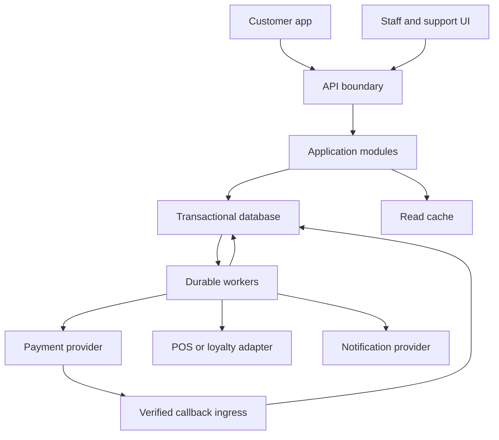
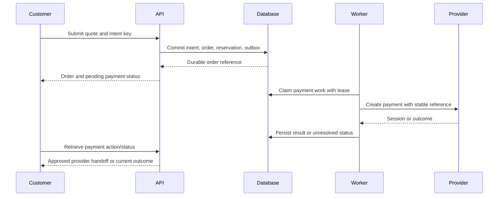

# 04 — Software Design Document

## Coffee Ordering & Rewards App

| Field | Value |
|---|---|
| Document ID | SDD-001 |
| Version / status | 1.0 / Proposed design for engineering review |
| Created / updated | 2026-09-11 |
| Technical owner / product owner | TBD / TBD |
| Inputs | `01-project-brief.md`, `02-prd.md`, `03-ux-ui-specification.md`, each v1.0 |
| Scope | Pickup-first MVP: customer, store, payment, loyalty, and operational services |
| Implementation status | Design only; no codebase, infrastructure, or provider contract inspected |
| Related specifications | Planned `05-database-specification.md` and `06-api-specification.yaml` |

> This document proposes a concrete architecture for the approved-to-be-reviewed MVP described in the preceding documents. It does not claim that this system exists, that a provider supports a capability, or that tests have passed. Product policies remain governed by PRD decisions D-01–D-17. Technology products, runtime versions, hosting, identity method, payment provider, POS ownership, and loyalty authority are unconfirmed. The design uses internal relational transactions plus durable asynchronous work; alternative external sources of truth require the explicit adapter and consistency treatment below.

## 1. Purpose, Goals, and Constraints

The system must let a customer select a store, obtain an authoritative quote, submit one pickup purchase, resolve payment, follow fulfillment, and receive or redeem the approved loyalty benefit. Staff must process eligible orders within their assigned stores. Support must recover incomplete cross-system work without duplicating financial effects.

### 1.1 Design goals

- Preserve transaction correctness through repeated requests, concurrency, process crashes, and delayed external outcomes.
- Keep payment, fulfillment, refunds, and loyalty adjustments separately observable.
- Make authoritative ownership explicit for every writable domain.
- Support an MVP with bounded operational complexity and clear module boundaries.
- Keep irreversible external work out of database transactions while retaining durable intent and recovery information.
- Connect each PRD requirement to a module, API capability, and verification strategy.

### 1.2 Constraints and non-goals

One store per order; pickup only; one initial payment method; one approved loyalty scheme. No delivery dispatch, multi-store checkout, microservice requirement, full ERP replacement, or technology selection is implied. Expected traffic, numerical service objectives, and recovery objectives must be approved before capacity and release acceptance.

## 2. Proposed Architecture Decisions

| ADR | Proposed decision | Rationale / tradeoff | Approval or unresolved detail |
|---|---|---|---|
| ADR-01 | Modular application with separately running background workers | Shared relational transactions simplify core invariants; modules can evolve without separate network services | Engineering review |
| ADR-02 | Transactional relational database is the internal command authority | Supports unique constraints, locking, conditional updates, and atomic outbox records | Engine/version and isolation behavior TBD |
| ADR-03 | Durable outbox/inbox with at-least-once delivery and deduplicated effects | Handles crash windows without claiming exactly-once network delivery | Worker/queue implementation TBD |
| ADR-04 | Server-owned immutable purchase snapshot and explicit quote confirmation | Historical totals survive catalog changes; changed prices require consent | Pricing policy D-09/D-13 |
| ADR-05 | Provider financial evidence is authoritative for payment/refund outcome | Client redirects are not proof; unresolved outcomes require reconciliation | Provider capabilities D-05 |
| ADR-06 | Internal fulfillment authority unless existing POS is selected as sole owner | Prevents dual-writer status conflicts | D-06; external-owner variant in Section 14 |
| ADR-07 | Strongly consistent internal loyalty reservation if internal ledger is selected | Makes concurrent spend safe; external ledger needs provider reservation protocol | D-07 |
| ADR-08 | Stateless request handling; durable intent retained outside client memory | Enables restart/retry recovery and multiple application instances | Session strategy D-04 |
| ADR-09 | Cache only accelerates reads | Cache loss cannot erase purchase evidence or grant financial eligibility | Freshness targets D-16 |
| ADR-10 | Pausing new checkout does not stop reconciliation or existing-order processing | Rollback and incidents must preserve financial obligations | Operational runbook |

All decisions are proposed. Before implementation, record reviewer, chosen alternative if any, date, and impact on downstream contracts.

## 3. Logical Topology and Trust Boundaries

The database-to-worker edge represents durable outbox polling or a relay, not an automatic database notification guarantee. A queue may be added after the outbox; the database remains the source of unsent work. Callback ingress persists verified events for processing. Customer/staff traffic and provider callbacks have distinct authentication rules.

### 3.1 Trust boundaries

| Boundary | Required control |
|---|---|
| Client → API | Transport protection; input validation; authentication where required; ownership/store authorization; rate limits |
| API → database | Restricted credentials and network reachability; parameterized access; transactions |
| Worker → provider | Managed credentials; validated endpoints; bounded timeouts; stable operation identifiers |
| Provider → callback ingress | Verify configured provider authentication/signature over required raw representation; reject mismatch/replay according to contract |
| Support → financial commands | Explicit permission, amount/state checks, reason and audit trail |
| Public assets → client | Controlled uploads/content types; no secrets or private transaction data |
| Analytics/logging | Allowlisted fields; no credentials, raw personal contact, or payment instrument data |

## 4. Module Responsibilities

| Module | Owns | Does not own |
|---|---|---|
| Identity and access | Account lifecycle, sessions, recovery, role/store scope | Provider financial truth |
| Store and catalog | Store eligibility, menu read model, source revisions | Historical order item mutation |
| Cart and quote | Cart validation, deterministic price calculation, expiring quote snapshots | Trusting client totals |
| Checkout | Intent lifecycle, idempotency, order creation, coordination | Treating provider timeout as failure |
| Orders | Fulfillment state, purchase snapshot, history, authorized transitions | Overwriting payment state |
| Payments | Attempts, provider mappings, verified outcomes, reconciliation | Store preparation policy |
| Refunds | Refund reservations/requests, outcomes, refundable totals | Erasing original collection evidence |
| Loyalty | Reservation, consumption, earning, reversal, history or external adapter | Inventing reward economics |
| Notifications | Delivery attempts from committed events | Changing business outcome when delivery fails |
| Operations/support | Exception ownership, permitted repair commands, audit views | Direct untracked database edits |
| Analytics | Deduplicated business-event projections | Source of financial truth |

Module writes go through the owning module's commands. Read models may combine domains, but a joined response does not grant a caller write authority across them.

## 5. Data Ownership and Logical Model

Names below are logical entities, not final table DDL. Final types, keys, indexes, lengths, and migrations belong in `05-database-specification.md`.

| Entity | Important fields / associations | Invariant |
|---|---|---|
| Account / session | Account ID, verified identity, session hash/reference, revocation, expiry | Identity uniqueness under approved normalization; expired/revoked sessions denied |
| Role assignment | Actor, role, store scope | Server enforces current permission |
| Store / catalog projection | Source ID, version, hours/time zone, pause flag, item/options, prices | Source ownership and freshness explicit |
| Cart | Owner/session, store, configured lines, version | Single-store contents; not a confirmed price promise |
| Quote / quote lines | Owner, store, configuration, amount components, currency, source/rule revisions, expiry | Immutable confirmed price basis; expires without becoming a payment failure |
| Checkout intent | Owner, operation key, canonical request hash, quote, lifecycle, order link | Unique owner/operation/key; one order per intent |
| Order / order items | Owner, store, intent, snapshot, totals, fulfillment version/state | Snapshot retained; transition guarded |
| Payment attempt | Order, stable operation reference, amount/currency, provider account/reference, outcome | Unresolved attempt blocks an independent collection attempt |
| Refund request | Payment, operation key, amount, outcome, reason, actor | Confirmed plus reserved refunds cannot exceed collected amount |
| Loyalty reservation | Member, intent, reserved amount/benefit, expiry and resolution | Reserved value cannot be spent again |
| Loyalty ledger / benefit effects | Member, source event, rule version, effect type, amount, reversal link | Unique business effect; append-only correction |
| Inbox event | Provider/account/event ID, receipt time, verification metadata, processing state | Repeated external event has one processing identity |
| Outbox event | Event ID, aggregate/version, type, minimal payload, dispatch state | Written atomically with business state |
| Job / effect receipt | Operation/event ID, consumer, lease, retry metadata, result | Repeated delivery cannot duplicate local effect |
| Exception case | Subject, category, owner, state, next action, timestamps | Unresolved obligations remain discoverable |
| Audit entry | Actor, command, subject, prior/new version/state, reason, correlation | Restricted append-only application path |

### 5.1 Identifiers and amount representation

Use stable opaque internal identifiers and a separate human-readable order reference. IDs are not authorization. Provider identifiers are namespaced by provider and merchant/account/environment.

Represent monetary values with exact decimal arithmetic or integer minor units using the configured currency precision; never binary floating point for authoritative totals. Higher-precision intermediate tax calculations may be necessary. Round only at the approved stages, store rule version and the final components, and use the same algorithm for quote and order validation. No currency, tax rate, or rounding formula from another project is assumed.

Store event timestamps with an unambiguous time basis; retain store time zone for hours, expiry interpretation, and presentation. Do not order all events solely by wall-clock timestamp; use versions/provider reconciliation for causal decisions.

## 6. Core Invariants and Transaction Boundaries

| ID | Invariant | Enforcement |
|---|---|---|
| INV-01 | One checkout intent creates at most one order | Unique intent-to-order relationship plus transaction |
| INV-02 | Same operation key with changed payload cannot change a purchase | Canonical request hash comparison |
| INV-03 | No new collection while an existing attempt is unresolved or succeeded | Locked order payment gate and durable attempt state |
| INV-04 | Authoritative payable total equals accepted quote under approved validity rules | Server quote lookup/revalidation and snapshot |
| INV-05 | An invalid/stale fulfillment transition cannot win | Aggregate version check and transition guard |
| INV-06 | Reserved/consumed rewards cannot exceed eligible available value | Locked ledger/benefit or external atomic reservation |
| INV-07 | Refund exposure cannot exceed collected value | Lock payment; include pending/reserved refunds |
| INV-08 | State change and its outbox/audit record commit together | One local database transaction |
| INV-09 | Replaying a committed business event cannot apply its local effect twice | Consumer receipt and effect written in the same transaction |
| INV-10 | Late payment never silently reopens a terminal order | Payment processing checks fulfillment state and raises resolution |

A database constraint is the final guard for unique relationships; an application-level precheck alone is insufficient. Select a consistent lock order, for example intent → order/payment aggregate → loyalty account/benefit, and apply it across commands. Deadlock retries are bounded and replay only the local transaction; they never blindly replay external calls.

### 6.1 Local transaction scopes

- **Quote creation:** consistent price/eligibility read and immutable quote persistence; no financial effect.
- **Checkout commit:** deduplication, validate quote/current eligibility, internal reward reservation, order snapshot, payment work intent, outbox/audit.
- **Provider-event application:** claim event, lock related aggregate, apply valid financial facts, create downstream outbox/exception, mark inbox applied.
- **Staff transition:** authorize scope, check expected version and policy, transition plus audit/outbox.
- **Refund reservation:** check permission and refundable exposure, reserve amount and enqueue one refund operation.
- **Loyalty adjustment:** unique effect receipt, account/benefit update, append ledger entry, outbox/audit.

Do not hold database transactions open across provider network calls. External authority variants use explicit pending coordination states rather than pretending to share this local atomic transaction.

## 7. Cart, Quote, and Checkout Design

### 7.1 Quote creation

1. Authenticate or resolve the allowed visitor/cart context.
2. Validate store and configured products/options/quantity; reject invalid client values.
3. Read the authoritative catalog/version and approved promotion/reward terms.
4. Calculate price components using the versioned pricing policy.
5. Persist immutable quote with owner, store, configuration, revisions, expiry, and payable currency/amount.
6. Return displayable components and quote ID. Benefit availability is provisional unless an explicit reservation exists.

At submission, verify quote ownership, expiry, configuration, and applicable current eligibility. If changed terms require repricing, return a revised quote for explicit customer confirmation. Do not mutate the previously accepted quote or charge a revised total automatically. D-13 must settle how long a validated price is honored and the treatment of changes after payment initiation.

### 7.2 Checkout idempotency contract

- Client obtains/generates one opaque key per deliberate purchase intent and retains it for retries.
- Key scope includes authenticated principal or secure approved guest context and command type.
- Hash canonical semantic input: quote ID, store, configured purchase, relevant contact/pickup data and selected benefit; exclude volatile trace headers and server timestamps. Define normalization in the API specification.
- Same key/same hash returns the same intent and its latest authoritative state; it need not reproduce stale response bytes.
- Same key/different hash returns a conflict without mutation.
- Concurrent first submissions race against a unique constraint; the loser reads the winning intent after transaction resolution.
- Completed intent/order associations survive response-cache expiry. Do not expire the financial uniqueness guard merely because a short API response cache expires.
- A new key cannot bypass an unresolved payment on the same intent. Independent intentional purchases remain possible; the UI must recover interrupted intent rather than minting another key automatically.

### 7.3 Internal-authority checkout flow

Provider callbacks and reconciliation use Section 8. The worker may create a redirect/session rather than collect money immediately. Session creation is not payment success. Synchronous initiation is an optional optimization only after the same durable commit and with the same recovery path.

If the response is lost after commit, resubmission retrieves the intent. If local commit fails, no outbox payment work exists. If a worker crashes after an external effect but before local persistence, stable provider references and reconciliation resolve the uncertainty.

## 8. Payment, Callbacks, and Reconciliation

### 8.1 Provider adapter contract

| Capability | Required semantics |
|---|---|
| Initiate | Stable merchant operation reference; amount/currency; existing-result recovery or safe deduplication |
| Retrieve | Query by durable reference, including when local provider ID was never persisted |
| Verify event | Provider-specific authentic origin and integrity verification; merchant/environment checks |
| Interpret outcome | Map authorized, captured/settled if relevant, pending, failed, canceled, and expired to explicit internal facts |
| Refund | Stable refund operation reference; status query; limit behavior |
| Reconcile | Query/statement access sufficient to find orphan or delayed financial outcomes |

Provider idempotency retention, lookup consistency, event identifiers, signing keys, replay rules, rate limits, and financial finality must be verified before integration acceptance. If safe deduplication and lookup are absent, do not automatically retry an ambiguous collection/refund: quarantine and reconcile manually. This limits availability rather than claiming a guarantee the provider cannot deliver.

### 8.2 Attempt and aggregate state

Attempt outcomes: `NOT_INITIATED`, `PENDING`, `SUCCEEDED`, `FAILED`; provider authorization/capture facts may add fields after D-05. The aggregate retains every attempt, successful amount, unresolved exposure, and provider evidence. A new failed event cannot erase previous success. Definitive failure is permitted only from trusted provider evidence with defined finality, not a local timeout.

Before a new attempt, lock the order/payment aggregate, ensure no unresolved/successful collection exists, and durably record a new operation. If a provider can contradict a supposedly final failure, D-05 must define the risk and safe retry interval/verification; contradictions become reconciliation exceptions.

### 8.3 Callback ingestion

1. Apply payload size and route limits; select provider/merchant configuration independently of untrusted payload claims.
2. Verify the configured authentication/signature using required raw request representation and approved replay handling.
3. Validate merchant/account, environment, references, amount/currency where applicable, and supported event shape.
4. Insert the event durably with a unique provider/account/event identity. If no stable event ID exists, agree a provider-specific deduplication strategy; do not assume timestamp alone is unique.
5. Return acknowledgement only after durable receipt. Invalid authentication receives rejection; transient persistence failure must not falsely acknowledge success.
6. Process asynchronously with lock/version checks. Duplicate receipt returns safe acknowledgement without another effect.
7. A valid unmatched event remains in an exception/retry state; it is not silently dropped.

Store only necessary payload/evidence under retention policy. A verified signature proves origin, not that a success event applies to the expected merchant, currency, amount, or order.

### 8.4 Applying outcomes

- Match durable merchant reference and provider namespace; validate the expected financial operation.
- For pending evidence, retain uncertainty and next reconciliation time.
- For success, persist evidence and collected amount once. Derive fulfillment eligibility from the approved capture policy.
- If order is terminal/nonfulfillable, retain success and create financial resolution; do not reopen fulfillment.
- If evidence conflicts with stored facts, retrieve authoritative status and raise an exception rather than processing messages by arrival order.
- Publish committed outcome events via outbox, then notify/update projections.

### 8.5 Reconciliation loops

| Scan | Detection | Resolution |
|---|---|---|
| Pending attempts | Age beyond configured threshold | Query provider with stable reference; retry boundedly; escalate |
| Provider-side outcomes | Payment missing/mismatched locally | Link verified evidence or create owned exception |
| Terminal orders with collected amount | Missing refund/approved settlement decision | Route to authorized financial workflow |
| Pending refunds | Unknown or delayed refund outcome | Query before any further refund operation |
| Orphan inbox events | Reference temporarily unknown | Re-match after dependencies arrive; escalate on limit |
| Internal/provider totals | Amount/count discrepancy by approved reporting period | Investigate explicit cases; do not overwrite ledger totals blindly |

Cadence, lookback window, provider settlement lag, escalation thresholds, and owner are D-05/D-12/D-14 gates. Reconciliation must include late events beyond normal UI wait time.

## 9. Fulfillment and Concurrency

### 9.1 Proposed transitions

| Current | Next | Guard |
|---|---|---|
| Submitted | Accepted | Assigned staff; payment eligible; expected version matches |
| Submitted | Rejected | Authorized actor and approved reason |
| Submitted | Canceled | Approved cancellation/expiry policy; financial obligations retained |
| Accepted | Preparing | Assigned staff; current version |
| Accepted | Canceled | Only approved policy allows it |
| Preparing | Ready for pickup | Assigned staff |
| Ready for pickup | Completed | Authorized collection verification |
| Completed / Rejected / Canceled | No ordinary next fulfillment state | Separate support/financial adjustment only |

No-show, post-preparation cancellation, and capture-before/after-acceptance policy remain D-08/D-05. Zero-total eligibility must be explicit and not fabricated as a provider payment.

### 9.2 Transition command

Input includes order ID, desired command, expected version, reason if required, and idempotency key for consequential actions. Server resolves actor and scope, locks/conditionally updates the order, verifies current state, increments version, and writes history/audit/outbox atomically. A repeated successful command returns its outcome; a stale conflicting command returns current state and permitted actions.

Cancellation and acceptance race through this same authority. The losing transaction cannot independently schedule a conflicting fulfillment effect. Paid rejection/cancellation schedules a policy-governed financial resolution, not an optimistic “refunded” label.

### 9.3 Read behavior

Order detail returns fulfillment, payment, refund, and loyalty states separately, version, and last-updated information. History uses a stable cursor such as creation time plus unique ID, scoped by owner. Reads after a command use an authoritative or suitably consistent source; asynchronous replicas cannot be allowed to imply the command disappeared.

## 10. Refund Design

1. Authorize role/store/payment access and approved reason/policy.
2. Lock payment aggregate. Calculate remaining capacity as collected amount minus succeeded refunds minus unresolved/reserved refund amounts.
3. Validate requested exact amount/currency and unique refund intent; reject excessive or conflicting request.
4. Commit refund reservation/request and outbox event together.
5. Worker calls provider using stable refund operation reference outside the transaction.
6. Apply verified outcome or retain pending. On ambiguous timeout, keep reservation; do not release capacity for another refund.
7. Release reserved capacity only on definitively failed/nonexecuted outcome according to provider contract. Persist success and downstream adjustment events once.
8. Reconcile disagreements and late success. A failed notification does not change refund status.

Partial refunds are enabled only if D-08 and the provider contract support them. Allocation to items/tax/rewards requires explicit rules; it is not inferred from an arbitrary amount. Refund arrival promises belong to approved customer policy, not worker timeout settings.

## 11. Loyalty Design

### 11.1 Internal authority baseline

Maintain an append-only effect ledger or explicit coupon lifecycle with atomic reservations. Balance is derived from or transactionally maintained alongside effects; periodically compare projection and source ledger. Reward economics are D-07, not hardcoded here.

| Operation | Guard and atomic effect |
|---|---|
| Reserve | Lock member/benefit, verify eligibility/expiry/available value, create intent-bound reservation |
| Consume | Same reservation/business operation can consume once; persist effect and receipt |
| Release | Release only unconsumed reservation after checkout resolution permits it |
| Earn | Approved qualifying event plus rule version produces one effect |
| Reverse | Link to original effect; enforce cumulative reversal bounds; preserve original history |

Do not release a reward reservation solely because a client timer expired while payment is unresolved. Resolve payment first or retain an explicit obligation that prevents overspend; D-13 defines the exact policy. If a late outcome conflicts with released value, route the order to exception handling rather than spending someone else's now-allocated value.

Proposed earning trigger is committed collection completion, pending D-07 approval. If loyalty processing fails after completion, fulfillment stays Completed and the outbox/job retries. Stable effect identity includes original qualifying event and effect type; a rule-version change alone must not grant the same reward again.

### 11.2 External authority variant

Use provider-supported atomic reserve/consume/release and stable operation lookup. Local balance is a display projection only. Create a durable coordinator intent before external reservation; record unknown outcomes; do not initiate collection until the required reservation is confirmed. Compensate with release only after order/payment resolution allows it.

If the external service cannot reserve safely under concurrency, redesign the redemption flow or defer redemption through explicit scope approval. A local mutex or cached external balance cannot prevent spending through other channels.

### 11.3 Reversal policy gates

D-07/D-08/D-13 must specify cancellation restoration, refund allocation, partial reversal, expiry on restoration, already-spent earnings, negative balances/debt handling, stacking, and zero-total eligibility. The ledger supports adjustments but does not decide these business rules.

## 12. Durable Work and Event Processing

### 12.1 Outbox and worker mechanics

- Business state and outbox event commit in the same database transaction.
- Poller claims eligible work with lease/expiry and an attempt token; commit the claim before external work.
- Lease expiry permits recovery after a crash. Local completion uses the current claim token to prevent a stale worker overwriting a newer claim.
- A lease alone cannot stop a paused old worker from making an external request. Stable external operation keys and reconciliation remain necessary.
- Queue delivery, if used, is at least once. Acknowledgement occurs after durable consumer result, not before.
- Local consumer effect and receipt commit together with a unique `(consumer, event)` identity.
- External effects use stable operation references and status lookup; local receipts alone cannot guarantee no duplicate external effect.
- Preserve aggregate version/event reference. Consumers reject inappropriate regressions and fetch current facts when ordering is uncertain.

### 12.2 Retry and failure classification

| Class | Behavior |
|---|---|
| Temporary transport/service limit | Bounded retry with backoff/jitter and provider guidance |
| Ambiguous financial timeout | Query/reconcile stable operation first; no blind new collection/refund |
| Invalid input/policy | Permanent failure; actionable error, no automatic retry |
| Authentication/configuration | Alert owner; stop repeated failing calls until corrected |
| Unknown event mapping | Quarantine with evidence and owner; no guessed state |
| Exhausted attempts | Retain durable exception/dead-letter entry; alert; replay only through reviewed safe command |

Configure retry count, elapsed-time limit, queue age threshold, concurrency, and lease duration from measured latency/provider limits. None are production-approved in this draft. Purging exhausted jobs must not delete the underlying obligation.

### 12.3 Notifications and analytics

Consumers process committed business events. Notification deduplication uses event/channel/recipient identity; providers may still duplicate visible delivery, so links always retrieve current state. Never retry forever or block orders on delivery. Analytics uses event identity and excludes sensitive fields; financial reports use transaction records, not browser events.

## 13. API and Client Contract Outline

Paths are proposals for `06-api-specification.yaml`, not an implemented or approved API. Authentication method and versioning must be finalized there.

| Capability | Proposed route | Notes |
|---|---|---|
| Account / sessions | `/v1/accounts`, `/v1/sessions`, `/v1/recovery` | Method-specific identity policy TBD |
| Profile / deletion request | `/v1/me`, `/v1/me/deletion-requests` | Ownership and verification |
| Stores / catalog | `/v1/stores`, `/v1/stores/{id}/menu` | Public/visitor policy; version/freshness |
| Quote | `POST /v1/quotes` | Server-calculated immutable quote |
| Checkout | `POST /v1/checkout-intents` | Idempotency key required |
| Intent status | `GET /v1/checkout-intents/{id}` | Owner-scoped recovery; current state |
| Order detail/history | `/v1/orders/{id}`, `/v1/me/orders` | Separate state dimensions; stable cursor |
| Cancel request | `POST /v1/orders/{id}/cancellation-requests` | Policy/state/version check |
| Rewards | `/v1/me/rewards`, `/v1/me/reward-history` | Scheme-dependent schema |
| Store commands | `/v1/staff/orders/{id}/transitions` | Scope, version, command key |
| Availability | `/v1/staff/stores/{id}/availability` | Authoritative-owner mapping |
| Refund request | `POST /v1/support/payments/{id}/refunds` | Financial permission and reservation |
| Provider events | `POST /v1/integrations/payments/{provider}/events` | Provider authentication; no customer session |

### 13.1 Response semantics

Return correlation ID, resource/intent reference where available, current state, field errors when applicable, and safe retry guidance. Validation/quote-change/conflict/authentication/authorization/service-unavailable conditions must be distinguishable. Pending durable work may use an accepted response and status resource; transport success never means payment success.

Client retains the intent key across interrupted submit and uses status retrieval. Backend computes allowed actions as a UI aid but rechecks commands. Error messages do not expose private record existence unnecessarily. API field naming, status codes, length limits, cursor format, and examples are finalized in the API spec.

## 14. Catalog and POS Integration

Choose one owner for store eligibility, price, availability, and fulfillment. An external owner publishes projections or answers validation requests; local screens cannot silently override it.

### 14.1 Catalog synchronization

Use source identifiers, revision/checkpoint, and last-successful sync time. Apply batches with consistent visibility so checkout does not price against half an update. Track removals as unavailability without deleting historical order snapshots. If freshness exceeds policy, block affected checkout or retrieve authority according to D-16; stale cache is not sufficient evidence.

A boolean available flag does not guarantee physical stock. If finite-stock reservation is required, define an authoritative reserve/release protocol before promising stock. Otherwise store rejection and financial resolution remain explicit accepted operational risks.

### 14.2 External fulfillment owner

If POS owns transitions, the app sends commands with stable correlation and represents submission as pending until the POS acknowledges. Verified external events/query results update the local projection with ordering/version guards. Do not independently accept/cancel locally while POS may make the opposite decision. Timeouts require lookup/reconciliation. If POS lacks safe command retry or ownership semantics, resolve feasibility before implementation approval.

Store-specific price/availability overrides must have a documented precedence policy. This design does not assume any existing BROWN, LS, database schema, or legacy status codes apply.

## 15. Security and Privacy Design

### 15.1 Identity and authorization

Use the selected identity provider or approved application authentication scheme; no custom cryptographic protocol is proposed. If passwords are used, use an appropriate maintained password-hashing implementation and reset/recovery design validated at implementation. If bearer sessions are used, define expiry, revocation and refresh behavior. If browser cookies are used, define protected cookie attributes and CSRF controls. Final mechanism and current library selection require technical verification at implementation time.

Every protected read/write resolves principal from trusted authentication, not a submitted user ID. Enforce owner and assigned-store scope server-side, including search, exports, links, and support views. Privileged configuration/refunds require explicit permission and audit. Rate-limit verification/recovery and sensitive commands under approved thresholds.

### 15.2 Data handling

- Minimize stored profile/contact fields and isolate secrets in the deployment's managed secret mechanism.
- Protect database/backups and transport according to the approved environment; restrict operational access.
- Do not store raw payment instrument credentials; prefer provider-managed collection interfaces.
- Allowlist log/event attributes; redact authorization headers, verification codes, payment secrets, and personal free text.
- Parameterize data access and encode displayed user content; validate upload/content types if asset uploads are introduced.
- Account deletion is a tracked workflow: authenticate, record request, apply active-obligation policy, revoke access at the approved step, delete/anonymize eligible data, retain only justified transaction records, acknowledge accurately.
- Retention, legal/business basis, consent, and deletion timelines are D-15 decisions; this draft makes no jurisdiction-specific compliance claim.

### 15.3 Threat-oriented verification

Test identifier tampering, cross-store commands, replayed callbacks, forged amount/currency, duplicate requests, excessive refund, reward overspend, stale sessions, leaked log fields, and inaccessible recovery flows. Security controls must be exercised, not inferred from UI restrictions.

## 16. Deployment, Configuration, and Recovery

### 16.1 Runtime units

API instances; worker instances; transactional database; optional read cache/queue; asset delivery; monitoring; provider connections. These are logical units and may use managed services or existing approved infrastructure. API state is not tied to one process. Workers need graceful shutdown and durable lease recovery.

### 16.2 Environment separation

Development, test/UAT, and production have distinct credentials, callback endpoints, database state, provider merchant/sandbox configuration, and notification destinations. Startup validation rejects incomplete or mismatched critical configuration. Configuration contains references to secrets, not committed secret values.

Required categories: identity policy; currency/pricing/rule revision; provider identity/endpoints; intent retention; quote expiry; retry/lease limits; reconciliation cadence; data retention; observability; store/time-zone configuration. Numeric values require owner review.

### 16.3 Release order

1. Verify backups and migration compatibility.
2. Apply additive/backward-compatible schema changes and indexes with assessed operational impact.
3. Deploy code able to read old/new records during transition.
4. Enable workers/events only when consumers understand the schema version.
5. Verify authenticated smoke journey and pending-operation recovery in the approved production procedure.
6. Enable pilot checkout and monitor before expansion.
7. Remove obsolete fields/contracts only in a later migration after old versions/work are drained.

Do not run irreversible cleanup as an automatic code rollback. Roll back to a compatible binary or forward-fix; keep provider callbacks/reconciliation operational. Disable new checkout independently from existing obligations.

### 16.4 Backup/restore

RPO, RTO, backup frequency, retention, encryption, restore environment, and owner are D-14 gates. After restore, reconcile provider financial activity beyond the restored checkpoint, deduplicate replayed events, inspect worker leases, and recover missing external outcomes before resuming collection. A restored database alone does not reverse money moved externally.

## 17. Observability and Capacity

| Signal | Purpose / action |
|---|---|
| Quote/submit/status latency and error categories | Detect degraded critical journey; separate external wait time |
| Pending payment/refund age | Identify unresolved money movement |
| Outbox age, failed jobs, lease churn | Detect stuck durable work |
| Unmatched/invalid callback counts | Detect mapping/configuration or abuse issues |
| Order acceptance/ready age | Route store operational delays |
| Reconciliation mismatch count and age | Track financial correctness obligations |
| Loyalty reservation age and failed adjustments | Detect blocked value and reward discrepancies |
| Catalog sync age | Enforce freshness policy |
| Database contention/deadlocks/connections | Identify scaling/locking bottlenecks |
| Duplicate operation suppression/conflicts | Inspect client retry behavior and invariant enforcement |

Use request/intent/order/provider-operation/event correlation without sensitive payload logging. Alerts have severity, owner, runbook, and deduplicated routing. Support dashboards distinguish business refusal from technical failure.

Capacity plan must specify concurrent customers, peak orders/minute, stores, line-item sizes, worker throughput, provider limits, and growth horizon. Benchmark realistic contention and recovery bursts, not only isolated reads. Scale API/workers within database/provider limits; preserve aggregate serialization. Cache invalidation/freshness and replica lag require measurement. No unmeasured throughput or latency promise is made here.

## 18. Failure Matrix and Verification Strategy

| Failure scenario | Required outcome | Verification evidence |
|---|---|---|
| Submit twice concurrently | One intent/order; same recovery reference | Race test against actual database constraints |
| Reuse key with changed payload | Conflict, no mutation | API integration case |
| Crash before local commit | No payment work dispatched | Transaction fault injection |
| Crash after commit before response | Intent retrieved; no extra order | Retry/restart case |
| Worker crashes after provider execution | Query/replay same operation safely | Adapter sandbox/contract test |
| Callback repeated or reordered | One effect; no state regression | Event replay tests |
| Callback storage fails | No false acknowledgement | Persistence failure test |
| Two staff transitions race | One valid winner; conflict returned | Version/lock test |
| Two reward redemptions race | No overspend | Ledger or external reservation test |
| Refund attempts overlap | Pending plus successful exposure bounded | Concurrency test |
| Payment success after cancellation | Financial exception; order remains terminal | Late-event case |
| Loyalty/notification fails | Fulfillment retained; durable retry | Worker fault/replay |
| Catalog stale or changes | Block/requote under policy; no silent total change | Freshness/revalidation case |
| Database restored behind provider | Reconciliation recovers financial evidence | Restore rehearsal |
| Cross-account/store identifiers | Access denied, no data leak | Authorization matrix |

Use unit tests for pure pricing/transitions, integration tests for transaction invariants, adapter contract tests for provider behavior, end-to-end UX scenarios for PRD outcomes, and resilience tests for crash windows. Release evidence must name build, configuration, database/provider test environment, and unresolved risks. None of these tests has been executed by this document-generation task.

## 19. PRD and UX Traceability

| Requirement | Owning design | UX |
|---|---|---|
| REQ-ACC-001 | Identity/session/recovery; Section 15 | C11, C12 |
| REQ-ACC-002 | Profile/deletion workflow; Sections 5, 15 | C13, C14 |
| REQ-STR-001 | Store authority/freshness; Section 14 | C01, C02, C05 |
| REQ-MNU-001 | Catalog projection/cache; Sections 4, 14 | C02 |
| REQ-MNU-002 | Server configuration validation; Section 7 | C03 |
| REQ-CART-001 | Single-store cart and validated configuration; Section 7 | C03, C04 |
| REQ-PRICE-001 | Immutable quote/exact arithmetic; Sections 5, 7 | C04, C05 |
| REQ-CHK-001 | Intent uniqueness/transaction/outbox; Sections 6, 7 | C05, C06 |
| REQ-PAY-001 | Provider adapter/verified outcomes; Section 8 | C06, C07 |
| REQ-PAY-002 | Durable unknown-state recovery/reconciliation; Section 8 | C06, C08, C09 |
| REQ-ORD-001 | Snapshot and owner-scoped query; Sections 5, 9 | C07, C08 |
| REQ-ORD-002 | Guarded fulfillment state/version; Section 9 | C08, S02 |
| REQ-ORD-003 | Stable owner-scoped pagination; Section 9 | C09 |
| REQ-ORD-004 | Race-safe cancellation/refund reservation; Sections 9, 10 | C08, S02, S04 |
| REQ-LOY-001 | Ledger/benefit projection; Section 11 | C10 |
| REQ-LOY-002 | Atomic reservation and unique effects; Section 11 | C05, C10 |
| REQ-NTF-001 | Committed-event notification consumer; Section 12 | C08, C13 |
| REQ-OPS-001 | Authorized/versioned commands; Sections 9, 14 | S01, S02 |
| REQ-OPS-002 | Availability source and pause gate; Section 14 | S03 |
| REQ-SUP-001 | Exceptions, audit, reconciliation; Sections 8, 10, 17 | S04 |

NFR-01–03 map to Section 15; NFR-04–06 to Section 17; NFR-07 to Sections 12/16/18; NFR-08–09 to UX and API/client contracts; NFR-10 to Section 17; NFR-11 to Section 15; NFR-12 to Sections 7/14. UI accessibility remains specified in `03-ux-ui-specification.md` and must be verified on the chosen platform.

## 20. Decisions, Handoff, and Approval

### 20.1 Blocking design decisions

| Decision | Owner | Must resolve before |
|---|---|---|
| Database/runtime/deployment products and supported versions | Technical Lead | Implementation baseline |
| D-04 identity/guest/session policy | Product / Engineering | Account/API design acceptance |
| D-05 provider idempotency, lookup, capture, financial finality | Finance / Engineering | Payment implementation acceptance |
| D-06 catalog and fulfillment source ownership | Operations / Engineering | Schema/integration freeze |
| D-07 loyalty authority and full economics | Loyalty / Engineering | Redemption/earning acceptance |
| D-08 exception/refund/no-show/collection policies | Operations / Finance | State-model acceptance |
| D-09/D-13 pricing, expiry, reward release, zero total | Product / Finance / Loyalty | Quote/checkout acceptance |
| D-11/D-14 capacity, SLOs, RPO/RTO, retries, escalation | Engineering / Operations | Performance/resilience gates |
| D-15 retention/deletion/access policy | Product / accountable privacy owner | Data design acceptance |
| D-16/D-17 freshness and notification contracts | Product / Operations | Client/integration acceptance |

### 20.2 Next specification outputs

`05-database-specification.md`: entity definitions, authoritative keys, constraints, exact monetary types, history/ledger retention, lock/index strategy, migration and restore implications.

`06-api-specification.yaml`: request/response schemas, authentication, operation-key scope, canonicalization, version conflicts, error taxonomy, pending status resources, pagination, callback schemas, and worked success/failure examples.

`07-delivery-plan.md`: engineering tasks with requirement/ADR IDs, dependencies, estimates, and decision gates. Test/deployment/runbook documents must carry the failure and recovery obligations into actual release evidence.

### 20.3 Review checklist

- [ ] One authoritative owner chosen for each domain.
- [ ] Provider safe retry and status lookup demonstrated, or ambiguous operations routed to manual resolution.
- [ ] Internal transaction constraints and external coordination paths reviewed.
- [ ] Payment, refund, and loyalty unknown outcomes retain obligations.
- [ ] Pricing and state-policy examples approved.
- [ ] Security, data retention, and operational access reviewed.
- [ ] Numerical capacity/recovery targets assigned and testable.
- [ ] Database and API specs align with this design.
- [ ] Fault, concurrency, and restore evidence exists before production approval.

| Approval | Reviewer | Status / date |
|---|---|---|
| Architecture and feasibility | Technical Lead — TBD | Pending / — |
| Product-policy alignment | Product Owner — TBD | Pending / — |
| Financial integration and recovery | Finance Owner — TBD | Pending / — |
| Store/POS operating model | Operations Lead — TBD | Pending / — |
| Testability and failure coverage | QA Owner — TBD | Pending / — |
| Deployment/recovery readiness | Operations/DevOps — TBD | Pending / — |

| Version | Date | Change |
|---|---|---|
| 1.0 | 2026-09-11 | Initial proposed modular architecture, transaction boundaries, integration recovery, security, operations, and traceability |

Approval of the design is separate from implementation verification and production go/no-go. Changes to authority, provider semantics, or financial invariants require coordinated updates to this SDD, database/API specs, and relevant tests.
