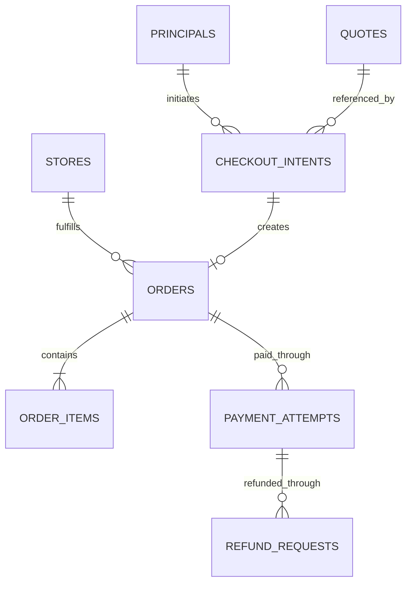
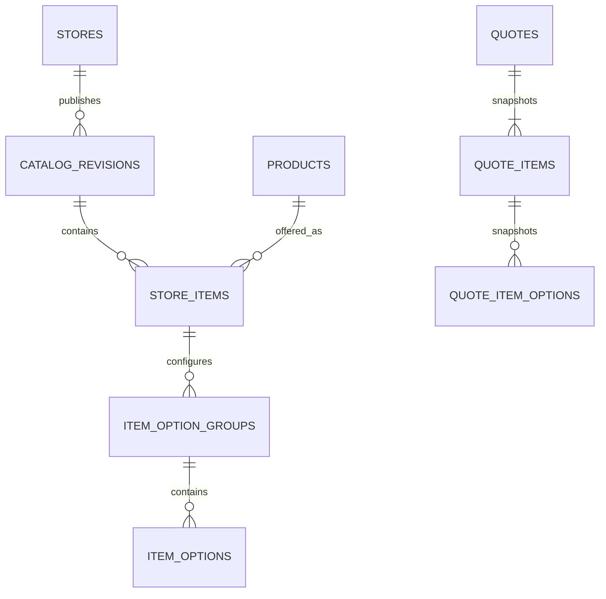
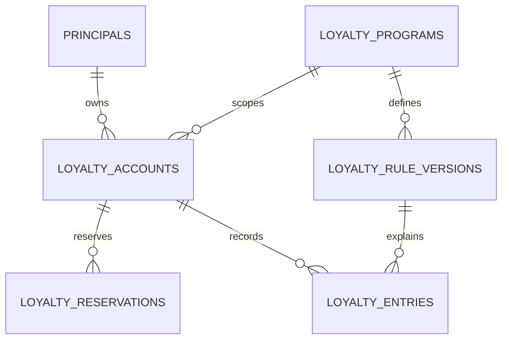

# 05 — Database Specification

## Coffee Ordering & Rewards App

| Field | Value |
|---|---|
| Document ID | DB-001 |
| Version / status | 1.0 / Proposed schema for engineering review |
| Created / updated | 2026-09-11 |
| Owner | Technical Lead / Database Owner — TBD |
| Inputs | Project brief, PRD, UX/UI specification, and SDD, each v1.0 |
| Architecture baseline | SDD ADR-02: transactional relational database; internal command authority |
| Engine / version | TBD; logical SQL types below require engine-specific mapping |
| Implementation status | Specification only; no database inspected, created, or altered |
| Next artifact | Planned `06-api-specification.yaml` |

> This specification defines a proposed new schema, not an alteration of an existing BROWN or other legacy database. It implements the internal-authority SDD baseline. External POS, identity, and loyalty authority variants are identified explicitly. Engine selection, policy decisions, provider contracts, and production limits remain approval gates. The dictionaries are reviewable logical definitions; executable DDL must follow engine selection and verification of constraint, collation, isolation, and index behavior.

## 1. Scope and Authority

Cover accounts and access, catalog revisions, carts, immutable quotes and order snapshots, checkout idempotency, payments, refunds, loyalty, durable work, audit, exceptions, retention, and recovery.

One owner writes each domain. Internal order commands own fulfillment unless D-06 selects POS as sole authority. Provider evidence owns financial outcomes. Internal loyalty tables are authoritative only if D-07 selects the internal ledger; otherwise they hold coordination and projections under the adapter contract in Section 13.

No delivery, procurement, complex campaigns, subscriptions, or unrelated merchant marketplace tables are included. Optional search infrastructure is outside this baseline.

## 2. Schema Conventions

### 2.1 Logical types

| Alias | Proposed logical representation | Rule |
|---|---|---|
| ID | Opaque generated identifier, up to 36 ASCII characters | Nonsemantic PK; UUID-style generation proposed; engine storage form TBD |
| STR(n) | Unicode variable-length string up to n characters | Exact bytes/collation/index limits verified for chosen engine |
| CODE(n) | Restricted machine code up to n ASCII characters | Case-sensitive or canonicalized explicitly; no locale-sensitive identifier comparison |
| INT64 | Signed 64-bit integer | Monetary/rule bounds must prevent overflow |
| INT | Integer | Bounds stated per field |
| DECIMAL(24,8) | Exact fixed-point decimal | Intermediate pricing only; scale/precision review required |
| BOOL | Boolean | Engine mapping explicit |
| TS | Timestamp with microsecond precision, representing UTC | Session/database time-zone behavior tested |
| DATE / TIME | Calendar date / local wall-clock time | Only with named store time zone where relevant |
| JSON | Validated structured JSON | Schema version required for evolving payloads; not the sole store for constraints |
| TEXT | Unicode long text | Input size limit enforced in API/schema policy |
| DIGEST | 64-character hex digest or equivalent binary bytes | Algorithm/version documented; never plaintext secret |

All listed columns are **NOT NULL unless suffixed `?`**. An arrow denotes a foreign key to the referenced table's `id` unless stated otherwise. Every table has `id ID PK` unless a composite PK is explicitly stated. Mutable tables have `created_at TS`, `updated_at TS`, and `version INT64 >= 1`. Immutable snapshots/effects/events have `created_at TS` and explicitly listed lifecycle fields; payload corrections use a new revision/effect. Use database-enforced keys/checks when supported and verify behavior; application validation supplements them.

Proposed lengths are design bounds, not provider guarantees. Validate actual provider ID sizes before finalizing DDL. Never truncate external references.

### 2.2 Relationship and deletion policy

Foreign keys default to RESTRICT/NO ACTION for business evidence. Cascades are permitted only for disposable cart children during authorized cleanup, and only if the migration specifies them. Do not cascade account deletion into orders, payments, refunds, ledger entries, or audit.

Use explicit nullable account references only where anonymization is approved. A retained principal tombstone or pseudonymous subject must preserve uniqueness and ownership history without exposing deleted profile data. Application authorization must not treat an anonymized record as publicly accessible.

### 2.3 Shared reference data

- `currencies(code CODE(3) PK, exponent INT 0..8, enabled BOOL)`: proposed supported-currency registry. Actual allowed currencies/exponents D-09. Amounts within one operation use one currency and exponent snapshot.
- Status/command values are constrained via approved lookup tables or engine checks. Free-form text cannot introduce a new financial state.
- Monetary final amounts are `INT64` minor units. Unit multiplication and sums use checked exact arithmetic; intermediate amounts may use `DECIMAL(24,8)` before approved rounding. No binary floating point.
- Public order reference has a unique key and is separate from PK. Knowing a reference never grants access.
- Store hours use a named time-zone identifier; UTC event timestamps retain unambiguous instant semantics.

## 3. ERD Overview

Diagrams show core persisted relationships. Polymorphic event subjects and external-provider associations are described in the dictionaries rather than drawn as nonexistent foreign keys.

### 3.1 Purchase records

A quote may appear on multiple attempted intents; the quote consumption guard allows at most one committed order from that quote. A new intentional purchase requires a new quote.

### 3.2 Catalog and snapshots

### 3.3 Internal loyalty

The final reward scheme selects scalar units or coupon benefits; Section 10 defines both alternatives without enabling two schemes implicitly.

## 4. Identity and Store Tables

### 4.1 `principals` — security subject, mutable

| Column | Type | Meaning / constraint |
|---|---|---|
| kind | CODE(16) | MEMBER, STAFF, SERVICE; GUEST only if approved |
| status | CODE(24) | ACTIVE, SUSPENDED, DELETION_PENDING, CLOSED |
| external_identity_namespace? | STR(100) | Selected identity system |
| external_identity_subject? | STR(255) | Unique with namespace when present |
| closed_at? | TS | Closure recorded without cascading history |

Required unique external identity pair, where non-null; both fields must be null or non-null together. Closed subjects cannot authenticate. Guest claim/merge is not implemented until D-04 defines it.

### 4.2 `profiles` — personal data, mutable

`principal_id ID → principals UNIQUE`, `display_name? STR(200)`, `contact_channel? CODE(16)`, `contact_value? STR(255)`, `contact_verified_at? TS`, `locale? CODE(35)`.

Contact normalization/uniqueness is D-04. Login identity uniqueness belongs to the identity mechanism, not an arbitrary display contact. Pending identity change must not overwrite verified contact; use the identity provider or a separate verified-change record.

### 4.3 `sessions` — only for application-managed sessions, mutable

`principal_id → principals`, `token_digest DIGEST UNIQUE`, `expires_at TS`, `revoked_at? TS`, `last_used_at? TS`, `credential_version INT >= 1`.

Store no raw bearer token. Recovery/verification challenges, if application-managed, require their own hashed-secret record with purpose, subject, expiry, attempt counter, consumed time, and unique use guard; exact identity method is D-04. Do not create an unused password/challenge store when an external identity provider owns it.

### 4.4 `role_assignments` — mutable

`principal_id → principals`, `role_code CODE(40)`, `scope_key CODE(80)`, `store_id? → stores`, `revoked_at? TS`.

Unique `(principal_id, role_code, scope_key)`. Scope is explicit, e.g. STORE with a non-null store versus GLOBAL with no store; choose a normalized `scope_key` to avoid relying on nullable unique semantics. Global access is a separately permitted role, not a missing-store wildcard. A revoked assignment can be reactivated with audit, rather than duplicated.

### 4.5 `account_deletion_requests` — mutable

`principal_id → principals`, `operation_key CODE(128)`, `status CODE(24)`, `requested_at TS`, `acknowledged_at? TS`, `completed_at? TS`, `policy_version CODE(40)`, `resolution_code? CODE(40)`.

Unique `(principal_id, operation_key)`. Status RECEIVED, REVIEW_REQUIRED, PROCESSING, COMPLETED, REJECTED under approved policy. Additional active-request uniqueness uses a principal lock/active-request pointer or engine-supported conditional constraint. Retention grounds and active-obligation rules are D-15.

### 4.6 `stores` — mutable

`source_namespace CODE(80)`, `source_store_id STR(128)`, `name STR(200)`, `address TEXT`, `time_zone STR(64)`, `ordering_status CODE(20)`, `current_catalog_revision_id? → catalog_revisions`, `source_version? STR(128)`.

Unique source pair. Ordering status ACTIVE, PAUSED, CLOSED_FOR_ORDERING, DISABLED is separate from operating-hours evaluation. The active revision must belong to the same store; enforce composite reference or guarded transaction. Index `ordering_status` only if list-query selectivity warrants it.

### 4.7 `store_hours` and `store_hour_exceptions` — mutable

`store_hours`: `store_id → stores`, `weekday INT 0..6`, `interval_no INT >= 1`, `opens_at TIME`, `closes_at TIME`, `closes_next_day BOOL`; unique `(store_id, weekday, interval_no)`.

`store_hour_exceptions`: `store_id → stores`, `local_date DATE`, `closed BOOL`, `interval_no INT >= 1`, `opens_at? TIME`, `closes_at? TIME`, `closes_next_day BOOL`; unique `(store_id, local_date, interval_no)`.

Closed exceptions have null times; open intervals have both. Multiple intervals cannot overlap under the service validator. Exception precedence, overnight intervals, and daylight-saving behavior are tested in the selected time-zone implementation. Do not store “open now” as permanent truth.

## 5. Catalog Tables

### 5.1 `products` — stable identity, mutable

`source_namespace CODE(80)`, `source_product_id STR(128)`, `lifecycle_status CODE(16)`; unique source pair. Descriptive/price data used to quote resides in immutable published revision rows, not mutable identity alone.

### 5.2 `catalog_revisions` — immutable contents with lifecycle metadata

`store_id → stores`, `source_revision STR(128)`, `status CODE(16)`, `published_at? TS`, `source_observed_at TS`, `import_completed_at? TS`, `content_digest? DIGEST`.

Unique `(store_id, source_revision)`. BUILDING → PUBLISHED or FAILED; immutable content after publication. Stage all children, validate completeness, then atomically switch `stores.current_catalog_revision_id`. Failed imports never replace active contents. Catalog cleanup must respect references and retention.

### 5.3 `store_items` — immutable revision row

`catalog_revision_id → catalog_revisions`, `product_id → products`, `source_item_id STR(128)`, `category_code CODE(80)`, `category_name STR(200)`, `name STR(200)`, `description? TEXT`, `image_reference? STR(1000)`, `currency_code → currencies.code`, `base_price_minor INT64 >= 0`, `available BOOL`, `sort_order INT`.

Unique `(catalog_revision_id, source_item_id)`. Index `(catalog_revision_id, category_code, sort_order, id)` for menu listing. Availability is the revision snapshot; a live source/override gate may additionally block checkout. A price is not proof of physical stock reservation.

### 5.4 `item_option_groups` and `item_options` — immutable revision children

`item_option_groups`: `store_item_id → store_items`, `source_group_id STR(128)`, `label STR(200)`, `min_selections INT >= 0`, `max_selections INT >= min_selections`, `sort_order INT`; unique `(store_item_id, source_group_id)`.

`item_options`: `group_id → item_option_groups`, `source_option_id STR(128)`, `label STR(200)`, `price_delta_minor INT64`, `available BOOL`, `sort_order INT`; unique `(group_id, source_option_id)`.

Signed deltas are allowed only under approved pricing rules; resulting unit price cannot be negative. Currency inherited from store item. Complex option dependencies are either rejected as unsupported or represented by versioned validated rules; do not silently assume every group can combine with every other group.

### 5.5 `availability_overrides` — conditional internal authority, mutable

`store_id → stores`, `product_id → products`, `available BOOL`, `reason_code CODE(40)`, `changed_by → principals`, `effective_at TS`, `expires_at? TS`; unique `(store_id, product_id)`.

Create only if D-06 permits local overrides. Effective availability follows an approved precedence rule. Store lock/version or equivalent coordinated gate serializes local pause/override changes with checkout validation; source sync is not a transaction shared with an external POS.

## 6. Cart and Quote Tables

### 6.1 `carts` — mutable, disposable

`principal_id → principals`, `store_id → stores`, `status CODE(16)`, `expires_at TS`.

Status ACTIVE, ABANDONED, CONVERTED. Proposed one active cart per principal implemented by `principal_cart_slots(principal_id PK/FK, cart_id UNIQUE FK)` rather than a nullable/conditional uniqueness assumption. Cart persistence and anonymous-to-member handling D-04/D-16.

### 6.2 `cart_items` / `cart_item_options` — mutable

`cart_items`: `cart_id → carts`, `line_no INT >= 1`, `product_id → products`, `quantity INT > 0`, `configuration_digest DIGEST`; unique `(cart_id, line_no)`.

`cart_item_options`: `cart_item_id → cart_items`, `source_group_id STR(128)`, `source_option_id STR(128)`, `selection_quantity INT > 0`; unique `(cart_item_id, source_group_id, source_option_id)`.

Digest can support merging identical configurations but is not the sole correctness check. Upper quantity limits D-13/API contract. No cart value is authoritative payable price.

### 6.3 `quotes` — immutable commercial snapshot

`principal_id → principals`, `store_id → stores`, `catalog_revision_id → catalog_revisions`, `currency_code → currencies.code`, `currency_exponent INT`, `pricing_rule_version CODE(80)`, `configuration_digest DIGEST`, `issued_at TS`, `expires_at TS`, `items_subtotal_minor INT64 >= 0`, `discount_minor INT64 >= 0`, `tax_added_minor INT64 >= 0`, `tax_included_minor INT64 >= 0`, `fee_minor INT64 >= 0`, `payable_minor INT64 >= 0`.

Check expiry > issued. Check `payable = items_subtotal - discount + tax_added + fee`; included tax is informational and not added again. Discount cannot exceed the approved discountable basis. Line/component totals and rounding reconciliation require transactional validation because ordinary row checks cannot sum children.

`quote_consumptions(quote_id PK/FK, intent_id ID UNIQUE → checkout_intents, consumed_at TS)` is inserted in the checkout commit. One quote cannot create two orders through different keys. Unsuccessful precommit attempts do not consume it. A new deliberate purchase requires a new quote.

### 6.4 `quote_items` — immutable

`quote_id → quotes`, `line_no INT`, `product_id → products`, `source_item_id STR(128)`, `name_snapshot STR(200)`, `quantity INT > 0`, `base_unit_minor INT64 >= 0`, `configured_unit_minor INT64 >= 0`, `line_subtotal_minor INT64 >= 0`, `line_discount_minor INT64 >= 0`, `line_tax_added_minor INT64 >= 0`, `line_tax_included_minor INT64 >= 0`, `line_total_minor INT64 >= 0`.

Unique `(quote_id, line_no)`. Explicit rounding rules define multiplication and allocation; line total excludes order-level fees unless allocated explicitly. Fee/discount allocation must sum to header components without hidden residuals.

### 6.5 `quote_item_options` and `quote_adjustments` — immutable

`quote_item_options`: `quote_item_id → quote_items`, `source_group_id STR(128)`, `source_option_id STR(128)`, `label_snapshot STR(200)`, `unit_delta_minor INT64`, `selection_quantity INT > 0`; unique item/group/option tuple.

`quote_adjustments`: `quote_id → quotes`, `adjustment_no INT`, `kind CODE(24)`, `source_reference? STR(128)`, `rule_version CODE(80)`, `amount_minor INT64 >= 0`, `display_label STR(200)`, `details_schema_version INT`, `details JSON`; unique `(quote_id, adjustment_no)`.

Kinds distinguish DISCOUNT, FEE, TAX_ADDED, TAX_INCLUDED, REWARD_DISCOUNT. Document whether adjustment rows are explanatory breakdown of header fields; they must never be added a second time. Tax rates/intermediate bases may use exact decimals in validated details or normalized tax child tables when the final tax model is chosen.

## 7. Intent and Order Tables

### 7.1 `checkout_intents` — immutable request identity, mutable coordination state

`principal_id → principals`, `operation_key CODE(128)`, `request_digest DIGEST`, `canonicalization_version INT`, `quote_id → quotes`, `status CODE(24)`, `next_resolution_at? TS`, `last_error_code? CODE(80)`.

Unique `(principal_id, operation_key)` for this command namespace. Status CREATED, COORDINATING, COMMITTED, REVIEW_REQUIRED, REJECTED according to adapter variant. Financial state is not stored as a substitute here. Digest covers canonical semantic request including quote/configuration/approved contact and pickup inputs; secrets excluded. Do not persist raw canonical personal payload merely to calculate a digest.

### 7.2 `orders` — immutable commercial columns, mutable fulfillment

`intent_id → checkout_intents UNIQUE`, `principal_id → principals`, `store_id → stores`, `public_reference CODE(64) UNIQUE`, `currency_code → currencies.code`, `currency_exponent INT`, `pricing_rule_version CODE(80)`, all seven monetary header fields from `quotes`, `fulfillment_state CODE(24)`, `submitted_at TS`, `accepted_at? TS`, `ready_at? TS`, `completed_at? TS`, `terminal_reason_code? CODE(80)`.

State SUBMITTED, ACCEPTED, PREPARING, READY_FOR_PICKUP, COMPLETED, REJECTED, CANCELED. `version` governs conditional transitions. Check amount equation as for quote. Match order principal/store/currency/amounts to consumed quote within checkout transaction; use composite references where worthwhile. Never overwrite commercial columns from later menu data.

No `is_paid` boolean or single combined status: financial and fulfillment states are independent. Transition policy is enforced in owning command, with row version and history.

### 7.3 `order_items`, `order_item_options`, `order_adjustments` — immutable

Same commercial snapshot fields as quote children, replacing quote references with order references. Retain stable product/source IDs as well as human-readable labels. Unique `(order_id, line_no)` and line/group/option tuple. Order records remain readable if catalog projections are retired; catalog retention or nullable historical product reference must be deliberately designed, never accidental cascade.

`order_adjustments` includes the quoted rule/source and amount breakdown. Refund allocations refer to these purchase facts, not a recalculated contemporary menu price.

### 7.4 `order_contacts` — separately controlled personal data

`order_id → orders UNIQUE`, `contact_name? STR(200)`, `contact_channel CODE(16)`, `contact_value STR(255)`, `retention_until? TS`.

Immutable during ordinary purchase history; authorized correction creates audit and follows policy. Access only for owner/fulfillment/support need. Separation permits approved anonymization without erasing monetary records. Do not copy these fields into outbox, analytics, or public queue cards.

### 7.5 `order_transitions` — append-only

`order_id → orders`, `from_version INT64`, `to_version INT64`, `from_state CODE(24)`, `to_state CODE(24)`, `actor_id? → principals`, `source CODE(24)`, `command_key CODE(128)`, `reason_code? CODE(80)`, `occurred_at TS`.

Unique `(order_id, to_version)` and `(order_id, command_key)`. `to_version = from_version + 1` for successful transitions. System actor uses explicit source, not a forged customer. Failed/denied attempts belong in safe audit logs, not successful history.

### 7.6 `operation_receipts` — durable command deduplication

`principal_id → principals`, `command_type CODE(60)`, `operation_key CODE(128)`, `request_digest DIGEST`, `subject_type CODE(40)`, `subject_id ID`, `result_code CODE(40)`, `committed_at TS`.

Unique `(principal_id, command_type, operation_key)`. Used for consequential commands not already covered by a dedicated unique key. Subject is polymorphic and not an FK; owning module validates it. Store minimal stable references, not an entire response containing personal data. Repeated commands return latest authorized resource state.

## 8. Payment and Refund Tables

### 8.1 `provider_accounts` — configuration identity, mutable

`provider_code CODE(60)`, `environment CODE(20)`, `merchant_reference STR(255)`, `credential_secret_reference STR(255)`, `enabled BOOL`; unique `(provider_code, environment, merchant_reference)`.

Secret reference only, not secret value. This identity namespaces all provider keys; sandbox cannot be mistaken for production.

### 8.2 `order_payment_gates` — serialized payment aggregate

`order_id PK/FK → orders`, `active_attempt_id? ID → payment_attempts`, `collection_state CODE(24)`, `collected_minor INT64 >= 0`, `version INT64`, `updated_at TS`.

Create with order even before first attempt. Lock this row to create/retry/apply collection. Active attempt must belong to this order, enforced with composite FK or guarded transaction. NONE, PENDING, SATISFIED, REVIEW_REQUIRED describe coordination; provider evidence remains in attempts/events. An unresolved attempt cannot be removed merely on timeout. Zero-total SATISFIED requires an explicit nonprovider policy reason in audit.

### 8.3 `payment_attempts` — mutable outcome, immutable operation identity

`order_id → orders`, `provider_account_id → provider_accounts`, `operation_reference CODE(128)`, `provider_payment_id? STR(255)`, `amount_minor INT64 > 0`, `currency_code → currencies.code`, `outcome CODE(20)`, `initiated_at? TS`, `resolved_at? TS`, `next_reconcile_at? TS`, `last_evidence_id? ID`, `failure_code? CODE(80)`.

Unique `(provider_account_id, operation_reference)` and non-null `(provider_account_id, provider_payment_id)`, mapped safely to engine semantics. Outcomes NOT_INITIATED, PENDING, SUCCEEDED, FAILED. Provider authorization/capture fields are added only when D-05 requires them; SUCCEEDED must have the approved monetary meaning. No actual zero-value provider attempt is fabricated.

Index `(outcome, next_reconcile_at, id)`. Confirmed amount/currency match expected order snapshot under the payment transaction. A provider ID cannot attach to two internal attempts.

### 8.4 `payment_evidence` — append-only verified facts

`provider_account_id → provider_accounts`, `payment_attempt_id? → payment_attempts`, `provider_event_reference STR(255)`, `evidence_kind CODE(24)`, `provider_status STR(80)`, `amount_minor? INT64`, `currency_code? → currencies.code`, `provider_occurred_at? TS`, `observed_at TS`, `payload_digest DIGEST`, `inbox_event_id? → inbox_events`.

Evidence kind CALLBACK, STATUS_QUERY, RECONCILIATION. Event identity uniqueness belongs to inbox for callbacks; polling observations can legitimately repeat status. `last_evidence_id` is an optional FK to this table after migration-order handling. Unmatched verified evidence remains discoverable. Payload storage, if necessary, uses separately protected retained storage; digest is not a substitute for provider verification.

### 8.5 `refund_requests` — immutable intent, mutable resolution

`payment_attempt_id → payment_attempts`, `provider_account_id → provider_accounts`, `operation_reference CODE(128)`, `provider_refund_id? STR(255)`, `amount_minor INT64 > 0`, `currency_code → currencies.code`, `status CODE(20)`, `requested_by → principals`, `reason_code CODE(80)`, `requested_at TS`, `resolved_at? TS`, `next_reconcile_at? TS`.

Unique provider/operation and non-null provider/refund ID. Status REQUESTED, PENDING, SUCCEEDED, FAILED. Reserve amount at creation under payment lock. REQUESTED/PENDING amounts count as unavailable to further refunds. FAILED only releases reservation after trusted evidence of nonexecution/finality. Unknown outcome remains reserved.

### 8.6 `payment_refund_gates` — serialized refund capacity

`payment_attempt_id PK/FK`, `refunded_minor INT64 >= 0`, `reserved_minor INT64 >= 0`, `version INT64`, `updated_at TS`.

Check nonnegative values locally; under lock verify `refunded + reserved <= confirmed collected amount` from the parent. Counters and request outcomes change together. A normal CHECK cannot compare a parent sum: command enforcement and reconciliation are required. Provider anomalies may exceed expected amounts externally; preserve evidence and create exceptions rather than discarding the fact to satisfy a projection.

### 8.7 `refund_allocations` — conditional on partial-refund policy

`refund_request_id → refund_requests`, `order_item_id? → order_items`, `order_adjustment_id? → order_adjustments`, `component CODE(24)`, `amount_minor INT64 > 0`.

Exactly one item/adjustment target when enabled; allocation sum equals refund request. Enforce with transaction, target ownership, and tested schema checks. If only full refunds are supported, do not expose partial requests. Financial policy must define tax/discount/loyalty allocation before this feature is enabled.

## 9. Financial Consistency Rules

1. Amount/currency is copied from confirmed quote to order to expected payment, not supplied independently by a client.
2. Intent/order uniqueness persists beyond short response cache expiry.
3. Payment gate creation precedes attempt dispatch; workers use stable operation reference.
4. Callback receipt, attempt outcome, gate update, audit, and downstream outbox changes follow SDD transaction boundaries.
5. Provider timeout never clears active attempt or refund reservation.
6. Duplicate financial facts cannot apply local counters twice; inbox/consumer identity is recorded atomically with effects.
7. A failed later attempt/event never removes earlier success evidence.
8. Late collection for canceled/rejected orders records success plus a financial exception; no fulfillment reopening.
9. Cross-row currency/owner/store relationships require composite constraints where practical and transactional validation everywhere else.
10. Quote/item/order sums are validated once before committing immutable snapshot. Reconciliation checks stored totals for corruption, not to rewrite history using new prices.

### Illustrative amount fixture

This is a synthetic test fixture, not an approved tax or pricing policy. For a configured two-decimal test currency: item subtotal 1000 minor units, discount 100, added tax 90, fee 50 gives payable 1040. If informational included tax is 80, payable remains 1040. A pending refund of 400 against collected 1040 leaves 640 available for further refund reservation; successful completion transfers 400 from reserved to refunded without increasing available capacity.

## 10. Loyalty Tables — Select One Approved Scheme

### 10.1 Shared program/rule definitions

`loyalty_programs` (mutable): `code CODE(60) UNIQUE`, `scheme_kind CODE(24)`, `authority CODE(24)`, `status CODE(16)`. Scheme SCALAR_UNITS or COUPON; authority INTERNAL or EXTERNAL. One selected MVP program does not imply both schemes are live.

`loyalty_rule_versions` (immutable): `program_id → loyalty_programs`, `rule_code CODE(60)`, `revision INT`, `effective_from TS`, `effective_until? TS`, `definition_schema_version INT`, `definition JSON`; unique `(program_id, rule_code, revision)`. Rule conflicts/overlap validated before activation; policies for earning and reversal must have worked examples.

### 10.2 `loyalty_accounts` — internal scalar projection, mutable

`principal_id → principals`, `program_id → loyalty_programs`, `posted_units INT64`, `reserved_units INT64 >= 0`, `status CODE(16)`; unique `(principal_id, program_id)`.

Available units derived as posted minus reserved, subject to approved debt/negative-balance policy. Ordinary reservation must not exceed spendable units. Do not enable negative posted values without explicit reversal/debt rules. Units have an approved program scale and are not silently interpreted as cash.

### 10.3 `loyalty_reservations` — mutable resolution

`account_id → loyalty_accounts`, `intent_id → checkout_intents`, `units INT64 > 0`, `status CODE(20)`, `expires_at TS`, `resolved_at? TS`, `operation_reference CODE(128) UNIQUE`.

Unique `(account_id, intent_id)` for the one-program baseline. Status HELD, CONSUMED, RELEASED, REVIEW_REQUIRED. Expiry signals review when payment is unresolved; it does not automatically free value. Lock account then validate and update counters/reservation within the checkout coordination transaction.

### 10.4 `loyalty_entries` — append-only effects

`account_id → loyalty_accounts`, `business_event_id ID`, `effect_type CODE(24)`, `rule_version_id → loyalty_rule_versions`, `units_delta INT64 != 0`, `order_id? → orders`, `reservation_id? → loyalty_reservations`, `reverses_entry_id? → loyalty_entries`, `effective_at TS`.

Unique `(account_id, business_event_id, effect_type)`. A rule revision is deliberately not part of the unique effect key: changing rules must not replay earnings twice. EARN, REDEEM, REVERSE, APPROVED_ADJUSTMENT have signed-delta rules. Link reversals, enforce cumulative reversal bounds under account lock, and preserve original history. Projection update, ledger effect, receipt, and outbox commit together.

### 10.5 Coupon variant: `member_benefits`

Use instead of scalar-unit redemption if D-07 selects coupons. Mutable lifecycle plus append-only effect history:

`principal_id → principals`, `program_id → loyalty_programs`, `issued_by_event_id ID`, `benefit_reference CODE(128) UNIQUE`, `rule_version_id → loyalty_rule_versions`, `status CODE(20)`, `expires_at? TS`, `reserved_intent_id? → checkout_intents`, `redeemed_order_id? → orders`.

Unique `(principal_id, program_id, issued_by_event_id)` for one benefit per qualifying event; if rules allow multiple, include explicit benefit sequence. AVAILABLE, RESERVED, REDEEMED, EXPIRED, REVERSED. Add `benefit_effects(benefit_id, business_event_id, effect_type, order_id?, effective_at)` with unique benefit/event/effect tuple and append-only history. Lock benefit row to reserve/consume/release. A null redeemed order never by itself means available.

### 10.6 Policy gates

Earning trigger, rate, expiry, stacking, restoration, partial refunds, already-spent earnings, negative balances, and reservation timeout are D-07/D-08/D-13. This schema enables tracking; it does not invent those rules. Completion is not rolled back because ledger processing fails.

## 11. Durable Work, Audit, and Operations Tables

### 11.1 `outbox_events` — immutable payload, mutable dispatch metadata

`aggregate_type CODE(40)`, `aggregate_id ID`, `aggregate_version INT64`, `event_type CODE(80)`, `payload_schema_version INT`, `payload JSON`, `occurred_at TS`, `dispatch_status CODE(20)`, `available_at TS`, `lease_token? ID`, `lease_expires_at? TS`, `attempt_count INT >= 0`, `published_at? TS`, `last_error_code? CODE(80)`.

PK is stable event ID. Index `(dispatch_status, available_at, id)`; lease-expiry scan index if separate. Payload contains references/minimal facts, not copied contact or secrets. Aggregate polymorphism is explicit, validated by owner. State and event commit together.

### 11.2 `inbox_events` — verified external receipt, mutable processing

`provider_account_id → provider_accounts`, `external_event_id STR(255)`, `payload_digest DIGEST`, `payload_schema_version INT`, `payload JSON`, `verified_at TS`, `received_at TS`, `processing_status CODE(24)`, `available_at TS`, `lease_token? ID`, `lease_expires_at? TS`, `attempt_count INT`, `processed_at? TS`, `last_error_code? CODE(80)`.

Unique `(provider_account_id, external_event_id)`. RECEIVED, PROCESSING, APPLIED, REVIEW_REQUIRED. If repeated ID arrives with a different digest, keep original, record integrity exception, and investigate; never overwrite silently. Provider without stable event IDs requires an approved contract-specific identity strategy before DDL acceptance.

### 11.3 `consumer_receipts` — immutable local effect identity

Composite PK `(consumer_name CODE(80), event_id ID)`; `applied_at TS`, `effect_reference? ID`.

Event ID may come from multiple streams, so namespace it globally or add source namespace to the composite PK. Consumer effect and receipt share one transaction. Local receipt alone cannot prevent an external provider effect after a worker crash; provider stable references remain required.

### 11.4 `work_items` — optional durable worker execution records

`work_type CODE(80)`, `operation_reference CODE(128)`, `subject_type CODE(40)`, `subject_id ID`, `status CODE(24)`, `available_at TS`, `lease_token? ID`, `lease_expires_at? TS`, `attempt_count INT`, `last_error_code? CODE(80)`; unique `(work_type, operation_reference)`.

Use when execution needs lifecycle separate from outbox publication; do not duplicate state without explicit ownership. READY, RUNNING, SUCCEEDED, REVIEW_REQUIRED. Completion must compare current lease token. Lease expiry does not prove a financial action did not happen.

### 11.5 `notification_deliveries` — mutable delivery state

`event_id ID`, `principal_id → principals`, `channel CODE(24)`, `destination_reference STR(255)`, `status CODE(24)`, `provider_message_id? STR(255)`, `attempt_count INT`, `next_attempt_at? TS`, `last_error_code? CODE(80)`.

Unique `(event_id, principal_id, channel)` for proposed one destination per channel/event. Destination is a secure token/reference where possible; actual device-token storage needs encrypted/restricted treatment and lifecycle. Delivery cannot mutate order outcome. Provider may still duplicate visible notifications.

### 11.6 `exception_cases` — mutable owned obligations

`category CODE(60)`, `subject_type CODE(40)`, `subject_id ID`, `deduplication_key CODE(200) UNIQUE`, `status CODE(24)`, `assigned_to? → principals`, `next_action_at? TS`, `resolution_code? CODE(80)`, `resolved_at? TS`.

OPEN, ASSIGNED, INVESTIGATING, RESOLVED. Unresolved financial/loyalty work must remain discoverable after retry exhaustion. Resolution commands are audited and idempotent, not arbitrary record edits.

### 11.7 `audit_entries` — append-only restricted record

`actor_id? → principals`, `actor_kind CODE(24)`, `action CODE(80)`, `subject_type CODE(40)`, `subject_id ID`, `from_version? INT64`, `to_version? INT64`, `reason_code? CODE(80)`, `correlation_id CODE(128)`, `occurred_at TS`, `safe_details JSON`.

No authentication secret or full personal payload. Index `(subject_type, subject_id, occurred_at, id)` and actor/time only for approved investigation need. Append-only application permissions are not a claim of cryptographic tamper-proofing; backup/admin controls must be reviewed.

### 11.8 `integration_checkpoints` — mutable sync position

`integration_name CODE(80)`, `scope_key CODE(128)`, `cursor_value TEXT`, `last_success_at TS`, `source_observed_at? TS`; unique `(integration_name, scope_key)`.

Advance only after corresponding batch data/evidence is durably stored. Reconciliation lookback must handle late records and inclusive boundary duplicates safely.

## 12. Index and Query Plan

Every PK/unique constraint is indexed. Foreign-key indexes are added explicitly where the engine does not supply them. Avoid redundant indexes with identical useful prefixes; evaluate plans and write cost against representative data before release.

| Query | Proposed index | Notes |
|---|---|---|
| Member order history | orders `(principal_id, submitted_at, id)` | Stable descending cursor by timestamp and ID |
| Store queue | orders `(store_id, fulfillment_state, submitted_at, id)` | Filter assigned store and actionable states |
| Order item expansion | order_items `(order_id, line_no)` unique | Child options indexed by item FK |
| Recover intent | checkout_intents `(principal_id, operation_key)` unique | Same key identity retained |
| Pending payment scan | payment_attempts `(outcome, next_reconcile_at, id)` | Batch with stable pagination/claim |
| Provider payment lookup | provider namespace/payment ID unique | Exact, not truncated prefix uniqueness |
| Pending refunds | refund_requests `(status, next_reconcile_at, id)` | Include unresolved requests |
| Member ledger history | loyalty_entries `(account_id, effective_at, id)` | Read from ledger/projection consistently |
| Old reservations | loyalty_reservations `(status, expires_at, id)` | Expiry triggers safe resolution |
| Outbox/inbox due work | status/available_at/id indexes | Selected engine locking semantics tested |
| Support exceptions | exception_cases `(status, next_action_at, id)` | Assigned-owner variant only if needed |
| Sessions expiry | sessions `(expires_at, id)` | Safe batched cleanup |
| Menu | store_items `(catalog_revision_id, category_code, sort_order, id)` | Published revision only |

Support contact search is not a reason to broadly index raw private data. If approved, use normalized/encrypted search strategy with access controls and threat review. No full-table wildcard search is assumed at launch. Pagination of live queues must tolerate new rows; current detail refresh is authoritative.

## 13. Transaction and Concurrency Recipes

These are engine-neutral algorithms. Select isolation level and test actual lock/deadlock behavior before implementation. Never keep a database transaction open across a network call.

### 13.1 Checkout commit — internal baseline

1. Begin transaction; acquire/create the unique principal/operation intent. Existing same digest returns existing outcome; changed digest conflicts.
2. Lock selected store eligibility gate before reading current locally owned pause/revision state; validate quote owner, expiry, totals, and current applicable availability.
3. Lock loyalty account/benefit if selected; reserve under approved rules.
4. Insert quote consumption, order header and complete children, contact record, payment gate, and durable payment work/outbox.
5. Mark intent COMMITTED; write audit; commit. Any failure rolls back all these local effects.
6. Initiate provider work only after commit, using the persisted operation reference.

For a new order there is no contested existing order lock. All commands needing multiple existing aggregates follow a single documented order: store gate if needed → existing order/payment gate → loyalty account/benefit. Cleanup/reversal paths follow the same order, or operate in separate event transactions rather than invert it.

### 13.2 Payment application

Begin; deduplicate event/effect; lock order then payment gate; validate merchant/reference/amount; append evidence; update outcome once; enqueue permitted next effects or exception; mark inbox applied; commit. Replay is a read/no-op for applied effect. A callback not yet matchable stays durable for later resolution.

### 13.3 Refund reservation

Begin; authorize; lock order/payment then refund gate; check existing operation; include unresolved refunds in exposure; insert request and increment reserved amount; write outbox/audit; commit. Resolution moves reserved to refunded or safely releases it once. No network calls in this transaction.

### 13.4 Staff state change

Check principal/store scope; begin; lock/order expected version; verify legal transition; update version/state and timestamps; append transition plus outbox/audit; commit. Cancellation and acceptance cannot both commit incompatible effects. Consequential operation key remains stable on retries.

### 13.5 Worker claims

Claim bounded batch using engine-supported atomic selection/update; write fresh lease token/expiry and commit. Process outside transaction. Completion compares current lease token. A stale worker cannot overwrite a newer local claim, but may still make an external request: provider idempotency/lookup remains mandatory.

### 13.6 External authority variation

If loyalty/POS is external, local atomicity cannot include their tables. Persist coordinator status and external operation reference before requests. Confirm reservation/fulfillment outcome before advancing dependent local state. Retain unknown states and query/reconcile before compensation. Local balance/availability projections are not authoritative locks against other channels.

## 14. Retention, Privacy, and Lifecycle

Retention durations are D-15 approvals, not invented defaults. Retain enough deduplication identity to safely handle provider replay and recovery; archive history without removing active uniqueness guards.

| Data | Lifecycle treatment |
|---|---|
| Cart and unconsumed expired quote | Batched cleanup after approved period; exclude referenced/pending coordination |
| Profiles/order contacts | Minimize and delete/anonymize under policy; separate from monetary evidence |
| Sessions/challenges | Expire/revoke and purge under security policy; no raw credentials |
| Orders/payment/refund/effects | Retained business evidence; no cascade from account/catalog deletion |
| Inbox/provider payload | Minimized, protected, policy-limited; retain essential dedup/reference evidence |
| Outbox/consumer receipts | Archive only after obligations resolved and replay window considered |
| Exceptions | Unresolved obligations retained; resolved case retention approved |
| Audit | Access restricted and retention defined; avoid unnecessary personal content |
| Backups | Retention and deletion propagation disclosed; access-controlled restore process |

Soft deletion is not erasure. An account deletion workflow must also address identity provider, caches, exports, projections, and restored backups under the approved policy. Tombstone or anonymized principal IDs cannot be reassigned to another customer.

## 15. Migration and Engine Mapping

### 15.1 Engine decision checklist

Confirm PK storage/generation, Unicode encoding, identifier collation, unique-null semantics, check enforcement, foreign-key support, timestamp handling, JSON validation, row locking/isolation, deadlock errors, online-index capabilities, and parameter limits. Test chosen engine/version behavior rather than assuming syntax implies enforcement.

### 15.2 Creation order

1. Currency/reference types, principals and provider accounts.
2. Stores without active-revision FK, products, catalog revisions/children; add active-revision FK afterwards.
3. Profiles/access/hours, carts, quotes/children.
4. Checkout intents, quote consumptions, orders/children/contacts/history.
5. Payment attempts and gates; add cyclic active-attempt/evidence references after both sides exist.
6. Refund and selected loyalty tables.
7. Inbox/outbox/receipts/work/audit/exceptions/checkpoints; add deferred cross-references as needed.
8. Validate indexes, check/foreign-key enforcement, and authorization/migration roles.

DDL ordering cycles must be resolved deliberately, not by leaving referential checks permanently disabled. Migration runner records version, checksum, applied time, and result.

### 15.3 Upgrades

Use additive changes first; backfill in bounded resumable batches; validate; switch application reads/writes; enforce new constraints only after data is clean; remove old fields in a later compatible release. Assess write locks and long index operations. Backfills are idempotent and do not emit duplicate payment/reward events.

No destructive rollback of monetary history. Roll back compatible application code or forward-fix schema. Pause new checkout independently while preserving callback ingestion/reconciliation and existing-order processing.

## 16. Backup, Restore, and Reconciliation

RPO/RTO, schedule, retention, encryption, access, and rehearsal owner remain D-14 gates. Capture transaction-consistent backups and required recovery logs using the selected database's supported process.

After restore:

1. Keep new financial initiation paused.
2. Restore schema/data and verify referential/amount invariants.
3. Identify restored checkpoint and external financial activity after it.
4. Recover provider outcomes by merchant operation reference; preserve duplicate guards.
5. Inspect expired leases, unresolved inbox/outbox, refunds, and reward reservations.
6. Rebuild projections from retained facts under controlled reconciliation; do not rerun external effects blindly.
7. Reconcile missing/excess facts and obtain operational approval before reopening checkout.

Restoring local data does not undo provider money movement. Archive recovery must retain enough stable operation identity for safe reconciliation.

## 17. Validation and Acceptance Plan

This section is a test specification, not executed database evidence.

| Test | Required result |
|---|---|
| Same key and payload concurrently | One intent/order, stable response identity |
| Same key with changed payload | Conflict without mutation |
| Two keys reuse one quote | Quote consumption permits only one committed order |
| Order snapshot child/header totals | Exact reconciliation; no floating-point drift |
| Duplicate provider reference/event | Unique identity; no duplicated effect |
| Duplicate ID with changed callback payload | Integrity exception; original evidence preserved |
| Two refund reservations | Combined succeeded/pending exposure cannot exceed collection |
| Two reward reservations | No overspend or double coupon consumption |
| Reservation expires during unknown payment | Value not blindly released |
| Staff cancel/accept race | One legal state/version outcome |
| Crash before checkout commit | No dispatched payment work |
| Crash after provider action before local update | Same operation recovered, no blind repeat |
| FK delete attempts | Protected history cannot cascade away |
| Account anonymization | Monetary evidence retained; profile access removed under policy |
| Unicode/case-sensitive keys | Approved normalization, no accidental identifier collision |
| UTC/store-hour edge cases | Correct eligibility at overnight/date boundaries |
| Worker lease expiry/stale completion | Stale claim cannot overwrite new local result |
| Restore behind provider | Reconciliation recovers obligations before new collection |
| Query plans at expected size | Approved latency/capacity targets met with bounded scans |

No performance numbers are claimed. Workload, contention, data volumes, and indexes must be measured on the selected engine.

## 18. Requirements and Invariant Traceability

| PRD requirement | Primary tables / design |
|---|---|
| REQ-ACC-001 | principals, sessions, selected identity mechanism |
| REQ-ACC-002 | profiles, account_deletion_requests, retained principal identity |
| REQ-STR-001 | stores, hours, exceptions, active catalog revision |
| REQ-MNU-001 | catalog_revisions, store_items |
| REQ-MNU-002 | item_option_groups, item_options |
| REQ-CART-001 | carts, cart items/options, active cart slot |
| REQ-PRICE-001 | quotes, quote items/options/adjustments, exact amount rules |
| REQ-CHK-001 | checkout_intents, quote_consumptions, orders, outbox |
| REQ-PAY-001 | payment_attempts, gates, evidence, inbox |
| REQ-PAY-002 | reconciliation indexes/checkpoints, exception_cases |
| REQ-ORD-001 | immutable order snapshot and contact separation |
| REQ-ORD-002 | orders version/state, order_transitions |
| REQ-ORD-003 | owner-scoped stable history index |
| REQ-ORD-004 | transition guards, refund requests/gates/allocations |
| REQ-LOY-001 | selected ledger or member-benefit scheme |
| REQ-LOY-002 | reservations, unique effect entries/benefit effects |
| REQ-NTF-001 | outbox, consumer_receipts, notification_deliveries |
| REQ-OPS-001 | role_assignments, orders, transitions |
| REQ-OPS-002 | stores and conditional availability overrides |
| REQ-SUP-001 | exception_cases, audit_entries, financial evidence |

SDD INV-01/02 map to intent/order keys and digest; INV-03 to payment gate; INV-04 to immutable quote/consumption; INV-05 to order version; INV-06 to loyalty locks/effect keys; INV-07 to refund gate; INV-08 to local transaction plus outbox; INV-09 to consumer receipt; INV-10 to payment application against terminal fulfillment.

## 19. Open Decisions and Approval

| Decision | Owner | Needed before |
|---|---|---|
| Database engine/version and physical type mapping | Technical Lead / DBA | Executable migrations |
| Identifier lengths and provider identity semantics | Engineering / provider owner | Financial DDL freeze |
| D-04 identity/guest/contact policy | Product / Engineering | Account/cart finalization |
| D-05 provider financial finality/retry/query capability | Finance / Engineering | Payment constraints and recovery acceptance |
| D-06 source authority and local overrides | Operations / Engineering | Catalog/POS schema acceptance |
| D-07 selected reward scheme and authority | Loyalty / Engineering | Loyalty DDL selection |
| D-08 partial refund and exception rules | Finance / Operations | Refund allocation acceptance |
| D-09/D-13 currency/tax/rounding/quote policy | Finance / Product | Amount fixtures and checkout acceptance |
| D-11 capacity and history volumes | Operations / Engineering | Index/performance acceptance |
| D-14/D-15 recovery/retention/deletion | Operations / accountable privacy owner | Production readiness |
| D-16 freshness/cart lifecycle | Product / Engineering | Cleanup/sync implementation |

### Review gates

- [ ] Final DDL defines all PKs, FKs, nullability, defaults, and constraint names on the chosen engine.
- [ ] Cross-row invariants have explicit transactional enforcement and tests.
- [ ] Selected authority variants are consistent; unused optional scheme tables are excluded or clearly isolated.
- [ ] Idempotency/financial uniqueness survives response-cache and archive lifecycles.
- [ ] Lock order and deadlock retry scope are documented and exercised.
- [ ] Data retention, access, and anonymization are approved.
- [ ] Query plans, migration locking, and restore reconciliation are tested.
- [ ] API schemas use matching identifiers, amounts, state/version semantics, and limits.

| Reviewer | Status / date |
|---|---|
| Technical Lead / Database Owner — TBD | Pending / — |
| Finance / Loyalty Owner — TBD | Pending / — |
| Operations / Security Owner — TBD | Pending / — |
| QA Owner — TBD | Pending / — |

| Version | Date | Change |
|---|---|---|
| 1.0 | 2026-09-11 | Initial logical schema, ERDs, dictionaries, integrity rules, indexes, transaction recipes, and migration/recovery plan aligned with SDD v1.0 |

The next API specification should reuse these identities and exact-money conventions. Any change to an authoritative owner or financial invariant requires coordinated updates to the SDD, database specification, API contract, and tests.
