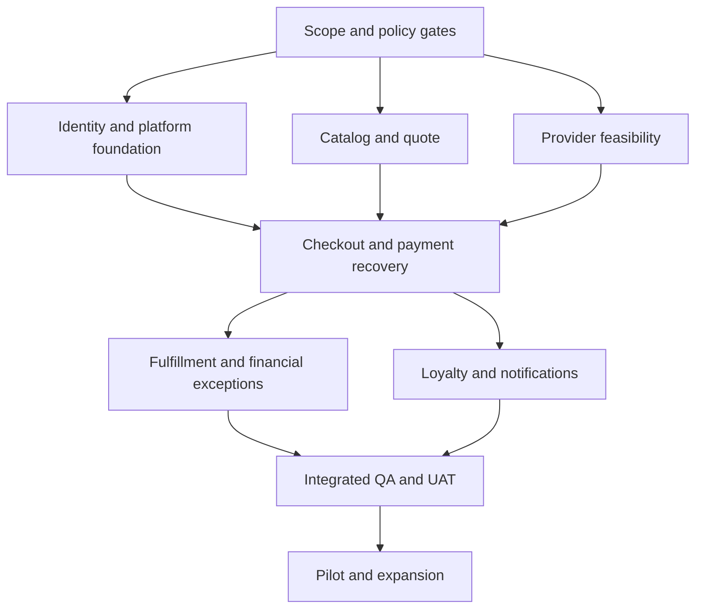

# 07 — Delivery Plan

## Coffee Ordering & Rewards App

| Field | Value |
|---|---|
| Document ID | DP-001 |
| Version / status | 1.0 / Proposed delivery baseline for review |
| Created / updated | 2026-09-11 |
| Delivery owner | Delivery Lead — TBD |
| Product / technical owners | Product Owner / Technical Lead — TBD |
| Source documents | `01-project-brief.md` through `06-api-specification.yaml` |
| Release scope | Pickup-first MVP; one approved payment method and one approved loyalty scheme |
| Schedule baseline | Relative milestones; start date and committed release date TBD |
| Execution status | Planning artifact only; no Jira tickets, repository changes, tests, or deployments performed |

> The preceding documents are drafts, not approvals or completed implementation. The API draft contains 41 operations and 64 schemas, with structural checks but no full OpenAPI conformance validation or live contract tests. Provider callbacks, identity, authority choices, policy limits, and database extensions remain explicit work. All work-package IDs below are local planning references, not existing Jira issue keys. Owners are roles until named people are assigned.

## 1. Delivery Objective and Scope Baseline

Deliver a customer journey from store selection through configured pickup purchase, verified payment, preparation, collection, and eligible rewards, supported by staff operations and financial recovery.

### Must-have release outcomes

- Customers can browse the chosen store, configure products, review authoritative totals, and submit one purchase intent.
- Authentication and ownership protect profile, orders, rewards, and operational actions.
- Interrupted checkout and unknown payment outcomes recover without duplicate orders or charges.
- Staff can process eligible orders within assigned stores and manage ordering availability.
- Cancellation, refunds, and loyalty effects follow approved rules and remain traceable.
- Monitoring, reconciliation, support, backup/restore, and deployment procedures are operational.

### Scope boundaries

Delivery, driver maps, multi-store carts, scheduled/recurring orders, subscriptions, complex missions/referrals, reward sharing, multiple payment providers, and ERP replacement remain excluded. Keyword search is optional and may enter only after Must scope and capacity are protected.

A new staff portal is conditional: existing POS/staff software may provide the specified capabilities. Do not estimate or build both alternatives without an explicit decision. Likewise, select one loyalty scheme and authority model; alternative schema designs are not all MVP features.

## 2. Planning Rules and Ownership

| Role | Delivery responsibility |
|---|---|
| Sponsor | Funding and major scope/schedule tradeoffs |
| Product Owner | Scope, priority, policy decisions, business acceptance |
| Delivery Lead | Dependency tracking, capacity, milestones, issue escalation |
| Technical Lead | Architecture decisions, engineering decomposition, integration feasibility |
| Design Owner | Approved screens, interaction states, accessibility handoff |
| Backend Owner | Data/API/worker implementation and transaction correctness |
| Client Owner | Customer app, recovery UX, supported-platform behavior |
| Operations UI / POS Owner | Staff interface or existing-system integration |
| QA Owner | Risk-based test plan, evidence, defect assessment, UAT coordination |
| DevOps / Runtime Owner | Environments, CI/CD, monitoring, release and recovery |
| Finance / Payment Owner | Provider readiness, refund/reconciliation policy and evidence |
| Loyalty Owner | Scheme economics, eligibility, expiry and reversal rules |
| Store Operations / Support Owners | Pilot staffing, fulfillment, exception response and training |

One person may hold several roles. Capacity must reflect that overlap; role count is not team size. Assign named accountable owners before committing a milestone. Each work package has one accountable owner even when several disciplines contribute.

## 3. Decision and Feasibility Gates

Resolve decisions before dependent work is accepted. Independent design, setup, and fixtures can proceed while a decision is pending, but they must not hardcode an unapproved assumption.

| Gate | Required decision/evidence | Accountable owner | Blocks |
|---|---|---|---|
| G01 — Scope/platform | Launch cohort, pickup scope, client platforms, named team and funding | Product / Sponsor | Committed schedule and platform implementation |
| G02 — Identity | D-04 channels, session model, guest behavior, recovery, verified contact changes | Product / Technical Lead | Identity and persisted-cart contract acceptance |
| G03 — Authority | D-06 catalog, availability and fulfillment owner; staff software choice | Operations / Technical Lead | Catalog/POS integration and final schema |
| G04 — Financial provider | D-05 authentication, callback schema, durable lookup, safe retry, capture/refund semantics, sandbox access | Finance / Technical Lead | Paid end-to-end acceptance |
| G05 — Commercial rules | D-07/08/09/13 reward scheme, cancellation, refund, tax/rounding, quote expiry and zero-total policy | Product / Finance / Loyalty | Quote, reward and exception acceptance |
| G06 — Quality and data | D-11/14/15/16 targets, limits, retention, RPO/RTO, freshness and lifecycle | Technical Lead / Operations | Capacity, resilience and privacy acceptance |
| G07 — Notification policy | D-17 channels, triggers, permission behavior and retry policy | Product / Operations | Notification acceptance |
| G08 — Contract alignment | Approved SDD/DB/API changes and full contract validation | Technical Lead / QA | Implementation baseline and integration sign-off |

G04 must demonstrate how to resolve a provider action when the caller crashes before saving its response. If the provider lacks safe idempotency/lookup, record the manual-resolution or scope alternative; do not assume automatic retry is safe.

### Known document alignment work

- Approve or replace the API's proposed challenge-based identity model.
- Replace the payment callback placeholder with the chosen provider's actual signed contract and acknowledgement behavior.
- Add device registration and notification preferences to the selected physical database design if those API operations remain in scope.
- Align verified contact changes, deletion requests, staff command authority, and optional external coordination resources across documents.
- Select scalar units or coupons and internal or external loyalty authority.
- Approve quote-consumption behavior and price/reward policies with worked examples.
- Confirm transport limits, amount bounds, cursor semantics, error codes, and expected-version behavior.
- Run full OpenAPI conformance validation and negative contract tests; prior structural checks do not replace these gates.

## 4. Milestones and Exit Evidence

Milestones align with the project brief. They describe deliverable outcomes, not elapsed calendar weeks. Test design begins before implementation and verification continues throughout.

| Milestone | Outcome | Exit evidence | Accountable approver |
|---|---|---|---|
| M1 — Alignment | Agreed MVP, roles and decision ownership | Brief scope accepted, owners named, open decisions tracked | Sponsor / Product |
| M2 — Requirements and experience | Testable business rules and complete screen states | PRD/UX review, policy examples, prototype review | Product / Operations |
| M3 — Technical readiness | Feasible authority/provider model and consistent contracts | SDD/DB/API alignment, integration spike evidence, architecture review | Technical Lead |
| M4 — Delivery readiness | Implementable backlog and working environments | Estimates, dependency links, setup guide, CI baseline and test data | Delivery / Technical Lead |
| M5 — Feature completion | Must journeys implemented and reviewed | Story acceptance evidence, integration tests, no missing Must capability | Technical Lead / QA |
| M6 — Release candidate | Business and operational readiness | QA report, UAT sign-off, recovery rehearsal, accepted known issues | Product / QA / Operations |
| M7 — Pilot | Controlled production cohort operating correctly | Smoke evidence, reconciled transactions, pilot metrics and incident review | Release owner / Operations |
| M8 — Expansion and handover | Wider release and sustained ownership | Rollout verification, support handover, monitoring review | Product / Operations |

M4 can prepare environments while M2/M3 decisions are underway. It cannot turn a provisional contract into an approved dependency. M5 is reached only when Must work has evidence, not merely merged code.

## 5. Dependency Structure

Monitoring, test fixtures, security review, and deployment preparation progress alongside these paths. The likely critical path runs through provider feasibility, checkout correctness, fulfillment exceptions, and acceptance; actual critical path must be recalculated after estimates and named capacity are available.

## 6. Jira Structure and Workflow

### Hierarchy

- **Release/version:** Pickup MVP — working label.
- **Epics:** Foundation plus PRD E01–E10. E11 Search stays outside the committed baseline unless selected.
- **Stories:** User-visible, testable increments tied to `REQ-*` IDs.
- **Technical tasks/spikes:** Feasibility, migrations, CI, recovery, observability and contract alignment with explicit evidence outputs.
- **Subtasks:** Backend, client, integration, test/data, and documentation work only where they have independently trackable ownership.
- **Bugs:** Reproduction, expected/actual behavior, impact, affected build and linked requirement.

### Proposed statuses

Backlog → Ready → In Progress → In Review → Ready for QA → In QA → Done.

Blocked is a flag with reason, owner and next action; it does not hide the underlying work state. Failed QA returns the item to implementation with evidence. UAT and release are separate milestone gates, not proof that every Done story has already reached production.

### Required Jira fields

Summary; problem/outcome; requirement IDs; scope in/out; acceptance criteria; accountable owner; component; dependency links; estimate and confidence; test evidence; documentation links; decision gates; release/version; and material operational risk.

Use explicit `blocks / is blocked by` relationships. Work-package IDs in this plan become references when real tickets are created; do not invent Jira keys or assume a Jira project is connected.

## 7. Work Packages and Delivery Backlog

Each row is a planning package to split into small reviewable stories/tasks during refinement. Effort bands in Section 8 are planning heuristics, not approved estimates. Gate dependencies and package IDs are both listed. All packages below are Must unless noted.

### 7.1 Foundation and contract readiness

| ID | Work package | Owner | Dependencies | Acceptance evidence | Size |
|---|---|---|---|---|---|
| WP-01 | Resolve MVP/platform, authority and policy decisions | Product / Technical Lead | G01–G07 owners | Decisions have owner, choice, rationale and updated documents | L |
| WP-02 | Validate payment/POS/loyalty integration feasibility | Backend / integration owner | G03/G04/G05 access | Sandbox evidence for lookup, repeated events, unknown outcomes and authority model | L |
| WP-03 | Finalize physical schema and API contract | Technical Lead | WP-01, WP-02, G08 | Engine-specific DDL reviewed; full OpenAPI validation; known document gaps resolved | L |
| WP-04 | Repository, local setup, environments and CI | DevOps / Technical Lead | Platform selection in G01 | New developer can run app; isolated environments; CI gates and secrets handling verified | M |
| WP-05 | Migration runner, fixtures and durable work foundation | Backend | WP-03, WP-04 | Constraints, outbox/inbox, worker leases, replay and migration tests | L |
| WP-06 | Approved UI components and prototype states | Design / Client | M2 rules, platform selection | Customer/staff states and responsive/accessibility handoff reviewed | L |

### 7.2 Identity, catalog, cart and quote

| ID | Work package / requirements | Owner | Dependencies | Acceptance evidence | Size |
|---|---|---|---|---|---|
| WP-07 | Registration, sign-in, recovery, session revocation — REQ-ACC-001 | Backend + Client; Backend accountable | G02, WP-03–06 | Verified access, bounded challenge retry, logout, expired session and protected return flows | L |
| WP-08 | Profile, verified changes and deletion request — REQ-ACC-002 | Backend + Client; Backend accountable | WP-07, D-15 | Own-data controls, pending identity changes, honest deletion acknowledgement, active-obligation policy | M |
| WP-09 | Store eligibility and catalog source — REQ-STR-001, REQ-MNU-001 | Backend | G03, WP-03–05 | Atomic published revisions, hours/pause/freshness behavior and source traceability | L |
| WP-10 | Store/menu/product customer screens — REQ-STR-001, REQ-MNU-001/002 | Client | WP-06, WP-09 contract; approved mocks before integration | Manual store selection, required options, sold-out/error/stale states and long-content layouts | M |
| WP-11 | Single-store cart and restore/edit behavior — REQ-CART-001 | Client + Backend; Client accountable | WP-07 policy, WP-09/10 | Version conflicts, explicit store change, valid persistence, edit/remove and empty states | M |
| WP-12 | Authoritative quote and exact monetary rules — REQ-PRICE-001 | Backend | G05, WP-09, WP-11 contract | Worked tax/discount fixtures, quote expiry/change/ownership checks, no client-trusted totals | L |

### 7.3 Checkout, fulfillment and financial recovery

| ID | Work package / requirements | Owner | Dependencies | Acceptance evidence | Size |
|---|---|---|---|---|---|
| WP-13 | Durable intent and order snapshot — REQ-CHK-001 | Backend | WP-05, WP-12; reward reservation interface from WP-21 | Concurrent duplicate submit produces one order; changed payload conflicts; consumed quote guard verified | L |
| WP-14 | Provider initiation, verified callbacks and status — REQ-PAY-001 | Backend | G04, WP-02, WP-13 | Trusted outcome mapping, stable operation reference, invalid callback rejection, duplicate-event safety | L |
| WP-15 | Pending/late payment reconciliation — REQ-PAY-002 | Backend | WP-14 | Crash after provider effect recovers safely; late success creates resolution without reopening order | L |
| WP-16 | Checkout and payment recovery UI — REQ-CHK-001, REQ-PAY-001/002 | Client | WP-06, WP-12–15 contracts | Changed quote reconfirmation, restart/return recovery, no second-charge prompt while unknown | L |
| WP-17 | Order confirmation, tracking and history — REQ-ORD-001/002/003 | Client + Backend; Client accountable | WP-13, WP-14, WP-18 contract | Historical snapshot, separate states, owned pagination, stale refresh and notification entry | M |
| WP-18 | Staff queue and guarded transitions — REQ-OPS-001, REQ-ORD-002 | POS/Operations UI owner | G03, WP-13/14 | Assigned-store scope; accept/prepare/ready/collect; concurrent transition conflicts | L |
| WP-19 | Pause/availability controls — REQ-OPS-002 | POS/Backend owner | G03, WP-09, WP-18 context | Correct authority; checkout sees pause; existing orders remain actionable | M |
| WP-20 | Cancellation and refunds — REQ-ORD-004 | Backend + Finance; Backend accountable | G05, WP-14/15/18 | Cancel/accept race, bounded refund reservation, unknown refund recovery, customer status | L |

### 7.4 Loyalty, notifications, support and measurement

| ID | Work package / requirements | Owner | Dependencies | Acceptance evidence | Size |
|---|---|---|---|---|---|
| WP-21 | Selected loyalty reservation/earning/reversal core — REQ-LOY-002 | Backend / Loyalty | G05, WP-05, quote/order event contracts | Atomic reservation; one effect per event; timeout retention; reversal examples; no overspend | L |
| WP-22 | Rewards overview/history and checkout selection — REQ-LOY-001/002 | Client | WP-06, WP-21 interface, WP-12 | Correct units/coupons, pending/reserved visibility, unavailable service distinct from zero | M |
| WP-23 | Transactional notification delivery and preferences — REQ-NTF-001 | Backend + Client; Backend accountable | G07, WP-03 schema additions, WP-05, order events | Permission denial harmless; event deduplication; safe current-state links; bounded failure retry | M |
| WP-24 | Support lookup, exceptions and audit views — REQ-SUP-001 | Backend / Support UI owner | WP-15, WP-20, WP-21 | Authorized lookup, owned unresolved cases, financial evidence and safe resolution commands | L |
| WP-25 | Funnel and operational measurement — PRD Section 11 | Backend / Product analytics owner | Approved event definitions, WP-13/18/21 events | Deduplicated metrics, test traffic excluded, no sensitive event fields, target owners named | M |

WP-13 and WP-21 share contracts, not a circular completion dependency: define reservation interfaces during WP-03, implement the reservation capability first, then integrate checkout. Reward earning and refund reversals can follow fulfillment events, but the integrated Must release cannot omit approved redemption safety. Client development may use agreed fixtures before services exist; mock acceptance is not integration acceptance.

### 7.5 Quality, operations and release

| ID | Work package | Owner | Dependencies | Acceptance evidence | Size |
|---|---|---|---|---|---|
| WP-26 | Test plan, fixtures and traceability | QA | PRD baseline; refine continuously | Positive/negative/concurrency cases mapped to all 20 requirements and key invariants | M |
| WP-27 | Monitoring, alerts and operational controls | DevOps / Backend | WP-04/05; G06 targets | Pending work, reconciliation, sync-age and failure alerts route to named owners | M |
| WP-28 | Integrated QA, security and performance verification | QA / Engineering | Integrated WP-07–25; WP-26/27 | Required gates pass on identified build/data/environment; remaining defects triaged | L |
| WP-29 | Migration, backup/restore and rollout rehearsal | DevOps / Backend | WP-03/05/27; G06 recovery targets | Compatible migration/rollback and provider-after-restore reconciliation demonstrated | M |
| WP-30 | UAT, staff training and support readiness | Product / Operations | WP-28/29; pilot staff selected | Business sign-off, operational drills, support contacts and limitations accepted | M |
| WP-31 | Pilot deployment and monitored verification | Release owner | M6 sign-off, WP-30 | Production smoke evidence, financial reconciliation, pilot review and go/no-go | M |
| WP-32 | Expansion, handover and follow-up backlog | Product / Operations | Pilot exit criteria | Wider rollout verified; ownership transferred; residual work assigned | M |

### Requirement-to-package mapping

| PRD requirement | Delivery packages |
|---|---|
| REQ-ACC-001 | WP-07 |
| REQ-ACC-002 | WP-08 |
| REQ-STR-001 | WP-09, WP-10 |
| REQ-MNU-001 | WP-09, WP-10 |
| REQ-MNU-002 | WP-10 |
| REQ-CART-001 | WP-11 |
| REQ-PRICE-001 | WP-12 |
| REQ-CHK-001 | WP-13, WP-16 |
| REQ-PAY-001 | WP-14, WP-16 |
| REQ-PAY-002 | WP-15, WP-16 |
| REQ-ORD-001 | WP-17 |
| REQ-ORD-002 | WP-17, WP-18 |
| REQ-ORD-003 | WP-17 |
| REQ-ORD-004 | WP-20 |
| REQ-LOY-001 | WP-22 |
| REQ-LOY-002 | WP-21, WP-22 |
| REQ-NTF-001 | WP-23 |
| REQ-OPS-001 | WP-18 |
| REQ-OPS-002 | WP-19 |
| REQ-SUP-001 | WP-24 |

All mappings also receive integrated verification through WP-26/WP-28.

## 8. Estimation and Capacity Method

Sizes above are relative planning bands. Proposed first-pass effort ranges per package:

| Band | Cross-discipline effort range | Interpretation |
|---|---|---|
| S | 1–3 person-days | Small bounded change with known dependencies |
| M | 4–8 person-days | Several related implementation/test activities |
| L | 9–15 person-days | Significant integration or multiple stories; split before execution |
| Uncertain | Timeboxed discovery first | Provider/authority unknown prevents useful commitment |

These ranges are rough heuristics, not staffing quotes, elapsed duration, or a validated total. They include normal implementation, review, tests and documentation for the package; dedicated system-level QA/rehearsal work is tracked separately. Avoid double-counting by allocating each activity to one package during refinement.

### Scheduling procedure

1. Assign named contributors and actual available days by discipline, accounting for support duties, leave and shared roles.
2. Split L packages into reviewable increments, ideally a few working days each, with observable outcomes.
3. Estimate optimistic/likely/pessimistic effort for integration-sensitive work after spikes.
4. Schedule dependency-ready work against each discipline's capacity; do not divide total effort by headcount and call it duration.
5. Explicitly reserve capacity for defect correction, integration uncertainty, provider access delays, and operational rehearsal; agree the amount rather than hiding it in every task.
6. Publish a forecast range with confidence and assumptions; commit dates only after sponsor/team review.
7. Reforecast using completed evidence, remaining work and dependency changes after each cycle.

Working calendar fields to fill: kickoff date, release target, customer-platform scope, named team, available capacity, iteration length, provider lead time, pilot observation window, and contingency. No calendar dates are committed by this document.

## 9. Recommended Execution Sequence

### Cycle A — Remove uncertainty and prepare delivery

Complete decision ownership, provider/authority spikes, contract alignment, repository/environments, migration/worker foundation and test planning. Design prepares the critical recovery states while engineering validates the provider. Exit: M1–M4 evidence sufficient for the selected first implementation slice.

### Cycle B — Browse to validated quote

Implement identity, store/menu, product options, cart and pricing. Demonstrate exact total calculation and changed-item/price handling against integrated services. Continue payment-adapter work against approved contracts. Exit: a real customer can produce a validated quote; no claim of full purchase completion yet.

### Cycle C — Safe purchase and store fulfillment

Implement checkout, payment/recovery, initial loyalty reservation, staff transitions and customer tracking. Demonstrate duplicate-request and lost-response cases as part of the slice. Exit: integrated purchase-to-collection path plus unknown-payment recovery.

### Cycle D — Complete exceptions and supporting capabilities

Finish refunds, loyalty earning/reversal, rewards UI, notifications, support cases and reporting. Exercise cancellation races, reservation expiry, late events and provider failures. Exit: all Must capabilities ready for system-level release-candidate verification.

### Cycle E — Release candidate and pilot

Complete integrated QA, performance/security evidence, migration/restore rehearsal, UAT, staff training and runbooks. Pilot only after M6 go/no-go. Expand only after pilot criteria are met.

Cycles are ordering groups, not fixed-duration sprints. Some overlap is appropriate when contracts are stable and named capacity exists; any external access blocker remains visible in the forecast.

## 10. Definition of Ready and Done

### Definition of Ready — story

- Requirement and customer/operator outcome are explicit.
- Acceptance criteria include relevant failure/recovery behavior.
- Decision dependencies are resolved or isolated behind an agreed interface with a clear acceptance gate.
- API/data/UX references and test fixtures are available at the required fidelity.
- Work is small enough to review, with accountable owner and estimate.
- Required integration access exists; a mock-only task is labeled as such.

### Definition of Done — story

- Implementation reviewed and merged through the agreed repository workflow.
- Acceptance criteria verified with linked evidence on an identified build.
- Relevant authorization, validation and retry behavior checked.
- Required CI checks pass; schema migration/backward compatibility assessed where affected.
- Documentation/contracts updated with the change.
- No unresolved defect prevents the story's stated outcome.

### Release-candidate Done

All Must stories satisfy their definition of done; end-to-end, concurrency, security, performance and recovery gates pass; UAT and operations are ready; unresolved risks are formally accepted by the accountable owner. Story completion alone does not authorize production release.

## 11. Git, Review and CI Delivery Controls

Repository host and branch model are TBD. Proposed baseline:

- Protected default branch; short-lived branches linked to a real Jira issue once available.
- Merge request explains problem, behavior change, requirement IDs, migration/configuration implications, tests and rollback/recovery impact.
- At least one accountable reviewer; financial/state/concurrency changes receive technical owner review.
- CI validates formatting/static checks, meaningful unit/integration tests, schema/API contracts, and build for affected components.
- Secrets remain outside committed source and logs.
- Every release candidate identifies an exact source revision, build artifact and configuration revision.
- Backward-compatible schema changes precede code that needs them; cleanup follows only after compatibility review.

Do not broaden tests without reason, but mandatory transaction/recovery gates cannot be replaced with happy-path screenshots. A failing required gate blocks merge/release until resolved or the requirement is explicitly changed by its owner.

## 12. QA and Evidence Plan

| Risk area | Required evidence | Work packages |
|---|---|---|
| Identity/ownership | Invalid/expired/revoked sessions; cross-account/store denial | WP-07/08/18/28 |
| Catalog/quote | Paused store, stale revision, invalid options, exact money, changed quote | WP-09–12/28 |
| Checkout uniqueness | Same key/same payload, changed payload conflict, quote consumed by competing intent | WP-13/28 |
| Financial uncertainty | Timeout, crash after provider effect, duplicate/reordered callback, late success | WP-14/15/28 |
| Fulfillment races | Acceptance versus cancellation; stale staff command | WP-18/20/28 |
| Refund capacity | Concurrent/pending refunds cannot exceed collection; retry resolves same operation | WP-20/28 |
| Loyalty correctness | Concurrent reserve, replayed earning, expiry during unknown payment, approved reversal | WP-21/22/28 |
| Notification isolation | Failed delivery does not undo order; link retrieves current state | WP-23/28 |
| Recovery | Database restore behind provider, replayed jobs, stale lease, retained obligations | WP-29 |
| UX/accessibility | Critical screens, enlarged text, keyboard/assistive use where supported, long localized content | WP-06/16/17/22/28 |
| Operational readiness | Alert routing, case ownership, staff response and support procedures | WP-24/27/30 |

Evidence records include scenario, expected/actual result, build/configuration, environment, test data reference, tester, time and defect link. Protect customer/provider credentials; use synthetic or approved test data.

## 13. Pilot and Production Plan

### Before pilot

- Named release decision maker and technical/operator responders.
- Approved stores, customer cohort, operating hours, observation period and volume expectations.
- Quantitative latency, availability, pending-payment age, store response and error thresholds agreed; blanks are not passes.
- Reconciliation, support, finance and staff trained for known exception paths.
- Verified backup/restore and deployment rollback/forward-fix procedure.
- Provider production configuration validated without confusing sandbox credentials.
- Release notes and known limitations available.

### Pilot checks

Verify an authorized critical journey, correct store receipt, payment/order association, collection, reward effect and notifications as applicable. Monitor pending financial work, rejected orders, unresolved refunds, duplicate incidents, queue age and support feedback. Use approved production-test procedures and reconcile resulting financial activity.

### Stop/rollback conditions

Confirmed duplicate collection, unauthorized data access, incorrect payable amounts, or lost/untraceable orders block expansion and trigger incident response. Agreed service thresholds determine additional pause conditions. The incident owner chooses pause, compatible rollback or forward fix based on observed impact.

Pausing new checkout must not stop callback intake, reconciliation, refunds, existing-order fulfillment or recovery workers needed to discharge obligations. Database rollback does not undo provider money movement.

### Pilot exit and expansion

Product, Finance where applicable, and Operations review measured results and unresolved cases over the agreed observation window. Expand only when release criteria are met and no unresolved blocking condition remains. Record cohort/date, decision, owner, evidence and support plan.

## 14. Risks, Escalation and Change Control

| Risk | Early signal | Action / owner |
|---|---|---|
| Provider access/semantics unknown | Spike cannot demonstrate safe outcome lookup | Escalate to Finance/Technical Lead before committing payment dates |
| Conflicting source authority | Local and POS commands both mutate the same state | Resolve G03; stop affected implementation acceptance |
| Policy churn | Price/refund/reward examples change repeatedly | Product freezes reviewed rule version; assess downstream rework |
| Thin shared capacity | Same person owns multiple concurrent critical packages | Delivery replans against actual available days |
| Excessive unresolved cases | Pending financial jobs or support queue age rises | Operations investigates before cohort expansion |
| UI implemented against mocks only | Integrated error states remain untested | Track integration debt explicitly; block M5/M6 as applicable |
| Late schema/API mismatch | Client fields or notification tables absent | WP-03 contract gate and change review |
| Missing recovery evidence | Backup exists but restore/reconcile not rehearsed | Block M6 until WP-29 evidence is available |

For a blocked item, record what is missing, impact, named decision owner, next action and review time. Proposed escalation: surface immediately when it threatens a milestone or financial correctness; review other blockers at the next coordination check. Agree response expectations with the actual team.

Scope changes require rationale, affected requirements/contracts, estimate/dependency impact, test/operations impact, and Product approval; budget or major schedule impact also requires Sponsor approval. Removing a Must feature requires an explicit scope revision, not silent deferral in Jira.

## 15. Delivery Cadence and Reporting

Proposed cadence, to adapt to team availability:

- Brief working-day coordination: completed evidence, next work, blockers.
- Weekly refinement/forecast review: ready backlog, decisions, remaining capacity and risks.
- End-of-cycle demo: integrated outcomes and failure recovery, not only screens.
- Milestone review: evidence-based go/no-go against exit criteria.
- Post-pilot review: incidents, transaction consistency, customer/staff feedback and expansion decision.

Weekly report fields: milestone forecast and confidence; outcomes completed with links; remaining critical-path work; blockers and owners; decisions needed; defect trend; scope changes; operational risks. Do not report ticket count as a substitute for readiness.

## 16. Documentation Deliverables

| Artifact | Accountable owner | Required by |
|---|---|---|
| Updated documents 01–07 | Product / Technical Lead / Delivery | M3/M4 baseline and subsequent changes |
| `08-developer-setup.md` | Engineering | M4 |
| `09-coding-standards.md` | Technical Lead | M4 |
| `10-git-and-review-workflow.md` | Technical Lead | M4 |
| `11-test-plan.md` | QA | Before integrated implementation acceptance |
| `12-uat-and-sign-off.md` | Product / QA | M6 |
| `13-deployment-and-rollback.md` | DevOps | Rehearsal and M6 |
| `14-release-checklist.md` | Release owner | M6/M7 |
| `15-operations-runbook.md` | Operations / Support | M6 |
| Release notes, evidence and decision records | Relevant owner | Every milestone/release |

These are planned deliverables; this file does not claim they already exist. Each names owner, version, status and related requirement/build references.

## 17. Immediate Backlog Preparation

1. Assign named owners and capacity to the roles in Section 2.
2. Create decision records for G01–G08 with due points relative to dependent work.
3. Start provider/authority feasibility packages and obtain required test access.
4. Refine WP-03 to close the known API/database gaps before freezing contracts.
5. Split WP-04–06 and WP-26 into executable foundation/design/test tasks.
6. Refine the browse-to-quote slice, then safe-purchase slice, with explicit dependencies.
7. Enter real Jira issues only in the selected project when that action is requested/authorized; retain these planning IDs as traceability references.
8. Publish the first capacity-based forecast after the team estimates the refined work.

## 18. Approval and Change History

| Approval | Reviewer | Status / date |
|---|---|---|
| Scope and priorities | Product Owner — TBD | Pending / — |
| Funding and major commitments | Sponsor — TBD | Pending / — |
| Engineering feasibility and capacity | Technical Lead — TBD | Pending / — |
| Test/release gates | QA Owner — TBD | Pending / — |
| Provider and financial operations | Finance Owner — TBD | Pending / — |
| Pilot and support readiness plan | Operations Owner — TBD | Pending / — |

| Version | Date | Change |
|---|---|---|
| 1.0 | 2026-09-11 | Initial milestone plan, 32 work packages, dependency model, estimation method, Jira workflow, evidence gates and pilot plan |

This document is a reviewable delivery plan. It does not commit a release date or certify the drafts as implementation-ready; those commitments follow named ownership, resolved gates and verified evidence.
